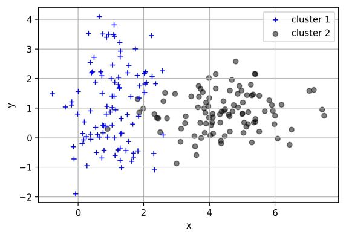
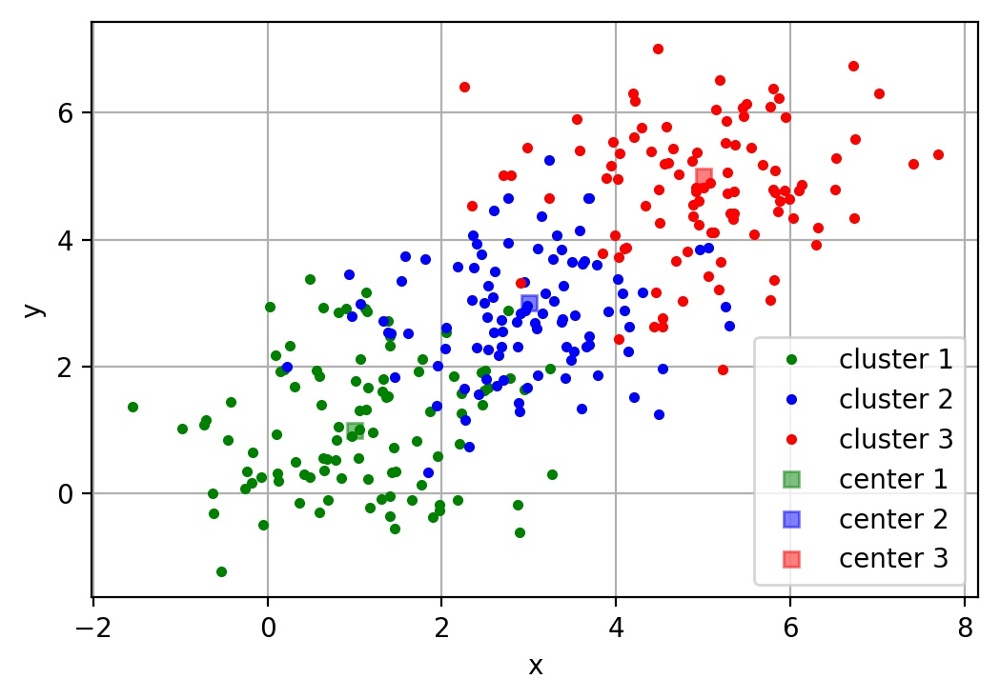
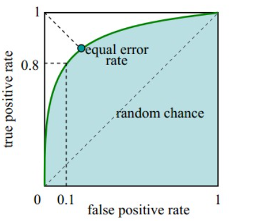

layout: post
#标题配置
title:  机器学习
#时间配置
date:   2019-06-20
#大类配置
categories:Interview
#小类配置
tag: 机器学习

* content
{:toc}
# 机器学习

## 1、机器学习

机器学习起源于上世纪50年代，1959年在IBM工作的Arthur Samuel设计了一个下棋程序，这个程序具有学习的能力，它可以在不断的对弈中提高自己。由此提出了“机器学习”这个概念，它是一个结合了多个学科如概率论，优化理论，统计等，最终在计算机上实现自我获取新知识，学习改善自己的这样一个研究领域。机器学习是人工智能的一个子集，目前已经发展出许多有用的方法，比如支持向量机，回归，决策树，随机森林，强化方法，集成学习，深度学习等等，一定程度上可以帮助人们完成一些数据预测，自动化，自动决策，最优化等初步替代脑力的任务。

机器学习(Machine Learning, ML)，顾名思义，让机器去学习。这里，机器指的是计算机，是算法运行的物理载体，你也可以把各种算法本身当做一个有输入和输出的机器。那么到底让计算机去学习什么呢？对于一个任务及其表现的度量方法，设计一种算法，让算法能够提取中数据所蕴含的规律，这就叫机器学习。如果输入机器的数据是带有标签的，就称作有监督学习。如果数据是无标签的，就是无监督学习。

### 001 各种常见算法图示

日常使用机器学习的任务中，我们经常会遇见各种算法，图2-1是各种常见算法的图示。

|         回归算法         |         聚类算法         |        正则化方法        |
| :----------------------: | :----------------------: | :----------------------: |
|  |  |  |

|        决策树学习        |        贝叶斯方法        |       基于核的算法       |
| :----------------------: | :----------------------: | :----------------------: |
|  |  |  |

|         聚类算法         |       关联规则学习       |       人工神经网络        |
| :----------------------: | :----------------------: | :-----------------------: |
|  |  |  |

|         深度学习          |       降低维度算法        |         集成算法          |
| :-----------------------: | :-----------------------: | :-----------------------: |
|  |  |  |
|            :-:            |            :-:            |            :-:            |
|                           |    图2-1 各种常见算法     |                           |

### 002 监督学习、非监督学习、半监督学习、弱监督学习？

根据数据类型的不同，对一个问题的建模有不同的方式。依据不同的学习方式和输入数据，机器学习主要分为以下四种学习方式。

**监督学习**：
1. 监督学习是使用已知正确答案的示例来训练网络。已知数据和其一一对应的标签，训练一个预测模型，将输入数据映射到标签的过程。
2. 监督式学习的常见应用场景如分类问题和回归问题。
3. 常见的有监督机器学习算法包括支持向量机(Support Vector Machine, SVM)，朴素贝叶斯(Naive Bayes)，逻辑回归(Logistic Regression)，K近邻(K-Nearest Neighborhood, KNN)，决策树(Decision Tree)，随机森林(Random Forest)，AdaBoost以及线性判别分析(Linear Discriminant Analysis, LDA)等。深度学习(Deep Learning)也是大多数以监督学习的方式呈现。

**非监督式学习**：
1. 在非监督式学习中，数据并不被特别标识，适用于你具有数据集但无标签的情况。学习模型是为了推断出数据的一些内在结构。
2. 常见的应用场景包括关联规则的学习以及聚类等。
3. 常见算法包括Apriori算法以及k-Means算法。

**半监督式学习**：
1. 在此学习方式下，输入数据部分被标记，部分没有被标记，这种学习模型可以用来进行预测。
2. 应用场景包括分类和回归，算法包括一些对常用监督式学习算法的延伸，通过对已标记数据建模，在此基础上，对未标记数据进行预测。
3. 常见算法如图论推理算法（Graph Inference）或者拉普拉斯支持向量机（Laplacian SVM）等。

**弱监督学习**：
1. 弱监督学习可以看做是有多个标记的数据集合，次集合可以是空集，单个元素，或包含多种情况（没有标记，有一个标记，和有多个标记）的多个元素。 
2. 数据集的标签是不可靠的，这里的不可靠可以是标记不正确，多种标记，标记不充分，局部标记等。
3. 已知数据和其一一对应的弱标签，训练一个智能算法，将输入数据映射到一组更强的标签的过程。标签的强弱指的是标签蕴含的信息量的多少，比如相对于分割的标签来说，分类的标签就是弱标签。
4. 举例，给出一张包含气球的图片，需要得出气球在图片中的位置及气球和背景的分割线，这就是已知弱标签学习强标签的问题。

在企业数据应用的场景下， 人们最常用的可能就是监督式学习和非监督式学习的模型。 在图像识别等领域，由于存在大量的非标识的数据和少量的可标识数据， 目前半监督式学习是一个很热的话题。

### 003 监督学习有哪些步骤
监督学习是使用已知正确答案的示例来训练网络，每组训练数据有一个明确的标识或结果。想象一下，我们可以训练一个网络，让其从照片库中（其中包含气球的照片）识别出气球的照片。以下就是我们在这个假设场景中所要采取的步骤。

**步骤1：数据集的创建和分类**

首先，浏览你的照片（数据集），确定所有包含气球的照片，并对其进行标注。然后，将所有照片分为训练集和验证集。目标就是在深度网络中找一函数，这个函数输入是任意一张照片，当照片中包含气球时，输出1，否则输出0。

**步骤2：数据增强（Data Augmentation）**

当原始数据搜集和标注完毕，一般搜集的数据并不一定包含目标在各种扰动下的信息。数据的好坏对于机器学习模型的预测能力至关重要，因此一般会进行数据增强。对于图像数据来说，数据增强一般包括，图像旋转，平移，颜色变换，裁剪，仿射变换等。

**步骤3：特征工程（Feature Engineering）**

一般来讲，特征工程包含特征提取和特征选择。常见的手工特征(Hand-Crafted Feature)有尺度不变特征变换(Scale-Invariant Feature Transform, SIFT)，方向梯度直方图(Histogram of Oriented Gradient, HOG)等。由于手工特征是启发式的，其算法设计背后的出发点不同，将这些特征组合在一起的时候有可能会产生冲突，如何将组合特征的效能发挥出来，使原始数据在特征空间中的判别性最大化，就需要用到特征选择的方法。在深度学习方法大获成功之后，人们很大一部分不再关注特征工程本身。因为，最常用到的卷积神经网络(Convolutional Neural Networks, CNNs)本身就是一种特征提取和选择的引擎。研究者提出的不同的网络结构、正则化、归一化方法实际上就是深度学习背景下的特征工程。

**步骤4：构建预测模型和损失**

将原始数据映射到特征空间之后，也就意味着我们得到了比较合理的输入。下一步就是构建合适的预测模型得到对应输入的输出。而如何保证模型的输出和输入标签的一致性，就需要构建模型预测和标签之间的损失函数，常见的损失函数(Loss Function)有交叉熵、均方差等。通过优化方法不断迭代，使模型从最初的初始化状态一步步变化为有预测能力的模型的过程，实际上就是学习的过程。

**步骤5：训练**

选择合适的模型和超参数进行初始化，其中超参数比如支持向量机中核函数、误差项惩罚权重等。当模型初始化参数设定好后，将制作好的特征数据输入到模型，通过合适的优化方法不断缩小输出与标签之间的差距，当迭代过程到了截止条件，就可以得到训练好的模型。优化方法最常见的就是梯度下降法及其变种，使用梯度下降法的前提是优化目标函数对于模型是可导的。

**步骤6：验证和模型选择**

训练完训练集图片后，需要进行模型测试。利用验证集来验证模型是否可以准确地挑选出含有气球在内的照片。

在此过程中，通常会通过调整和模型相关的各种事物（超参数）来重复步骤2和3，诸如里面有多少个节点，有多少层，使用怎样的激活函数和损失函数，如何在反向传播阶段积极有效地训练权值等等。

**步骤7：测试及应用**

当有了一个准确的模型，就可以将该模型部署到你的应用程序中。你可以将预测功能发布为API（Application Programming Interface, 应用程序编程接口）调用，并且你可以从软件中调用该API，从而进行推理并给出相应的结果。

### 004 多实例学习？

多实例学习(Multiple Instance Learning, MIL) ：已知包含多个数据的数据包和数据包的标签，训练智能算法，将数据包映射到标签的过程，在有的问题中也同时给出包内每个数据的标签。

比如说一段视频由很多张图组成，假如10000张，那么我们要判断视频里是否包含某一物体，比如气球。单张标注每一帧是否有气球太耗时，通常人们看一遍说这个视频里是否有气球，就得到了多示例学习的数据。10000帧的数据不是每一个都有气球出现，只要有一帧有气球，那么我们就认为这个数据包是有气球的。只有当所有的视频帧都没有气球，才是没有气球的。从这里面学习哪一段视频（10000张）是否有气球出现就是多实例学习的问题。

### 005 理解局部最优与全局最优

笑谈局部最优和全局最优

> 	柏拉图有一天问老师苏格拉底什么是爱情？苏格拉底叫他到麦田走一次，摘一颗最大的麦穗回来，不许回头，只可摘一次。柏拉图空着手出来了，他的理由是，看见不错的，却不知道是不是最好的，一次次侥幸，走到尽头时，才发现还不如前面的，于是放弃。苏格拉底告诉他：“这就是爱情。”这故事让我们明白了一个道理，因为生命的一些不确定性，所以全局最优解是很难寻找到的，或者说根本就不存在，我们应该设置一些限定条件，然后在这个范围内寻找最优解，也就是局部最优解——有所斩获总比空手而归强，哪怕这种斩获只是一次有趣的经历。
> 			柏拉图有一天又问什么是婚姻？苏格拉底叫他到树林走一次,选一棵最好的树做圣诞树，也是不许回头，只许选一次。这次他一身疲惫地拖了一棵看起来直挺、翠绿，却有点稀疏的杉树回来，他的理由是，有了上回的教训，好不容易看见一棵看似不错的，又发现时间、体力已经快不够用了，也不管是不是最好的，就拿回来了。苏格拉底告诉他：“这就是婚姻。”

优化问题一般分为局部最优和全局最优。

1. 局部最优，就是在函数值空间的一个有限区域内寻找最小值；而全局最优，是在函数值空间整个区域寻找最小值问题。
2. 函数局部最小点是它的函数值小于或等于附近点的点。但是有可能大于较远距离的点。
3. 全局最小点是那种它的函数值小于或等于所有的可行点。

### 006 分类算法

分类算法和回归算法是对真实世界不同建模的方法。分类模型是认为模型的输出是离散的，例如大自然的生物被划分为不同的种类，是离散的。回归模型的输出是连续的，例如人的身高变化过程是一个连续过程，而不是离散的。因此，在实际建模过程时，采用分类模型还是回归模型，取决于你对任务（真实世界）的分析和理解。

**1、常用分类算法的优缺点？**

接下来我们介绍常用分类算法的优缺点，如表2-1所示。
										表2-1 常用分类算法的优缺点
| 算法                        | 优点                                                         | 缺点                                                         |
| :-------------------------- | :----------------------------------------------------------- | :----------------------------------------------------------- |
| Bayes 贝叶斯分类法          | 1）所需估计的参数少，对于缺失数据不敏感。<br />2）有着坚实的数学基础，以及稳定的分类效率。 | 1）需要假设属性之间相互独立，这往往并不成立。（喜欢吃番茄、鸡蛋，却不喜欢吃番茄炒蛋）。<br />2）需要知道先验概率。<br />3）分类决策存在错误率。 |
| Decision Tree决策树         | 1）不需要任何领域知识或参数假设。<br />2）适合高维数据。<br />3）简单易于理解。<br />4）短时间内处理大量数据，得到可行且效果较好的结果。<br />5）能够同时处理数据型和常规性属性。 | 1）对于各类别样本数量不一致数据，信息增益偏向于那些具有更多数值的特征。<br />2）易于过拟合。<br />3）忽略属性之间的相关性。<br />4）不支持在线学习。 |
| SVM支持向量机               | 1）可以解决小样本下机器学习的问题。<br />2）提高泛化性能。<br />3）可以解决高维、非线性问题。超高维文本分类仍受欢迎。<br />4）避免神经网络结构选择和局部极小的问题。 | 1）对缺失数据敏感。<br />2）内存消耗大，难以解释。<br />3）运行和调参略烦人。 |
| KNN K近邻                   | 1）思想简单，理论成熟，既可以用来做分类也可以用来做回归； <br />2）可用于非线性分类；<br /> 3）训练时间复杂度为O(n)； <br />4）准确度高，对数据没有假设，对outlier不敏感； | 1）计算量太大。<br />2）对于样本分类不均衡的问题，会产生误判。<br />3）需要大量的内存。<br />4）输出的可解释性不强。 |
| Logistic Regression逻辑回归 | 1）速度快。<br />2）简单易于理解，直接看到各个特征的权重。<br />3）能容易地更新模型吸收新的数据。<br />4）如果想要一个概率框架，动态调整分类阀值。 | 特征处理复杂。需要归一化和较多的特征工程。                   |
| Neural Network 神经网络     | 1）分类准确率高。<br />2）并行处理能力强。<br />3）分布式存储和学习能力强。<br />4）鲁棒性较强，不易受噪声影响。 | 1）需要大量参数（网络拓扑、阀值、阈值）。<br />2）结果难以解释。<br />3）训练时间过长。 |
| Adaboosting                 | 1）adaboost是一种有很高精度的分类器。<br />2）可以使用各种方法构建子分类器，Adaboost算法提供的是框架。<br />3）当使用简单分类器时，计算出的结果是可以理解的。而且弱分类器构造极其简单。<br />4）简单，不用做特征筛选。<br />5）不用担心overfitting。 | 对outlier比较敏感                                            |
**2、分类算法的评估方法？**

分类评估方法主要功能是用来评估分类算法的好坏，而评估一个分类器算法的好坏又包括许多项指标。了解各种评估方法，在实际应用中选择正确的评估方法是十分重要的。

- **几个常用术语**

这里首先介绍几个常见的模型评价术语，现在假设我们的分类目标只有两类，计为正例（positive）和负例（negative）分别是：

1) True positives(TP):  被正确地划分为正例的个数，即实际为正例且被分类器划分为正例的实例数；
2) False positives(FP): 被错误地划分为正例的个数，即实际为负例但被分类器划分为正例的实例数；
3) False negatives(FN):被错误地划分为负例的个数，即实际为正例但被分类器划分为负例的实例数；
4) True negatives(TN): 被正确地划分为负例的个数，即实际为负例且被分类器划分为负例的实例数。　


图2-3是这四个术语的混淆矩阵，做以下说明：

1）P=TP+FN表示实际为正例的样本个数。
2）True、False描述的是分类器是否判断正确。
3）Positive、Negative是分类器的分类结果，如果正例计为1、负例计为-1，即positive=1、negative=-1。用1表示True，-1表示False，那么实际的类标=TF\*PN，TF为true或false，PN为positive或negative。
4）例如True positives(TP)的实际类标=1\*1=1为正例，False positives(FP)的实际类标=(-1)\*1=-1为负例，False negatives(FN)的实际类标=(-1)\*(-1)=1为正例，True negatives(TN)的实际类标=1\*(-1)=-1为负例。

- **评价指标**

1) 正确率（accuracy）

正确率是我们最常见的评价指标，accuracy = (TP+TN)/(P+N)，正确率是被分对的样本数在所有样本数中的占比，通常来说，正确率越高，分类器越好。

2) 错误率（error rate)

错误率则与正确率相反，描述被分类器错分的比例，error rate = (FP+FN)/(P+N)，对某一个实例来说，分对与分错是互斥事件，所以accuracy =1 -  error rate。

3) 灵敏度（sensitivity）

sensitivity = TP/P，表示的是所有正例中被分对的比例，衡量了分类器对正例的识别能力。

4) 特异性（specificity)

specificity = TN/N，表示的是所有负例中被分对的比例，衡量了分类器对负例的识别能力。

5) 精度（precision）

precision=TP/(TP+FP)，精度是精确性的度量，表示被分为正例的示例中实际为正例的比例。

6) 召回率（recall）

召回率是覆盖面的度量，度量有多个正例被分为正例，recall=TP/(TP+FN)=TP/P=sensitivity，可以看到召回率与灵敏度是一样的。

7) 其他评价指标

计算速度：分类器训练和预测需要的时间；
鲁棒性：处理缺失值和异常值的能力；
可扩展性：处理大数据集的能力；
可解释性：分类器的预测标准的可理解性，像决策树产生的规则就是很容易理解的，而神经网络的一堆参数就不好理解，我们只好把它看成一个黑盒子。

8) 精度和召回率反映了分类器分类性能的两个方面。如果综合考虑查准率与查全率，可以得到新的评价指标F1-score，也称为综合分类率：$F1=\frac{2 \times precision \times recall}{precision + recall}$。

为了综合多个类别的分类情况，评测系统整体性能，经常采用的还有微平均F1（micro-averaging）和宏平均F1（macro-averaging ）两种指标。

（1）宏平均F1与微平均F1是以两种不同的平均方式求的全局F1指标。
（2）宏平均F1的计算方法先对每个类别单独计算F1值，再取这些F1值的算术平均值作为全局指标。
（3）微平均F1的计算方法是先累加计算各个类别a、b、c、d的值，再由这些值求出F1值。
（4）由两种平均F1的计算方式不难看出，宏平均F1平等对待每一个类别，所以它的值主要受到稀有类别的影响，而微平均F1平等考虑文档集中的每一个文档，所以它的值受到常见类别的影响比较大。

- **ROC曲线和PR曲线**

如图2-4，ROC曲线是（Receiver Operating Characteristic Curve，受试者工作特征曲线）的简称，是以灵敏度（真阳性率）为纵坐标，以1减去特异性（假阳性率）为横坐标绘制的性能评价曲线。可以将不同模型对同一数据集的ROC曲线绘制在同一笛卡尔坐标系中，ROC曲线越靠近左上角，说明其对应模型越可靠。也可以通过ROC曲线下面的面积（Area Under Curve, AUC）来评价模型，AUC越大，模型越可靠。


	
PR曲线是Precision Recall Curve的简称，描述的是precision和recall之间的关系，以recall为横坐标，precision为纵坐标绘制的曲线。该曲线的所对应的面积实际上是目标检测中常用的评价指标平均精度（Average Precision, AP）。AP越高，说明模型性能越好。

**3、正确率能很好的评估分类算法吗？**

不同算法有不同特点，在不同数据集上有不同的表现效果，根据特定的任务选择不同的算法。如何评价分类算法的好坏，要做具体任务具体分析。对于决策树，主要用正确率去评估，但是其他算法，只用正确率能很好的评估吗？

答案是否定的。

正确率确实是一个很直观很好的评价指标，但是有时候正确率高并不能完全代表一个算法就好。比如对某个地区进行地震预测，地震分类属性分为0：不发生地震、1发生地震。我们都知道，不发生的概率是极大的，对于分类器而言，如果分类器不加思考，对每一个测试样例的类别都划分为0，达到99%的正确率，但是，问题来了，如果真的发生地震时，这个分类器毫无察觉，那带来的后果将是巨大的。很显然，99%正确率的分类器并不是我们想要的。出现这种现象的原因主要是数据分布不均衡，类别为1的数据太少，错分了类别1但达到了很高的正确率缺忽视了研究者本身最为关注的情况。

**4、什么样的分类器是最好的？**

对某一个任务，某个具体的分类器不可能同时满足或提高所有上面介绍的指标。

如果一个分类器能正确分对所有的实例，那么各项指标都已经达到最优，但这样的分类器往往不存在。比如之前说的地震预测，既然不能百分百预测地震的发生，但实际情况中能容忍一定程度的误报。假设在1000次预测中，共有5次预测发生了地震，真实情况中有一次发生了地震，其他4次则为误报。正确率由原来的999/1000=99.9下降为996/1000=99.6。召回率由0/1=0%上升为1/1=100%。对此解释为，虽然预测失误了4次，但真的地震发生前，分类器能预测对，没有错过，这样的分类器实际意义更为重大，正是我们想要的。在这种情况下，在一定正确率前提下，要求分类器的召回率尽量高。

### 007 代价函数

**1、为什么需要代价函数？**

1. 为了得到训练逻辑回归模型的参数，需要一个代价函数，通过训练代价函数来得到参数。
2. 用于找到最优解的目标函数。

**2、代价函数作用原理 **

在回归问题中，通过代价函数来求解最优解，常用的是平方误差代价函数。有如下假设函数：

$$
h(x) = A + Bx
$$

假设函数中有$A$和$B$两个参数，当参数发生变化时，假设函数状态也会随着变化。如下图所示：


想要拟合图中的离散点，我们需要尽可能找到最优的$A$和$B$来使这条直线更能代表所有数据。如何找到最优解呢，这就需要使用代价函数来求解，以平方误差代价函数为例，假设函数为$h(x)=\theta_0x$。

**平方误差代价函数的主要思想** 就是将实际数据给出的值与拟合出的线的对应值做差，求出拟合出的直线与实际的差距。在实际应用中，为了避免因个别极端数据产生的影响，采用类似方差再取二分之一的方式来减小个别数据的影响。因此，引出代价函数：
$$
J(\theta_0, \theta_1) = \frac{1}{m}\sum_{i=1}^m(h(x^{(i)})-y^{(i)})^2
$$

**最优解即为代价函数的最小值** $\min J(\theta_0, \theta_1)$。如果是1个参数，代价函数一般通过二维曲线便可直观看出。如果是2个参数，代价函数通过三维图像可看出效果，参数越多，越复杂。当参数为2个时，代价函数是三维图像。


**3、为什么代价函数要非负？**

目标函数存在一个下界，在优化过程当中，如果优化算法能够使目标函数不断减小，根据单调有界准则，这个优化算法就能证明是收敛有效的。只要设计的目标函数有下界，基本上都可以，代价函数非负<u>更为方便</u>。

**4、常见代价函数？**

1. **二次代价函数（quadratic cost）**：

$$
J = \frac{1}{2n}\sum_x\Vert y(x)-a^L(x)\Vert^2
$$

其中，$J$表示代价函数，$x$表示样本，$y$示实际值，$a$表示输出值，$n$表示样本的总数。使用一个样本为例简单说明，此时二次代价函数为：
$$
J = \frac{(y-a)^2}{2}
$$
假如使用梯度下降法（Gradient descent）来调整权值参数的大小，权值$w$和偏置$b$的梯度推导如下：
$$
\frac{\partial J}{\partial b}=(a-y)\sigma'(z)
$$
其中，$z$表示神经元的输入，$\sigma$表示激活函数。权值$w$和偏置$b$的梯度跟激活函数的梯度成正比，激活函数的梯度越大，权值$w$和偏置$b$的大小调整得越快，训练收敛得就越快。

*注*：神经网络常用的激活函数为sigmoid函数，该函数的曲线如下所示：


如图所示，对0.88和0.98两个点进行比较：

假设目标是收敛到1.0。0.88离目标1.0比较远，梯度比较大，权值调整比较大。0.98离目标1.0比较近，梯度比较小，权值调整比较小。调整方案合理。

假如目标是收敛到0。0.88离目标0比较近，梯度比较大，权值调整比较大。0.98离目标0比较远，梯度比较小，权值调整比较小。调整方案不合理。

原因：在使用sigmoid函数的情况下, 初始的代价（误差）越大，导致训练越慢。

2. **交叉熵代价函数（cross-entropy）**：

$$
J = -\frac{1}{n}\sum_x[y\ln a + (1-y)\ln{(1-a)}]
$$

其中，$J$表示代价函数，$x$表示样本，$y$表示实际值，$a$表示输出值，$n$表示样本的总数。权值$w$和偏置$b$的梯度推导如下：
$$
\frac{\partial J}{\partial w_j}=\frac{1}{n}\sum_{x}x_j(\sigma{(z)}-y)\;，
\frac{\partial J}{\partial b}=\frac{1}{n}\sum_{x}(\sigma{(z)}-y)
$$

当误差越大时，梯度就越大，权值$w$和偏置$b$调整就越快，训练的速度也就越快。
**二次代价函数适合输出神经元是线性的情况，交叉熵代价函数适合输出神经元是S型函数的情况。**

3. **对数似然代价函数（log-likelihood cost）**：
	

对数似然函数常用来作为softmax回归的代价函数。深度学习中普遍的做法是将softmax作为最后一层，此时常用的代价函数是对数似然代价函数。

对数似然代价函数与softmax的组合和交叉熵与sigmoid函数的组合非常相似。对数似然代价函数在二分类时可以化简为交叉熵代价函数的形式。

在tensorflow中：
与sigmoid搭配使用的交叉熵函数：`tf.nn.sigmoid_cross_entropy_with_logits()`
与softmax搭配使用的交叉熵函数：`tf.nn.softmax_cross_entropy_with_logits()`

在pytorch中：
与sigmoid搭配使用的交叉熵函数：`torch.nn.BCEWithLogitsLoss()`
与softmax搭配使用的交叉熵函数：`torch.nn.CrossEntropyLoss()`

**5、为什么用交叉熵代替二次代价函数？**

1. **为什么不用二次方代价函数**

由上一节可知，权值$w$和偏置$b$的偏导数为$\frac{\partial J}{\partial w}=(a-y)\sigma'(z)x$，$\frac{\partial J}{\partial b}=(a-y)\sigma'(z)$， 偏导数受激活函数导数影响，sigmoid函数导数在输出接近0和1时非常小，会导致一些实例在刚开始训练时学习得非常慢。

2. **为什么要用交叉熵**

交叉熵函数权值$w$和偏置$b$的梯度推导为：

$$
\frac{\partial J}{\partial w_j}=\frac{1}{n}\sum_{x}x_j(\sigma{(z)}-y)\;，
\frac{\partial J}{\partial b}=\frac{1}{n}\sum_{x}(\sigma{(z)}-y)
$$

由以上公式可知，权重学习的速度受到$\sigma{(z)}-y$影响，更大的误差，就有更快的学习速度，避免了二次代价函数方程中因$\sigma'{(z)}$导致的学习缓慢的情况。

### 008 损失函数

**1、什么是损失函数？**

损失函数（Loss Function）又叫做误差函数，用来衡量算法的运行情况，估量模型的预测值与真实值的不一致程度，是一个非负实值函数，通常使用$
L(Y, f(x))$来表示。损失函数越小，模型的鲁棒性就越好。损失函数是经验风险函数的核心部分，也是结构风险函数重要组成部分。

**2、常见的损失函数**

机器学习通过对算法中的目标函数进行不断求解优化，得到最终想要的结果。分类和回归问题中，通常使用损失函数或代价函数作为目标函数。

损失函数用来评价预测值和真实值不一样的程度。通常损失函数越好，模型的性能也越好。

损失函数可分为经验风险损失函数和结构风险损失函数。经验风险损失函数指预测结果和实际结果的差别，结构风险损失函数是在经验风险损失函数上加上正则项。

下面介绍常用的损失函数：

1. **0-1损失函数**

如果预测值和目标值相等，值为0，如果不相等，值为1。

$$
L(Y, f(x)) =
\begin{cases}
1,& Y\ne f(x)\\
0,& Y = f(x)
\end{cases}
$$

一般的在实际使用中，相等的条件过于严格，可适当放宽条件：

$$
L(Y, f(x)) =
\begin{cases}
1,& |Y-f(x)|\geqslant T\\
0,& |Y-f(x)|< T
\end{cases}
$$

2. **绝对值损失函数**

和0-1损失函数相似，绝对值损失函数表示为：

$$
L(Y, f(x)) = |Y-f(x)|
$$

3. **平方损失函数**

$$
L(Y, f(x)) = \sum_N{(Y-f(x))}^2
$$

这点可从最小二乘法和欧几里得距离角度理解。最小二乘法的原理是，最优拟合曲线应该使所有点到回归直线的距离和最小。

4. **对数损失函数**

$$
L(Y, P(Y|X)) = -\log{P(Y|X)}
$$

常见的逻辑回归使用的就是对数损失函数，有很多人认为逻辑回归的损失函数是平方损失，其实不然。逻辑回归它假设样本服从伯努利分布（0-1分布），进而求得满足该分布的似然函数，接着取对数求极值等。逻辑回归推导出的经验风险函数是最小化负的似然函数，从损失函数的角度看，就是对数损失函数。

5. **指数损失函数**

指数损失函数的标准形式为：

$$
L(Y, f(x)) = \exp(-Yf(x))
$$

例如AdaBoost就是以指数损失函数为损失函数。

6. **Hinge损失函数**

Hinge损失函数的标准形式如下：

$$
L(y) = \max{(0, 1-ty)}
$$

统一的形式：
$$
L(Y, f(x)) = \max{(0, Yf(x))}
$$

其中y是预测值，范围为(-1,1)，t为目标值，其为-1或1。

在线性支持向量机中，最优化问题可等价于

$$
\underset{\min}{w,b}\sum_{i=1}^N (1-y_i(wx_i+b))+\lambda\Vert w\Vert ^2
$$

上式相似于下式

$$
\frac{1}{m}\sum_{i=1}^{N}l(wx_i+by_i) + \Vert w\Vert ^2
$$

其中$l(wx_i+by_i)$是Hinge损失函数，$\Vert w\Vert ^2$可看做为正则化项。

**3、对数损失函数是如何度量损失的？**

例如，在高斯分布中，我们需要确定均值和标准差。

如何确定这两个参数？最大似然估计是比较常用的方法。最大似然的目标是找到一些参数值，这些参数值对应的分布可以最大化观测到数据的概率。

因为需要计算观测到所有数据的全概率，即所有观测到的数据点的联合概率。现考虑如下简化情况：

1. 假设观测到每个数据点的概率和其他数据点的概率是独立的。
2. 取自然对数。

假设观测到单个数据点$x_i(i=1,2,...n)$的概率为：
$$
P(x_i;\mu,\sigma)=\frac{1}{\sigma \sqrt{2\pi}}\exp 
		\left( - \frac{(x_i-\mu)^2}{2\sigma^2} \right)
$$

3. 其联合概率为：
$$
P(x_1,x_2,...,x_n;\mu,\sigma)=\frac{1}{\sigma \sqrt{2\pi}}\exp 
\left( - \frac{(x_1-\mu)^2}{2\sigma^2} \right) \\ \times
\frac{1}{\sigma \sqrt{2\pi}}\exp 
\left( - \frac{(x_2-\mu)^2}{2\sigma^2} \right) \times ... \times
\frac{1}{\sigma \sqrt{2\pi}}\exp 
\left( - \frac{(x_n-\mu)^2}{2\sigma^2} \right)
$$

对上式取自然对数，可得：
$$
\ln(P(x_1,x_2,...x_n;\mu,\sigma))=
 		\ln \left(\frac{1}{\sigma \sqrt{2\pi}} \right) 
 		 - \frac{(x_1-\mu)^2}{2\sigma^2}  \\ +
 		 \ln \left( \frac{1}{\sigma \sqrt{2\pi}} \right) 
 		 - \frac{(x_2-\mu)^2}{2\sigma^2} +...+
 		 \ln \left( \frac{1}{\sigma \sqrt{2\pi}} \right) 
 		 - \frac{(x_n-\mu)^2}{2\sigma^2}
$$
根据对数定律，上式可以化简为：
$$
\ln(P(x_1,x_2,...x_n;\mu,\sigma))=-n\ln(\sigma)-\frac{n}{2} \ln(2\pi)\\
     	-\frac{1}{2\sigma^2}[(x_1-\mu)^2+(x_2-\mu)^2+...+(x_n-\mu)^2]
$$
然后求导为：
$$
\frac{\partial\ln(P(x_1,x_2,...,x_n;\mu,\sigma))}{\partial\mu}=
     			\frac{n}{\sigma^2}[\mu - (x_1+x_2+...+x_n)]
$$
上式左半部分为对数损失函数。损失函数越小越好，因此我们令等式左半的对数损失函数为0，可得：
$$
\mu=\frac{x_1+x_2+...+x_n}{n}
$$
同理，可计算$\sigma $。

## 2. 逻辑回归（LR）

广义线性模型家族里，依据因变量不同，可以有如下划分：

1. 如果是连续的，就是多重线性回归。
2. 如果是二项分布，就是逻辑回归。
3. 如果是泊松（Poisson）分布，就是泊松回归。
4. 如果是负二项分布，就是负二项回归。
5. 逻辑回归的因变量可以是二分类的，也可以是多分类的，但是二分类的更为常用，也更加容易解释。所以实际中最常用的就是二分类的逻辑回归。

[逻辑回归（Logistic Regression，LR）](https://en.wikipedia.org/wiki/Logistic_regression)也称为"对数几率回归"，又称为"逻辑斯谛"回归。

**1、知识点提炼**

- **分类**，经典的二分类算法！
- 逻辑回归就是这样的一个过程：面对一个回归或者分类问题，建立代价函数，然后通过优化方法迭代求解出最优的模型参数，然后测试验证我们这个求解的模型的好坏。
- Logistic 回归虽然名字里带“回归”，但是它实际上是一种分类方法，主要用于两分类问题（即输出只有两种，分别代表两个类别）
- 回归模型中，y 是一个定性变量，比如 y = 0 或 1，logistic 方法主要应用于研究某些事件发生的概率。
- 逻辑回归的本质：极大似然估计
- 逻辑回归的激活函数：Sigmoid
- 逻辑回归的代价函数：交叉熵

**2、逻辑回归的优缺点**

优点： 

1）速度快，适合二分类问题 
2）简单易于理解，直接看到各个特征的权重 
3）能容易地更新模型吸收新的数据 

缺点： 

对数据和场景的适应能力有局限性，不如决策树算法适应性那么强

**3、逻辑回归适用性**

1. 用于概率预测。用于可能性预测时，得到的结果有可比性。比如根据模型进而预测在不同的自变量情况下，发生某病或某种情况的概率有多大。
2. 用于分类。实际上跟预测有些类似，也是根据模型，判断某人属于某病或属于某种情况的概率有多大，也就是看一下这个人有多大的可能性是属于某病。进行分类时，仅需要设定一个阈值即可，可能性高于阈值是一类，低于阈值是另一类。
3. 寻找危险因素。寻找某一疾病的危险因素等。
4. 仅能用于线性问题。只有当目标和特征是线性关系时，才能用逻辑回归。在应用逻辑回归时注意两点：一是当知道模型是非线性时，不适用逻辑回归；二是当使用逻辑回归时，应注意选择和目标为线性关系的特征。
5. 各特征之间不需要满足条件独立假设，但各个特征的贡献独立计算。

**逻辑回归中最核心的概念是 [Sigmoid 函数](https://en.wikipedia.org/wiki/Sigmoid_function)**，Sigmoid函数可以看成逻辑回归的激活函数。

下图是逻辑回归网络：


对数几率函数（Sigmoid）：
$$
y = \sigma (z) = \frac{1}{1+e^{-z}}
$$


通过对数几率函数的作用，我们可以将输出的值限制在区间[0，1]上，p(x) 则可以用来表示概率 p(y=1|x)，即当一个x发生时，y被分到1那一组的概率。可是，等等，我们上面说 y 只有两种取值，但是这里却出现了一个区间[0, 1]，这是什么鬼？？其实在真实情况下，我们最终得到的y的值是在 [0, 1] 这个区间上的一个数，然后我们可以选择一个阈值，通常是 0.5，当 y > 0.5 时，就将这个 x 归到 1 这一类，如果 y< 0.5 就将 x 归到 0 这一类。但是阈值是可以调整的，比如说一个比较保守的人，可能将阈值设为 0.9，也就是说有超过90%的把握，才相信这个x属于 1这一类。了解一个算法，最好的办法就是自己从头实现一次。下面是逻辑回归的具体实现。

**Regression 常规步骤**

1. 寻找$h$函数（即预测函数）
2. 构造$J$函数（损失函数）
3. 想办法（迭代）使得$J$函数最小并求得回归参数（θ）

函数h(x)的值有特殊的含义，它表示结果取1的概率，于是可以看成类1的后验估计。因此对于输入x分类结果为类别1和类别0的概率分别为： 

P(y=1│x;θ)=hθ (x) 
P(y=0│x;θ)=1-hθ (x)

**4、代价函数**

**逻辑回归一般使用交叉熵作为代价函数**。关于[代价函数](https://en.wikipedia.org/wiki/Loss_function)的具体细节，请参考[代价函数](http://www.cnblogs.com/Belter/p/6653773.html)。

交叉熵是对「出乎意料」（译者注：原文使用suprise）的度量。神经元的目标是去计算函数 y, 且 y = y(x)。但是我们让它取而代之计算函数 a, 且 a = a(x) 。假设我们把 a 当作 y 等于 1 的概率，1−a 是 y 等于 0 的概率。那么，交叉熵衡量的是我们在知道 y 的真实值时的平均「出乎意料」程度。当输出是我们期望的值，我们的「出乎意料」程度比较低；当输出不是我们期望的，我们的「出乎意料」程度就比较高。

交叉熵代价函数如下所示：
$$
J(w)=-l(w)=-\sum_{i = 1}^n y^{(i)}ln(\phi(z^{(i)})) + (1 - y^{(i)})ln(1-\phi(z^{(i)}))
$$

$$
J(\phi(z),y;w)=-yln(\phi(z))-(1-y)ln(1-\phi(z))
$$

注：为什么要使用交叉熵函数作为代价函数，而不是平方误差函数？请参考：[逻辑回归算法之交叉熵函数理解](https://blog.csdn.net/syyyy712/article/details/78252722)

**5、逻辑回归伪代码**

```
初始化线性函数参数为1
构造sigmoid函数
重复循环I次
	计算数据集梯度
	更新线性函数参数
确定最终的sigmoid函数
输入训练（测试）数据集
运用最终sigmoid函数求解分类
```

**6、逻辑回归中Sigmoid的好处**

1.广义模型推导所得
2.满足统计的最大熵模型
3.性质优秀，方便使用（Sigmoid函数是平滑的，而且任意阶可导，一阶二阶导数可以直接由函数值得到不用进行求导，这在实现中很实用）

**7、逻辑回归为什么使用对数损失函数？**

假设逻辑回归模型
$$
P(y=1|x;\theta)=\frac{1}{1+e^{-\theta^{T}x}}
$$
假设逻辑回归模型的概率分布是伯努利分布，其概率质量函数为：
$$
P(X=n)=
\begin{cases}
1-p, n=0\\
 p,n=1
\end{cases}
$$
其似然函数为：
$$
L(\theta)=\prod_{i=1}^{m}
P(y=1|x_i)^{y_i}P(y=0|x_i)^{1-y_i}
$$
对数似然函数为：
$$
\ln L(\theta)=\sum_{i=1}^{m}[y_i\ln{P(y=1|x_i)}+(1-y_i)\ln{P(y=0|x_i)}]\\
  =\sum_{i=1}^m[y_i\ln{P(y=1|x_i)}+(1-y_i)\ln(1-P(y=1|x_i))]
$$
对数函数在单个数据点上的定义为：
$$
cost(y,p(y|x))=-y\ln{p(y|x)-(1-y)\ln(1-p(y|x))}
$$
则全局样本损失函数为：
$$
cost(y,p(y|x)) = -\sum_{i=1}^m[y_i\ln p(y_i|x_i)+(1-y_i)\ln(1-p(y_i|x_i))]
$$
由此可看出，对数损失函数与极大似然估计的对数似然函数本质上是相同的。所以逻辑回归直接采用对数损失函数。

**8、逻辑回归与朴素贝叶斯有什么区别？**

1. 逻辑回归是判别模型， 朴素贝叶斯是生成模型，所以生成和判别的所有区别它们都有。
2. 朴素贝叶斯属于贝叶斯，逻辑回归是最大似然，两种概率哲学间的区别。
3. 朴素贝叶斯需要条件独立假设。
4. 逻辑回归需要求特征参数间是线性的。

**9、线性回归与逻辑回归的区别？**

线性回归的样本的输出，都是连续值，$ y\in (-\infty ,+\infty )$，而逻辑回归中$y\in (0,1)$，只能取0和1。

对于拟合函数也有本质上的差别： 

线性回归：$f(x)=\theta ^{T}x=\theta _{1}x _{1}+\theta _{2}x _{2}+...+\theta _{n}x _{n}$

逻辑回归：$f(x)=P(y=1|x;\theta )=g(\theta ^{T}x)$，其中，$g(z)=\frac{1}{1+e^{-z}}$

可以看出，线性回归的拟合函数，是对f(x)的输出变量y的拟合，而逻辑回归的拟合函数是对为1类样本的概率的拟合。

那么，为什么要以1类样本的概率进行拟合呢，为什么可以这样拟合呢？ 

$\theta ^{T}x=0$就相当于是1类和0类的决策边界： 

当$\theta ^{T}x>0$，则$y$>0.5；若$\theta ^{T}x\rightarrow +\infty $，则$y \rightarrow  1 $，即y为1类; 当$\theta ^{T}x<0$，则$y$<0.5；若$\theta ^{T}x\rightarrow -\infty $，则$y \rightarrow  0 $，即y为0类; 

这个时候就能看出区别，在线性回归中$\theta ^{T}x$为预测值的拟合函数；而在逻辑回归中$\theta ^{T}x$为决策边界。

|              |  线性回归  |   逻辑回归   |
| :----------: | :--------: | :----------: |
|     目的     |    预测    |     分类     |
|  $y^{(i)}$   |    未知    |   （0,1）    |
|     函数     |  拟合函数  |   预测函数   |
| 参数计算方式 | 最小二乘法 | 极大似然估计 |

下面具体解释一下： 

1. 拟合函数和预测函数什么关系呢？简单来说就是将拟合函数做了一个逻辑函数的转换，转换后使得$y^{(i)} \in (0,1)$;
2. 最小二乘和最大似然估计可以相互替代吗？回答当然是不行了。我们来看看两者依仗的原理：最大似然估计是计算使得数据出现的可能性最大的参数，依仗的自然是Probability。而最小二乘是计算误差损失。

**参考资料**

- [为什么逻辑回归 模型要使用 sigmoid 函数](https://blog.csdn.net/weixin_39881922/article/details/80366324)
- [Logistic Regression](https://en.wikipedia.org/wiki/Logistic_regression)
- [《Machine Learning》 吴恩达 Logistic Regression](https://d19vezwu8eufl6.cloudfront.net/ml/docs%2Fslides%2FLecture6.pdf)
- [逻辑回归 - 理论篇](https://blog.csdn.net/pakko/article/details/37878837)
- [逻辑回归(logistic regression)的本质——极大似然估计](https://blog.csdn.net/zjuPeco/article/details/77165974)
- [机器学习算法与Python实践之（七）逻辑回归（Logistic Regression）](https://www.cnblogs.com/zhizhan/p/4868555.html)
- [机器学习之Logistic回归与Python实现](https://blog.csdn.net/moxigandashu/article/details/72779856)
- [【机器学习】逻辑回归（Logistic Regression）](https://www.cnblogs.com/Belter/p/6128644.html)
- [机器学习算法--逻辑回归原理介绍](https://blog.csdn.net/chibangyuxun/article/details/53148005)
- [逻辑回归算法面经](https://zhuanlan.zhihu.com/p/46591702)

## 3. 支持向量机（SVM）

[支持向量机（supporr vector machine，SVM）](https://en.wikipedia.org/wiki/Support-vector_machine)是一种二类分类模型，该模型是定义在特征空间上的间隔最大的线性分类器。间隔最大使它有区别于感知机；支持向量机还包括核技巧，这使它成为实质上的非线性分类器。支持向量机的学习策略就是**间隔最大化**，可形式化为一个求解凸二次规划的最小化问题。

**1、什么是支持向量机**

支持向量：在求解的过程中，会发现只根据部分数据就可以确定分类器，这些数据称为支持向量。

支持向量机（Support Vector Machine，SVM）：其含义是通过支持向量运算的分类器。

在一个二维环境中，其中点R，S，G点和其它靠近中间黑线的点可以看作为支持向量，它们可以决定分类器，即黑线的具体参数。


支持向量机是一种二分类模型，它的目的是寻找一个超平面来对样本进行分割，分割的原则是边界最大化，最终转化为一个凸二次规划问题来求解。由简至繁的模型包括：

当训练样本线性可分时，通过硬边界（hard margin）最大化，学习一个线性可分支持向量机；

当训练样本近似线性可分时，通过软边界（soft margin）最大化，学习一个线性支持向量机；

当训练样本线性不可分时，通过核技巧和软边界最大化，学习一个非线性支持向量机；

**2、支持向量机能解决哪些问题？**

**线性分类**

在训练数据中，每个数据都有n个的属性和一个二分类类别标志，我们可以认为这些数据在一个n维空间里。我们的目标是找到一个n-1维的超平面，这个超平面可以将数据分成两部分，每部分数据都属于同一个类别。

这样的超平面有很多，假如我们要找到一个最佳的超平面。此时，增加一个约束条件：要求这个超平面到每边最近数据点的距离是最大的，成为最大边距超平面。这个分类器即为最大边距分类器。

**非线性分类**

SVM的一个优势是支持非线性分类。它结合使用拉格朗日乘子法（Lagrange Multiplier）和KKT（Karush Kuhn Tucker）条件，以及核函数可以生成非线性分类器。

**知识点提炼：**

- SVM核函数
  - 多项式核函数
  - 高斯核函数
  - 字符串核函数
- SMO
- SVM损失函数

支持向量机的学习算法是求解凸二次规划的最优化算法。

支持向量机学习方法包含构建由简至繁的模型：

- 线性可分支持向量机
- 线性支持向量机
- 非线性支持向量机（使用核函数）

当训练数据线性可分时，通过硬间隔最大化（hard margin maximization）学习一个线性的分类器，即线性可分支持向量机，又成为硬间隔支持向量机；

当训练数据近似线性可分时，通过软间隔最大化（soft margin maximization）也学习一个线性的分类器，即线性支持向量机，又称为软间隔支持向量机；

当训练数据不可分时，通过核技巧（kernel trick）及软间隔最大化，学习非线性支持向量机。

注：以上各SVM的数学推导应该熟悉：硬间隔最大化（几何间隔）---学习的对偶问题---软间隔最大化（引入松弛变量）---非线性支持向量机（核技巧）。

**SVM的主要特点**

（1）非线性映射-理论基础 
（2）最大化分类边界-方法核心 
（3）支持向量-计算结果 
（4）小样本学习方法 
（5）最终的决策函数只有少量支持向量决定，避免了“维数灾难” 
（6）少数支持向量决定最终结果—->可“剔除”大量冗余样本+算法简单+具有鲁棒性（体现在3个方面） 
（7）学习问题可表示为凸优化问题—->全局最小值 
（8）可自动通过最大化边界控制模型，但需要用户指定核函数类型和引入松弛变量 
（9）适合于小样本，优秀泛化能力（因为结构风险最小） 
（10）泛化错误率低，分类速度快，结果易解释

**SVM为什么采用间隔最大化？**

当训练数据线性可分时，存在无穷个分离超平面可以将两类数据正确分开。

感知机利用误分类最小策略，求得分离超平面，不过此时的解有无穷多个。

线性可分支持向量机利用间隔最大化求得最优分离超平面，这时，解是唯一的。另一方面，此时的分隔超平面所产生的分类结果是最鲁棒的，对未知实例的泛化能力最强。

然后应该借此阐述，几何间隔，函数间隔，及从函数间隔—>求解最小化1/2 ||w||^2 时的w和b。即线性可分支持向量机学习算法—最大间隔法的由来。

**为什么要将求解SVM的原始问题转换为其对偶问题？**

1. 对偶问题往往更易求解（当我们寻找约束存在时的最优点的时候，约束的存在虽然减小了需要搜寻的范围，但是却使问题变得更加复杂。为了使问题变得易于处理，我们的方法是把目标函数和约束全部融入一个新的函数，即拉格朗日函数，再通过这个函数来寻找最优点。）
2. 自然引入核函数，进而推广到非线性分类问题

**为什么SVM要引入核函数？**

当样本在原始空间线性不可分时，可将样本从原始空间映射到一个更高维的特征空间，使得样本在这个特征空间内线性可分。

**SVM核函数有哪些？**

- 线性（Linear）核函数：主要用于线性可分的情形。参数少，速度快。
- 多项式核函数
- 高斯（RBF）核函数：主要用于线性不可分的情形。参数多，分类结果非常依赖于参数。
- Sigmoid核函数
- 拉普拉斯（Laplac）核函数

注：如果feature数量很大，跟样本数量差不多，建议使用LR或者Linear kernel的SVM。如果feature数量较少，样本数量一般，建议使用Gaussian Kernel的SVM。

**SVM如何处理多分类问题？**

一般有两种做法：

1. 直接法：直接在目标函数上修改，将多个分类面的参数求解合并到一个最优化问题里面。看似简单但是计算量却非常的大。

2. 间接法：对训练器进行组合。其中比较典型的有一对一，和一对多。
   - 一对多：对每个类都训练出一个分类器，由svm是二分类，所以将此而分类器的两类设定为目标类为一类，其余类为另外一类。这样针对k个类可以训练出k个分类器，当有一个新的样本来的时候，用这k个分类器来测试，那个分类器的概率高，那么这个样本就属于哪一类。这种方法效果不太好，bias比较高。
   - 一对一：针对任意两个类训练出一个分类器，如果有k类，一共训练出C(2,k) 个分类器，这样当有一个新的样本要来的时候，用这C(2,k) 个分类器来测试，每当被判定属于某一类的时候，该类就加一，最后票数最多的类别被认定为该样本的类。

**SVM中硬间隔和软间隔**

硬间隔分类即线性可分支持向量机，软间隔分类即线性不可分支持向量机，利用软间隔分类时是因为存在一些训练集样本不满足函数间隔（泛函间隔）大于等于1的条件，于是加入一个非负的参数 ζ （松弛变量），让得出的函数间隔加上 ζ 满足条件。于是软间隔分类法对应的拉格朗日方程对比于硬间隔分类法的方程就多了两个参数（一个ζ ，一个 β），但是当我们求出对偶问题的方程时惊奇的发现这两种情况下的方程是一致的。下面我说下自己对这个问题的理解。

我们可以先考虑软间隔分类法为什么会加入ζ 这个参数呢？硬间隔的分类法其结果容易受少数点的控制，这是很危险的，由于一定要满足函数间隔大于等于1的条件，而存在的少数离群点会让算法无法得到最优解，于是引入松弛变量，从字面就可以看出这个变量是为了缓和判定条件，所以当存在一些离群点时我们只要对应给他一个ζi，就可以在不变更最优分类超平面的情况下让这个离群点满足分类条件。

综上，我们可以看出来软间隔分类法加入ζ 参数，使得最优分类超平面不会受到离群点的影响，不会向离群点靠近或远离，相当于我们去求解排除了离群点之后，样本点已经线性可分的情况下的硬间隔分类问题，所以两者的对偶问题是一致的。

**核函数特点及其作用？**

引入核函数目的：把原坐标系里线性不可分的数据用核函数Kernel投影到另一个空间，尽量使得数据在新的空间里线性可分。  

核函数方法的广泛应用，与其特点是分不开的：  

1）核函数的引入避免了“维数灾难”，大大减小了计算量。而输入空间的维数n对核函数矩阵无影响。因此，核函数方法可以有效处理高维输入。
2）无需知道非线性变换函数Φ的形式和参数。
3）核函数的形式和参数的变化会隐式地改变从输入空间到特征空间的映射，进而对特征空间的性质产生影响，最终改变各种核函数方法的性能。
4）核函数方法可以和不同的算法相结合，形成多种不同的基于核函数技术的方法，且这两部分的设计可以单独进行，并可以为不同的应用选择不同的核函数和算法。

**SVM为什么引入对偶问题？**

1. 对偶问题将原始问题中的约束转为了对偶问题中的等式约束，对偶问题往往更加容易求解。
2. 可以很自然的引用核函数（拉格朗日表达式里面有内积，而核函数也是通过内积进行映射的）。
3. 在优化理论中，目标函数 f(x) 会有多种形式：如果目标函数和约束条件都为变量 x 的线性函数，称该问题为线性规划；如果目标函数为二次函数，约束条件为线性函数，称该最优化问题为二次规划；如果目标函数或者约束条件均为非线性函数，称该最优化问题为非线性规划。每个线性规划问题都有一个与之对应的对偶问题，对偶问题有非常良好的性质，以下列举几个：

a）对偶问题的对偶是原问题；
b）无论原始问题是否是凸的，对偶问题都是凸优化问题；
c）对偶问题可以给出原始问题一个下界；
d）当满足一定条件时，原始问题与对偶问题的解是完全等价的。

**如何理解SVM中的对偶问题**

在硬边界支持向量机中，问题的求解可以转化为凸二次规划问题。

假设优化目标为
$$
\begin{align}
&\min_{\boldsymbol w, b}\frac{1}{2}||\boldsymbol w||^2\\
&s.t. y_i(\boldsymbol w^T\boldsymbol x_i+b)\geqslant 1, i=1,2,\cdots,m.\\
\end{align}  \tag{1}
$$
**step 1**. 转化问题：
$$
\min_{\boldsymbol w, b} \max_{\alpha_i \geqslant 0}  \left\{\frac{1}{2}||\boldsymbol w||^2 + \sum_{i=1}^m\alpha_i(1 - y_i(\boldsymbol w^T\boldsymbol x_i+b))\right\}  \tag{2}
$$
上式等价于原问题，因为若满足(1)中不等式约束，则(2)式求max时,  $ \alpha_i(1 - y_i(\bold symbol w^T\bold symbol x_i+b)) $

必须取0，与(1)等价；若不满足(1)中不等式约束，(2)中求max会得到无穷大。 交换min和max获得其对偶问题:
$$
\max_{\alpha_i \geqslant 0} \min_{\boldsymbol w, b}  \left\{\frac{1}{2}||\boldsymbol w||^2 + \sum_{i=1}^m\alpha_i(1 - y_i(\boldsymbol w^T\boldsymbol x_i+b))\right\}
$$
交换之后的对偶问题和原问题并不相等，上式的解小于等于原问题的解。

**step 2**.现在的问题是如何找到问题(1) 的最优值的一个最好的下界? 
$$
\frac{1}{2}||\boldsymbol w||^2 < v\\
1 - y_i(\boldsymbol w^T\boldsymbol x_i+b) \leqslant 0\tag{3}
$$
若方程组(3)无解， 则v是问题(1)的一个下界。若(3)有解， 则 
$$
\forall \boldsymbol \alpha >  0 , \ \min_{\boldsymbol w, b}  \left\{\frac{1}{2}||\boldsymbol w||^2 + \sum_{i=1}^m\alpha_i(1 - y_i(\boldsymbol w^T\boldsymbol x_i+b))\right\} < v
$$
由逆否命题得：若 
$$
\exists \boldsymbol \alpha >  0 , \ \min_{\boldsymbol w, b}  \left\{\frac{1}{2}||\boldsymbol w||^2 + \sum_{i=1}^m\alpha_i(1 - y_i(\boldsymbol w^T\boldsymbol x_i+b))\right\} \geqslant v
$$
则(3)无解。那么v是问题(1)的一个下界。要求得一个好的下界，取最大值即可 
$$
\max_{\alpha_i \geqslant 0}  \min_{\boldsymbol w, b} \left\{\frac{1}{2}||\boldsymbol w||^2 + \sum_{i=1}^m\alpha_i(1 - y_i(\boldsymbol w^T\boldsymbol x_i+b))\right\}
$$
**step 3**. 令
$$
L(\boldsymbol w, b,\boldsymbol a) =   \frac{1}{2}||\boldsymbol w||^2 + \sum_{i=1}^m\alpha_i(1 - y_i(\boldsymbol w^T\boldsymbol x_i+b))
$$
$p^*$为原问题的最小值，对应的$w,b$分别为$w^*,b^*$,则对于任意的$a>0$:
$$
p^* = \frac{1}{2}||\boldsymbol w^*||^2 \geqslant  L(\boldsymbol w^*, b,\boldsymbol a) \geqslant \min_{\boldsymbol w, b} L(\boldsymbol w, b,\boldsymbol a)
$$
则 $\min_{\boldsymbol w, b} L(\boldsymbol w, b,\boldsymbol a)$是问题（1）的一个下界。

此时，取最大值即可求得好的下界，即
$$
\max_{\alpha_i \geqslant 0} \min_{\boldsymbol w, b} L(\boldsymbol w, b,\boldsymbol a)
$$

**常见的核函数有哪些？**

| 核函数                     | 表达式                                                       | 备注                                |
| -------------------------- | ------------------------------------------------------------ | ----------------------------------- |
| Linear Kernel线性核        | $k(x,y)=x^{t}y+c$                                            |                                     |
| Polynomial Kernel多项式核  | $k(x,y)=(ax^{t}y+c)^{d}$                                     | $d\geqslant1$为多项式的次数         |
| Exponential Kernel指数核   | $k(x,y)=exp(-\frac{\left \|x-y \right \|}{2\sigma ^{2}})$    | $\sigma>0$                          |
| Gaussian Kernel高斯核      | $k(x,y)=exp(-\frac{\left \|x-y \right \|^{2}}{2\sigma ^{2}})$ | $\sigma$为高斯核的带宽，$\sigma>0$, |
| Laplacian Kernel拉普拉斯核 | $k(x,y)=exp(-\frac{\left \|x-y \right \|}{\sigma})$          | $\sigma>0$                          |
| ANOVA Kernel               | $k(x,y)=exp(-\sigma(x^{k}-y^{k})^{2})^{d}$                   |                                     |
| Sigmoid Kernel             | $k(x,y)=tanh(ax^{t}y+c)$                                     | $tanh$为双曲正切函数，$a>0,c<0$     |

**SVM主要特点？**

(1)  SVM方法的理论基础是非线性映射，SVM利用内积核函数代替向高维空间的非线性映射。 
(2)  SVM的目标是对特征空间划分得到最优超平面，SVM方法核心是最大化分类边界。 
(3)  支持向量是SVM的训练结果，在SVM分类决策中起决定作用的是支持向量。 
(4)  SVM是一种有坚实理论基础的新颖的适用小样本学习方法。它基本上不涉及概率测度及大数定律等，也简化了通常的分类和回归等问题。
(5)  SVM的最终决策函数只由少数的支持向量所确定，计算的复杂性取决于支持向量的数目，而不是样本空间的维数，这在某种意义上避免了“维数灾难”。 
(6)  少数支持向量决定了最终结果，这不但可以帮助我们抓住关键样本、“剔除”大量冗余样本，而且注定了该方法不但算法简单，而且具有较好的“鲁棒性”。这种鲁棒性主要体现在：
​        ①增、删非支持向量样本对模型没有影响; 
​        ②支持向量样本集具有一定的鲁棒性; 
​        ③有些成功的应用中，SVM方法对核的选取不敏感 
(7)  SVM学习问题可以表示为凸优化问题，因此可以利用已知的有效算法发现目标函数的全局最小值。而其他分类方法（如基于规则的分类器和人工神经网络）都采用一种基于贪心学习的策略来搜索假设空间，这种方法一般只能获得局部最优解。 
(8)  SVM通过最大化决策边界的边缘来控制模型的能力。尽管如此，用户必须提供其他参数，如使用核函数类型和引入松弛变量等。 
(9)  SVM在小样本训练集上能够得到比其它算法好很多的结果。SVM优化目标是结构化风险最小，而不是经验风险最小，避免了过拟合问题，通过margin的概念，得到对数据分布的结构化描述，减低了对数据规模和数据分布的要求，有优秀的泛化能力。 
(10)  它是一个凸优化问题，因此局部最优解一定是全局最优解的优点。 

**SVM主要缺点？**

(1) SVM算法对大规模训练样本难以实施  

SVM的空间消耗主要是存储训练样本和核矩阵，由于SVM是借助二次规划来求解支持向量，而求解二次规划将涉及m阶矩阵的计算（m为样本的个数），当m数目很大时该矩阵的存储和计算将耗费大量的机器内存和运算时间。  

如果数据量很大，SVM的训练时间就会比较长，如垃圾邮件的分类检测，没有使用SVM分类器，而是使用简单的朴素贝叶斯分类器，或者是使用逻辑回归模型分类。

(2) 用SVM解决多分类问题存在困难

经典的支持向量机算法只给出了二类分类的算法，而在实际应用中，一般要解决多类的分类问题。可以通过多个二类支持向量机的组合来解决。主要有一对多组合模式、一对一组合模式和SVM决策树；再就是通过构造多个分类器的组合来解决。主要原理是克服SVM固有的缺点，结合其他算法的优势，解决多类问题的分类精度。如：与粗糙集理论结合，形成一种优势互补的多类问题的组合分类器。

(3) 对缺失数据敏感，对参数和核函数的选择敏感

支持向量机性能的优劣主要取决于核函数的选取，所以对于一个实际问题而言，如何根据实际的数据模型选择合适的核函数从而构造SVM算法。目前比较成熟的核函数及其参数的选择都是人为的，根据经验来选取的，带有一定的随意性。在不同的问题领域，核函数应当具有不同的形式和参数，所以在选取时候应该将领域知识引入进来，但是目前还没有好的方法来解决核函数的选取问题。

**逻辑回归与SVM的异同**

相同点：

第一，LR和SVM都是分类算法。

看到这里很多人就不会认同了，因为在很大一部分人眼里，LR是回归算法。我是非常不赞同这一点的，因为我认为判断一个算法是分类还是回归算法的唯一标准就是样本label的类型，如果label是离散的，就是分类算法，如果label是连续的，就是回归算法。很明显，LR的训练数据的label是“0或者1”，当然是分类算法。其实这样不重要啦，暂且迁就我认为它是分类算法吧，再说了，SVM也可以回归用呢。

第二，如果不考虑核函数，LR和SVM都是线性分类算法，也就是说他们的分类决策面都是线性的。

这里要先说明一点，那就是LR也是可以用核函数的，至于为什么通常在SVM中运用核函数而不在LR中运用，后面讲到他们之间区别的时候会重点分析。总之，原始的LR和SVM都是线性分类器，这也是为什么通常没人问你决策树和LR什么区别，决策树和SVM什么区别，你说一个非线性分类器和一个线性分类器有什么区别？

第三，LR和SVM都是监督学习算法。

第四，LR和SVM都是判别模型。

判别模型会生成一个表示P(Y|X)的判别函数（或预测模型），而生成模型先计算联合概率p(Y,X)然后通过贝叶斯公式转化为条件概率。简单来说，在计算判别模型时，不会计算联合概率，而在计算生成模型时，必须先计算联合概率。或者这样理解：生成算法尝试去找到底这个数据是怎么生成的（产生的），然后再对一个信号进行分类。基于你的生成假设，那么那个类别最有可能产生这个信号，这个信号就属于那个类别。判别模型不关心数据是怎么生成的，它只关心信号之间的差别，然后用差别来简单对给定的一个信号进行分类。常见的判别模型有：KNN、SVM、LR，常见的生成模型有：朴素贝叶斯，隐马尔可夫模型。

- LR和SVM都是**分类**（二分类）算法。
- LR和SVM都是**监督学习**算法。
- LR和SVM都是**判别模型**。
- 如果不考虑核函数，LR和SVM都是**线性分类**算法，也就是说他们的分类决策面都是线性的。

说明：LR也是可以用核函数的，但LR通常不采用核函数的方法。（**计算量太大**）

联系：（2）可加入正则化项 

不同点：

两种方法都是常见的分类算法，从目标函数来看，区别在于逻辑回归采用的是logistical loss，svm采用的是hinge loss。这两个损失函数的目的都是增加对分类影响较大的数据点的权重，减少与分类关系较小的数据点的权重。SVM的处理方法是只考虑support vectors，也就是和分类最相关的少数点，去学习分类器。而逻辑回归通过非线性映射，大大减小了离分类平面较远的点的权重，相对提升了与分类最相关的数据点的权重。两者的根本目的都是一样的。此外，根据需要，两个方法都可以增加不同的正则化项，如l1,l2等等。所以在很多实验中，两种算法的结果是很接近的。但是逻辑回归相对来说模型更简单，好理解，实现起来，特别是大规模线性分类时比较方便。而SVM的理解和优化相对来说复杂一些。但是SVM的理论基础更加牢固，有一套结构化风险最小化的理论基础，虽然一般使用的人不太会去关注。还有很重要的一点，SVM转化为对偶问题后，分类只需要计算与少数几个支持向量的距离，这个在进行复杂核函数计算时优势很明显，能够大大简化模型和计算量。

第一，本质上是其损失函数（loss function）不同。

注：lr的损失函数是 cross entropy loss，adaboost的损失函数是 expotional loss，svm是hinge loss，常见的回归模型通常用 均方误差 loss。

逻辑回归的损失函数


SVM的目标函数


不同的loss function代表了不同的假设前提，也就代表了不同的分类原理，也就代表了一切！！！简单来说，逻辑回归方法基于概率理论，假设样本为1的概率可以用sigmoid函数来表示，然后通过极大似然估计的方法估计出参数的值，具体细节参考[逻辑回归](http://blog.csdn.net/pakko/article/details/37878837)。支持向量机基于几何间隔最大化原理，认为存在最大几何间隔的分类面为最优分类面，具体细节参考[支持向量机通俗导论（理解SVM的三层境界）](http://blog.csdn.net/macyang/article/details/38782399)

第二，支持向量机只考虑局部的边界线附近的点，而逻辑回归考虑全局（远离的点对边界线的确定也起作用）。

当你读完上面两个网址的内容，深入了解了LR和SVM的原理过后，会发现影响SVM决策面的样本点只有少数的结构支持向量，当在支持向量外添加或减少任何样本点对分类决策面没有任何影响；而在LR中，每个样本点都会影响决策面的结果。用下图进行说明：

支持向量机改变非支持向量样本并不会引起决策面的变化


逻辑回归中改变任何样本都会引起决策面的变化


理解了这一点，有可能你会问，然后呢？有什么用呢？有什么意义吗？对使用两种算法有什么帮助么？一句话回答：

因为上面的原因，得知：线性SVM不直接依赖于数据分布，分类平面不受一类点影响；LR则受所有数据点的影响，如果数据不同类别strongly unbalance，一般需要先对数据做balancing。（引自http://www.zhihu.com/question/26768865/answer/34078149）

第三，在解决非线性问题时，支持向量机采用核函数的机制，而LR通常不采用核函数的方法。

这个问题理解起来非常简单。分类模型的结果就是计算决策面，模型训练的过程就是决策面的计算过程。通过上面的第二点不同点可以了解，在计算决策面时，SVM算法里只有少数几个代表支持向量的样本参与了计算，也就是只有少数几个样本需要参与核计算（即kernal machine解的系数是稀疏的）。然而，LR算法里，每个样本点都必须参与决策面的计算过程，也就是说，假设我们在LR里也运用核函数的原理，那么每个样本点都必须参与核计算，这带来的计算复杂度是相当高的。所以，在具体应用时，LR很少运用核函数机制。

第四，线性SVM依赖数据表达的距离测度，所以需要对数据先做normalization，LR不受其影响。（引自http://www.zhihu.com/question/26768865/answer/34078149）

一个机遇概率，一个机遇距离！

第五，SVM的损失函数就自带正则！！！（损失函数中的1/2||w||^2项），这就是为什么SVM是结构风险最小化算法的原因！！！而LR必须另外在损失函数上添加正则项！！！

以前一直不理解为什么SVM叫做结构风险最小化算法，**所谓结构风险最小化，意思就是在训练误差和模型复杂度之间寻求平衡，防止过拟合，从而达到真实误差的最小化**。为达到结构风险最小化的目的，最常用的方法就是添加正则项，后面的博客我会具体分析各种正则因子的不同，这里就不扯远了。但是，你发现没，SVM的目标函数里居然自带正则项！！！再看一下上面提到过的SVM目标函数：

SVM目标函数


有木有，那不就是L2正则项吗？

不用多说了，如果不明白看看L1正则与L2正则吧，参考http://www.mamicode.com/info-detail-517504.html

http://www.zhihu.com/question/26768865/answer/34078149

**（1）LR采用log损失，SVM采用合页(hinge)损失。**

逻辑回归的损失函数：
$$
J(\theta)=-\frac{1}{m}\sum^m_{i=1}\left[y^{i}logh_{\theta}(x^{i})+ (1-y^{i})log(1-h_{\theta}(x^{i}))\right]
$$
支持向量机的目标函数:
$$
L(w,n,a)=\frac{1}{2}||w||^2-\sum^n_{i=1}\alpha_i \left( y_i(w^Tx_i+b)-1\right)
$$
逻辑回归方法基于概率理论，假设样本为1的概率可以用sigmoid函数来表示，然后通过**极大似然估计**的方法估计出参数的值。  
支持向量机基于几何**边界最大化**原理，认为存在最大几何边界的分类面为最优分类面。

**（2）LR对异常值敏感，SVM对异常值不敏感**。

支持向量机只考虑局部的边界线附近的点，而逻辑回归考虑全局。LR模型找到的那个超平面，是尽量让所有点都远离他，而SVM寻找的那个超平面，是只让最靠近中间分割线的那些点尽量远离，即只用到那些支持向量的样本。

支持向量机改变非支持向量样本并不会引起决策面的变化。  

逻辑回归中改变任何样本都会引起决策面的变化。  

**（3）计算复杂度不同。对于海量数据，SVM的效率较低，LR效率比较高**

当样本较少，特征维数较低时，SVM和LR的运行时间均比较短，SVM较短一些。准确率的话，LR明显比SVM要高。当样本稍微增加些时，SVM运行时间开始增长，但是准确率赶超了LR。SVM时间虽长，但在可接受范围内。当数据量增长到20000时，特征维数增长到200时，SVM的运行时间剧烈增加，远远超过了LR的运行时间。但是准确率却和LR相差无几。(这其中主要原因是大量非支持向量参与计算，造成SVM的二次规划问题)

**（4）对非线性问题的处理方式不同**

LR主要靠特征构造，必须组合交叉特征，特征离散化。SVM也可以这样，还可以通过核函数kernel（因为只有支持向量参与核计算，计算复杂度不高）。由于可以利用核函数，SVM则可以通过对偶求解高效处理。LR则在特征空间维度很高时，表现较差。

**（5）SVM的损失函数就自带正则**。  
损失函数中的1/2||w||^2项，这就是为什么SVM是结构风险最小化算法的原因！！！而LR必须另外在损失函数上添加正则项！！！**

（6）SVM自带**结构风险最小化**，LR则是**经验风险最小化**。

（7）SVM会用核函数而LR一般不用核函数。

区别：（1）LR–参数模型；SVM–非参数模型？（2）目标函数：LR—logistical loss；SVM–hinge loss （3）SVM–support vectors；LR–减少较远点的权重 （4）LR–模型简单，好理解，精度低，可能局部最优；SVM–理解、优化复杂，精度高，全局最优，转化为对偶问题—>简化模型和计算 （5）LR可以做的SVM可以做（线性可分），SVM能做的LR不一定能做（线性不可分）

**总结一下**

- Linear SVM和LR都是线性分类器
- Linear SVM不直接依赖数据分布，分类平面不受一类点影响；LR则受所有数据点的影响，如果数据不同类别strongly unbalance，一般需要对数据先做balancing。
- Linear SVM依赖数据表打对距离测度，所以需要对数据先做normalization；LR不受影响
- Linear SVM依赖penalty的系数，实验中需要做validation
- Linear SVM的LR的performance都会收到outlier的影响，就敏感程度而言，无法给出明确结论。

**参考资料**

- [LR与SVM的异同](https://www.cnblogs.com/zhizhan/p/5038747.html)
- [SVM和logistic回归分别在什么情况下使用？](<https://www.zhihu.com/question/21704547/answer/20293255>)
- [Linear SVM 和 LR 有什么异同？](https://www.zhihu.com/question/26768865/answer/34078149)
- [Support-vector machine](https://en.wikipedia.org/wiki/Support-vector_machine)
- [支持向量机通俗导论（理解SVM的三层境界）](https://blog.csdn.net/v_july_v/article/details/7624837)
- [数据挖掘（机器学习）面试--SVM面试常考问题](https://blog.csdn.net/szlcw1/article/details/52259668)
- [机器学习实战教程（八）：支持向量机原理篇之手撕线性SVM](http://cuijiahua.com/blog/2017/11/ml_8_svm_1.html)
- [支持向量机（SVM）入门理解与推导](https://blog.csdn.net/sinat_20177327/article/details/79729551)
- [数据挖掘领域十大经典算法之—SVM算法（超详细附代码）](https://blog.csdn.net/fuqiuai/article/details/79483057)

## 4. 决策树

**决策树的基本原理**

决策树（Decision Tree）是一种分而治之的决策过程。一个困难的预测问题，通过树的分支节点，被划分成两个或多个较为简单的子集，从结构上划分为不同的子问题。将依规则分割数据集的过程不断递归下去（Recursive Partitioning）。随着树的深度不断增加，分支节点的子集越来越小，所需要提的问题数也逐渐简化。当分支节点的深度或者问题的简单程度满足一定的停止规则（Stopping Rule）时, 该分支节点会停止分裂，此为自上而下的停止阈值（Cutoff Threshold）法；有些决策树也使用自下而上的剪枝（Pruning）法。

**决策树的三要素？**

一棵决策树的生成过程主要分为以下3个部分：  

- 特征选择：从训练数据中众多的特征中选择一个特征作为当前节点的分裂标准，如何选择特征有着很多不同量化评估标准，从而衍生出不同的决策树算法。 
- 决策树生成：根据选择的特征评估标准，从上至下递归地生成子节点，直到数据集不可分则决策树停止生长。树结构来说，递归结构是最容易理解的方式。 
- 剪枝：决策树容易过拟合，一般来需要剪枝，缩小树结构规模、缓解过拟合。剪枝技术有预剪枝和后剪枝两种。

**决策树学习基本算法**


**决策树算法优缺点**

**决策树算法的优点**：  

1、决策树算法易理解，机理解释起来简单。 
2、决策树算法可以用于小数据集。
3、决策树算法的时间复杂度较小，为用于训练决策树的数据点的对数。
4、相比于其他算法智能分析一种类型变量，决策树算法可处理数字和数据的类别。
5、能够处理多输出的问题。 
6、对缺失值不敏感。
7、可以处理不相关特征数据。
8、效率高，决策树只需要一次构建，反复使用，每一次预测的最大计算次数不超过决策树的深度。

**决策树算法的缺点**： 

1、对连续性的字段比较难预测。
2、容易出现过拟合。
3、当类别太多时，错误可能就会增加的比较快。
4、在处理特征关联性比较强的数据时表现得不是太好。
5、对于各类别样本数量不一致的数据，在决策树当中，信息增益的结果偏向于那些具有更多数值的特征。

**熵的概念以及理解**

熵：度量随机变量的不确定性。  

定义：假设随机变量X的可能取值有$x_{1},x_{2},...,x_{n}$，对于每一个可能的取值$x_{i}$，其概率为$P(X=x_{i})=p_{i},i=1,2...,n$。随机变量的熵为：
$$
H(X)=-\sum_{i=1}^{n}p_{i}log_{2}p_{i}
$$
 对于样本集合，假设样本有k个类别，每个类别的概率为$\frac{|C_{k}|}{|D|}$，其中 ${|C_{k}|}{|D|}$为类别为k的样本个数，$|D|$为样本总数。样本集合D的熵为：
$$
H(D)=-\sum_{k=1}^{k}\frac{|C_{k}|}{|D|}log_{2}\frac{|C_{k}|}{|D|}
$$

**信息增益的理解**

定义：以某特征划分数据集前后的熵的差值。 

熵可以表示样本集合的不确定性，熵越大，样本的不确定性就越大。因此可以使用划分前后集合熵的差值来衡量使用当前特征对于样本集合D划分效果的好坏。  ​	假设划分前样本集合D的熵为H(D)。使用某个特征A划分数据集D，计算划分后的数据子集的熵为H(D|A)。  

则信息增益为：
$$
g(D,A)=H(D)-H(D|A)
$$
*注：*在决策树构建的过程中我们总是希望集合往最快到达纯度更高的子集合方向发展，因此我们总是选择使得信息增益最大的特征来划分当前数据集D。  

思想：计算所有特征划分数据集D，得到多个特征划分数据集D的信息增益，从这些信息增益中选择最大的，因而当前结点的划分特征便是使信息增益最大的划分所使用的特征。  

另外这里提一下信息增益比相关知识：$信息增益比=惩罚参数\times信息增益$  

信息增益比本质：在信息增益的基础之上乘上一个惩罚参数。特征个数较多时，惩罚参数较小；特征个数较少时，惩罚参数较大。  

惩罚参数：数据集D以特征A作为随机变量的熵的倒数。

**剪枝处理的作用及策略？**

剪枝处理是决策树学习算法用来解决过拟合问题的一种办法。

在决策树算法中，为了尽可能正确分类训练样本， 节点划分过程不断重复， 有时候会造成决策树分支过多，以至于将训练样本集自身特点当作泛化特点， 而导致过拟合。 因此可以采用剪枝处理来去掉一些分支来降低过拟合的风险。 

剪枝的基本策略有预剪枝（pre-pruning）和后剪枝（post-pruning）。

预剪枝：在决策树生成过程中，在每个节点划分前先估计其划分后的泛化性能， 如果不能提升，则停止划分，将当前节点标记为叶结点。 

后剪枝：生成决策树以后，再自下而上对非叶结点进行考察， 若将此节点标记为叶结点可以带来泛化性能提升，则修改之。

**常见决策树**

常用的决策树算法有ID3，C4.5，CART三种。3种算法的模型构建思想都十分类似，只是采用了不同的指标。决策树模型的构建过程大致如下：

**ID3，C4.5决策树的生成**

输入：训练集D，特征集A，阈值eps 输出：决策树T

若D中所有样本属于同一类Ck，则T为单节点树，将类Ck作为该结点的类标记，返回T

若A为空集，即没有特征作为划分依据，则T为单节点树，并将D中实例数最大的类Ck作为该结点的类标记，返回T
否则，计算A中各特征对D的信息增益(ID3)/信息增益比(C4.5)，选择信息增益最大的特征Ag

若Ag的信息增益（比）小于阈值eps，则置T为单节点树，并将D中实例数最大的类Ck作为该结点的类标记，返回T
否则，依照特征Ag将D划分为若干非空子集Di，将Di中实例数最大的类作为标记，构建子节点，由结点及其子节点构成树T，返回T

对第i个子节点，以Di为训练集，以A-{Ag}为特征集，递归地调用1~5，得到子树Ti，返回Ti

**CART决策树的生成**

这里只简单介绍下CART与ID3和C4.5的区别。

- CART树是二叉树，而ID3和C4.5可以是多叉树
- CART在生成子树时，是选择一个特征一个取值作为切分点，生成两个子树
- 选择特征和切分点的依据是基尼指数，选择基尼指数最小的特征及切分点生成子树

**参考资料**

- [机器学习之-常见决策树算法(ID3、C4.5、CART)](https://shuwoom.com/?p=1452)
- [机器学习实战（三）——决策树](https://blog.csdn.net/jiaoyangwm/article/details/79525237)
- [决策树基本概念及算法优缺点](https://www.jianshu.com/p/655d8e555494)

## 5. 集成学习

在集成学习中，主要分为bagging算法和boosting算法。我们先看看这两种方法的特点和区别。

**Bagging（套袋法）**

bagging的算法过程如下：

从原始样本集中使用Bootstraping方法随机抽取n个训练样本，共进行k轮抽取，得到k个训练集。（k个训练集之间相互独立，元素可以有重复）
对于k个训练集，我们训练k个模型（这k个模型可以根据具体问题而定，比如决策树，knn等）
对于分类问题：由投票表决产生分类结果；对于回归问题：由k个模型预测结果的均值作为最后预测结果。（所有模型的重要性相同）

**Boosting（提升法）**

boosting的算法过程如下：

对于训练集中的每个样本建立权值wi，表示对每个样本的关注度。当某个样本被误分类的概率很高时，需要加大对该样本的权值。

进行迭代的过程中，每一步迭代都是一个弱分类器。我们需要用某种策略将其组合，作为最终模型。（例如AdaBoost给每个弱分类器一个权值，将其线性组合最为最终分类器。误差越小的弱分类器，权值越大）
Bagging，Boosting的主要区别

样本选择上：Bagging采用的是Bootstrap随机有放回抽样；而Boosting每一轮的训练集是不变的，改变的只是每一个样本的权重。

样本权重：Bagging使用的是均匀取样，每个样本权重相等；Boosting根据错误率调整样本权重，错误率越大的样本权重越大。

预测函数：Bagging所有的预测函数的权重相等；Boosting中误差越小的预测函数其权重越大。

并行计算：Bagging各个预测函数可以并行生成；Boosting各个预测函数必须按顺序迭代生成。

下面是将决策树与这些算法框架进行结合所得到的新的算法：

1）Bagging + 决策树 = 随机森林
2）AdaBoost + 决策树 = 提升树
3）Gradient Boosting + 决策树 = GBDT

**参考资料**

- [Bagging和Boosting 概念及区别](https://www.cnblogs.com/liuwu265/p/4690486.html)
- [Bagging和Boosting的概念与区别](https://www.cnblogs.com/onemorepoint/p/9264782.html)
- https://blog.csdn.net/jinping_shi/article/details/52433975)

### 001 随机森林

随机森林是一种重要的基于Bagging的集成学习方法，可以用来做分类、回归等问题。

随机森林有许多优点：

- 具有极高的准确率
- 随机性的引入，使得随机森林不容易过拟合
- 随机性的引入，使得随机森林有很好的抗噪声能力
- 能处理很高维度的数据，并且不用做特征选择
- 既能处理离散型数据，也能处理连续型数据，数据集无需规范化
- 训练速度快，可以得到变量重要性排序
- 容易实现并行化

**随机森林的缺点：**

当随机森林中的决策树个数很多时，训练时需要的空间和时间会较大

随机森林模型还有许多不好解释的地方，有点算个黑盒模型

与上面介绍的Bagging过程相似，随机森林的构建过程大致如下：

从原始训练集中使用Bootstraping方法随机有放回采样选出m个样本，共进行n_tree次采样，生成n_tree个训练集
对于n_tree个训练集，我们分别训练n_tree个决策树模型

对于单个决策树模型，假设训练样本特征的个数为n，那么每次分裂时根据信息增益/信息增益比/基尼指数选择最好的特征进行分裂

每棵树都一直这样分裂下去，直到该节点的所有训练样例都属于同一类。在决策树的分裂过程中不需要剪枝
将生成的多棵决策树组成随机森林。对于分类问题，按多棵树分类器投票决定最终分类结果；对于回归问题，由多棵树预测值的均值决定最终预测结果

**参考资料**

- [随机森林算法学习(Random Forest)](https://blog.csdn.net/qq547276542/article/details/78304454)
- [随机森林（Random Forest）算法原理](https://blog.csdn.net/edogawachia/article/details/79357844)
- [随机森林（Random Forest）](https://www.cnblogs.com/maybe2030/p/4585705.html)
- [机器学习算法之随机森林算法详解及工作原理图解](http://www.elecfans.com/d/647463.html)

### 002 梯度提升树（GDBT）

下面关于GBDT的理解来自论文greedy function approximation: a gradient boosting machine

1. 损失函数的数值优化可以看成是在函数空间，而不是在参数空间。
2. 损失函数L(y,F)包含平方损失(y−F)2，绝对值损失|y−F|用于回归问题，负二项对数似然log(1+e−2yF),y∈{-1,1}用于分类。
3. 关注点是预测函数的加性扩展。

最关键的点在于损失函数的数值优化可以看成是在函数空间而不是参数空间。

GBDT对分类问题基学习器是二叉分类树，对回归问题基学习器是二叉决策树。

**GBDT和随机森林的区别**

GBDT和随机森林的相同点：
1、都是由多棵树组成
2、最终的结果都是由多棵树一起决定

GBDT和随机森林的不同点：
1、组成随机森林的树可以是分类树，也可以是回归树；而GBDT只由回归树组成
2、组成随机森林的树可以并行生成；而GBDT只能是串行生成
3、对于最终的输出结果而言，随机森林采用多数投票等；而GBDT则是将所有结果累加起来，或者加权累加起来
4、随机森林对异常值不敏感，GBDT对异常值非常敏感
5、随机森林对训练集一视同仁，GBDT是基于权值的弱分类器的集成
6、随机森林是通过减少模型方差提高性能，GBDT是通过减少模型偏差提高性能

**参考资料**

- [简单易学的机器学习算法——梯度提升决策树GBDT](https://blog.csdn.net/google19890102/article/details/51746402/)
- [GBDT原理详解](https://www.cnblogs.com/ScorpioLu/p/8296994.html)

###  003 AdaBoost

Adaboost算法基本原理就是将多个弱分类器（弱分类器一般选用单层决策树）进行合理的结合，使其成为一个强分类器。

Adaboost采用迭代的思想，每次迭代只训练一个弱分类器，训练好的弱分类器将参与下一次迭代的使用。也就是说，在第N次迭代中，一共就有N个弱分类器，其中N-1个是以前训练好的，其各种参数都不再改变，本次训练第N个分类器。其中弱分类器的关系是第N个弱分类器更可能分对前N-1个弱分类器没分对的数据，最终分类输出要看这N个分类器的综合效果。

**参考资料**

- [Adaboost入门教程——最通俗易懂的原理介绍（图文实例）](https://blog.csdn.net/px_528/article/details/72963977)
- [AdaBoost原理详解](https://www.cnblogs.com/ScorpioLu/p/8295990.html)
- [数据挖掘领域十大经典算法之—AdaBoost算法（超详细附代码）](https://blog.csdn.net/fuqiuai/article/details/79482487)
- [聊聊Adaboost，从理念到硬核推导](https://zhuanlan.zhihu.com/p/62037189)

### 004 XGBoost

**XGBoost全名叫（eXtreme Gradient Boosting）极端梯度提升**，经常被用在一些比赛中，其效果显著。它是大规模并行boosted tree的工具，它是目前最快最好的开源boosted tree工具包。下面我们将XGBoost的学习分为3步：

① 集成思想 
② 损失函数分析 
③ 求解

我们知道机器学习三要素：模型、策略、算法。对于集成思想的介绍，XGBoost算法本身就是以集成思想为基础的。所以理解清楚集成学习方法对XGBoost是必要的，它能让我们更好的理解其预测函数模型。在第二部分，我们将详细分析损失函数，这就是我们将要介绍策略。第三部分，对于目标损失函数求解，也就是算法了。

**Adaboost、GBDT与XGBoost的区别**

**参考资料**

- [Adaboost、GBDT与XGBoost的区别](https://blog.csdn.net/hellozhxy/article/details/82143554)
- [XGBoost Documentation](https://xgboost.readthedocs.io/en/latest/)
- [通俗、有逻辑的写一篇说下Xgboost的原理，供讨论参考](https://blog.csdn.net/github_38414650/article/details/76061893)
- [xgboost的原理没你想像的那么难](https://www.jianshu.com/p/7467e616f227)

## 6. 降维和聚类

**图解为什么会产生“维数灾难”？**

假如数据集包含10张照片，照片中包含三角形和圆两种形状。现在来设计一个分类器进行训练，让这个分类器对其他的照片进行正确分类（假设三角形和圆的总数是无限大），简单的，我们用一个特征进行分类：


从上图可看到，如果仅仅只有一个特征进行分类，三角形和圆几乎是均匀分布在这条线段上，很难将10张照片线性分类。那么，增加一个特征后的情况会怎么样：


增加一个特征后，我们发现仍然无法找到一条直线将猫和狗分开。所以，考虑需要再增加一个特征：


此时，可以找到一个平面将三角形和圆分开。

现在计算一下不同特征数是样本的密度：

（1）一个特征时，假设特征空间时长度为5的线段，则样本密度为$10 \div 5 = 2$。
（2）两个特征时，特征空间大小为$ 5\times5 = 25$，样本密度为$10 \div 25 = 0.4$。
（3）三个特征时，特征空间大小是$ 5\times5\times5 = 125$，样本密度为$10 \div 125 = 0.08$。

以此类推，如果继续增加特征数量，样本密度会越来越稀疏，此时，更容易找到一个超平面将训练样本分开。当特征数量增长至无限大时，样本密度就变得非常稀疏。

下面看一下将高维空间的分类结果映射到低维空间时，会出现什么情况？


上图是将三维特征空间映射到二维特征空间后的结果。尽管在高维特征空间时训练样本线性可分，但是映射到低维空间后，结果正好相反。事实上，增加特征数量使得高维空间线性可分，相当于在低维空间内训练一个复杂的非线性分类器。不过，这个非线性分类器太过“聪明”，仅仅学到了一些特例。如果将其用来辨别那些未曾出现在训练样本中的测试样本时，通常结果不太理想，会造成过拟合问题。


上图所示的只采用2个特征的线性分类器分错了一些训练样本，准确率似乎没有图2.21.1.e的高，但是，采用2个特征的线性分类器的泛化能力比采用3个特征的线性分类器要强。因为，采用2个特征的线性分类器学习到的不只是特例，而是一个整体趋势，对于那些未曾出现过的样本也可以比较好地辨别开来。换句话说，通过减少特征数量，可以避免出现过拟合问题，从而避免“维数灾难”。


上图从另一个角度诠释了“维数灾难”。假设只有一个特征时，特征的值域是0到1，每一个三角形和圆的特征值都是唯一的。如果我们希望训练样本覆盖特征值值域的20%，那么就需要三角形和圆总数的20%。我们增加一个特征后，为了继续覆盖特征值值域的20%就需要三角形和圆总数的45%($0.452^2\approx0.2$)。继续增加一个特征后，需要三角形和圆总数的58%($0.583^3\approx0.2$)。随着特征数量的增加，为了覆盖特征值值域的20%，就需要更多的训练样本。如果没有足够的训练样本，就可能会出现过拟合问题。

通过上述例子，我们可以看到特征数量越多，训练样本就会越稀疏，分类器的参数估计就会越不准确，更加容易出现过拟合问题。“维数灾难”的另一个影响是训练样本的稀疏性并不是均匀分布的。处于中心位置的训练样本比四周的训练样本更加稀疏。


假设有一个二维特征空间，如上图所示的矩形，在矩形内部有一个内切的圆形。由于越接近圆心的样本越稀疏，因此，相比于圆形内的样本，那些位于矩形四角的样本更加难以分类。当维数变大时，特征超空间的容量不变，但单位圆的容量会趋于0，在高维空间中，大多数训练数据驻留在特征超空间的角落。散落在角落的数据要比处于中心的数据难于分类。

**怎样避免维数灾难**

解决维度灾难问题：

- 主成分分析法PCA，线性判别法LDA
- 奇异值分解简化数据、拉普拉斯特征映射
- Lassio缩减系数法、小波分析法、

**聚类和降维有什么区别与联系？**

聚类用于找寻数据内在的分布结构，既可以作为一个单独的过程，比如异常检测等等。也可作为分类等其他学习任务的前驱过程。聚类是标准的无监督学习。

1）在一些推荐系统中需确定新用户的类型，但定义“用户类型”却可能不太容易，此时往往可先对原有的用户数据进行聚类，根据聚类结果将每个簇定义为一个类,然后再基于这些类训练分类模型,用于判别新用户的类型。


2）而降维则是为了缓解维数灾难的一个重要方法，就是通过某种数学变换将原始高维属性空间转变为一个低维“子空间”。其基于的假设就是，虽然人们平时观测到的数据样本虽然是高维的，但是实际上真正与学习任务相关的是个低维度的分布。从而通过最主要的几个特征维度就可以实现对数据的描述，对于后续的分类很有帮助。比如对于Kaggle（数据分析竞赛平台之一）上的泰坦尼克号生还问题。通过给定一个乘客的许多特征如年龄、姓名、性别、票价等，来判断其是否能在海难中生还。这就需要首先进行特征筛选，从而能够找出主要的特征，让学习到的模型有更好的泛化性。

聚类和降维都可以作为分类等问题的预处理步骤。


但是他们虽然都能实现对数据的约减。但是二者适用的对象不同，聚类针对的是数据点，而降维则是对于数据的特征。另外它们有着很多种实现方法。聚类中常用的有K-means、层次聚类、基于密度的聚类等；降维中常用的则PCA、Isomap、LLE等。

**降维的必要性及目的**

**降维的必要性**：

1. 多重共线性和预测变量之间相互关联。多重共线性会导致解空间的不稳定，从而可能导致结果的不连贯。
2. 高维空间本身具有稀疏性。一维正态分布有68%的值落于正负标准差之间，而在十维空间上只有2%。
3. 过多的变量，对查找规律造成冗余麻烦。
4. 仅在变量层面上分析可能会忽略变量之间的潜在联系。例如几个预测变量可能落入仅反映数据某一方面特征的一个组内。

**降维的目的**：

1. 减少预测变量的个数。
2. 确保这些变量是相互独立的。
3. 提供一个框架来解释结果。相关特征，特别是重要特征更能在数据中明确的显示出来；如果只有两维或者三维的话，更便于可视化展示。
4. 数据在低维下更容易处理、更容易使用。
5. 去除数据噪声。
6. 降低算法运算开销。

**聚类和分类有什么区别？**

**聚类（Clustering） **

聚类，简单地说就是把相似的东西分到一组，聚类的时候，我们并不关心某一类是什么，我们需要实现的目标只是把相似的东西聚到一起。一个聚类算法通常只需要知道如何计算相似度就可以开始工作了，因此聚类通常并不需要使用训练数据进行学习，在机器学习中属于无监督学习。 

**分类（Classification） **

分类，对于一个分类器，通常需要你告诉它“这个东西被分为某某类”。一般情况下，一个分类器会从它得到的训练集中进行学习，从而具备对未知数据进行分类的能力，在机器学习中属于监督学习。

**有哪些聚类算法优劣衡量标准？**

不同聚类算法有不同的优劣和不同的适用条件。可从以下方面进行衡量判断：

1、算法的处理能力：处理大的数据集的能力，即算法复杂度；处理数据噪声的能力；处理任意形状，包括有间隙的嵌套的数据的能力； 
2、算法是否需要预设条件：是否需要预先知道聚类个数，是否需要用户给出领域知识； 
3、算法的数据输入属性：算法处理的结果与数据输入的顺序是否相关，也就是说算法是否独立于数据输入顺序；算法处理有很多属性数据的能力，也就是对数据维数是否敏感，对数据的类型有无要求。

**不同聚类算法特点性能比较**

|   算法名称   | 可伸缩性 | 适合的数据类型 | 高维性 | 异常数据抗干扰性 | 聚类形状 | 算法效率 |
| :----------: | :------: | :------------: | :----: | :--------------: | :------: | :------: |
| WAVECLUSTER  |   很高   |     数值型     |  很高  |       较高       | 任意形状 |   很高   |
|     ROCK     |   很高   |     混合型     |  很高  |       很高       | 任意形状 |   一般   |
|    BIRCH     |   较高   |     数值型     |  较低  |       较低       |   球形   |   很高   |
|     CURE     |   较高   |     数值型     |  一般  |       很高       | 任意形状 |   较高   |
| K-PROTOTYPES |   一般   |     混合型     |  较低  |       较低       | 任意形状 |   一般   |
|   DENCLUE    |   较低   |     数值型     |  较高  |       一般       | 任意形状 |   较高   |
|   OPTIGRID   |   一般   |     数值型     |  较高  |       一般       | 任意形状 |   一般   |
|    CLIQUE    |   较高   |     数值型     |  较高  |       较高       | 任意形状 |   较低   |
|    DBSCAN    |   一般   |     数值型     |  较低  |       较高       | 任意形状 |   一般   |
|   CLARANS    |   较低   |     数值型     |  较低  |       较高       |   球形   |   较低   |

**四种常用聚类方法之比较**

聚类就是按照某个特定标准把一个数据集分割成不同的类或簇，使得同一个簇内的数据对象的相似性尽可能大，同时不在同一个簇中的数据对象的差异性也尽可能地大。即聚类后同一类的数据尽可能聚集到一起，不同类数据尽量分离。

主要的聚类算法可以划分为如下几类：划分方法、层次方法、基于密度的方法、基于网格的方法以及基于模型的方法。下面主要对k-means聚类算法、凝聚型层次聚类算法、神经网络聚类算法之SOM,以及模糊聚类的FCM算法通过通用测试数据集进行聚类效果的比较和分析。

### 001 k-means聚类算法

k-means是划分方法中较经典的聚类算法之一。由于该算法的效率高，所以在对大规模数据进行聚类时被广泛应用。目前，许多算法均围绕着该算法进行扩展和改进。
k-means算法以k为参数，把n个对象分成k个簇，使簇内具有较高的相似度，而簇间的相似度较低。k-means算法的处理过程如下：首先，随机地 选择k个对象，每个对象初始地代表了一个簇的平均值或中心;对剩余的每个对象，根据其与各簇中心的距离，将它赋给最近的簇;然后重新计算每个簇的平均值。 这个过程不断重复，直到准则函数收敛。通常，采用平方误差准则，其定义如下：
$$
E=\sum_{i=1}^{k}\sum_{p\in C_i}\left\|p-m_i\right\|^2
$$
这里E是数据中所有对象的平方误差的总和，p是空间中的点，$m_i$是簇$C_i$的平均值[9]。该目标函数使生成的簇尽可能紧凑独立，使用的距离度量是欧几里得距离，当然也可以用其他距离度量。

**算法思想**：

```
选择K个点作为初始质心  
repeat  
    将每个点指派到最近的质心，形成K个簇  
    重新计算每个簇的质心  
until 簇不发生变化或达到最大迭代次数  
```

这里的重新计算每个簇的质心，如何计算的是根据目标函数得来的，因此在开始时我们要考虑距离度量和目标函数。

考虑欧几里得距离的数据，使用误差平方和（Sum of the Squared Error,SSE）作为聚类的目标函数，两次运行K均值产生的两个不同的簇集，我们更喜欢SSE最小的那个。

**算法流程**：
```
输入：包含n个对象的数据和簇的数目k；
输出：n个对象到k个簇，使平方误差准则最小。
步骤：
(1) 任意选择k个对象作为初始的簇中心；
(2) 根据簇中对象的平均值，将每个对象(重新)赋予最类似的簇；
(3) 更新簇的平均值，即计算每个簇中对象的平均值；
(4) 重复步骤(2)、(3)直到簇中心不再变化；
```

**参考资料**

- [深入理解K-Means聚类算法](https://blog.csdn.net/taoyanqi8932/article/details/53727841)
- [数据挖掘领域十大经典算法之—K-Means算法（超详细附代码）](https://blog.csdn.net/fuqiuai/article/details/79458331)

### 002  层次聚类算法

根据层次分解的顺序是自底向上的还是自上向下的，层次聚类算法分为凝聚的层次聚类算法和分裂的层次聚类算法。

凝聚型层次聚类的策略是先将每个对象作为一个簇，然后合并这些原子簇为越来越大的簇，直到所有对象都在一个簇中，或者某个终结条件被满足。绝大多数层次聚类属于凝聚型层次聚类，它们只是在簇间相似度的定义上有所不同。

**算法流程**：
```
(1) 将每个对象看作一类，计算两两之间的最小距离；
(2) 将距离最小的两个类合并成一个新类；
(3) 重新计算新类与所有类之间的距离；
(4) 重复(2)、(3)，直到所有类最后合并成一类。

注：以采用最小距离的凝聚层次聚类算法为例：
```

### 003 SOM聚类算法

SOM神经网络[11]是由芬兰神经网络专家Kohonen教授提出的，该算法假设在输入对象中存在一些拓扑结构或顺序，可以实现从输入空间(n维)到输出平面(2维)的降维映射，其映射具有拓扑特征保持性质,与实际的大脑处理有很强的理论联系。

SOM网络包含输入层和输出层。输入层对应一个高维的输入向量，输出层由一系列组织在2维网格上的有序节点构成，输入节点与输出节点通过权重向量连接。 学习过程中，找到与之距离最短的输出层单元，即获胜单元，对其更新。同时，将邻近区域的权值更新，使输出节点保持输入向量的拓扑特征。

**算法流程**：
```
(1) 网络初始化，对输出层每个节点权重赋初值；
(2) 从输入样本中随机选取输入向量并且归一化，找到与输入向量距离最小的权重向量；
(3) 定义获胜单元，在获胜单元的邻近区域调整权重使其向输入向量靠拢；
(4) 提供新样本、进行训练；
(5) 收缩邻域半径、减小学习率、重复，直到小于允许值，输出聚类结果。
```

### 004 FCM聚类算法

1965年美国加州大学柏克莱分校的扎德教授第一次提出了‘集合’的概念。经过十多年的发展，模糊集合理论渐渐被应用到各个实际应用方面。为克服非此即彼的分类缺点，出现了以模糊集合论为数学基础的聚类分析。用模糊数学的方法进行聚类分析，就是模糊聚类分析[12]。  

FCM算法是一种以隶属度来确定每个数据点属于某个聚类程度的算法。该聚类算法是传统硬聚类算法的一种改进。  

设数据集$X={x_1,x_2,...,x_n}$,它的模糊$c$划分可用模糊矩阵$U=[u_{ij}]$表示，矩阵$U$的元素$u_{ij}$表示第$j(j=1,2,...,n)$个数据点属于第$i(i=1,2,...,c)$类的隶属度，$u_{ij}$满足如下条件：
$$
\begin{equation}
\left\{
\begin{array}{lr}
\sum_{i=1}^c u_{ij}=1 \quad\forall~j
\\u_{ij}\in[0,1] \quad\forall ~i,j
\\\sum_{j=1}^c u_{ij}>0 \quad\forall ~i
\end{array}
\right.
\end{equation}
$$
目前被广泛使用的聚类准则是取类内加权误差平方和的极小值。即：
$$
(min)J_m(U,V)=\sum^n_{j=1}\sum^c_{i=1}u^m_{ij}d^2_{ij}(x_j,v_i)
$$
其中$V$为聚类中心，$m$为加权指数，$d_{ij}(x_j,v_i)=||v_i-x_j||$。

**算法流程**：
```
(1) 标准化数据矩阵；
(2) 建立模糊相似矩阵，初始化隶属矩阵；
(3) 算法开始迭代，直到目标函数收敛到极小值；
(4) 根据迭代结果，由最后的隶属矩阵确定数据所属的类，显示最后的聚类结果。
```

**四种聚类算法试验**

选取专门用于测试分类、聚类算法的国际通用的UCI数据库中的IRIS数据集，IRIS数据集包含150个样本数据，分别取自三种不同 的莺尾属植物setosa、versicolor和virginica的花朵样本,每个数据含有4个属性，即萼片长度、萼片宽度、花瓣长度、花瓣宽度，单位为cm。 在数据集上执行不同的聚类算法，可以得到不同精度的聚类结果。基于前面描述的各算法原理及流程，可初步得如下聚类结果。

| 聚类方法 | 聚错样本数 | 运行时间/s | 平均准确率/（%） |
| -------- | ---------- | ---------- | ---------------- |
| K-means  | 17         | 0.146001   | 89               |
| 层次聚类 | 51         | 0.128744   | 66               |
| SOM      | 22         | 5.267283   | 86               |
| FCM      | 12         | 0.470417   | 92               |

**注**：

(1) 聚错样本数：总的聚错的样本数，即各类中聚错的样本数的和； 
(2) 运行时间：即聚类整个过程所耗费的时间，单位为s； 
(3) 平均准确度：设原数据集有k个类,用$c_i$表示第i类，$n_i$为$c_i$中样本的个数，$m_i$为聚类正确的个数,则$m_i/n_i$为 第i类中的精度，则平均精度为：$avg=\frac{1}{k}\sum_{i=1}^{k}\frac{m_{i}}{n_{i}}$。 

### 005 K 近邻（KNN)

1、KNN算法概述

kNN算法的核心思想是如果一个样本在特征空间中的k个最相邻的样本中的大多数属于某一个类别，则该样本也属于这个类别，并具有这个类别上样本的特性。该方法在确定分类决策上只依据最邻近的一个或者几个样本的类别来决定待分样本所属的类别。 
　　
2、KNN算法介绍

最简单最初级的分类器是将全部的训练数据所对应的类别都记录下来，当测试对象的属性和某个训练对象的属性完全匹配时，便可以对其进行分类。但是怎么可能所有测试对象都会找到与之完全匹配的训练对象呢，其次就是存在一个测试对象同时与多个训练对象匹配，导致一个训练对象被分到了多个类的问题，基于这些问题呢，就产生了KNN。

KNN是通过测量不同特征值之间的距离进行分类。它的的思路是：如果一个样本在特征空间中的k个最相似(即特征空间中最邻近)的样本中的大多数属于某一个类别，则该样本也属于这个类别。K通常是不大于20的整数。KNN算法中，所选择的邻居都是已经正确分类的对象。该方法在定类决策上只依据最邻近的一个或者几个样本的类别来决定待分样本所属的类别。

下面通过一个简单的例子说明一下：如下图，绿色圆要被决定赋予哪个类，是红色三角形还是蓝色四方形？如果K=3，由于红色三角形所占比例为2/3，绿色圆将被赋予红色三角形那个类，如果K=5，由于蓝色四方形比例为3/5，因此绿色圆被赋予蓝色四方形类。


　
接下来对KNN算法的思想总结一下：就是在训练集中数据和标签已知的情况下，输入测试数据，将测试数据的特征与训练集中对应的特征进行相互比较，找到训练集中与之最为相似的前K个数据，则该测试数据对应的类别就是K个数据中出现次数最多的那个分类，其算法的描述为：

1）计算测试数据与各个训练数据之间的距离；
2）按照距离的递增关系进行排序；
3）选取距离最小的K个点；
4）确定前K个点所在类别的出现频率；
5）返回前K个点中出现频率最高的类别作为测试数据的预测分类。　

**K-Means 与 KNN 的区别**

- KNN最近邻方法在样本数量较大情况下效果最好

**参考资料**

-  [Kmeans算法与KNN算法的区别](https://www.cnblogs.com/peizhe123/p/4619066.html)
- [KNN算法原理及实现](https://www.cnblogs.com/sxron/p/5451923.html)
- [第2章 k-近邻算法](https://www.cnblogs.com/apachecnxy/p/7462628.html)
- [数据挖掘领域十大经典算法之—K-邻近算法/kNN（超详细附代码）](https://blog.csdn.net/fuqiuai/article/details/79458648)

### 006 主成分分析（PCA）

**主成分分析（PCA）思想总结**

1. PCA就是将高维的数据通过线性变换投影到低维空间上去。
2. 投影思想：找出最能够代表原始数据的投影方法。被PCA降掉的那些维度只能是那些噪声或是冗余的数据。
3. 去冗余：去除可以被其他向量代表的线性相关向量，这部分信息量是多余的。
4. 去噪声，去除较小特征值对应的特征向量，特征值的大小反映了变换后在特征向量方向上变换的幅度，幅度越大，说明这个方向上的元素差异也越大，要保留。
5. 对角化矩阵，寻找极大线性无关组，保留较大的特征值，去除较小特征值，组成一个投影矩阵，对原始样本矩阵进行投影，得到降维后的新样本矩阵。
6. 完成PCA的关键是——协方差矩阵。协方差矩阵，能同时表现不同维度间的相关性以及各个维度上的方差。协方差矩阵度量的是维度与维度之间的关系，而非样本与样本之间。
7. 之所以对角化，因为对角化之后非对角上的元素都是0，达到去噪声的目的。对角化后的协方差矩阵，对角线上较小的新方差对应的就是那些该去掉的维度。所以我们只取那些含有较大能量(特征值)的维度，其余的就舍掉，即去冗余。

**图解PCA核心思想**

PCA可解决训练数据中存在数据特征过多或特征累赘的问题。核心思想是将m维特征映射到n维（n < m），这n维形成主元，是重构出来最能代表原始数据的正交特征。

假设数据集是m个n维，$(\boldsymbol x^{(1)}, \boldsymbol x^{(2)}, \cdots, \boldsymbol x^{(m)})$。如果$n=2$，需要降维到$n'=1$，现在想找到某一维度方向代表这两个维度的数据。下图有$u_1, u_2$两个向量方向，但是哪个向量才是我们所想要的，可以更好代表原始数据集的呢？


从图可看出，$u_1$比$u_2$好，为什么呢？有以下两个主要评价指标：

1. 样本点到这个直线的距离足够近。
2. 样本点在这个直线上的投影能尽可能的分开。

如果我们需要降维的目标维数是其他任意维，则：

1. 样本点到这个超平面的距离足够近。
2. 样本点在这个超平面上的投影能尽可能的分开。

**PCA算法推理**

下面以基于最小投影距离为评价指标推理：

假设数据集是m个n维，$(x^{(1)}, x^{(2)},...,x^{(m)})$，且数据进行了中心化。经过投影变换得到新坐标为 ${w_1,w_2,...,w_n}$，其中 $w$ 是标准正交基，即 $\| w \|_2 = 1$，$w^T_iw_j = 0$。

经过降维后，新坐标为 $\{ w_1,w_2,...,w_n \}$，其中 $n'$ 是降维后的目标维数。样本点 $x^{(i)}$ 在新坐标系下的投影为 $z^{(i)} = \left(z^{(i)}_1, z^{(i)}_2, ..., z^{(i)}_{n'}   \right)$，其中 $z^{(i)}_j = w^T_j x^{(i)}$ 是 $x^{(i)} $ 在低维坐标系里第 j 维的坐标。

如果用 $z^{(i)} $ 去恢复 $x^{(i)} $ ，则得到的恢复数据为 $\widehat{x}^{(i)} = \sum^{n'}_{j=1} x^{(i)}_j w_j = Wz^{(i)}$，其中 $W$为标准正交基组成的矩阵。

考虑到整个样本集，样本点到这个超平面的距离足够近，目标变为最小化 $\sum^m_{i=1} \| \hat{x}^{(i)} - x^{(i)} \|^2_2$ 。对此式进行推理，可得：
$$
\sum^m_{i=1} \| \hat{x}^{(i)} - x^{(i)} \|^2_2 = 
	\sum^m_{i=1} \| Wz^{(i)} - x^{(i)} \|^2_2 \\
	= \sum^m_{i=1} \left( Wz^{(i)} \right)^T \left( Wz^{(i)} \right)
	- 2\sum^m_{i=1} \left( Wz^{(i)} \right)^T x^{(i)}
	+ \sum^m_{i=1} \left( x^{(i)} \right)^T x^{(i)} \\
	= \sum^m_{i=1} \left( z^{(i)} \right)^T \left( z^{(i)} \right)
	- 2\sum^m_{i=1} \left( z^{(i)} \right)^T x^{(i)}
	+ \sum^m_{i=1} \left( x^{(i)} \right)^T x^{(i)} \\
	= - \sum^m_{i=1} \left( z^{(i)} \right)^T \left( z^{(i)} \right)
	+ \sum^m_{i=1} \left( x^{(i)} \right)^T x^{(i)} \\
	= -tr \left( W^T \left( \sum^m_{i=1} x^{(i)} \left( x^{(i)} \right)^T \right)W \right)
	+ \sum^m_{i=1} \left( x^{(i)} \right)^T x^{(i)} \\
	= -tr \left( W^TXX^TW \right)
	+ \sum^m_{i=1} \left( x^{(i)} \right)^T x^{(i)}
$$
在推导过程中，分别用到了 $\overline{x}^{(i)} = Wz^{(i)}$ ，矩阵转置公式 $(AB)^T = B^TA^T$，$W^TW = I$，$z^{(i)} = W^Tx^{(i)}$ 以及矩阵的迹，最后两步是将代数和转为矩阵形式。

由于 $W$ 的每一个向量 $w_j$ 是标准正交基，$\sum^m_{i=1} x^{(i)} \left(  x^{(i)} \right)^T$ 是数据集的协方差矩阵，$\sum^m_{i=1} \left(  x^{(i)} \right)^T x^{(i)} $ 是一个常量。最小化 $\sum^m_{i=1} \| \hat{x}^{(i)} - x^{(i)} \|^2_2$ 又可等价于
$$
\underbrace{\arg \min}_W - tr \left( W^TXX^TW \right) s.t.W^TW = I
$$
利用拉格朗日函数可得到
$$
J(W) = -tr(W^TXX^TW) + \lambda(W^TW - I)
$$
对 $W$ 求导，可得 $-XX^TW + \lambda W = 0 $ ，也即 $ XX^TW = \lambda W $ 。 $ XX^T $ 是 $ n' $ 个特征向量组成的矩阵，$\lambda$ 为$ XX^T $ 的特征值。$W$ 即为我们想要的矩阵。

对于原始数据，只需要 $z^{(i)} = W^TX^{(i)}$ ，就可把原始数据集降维到最小投影距离的 $n'$ 维数据集。

基于最大投影方差的推导，这里就不再赘述，有兴趣的同仁可自行查阅资料。

**PCA算法流程总结**

输入：$n$ 维样本集 $D = \left( x^{(1)},x^{(2)},...,x^{(m)} \right)$ ，目标降维的维数 $n'$ 。

输出：降维后的新样本集 $D'  = \left( z^{(1)},z^{(2)},...,z^{(m)} \right)$ 。

主要步骤如下：

1. 对所有的样本进行中心化，$ x^{(i)} = x^{(i)} - \frac{1}{m} \sum^m_{j=1} x^{(j)} $ 。
2. 计算样本的协方差矩阵 $XX^T$ 。
3. 对协方差矩阵 $XX^T$ 进行特征值分解。
4. 取出最大的 $n' $ 个特征值对应的特征向量 $\{ w_1,w_2,...,w_{n'} \}$ 。
5. 标准化特征向量，得到特征向量矩阵 $W$ 。
6. 转化样本集中的每个样本 $z^{(i)} = W^T x^{(i)}$ 。
7. 得到输出矩阵 $D' = \left( z^{(1)},z^{(2)},...,z^{(n)} \right)$ 。
   *注*：在降维时，有时不明确目标维数，而是指定降维到的主成分比重阈值 $k(k \epsilon(0,1])$ 。假设 $n$ 个特征值为 $\lambda_1 \geqslant \lambda_2 \geqslant ... \geqslant \lambda_n$ ，则 $n'$ 可从 $\sum^{n'}_{i=1} \lambda_i \geqslant k \times \sum^n_{i=1} \lambda_i $ 得到。

**PCA算法主要优缺点**

| 优缺点 | 简要说明                                                     |
| :----: | :----------------------------------------------------------- |
|  优点  | 1. 仅仅需要以方差衡量信息量，不受数据集以外的因素影响。　2.各主成分之间正交，可消除原始数据成分间的相互影响的因素。3. 计算方法简单，主要运算是特征值分解，易于实现。 |
|  缺点  | 1.主成分各个特征维度的含义具有一定的模糊性，不如原始样本特征的解释性强。2. 方差小的非主成分也可能含有对样本差异的重要信息，因降维丢弃可能对后续数据处理有影响。 |

**KPCA与PCA的区别？**

应用PCA算法前提是假设存在一个线性超平面，进而投影。那如果数据不是线性的呢？该怎么办？这时候就需要KPCA，数据集从 $n$ 维映射到线性可分的高维 $N >n$，然后再从 $N$ 维降维到一个低维度 $n'(n'<n<N)$ 。

KPCA用到了核函数思想，使用了核函数的主成分分析一般称为核主成分分析(Kernelized PCA, 简称KPCA）。

假设高维空间数据由 $n$ 维空间的数据通过映射 $\phi$ 产生。

$n$ 维空间的特征分解为：
$$
\sum^m_{i=1} x^{(i)} \left( x^{(i)} \right)^T W = \lambda W
$$
其映射为
$$
\sum^m_{i=1} \phi \left( x^{(i)} \right) \phi \left( x^{(i)} \right)^T W = \lambda W
$$
通过在高维空间进行协方差矩阵的特征值分解，然后用和PCA一样的方法进行降维。由于KPCA需要核函数的运算，因此它的计算量要比PCA大很多。

- 是一种对数据集降维的方法
- 它将一组可能相关的变量变换为同样数量的不相关的变量
- 它的第一个主分量尽可能大的反映数据中的发散性

PCA（Principal Component Analysis）是一种常用的数据分析方法。PCA通过线性变换将原始数据变换为一组各维度线性无关的表示，可用于提取数据的主要特征分量，常用于高维数据的降维。网上关于PCA的文章有很多，但是大多数只描述了PCA的分析过程，而没有讲述其中的原理。这篇文章的目的是介绍PCA的基本数学原理，帮助读者了解PCA的工作机制是什么。

当然我并不打算把文章写成纯数学文章，而是希望用直观和易懂的方式叙述PCA的数学原理，所以整个文章不会引入严格的数学推导。希望读者在看完这篇文章后能更好的明白PCA的工作原理。

**CCA和PCA的区别**

**参考资料**

- [PCA的数学原理](https://www.cnblogs.com/mikewolf2002/p/3429711.html)
- [PCA的数学原理(转)](https://zhuanlan.zhihu.com/p/21580949)
- [第13章 利用 PCA 来简化数据](https://www.cnblogs.com/apachecnxy/p/7640976.html)

### 007 线性判别分析（LDA）

**LDA思想总结**

线性判别分析（Linear Discriminant Analysis，LDA）是一种经典的降维方法。和主成分分析PCA不考虑样本类别输出的无监督降维技术不同，LDA是一种监督学习的降维技术，数据集的每个样本有类别输出。 

LDA分类思想简单总结如下： 

1. 多维空间中，数据处理分类问题较为复杂，LDA算法将多维空间中的数据投影到一条直线上，将d维数据转化成1维数据进行处理。 
2. 对于训练数据，设法将多维数据投影到一条直线上，同类数据的投影点尽可能接近，异类数据点尽可能远离。 
3. 对数据进行分类时，将其投影到同样的这条直线上，再根据投影点的位置来确定样本的类别。 

如果用一句话概括LDA思想，即“投影后类内方差最小，类间方差最大”。

**图解LDA核心思想**

假设有红、蓝两类数据，这些数据特征均为二维，如下图所示。我们的目标是将这些数据投影到一维，让每一类相近的数据的投影点尽可能接近，不同类别数据尽可能远，即图中红色和蓝色数据中心之间的距离尽可能大。


左图和右图是两种不同的投影方式。

左图思路：让不同类别的平均点距离最远的投影方式。

右图思路：让同类别的数据挨得最近的投影方式。

从上图直观看出，右图红色数据和蓝色数据在各自的区域来说相对集中，根据数据分布直方图也可看出，所以右图的投影效果好于左图，左图中间直方图部分有明显交集。

以上例子是基于数据是二维的，分类后的投影是一条直线。如果原始数据是多维的，则投影后的分类面是一低维的超平面。

**二类LDA算法原理？**

输入：数据集 $D=\{(\boldsymbol x_1,\boldsymbol y_1),(\boldsymbol x_2,\boldsymbol y_2),...,(\boldsymbol x_m,\boldsymbol y_m)\}$，其中样本 $\boldsymbol x_i $ 是n维向量，$\boldsymbol y_i  \epsilon \{0, 1\}$，降维后的目标维度 $d$。定义

$N_j(j=0,1)$ 为第 $j$ 类样本个数；

$X_j(j=0,1)$ 为第 $j$ 类样本的集合；

$u_j(j=0,1)$ 为第 $j$ 类样本的均值向量；

$\sum_j(j=0,1)$ 为第 $j$ 类样本的协方差矩阵。

其中
$$
u_j = \frac{1}{N_j} \sum_{\boldsymbol x\epsilon X_j}\boldsymbol x(j=0,1)， 
\sum_j = \sum_{\boldsymbol x\epsilon X_j}(\boldsymbol x-u_j)(\boldsymbol x-u_j)^T(j=0,1)
$$
假设投影直线是向量 $\boldsymbol w$，对任意样本 $\boldsymbol x_i$，它在直线 $w$上的投影为 $\boldsymbol w^Tx_i$，两个类别的中心点 $u_0$, $u_1 $在直线 $w$ 的投影分别为 $\boldsymbol w^Tu_0$ 、$\boldsymbol w^Tu_1$。

LDA的目标是让两类别的数据中心间的距离 $\| \boldsymbol w^Tu_0 - \boldsymbol w^Tu_1 \|^2_2$ 尽量大，与此同时，希望同类样本投影点的协方差$\boldsymbol w^T \sum_0 \boldsymbol w$、$\boldsymbol w^T \sum_1 \boldsymbol w$ 尽量小，最小化 $\boldsymbol w^T \sum_0 \boldsymbol w - \boldsymbol w^T \sum_1 \boldsymbol w$ 。
定义类内散度矩阵
$$
S_w = \sum_0 + \sum_1 = 
	\sum_{\boldsymbol x\epsilon X_0}(\boldsymbol x-u_0)(\boldsymbol x-u_0)^T + 
	\sum_{\boldsymbol x\epsilon X_1}(\boldsymbol x-u_1)(\boldsymbol x-u_1)^T
$$
类间散度矩阵 $S_b = (u_0 - u_1)(u_0 - u_1)^T$

据上分析，优化目标为
$$
\mathop{\arg\max}_\boldsymbol w J(\boldsymbol w) = \frac{\| \boldsymbol w^Tu_0 - \boldsymbol w^Tu_1 \|^2_2}{\boldsymbol w^T \sum_0\boldsymbol w + \boldsymbol w^T \sum_1\boldsymbol w} = 
\frac{\boldsymbol w^T(u_0-u_1)(u_0-u_1)^T\boldsymbol w}{\boldsymbol w^T(\sum_0 + \sum_1)\boldsymbol w} =
\frac{\boldsymbol w^TS_b\boldsymbol w}{\boldsymbol w^TS_w\boldsymbol w}
$$
根据广义瑞利商的性质，矩阵 $S^{-1}_{w} S_b$ 的最大特征值为 $J(\boldsymbol w)$ 的最大值，矩阵 $S^{-1}_{w} S_b$ 的最大特征值对应的特征向量即为 $\boldsymbol w$。

**LDA算法流程总结？**

LDA算法降维流程如下：

输入：数据集 $D = \{ (x_1,y_1),(x_2,y_2), ... ,(x_m,y_m) \}$，其中样本 $x_i $ 是n维向量，$y_i  \epsilon \{C_1, C_2, ..., C_k\}$，降维后的目标维度 $d$ 。

输出：降维后的数据集 $\overline{D} $ 。

步骤：

1. 计算类内散度矩阵 $S_w$。
2. 计算类间散度矩阵 $S_b$ 。
3. 计算矩阵 $S^{-1}_wS_b$ 。
4. 计算矩阵 $S^{-1}_wS_b$ 的最大的 d 个特征值。
5. 计算 d 个特征值对应的 d 个特征向量，记投影矩阵为 W 。
6. 转化样本集的每个样本，得到新样本 $P_i = W^Tx_i$ 。
7. 输出新样本集 $\overline{D} = \{ (p_1,y_1),(p_2,y_2),...,(p_m,y_m) \}$

**LDA和PCA区别？**

| 异同点 | LDA                                                          | PCA                                |
| :----: | :----------------------------------------------------------- | :--------------------------------- |
| 相同点 | 1. 两者均可以对数据进行降维；<br />2. 两者在降维时均使用了矩阵特征分解的思想；<br />3. 两者都假设数据符合高斯分布； |                                    |
| 不同点 | 有监督的降维方法；                                           | 无监督的降维方法；                 |
|        | 降维最多降到k-1维；                                          | 降维多少没有限制；                 |
|        | 可以用于降维，还可以用于分类；                               | 只用于降维；                       |
|        | 选择分类性能最好的投影方向；                                 | 选择样本点投影具有最大方差的方向； |
|        | 更明确，更能反映样本间差异；                                 | 目的较为模糊；                     |

**LDA优缺点？**

| 优缺点 | 简要说明                                                     |
| :----: | :----------------------------------------------------------- |
|  优点  | 1. 可以使用类别的先验知识；<br />2. 以标签、类别衡量差异性的有监督降维方式，相对于PCA的模糊性，其目的更明确，更能反映样本间的差异； |
|  缺点  | 1. LDA不适合对非高斯分布样本进行降维；<br />2. LDA降维最多降到分类数k-1维；<br />3. LDA在样本分类信息依赖方差而不是均值时，降维效果不好；<br />4. LDA可能过度拟合数据。 |

## 7. 朴素贝叶斯

### 001 极大似然估计

**图解极大似然估计**

极大似然估计的原理，用一张图片来说明，如下图所示：


例：有两个外形完全相同的箱子，1号箱有99只白球，1只黑球；2号箱有1只白球，99只黑球。在一次实验中，取出的是黑球，请问是从哪个箱子中取出的？

一般的根据经验想法，会猜测这只黑球最像是从2号箱取出，此时描述的“最像”就有“最大似然”的意思，这种想法常称为“最大似然原理”。

**极大似然估计原理**

总结起来，最大似然估计的目的就是：利用已知的样本结果，反推最有可能（最大概率）导致这样结果的参数值。

极大似然估计是建立在极大似然原理的基础上的一个统计方法。极大似然估计提供了一种给定观察数据来评估模型参数的方法，即：“模型已定，参数未知”。通过若干次试验，观察其结果，利用试验结果得到某个参数值能够使样本出现的概率为最大，则称为极大似然估计。

由于样本集中的样本都是独立同分布，可以只考虑一类样本集$D$，来估计参数向量$\vec\theta$。记已知的样本集为：
$$
D=\vec x_{1},\vec x_{2},...,\vec x_{n}
$$
似然函数（likelihood function）：联合概率密度函数$p(D|\vec\theta )$称为相对于$\vec x_{1},\vec x_{2},...,\vec x_{n}$的$\vec\theta$的似然函数。
$$
l(\vec\theta )=p(D|\vec\theta ) =p(\vec x_{1},\vec x_{2},...,\vec x_{n}|\vec\theta )=\prod_{i=1}^{n}p(\vec x_{i}|\vec \theta )
$$
如果$\hat{\vec\theta}$是参数空间中能使似然函数$l(\vec\theta)$最大的$\vec\theta$值，则$\hat{\vec\theta}$应该是“最可能”的参数值，那么$\hat{\vec\theta}$就是$\theta$的极大似然估计量。它是样本集的函数，记作：
$$
\hat{\vec\theta}=d(D)= \mathop {\arg \max}_{\vec\theta} l(\vec\theta )
$$
$\hat{\vec\theta}(\vec x_{1},\vec x_{2},...,\vec x_{n})$称为极大似然函数估计值。

### 002 贝叶斯分类器基本原理

贝叶斯决策论通过**相关概率已知**的情况下利用**误判损失**来选择最优的类别分类。  
假设有$N$种可能的分类标记，记为$Y=\{c_1,c_2,...,c_N\}$，那对于样本$\boldsymbol{x}$，它属于哪一类呢？

计算步骤如下：

step 1. 算出样本$\boldsymbol{x}$属于第i个类的概率，即$P(c_i|x)$；
step 2. 通过比较所有的$P(c_i|\boldsymbol{x})$，得到样本$\boldsymbol{x}$所属的最佳类别。
step 3. 将类别$c_i$和样本$\boldsymbol{x}$代入到贝叶斯公式中，得到：
$$
P(c_i|\boldsymbol{x})=\frac{P(\boldsymbol{x}|c_i)P(c_i)}{P(\boldsymbol{x})}.
$$
一般来说，$P(c_i)$为先验概率，$P(\boldsymbol{x}|c_i)$为条件概率，$P(\boldsymbol{x})$是用于归一化的证据因子。对于$P(c_i)$可以通过训练样本中类别为$c_i$的样本所占的比例进行估计；此外，由于只需要找出最大的$P(\boldsymbol{x}|c_i)$，因此我们并不需要计算$P(\boldsymbol{x})$。 

为了求解条件概率，基于不同假设提出了不同的方法，以下将介绍朴素贝叶斯分类器和半朴素贝叶斯分类器。

### 003 朴素贝叶斯分类器

假设样本$\boldsymbol{x}$包含$d$个属性，即$\boldsymbol{x}=\{ x_1,x_2,...,x_d\}$。于是有：
$$
P(\boldsymbol{x}|c_i)=P(x_1,x_2,\cdots,x_d|c_i)
$$
这个联合概率难以从有限的训练样本中直接估计得到。于是，朴素贝叶斯（Naive Bayesian，简称NB）采用了“属性条件独立性假设”：对已知类别，假设所有属性相互独立。于是有：
$$
P(x_1,x_2,\cdots,x_d|c_i)=\prod_{j=1}^d P(x_j|c_i)
$$
这样的话，我们就可以很容易地推出相应的判定准则了：
$$
h_{nb}(\boldsymbol{x})=\mathop{\arg \max}_{c_i\in Y} P(c_i)\prod_{j=1}^dP(x_j|c_i)
$$
**条件概率$P(x_j|c_i)$的求解**

如果$x_j$是标签属性，那么我们可以通过计数的方法估计$P(x_j|c_i)$
$$
P(x_j|c_i)=\frac{P(x_j,c_i)}{P(c_i)}\approx\frac{\#(x_j,c_i)}{\#(c_i)}
$$
其中，$\#(x_j,c_i)$表示在训练样本中$x_j$与$c_{i}$共同出现的次数。

如果$x_j$是数值属性，通常我们假设类别中$c_{i}$的所有样本第$j$个属性的值服从正态分布。我们首先估计这个分布的均值$μ$和方差$σ$，然后计算$x_j$在这个分布中的概率密度$P(x_j|c_i)$。

**举例理解朴素贝叶斯分类器**

使用经典的西瓜训练集如下：

| 编号 | 色泽 | 根蒂 | 敲声 | 纹理 | 脐部 | 触感 | 密度  | 含糖率 | 好瓜 |
| :--: | :--: | :--: | :--: | :--: | :--: | :--: | :---: | :----: | :--: |
|  1   | 青绿 | 蜷缩 | 浊响 | 清晰 | 凹陷 | 硬滑 | 0.697 | 0.460  |  是  |
|  2   | 乌黑 | 蜷缩 | 沉闷 | 清晰 | 凹陷 | 硬滑 | 0.774 | 0.376  |  是  |
|  3   | 乌黑 | 蜷缩 | 浊响 | 清晰 | 凹陷 | 硬滑 | 0.634 | 0.264  |  是  |
|  4   | 青绿 | 蜷缩 | 沉闷 | 清晰 | 凹陷 | 硬滑 | 0.608 | 0.318  |  是  |
|  5   | 浅白 | 蜷缩 | 浊响 | 清晰 | 凹陷 | 硬滑 | 0.556 | 0.215  |  是  |
|  6   | 青绿 | 稍蜷 | 浊响 | 清晰 | 稍凹 | 软粘 | 0.403 | 0.237  |  是  |
|  7   | 乌黑 | 稍蜷 | 浊响 | 稍糊 | 稍凹 | 软粘 | 0.481 | 0.149  |  是  |
|  8   | 乌黑 | 稍蜷 | 浊响 | 清晰 | 稍凹 | 硬滑 | 0.437 | 0.211  |  是  |
|  9   | 乌黑 | 稍蜷 | 沉闷 | 稍糊 | 稍凹 | 硬滑 | 0.666 | 0.091  |  否  |
|  10  | 青绿 | 硬挺 | 清脆 | 清晰 | 平坦 | 软粘 | 0.243 | 0.267  |  否  |
|  11  | 浅白 | 硬挺 | 清脆 | 模糊 | 平坦 | 硬滑 | 0.245 | 0.057  |  否  |
|  12  | 浅白 | 蜷缩 | 浊响 | 模糊 | 平坦 | 软粘 | 0.343 | 0.099  |  否  |
|  13  | 青绿 | 稍蜷 | 浊响 | 稍糊 | 凹陷 | 硬滑 | 0.639 | 0.161  |  否  |
|  14  | 浅白 | 稍蜷 | 沉闷 | 稍糊 | 凹陷 | 硬滑 | 0.657 | 0.198  |  否  |
|  15  | 乌黑 | 稍蜷 | 浊响 | 清晰 | 稍凹 | 软粘 | 0.360 | 0.370  |  否  |
|  16  | 浅白 | 蜷缩 | 浊响 | 模糊 | 平坦 | 硬滑 | 0.593 | 0.042  |  否  |
|  17  | 青绿 | 蜷缩 | 沉闷 | 稍糊 | 稍凹 | 硬滑 | 0.719 | 0.103  |  否  |

对下面的测试例“测1”进行 分类：

| 编号 | 色泽 | 根蒂 | 敲声 | 纹理 | 脐部 | 触感 | 密度  | 含糖率 | 好瓜 |
| :--: | :--: | :--: | :--: | :--: | :--: | :--: | :---: | :----: | :--: |
| 测1  | 青绿 | 蜷缩 | 浊响 | 清晰 | 凹陷 | 硬滑 | 0.697 | 0.460  |  ？  |

首先，估计类先验概率$P(c_j)$，有
$$
\begin{align} 
&P(好瓜=是)=\frac{8}{17}=0.471 \newline 
&P(好瓜=否)=\frac{9}{17}=0.529 
\end{align}
$$
然后，为每个属性估计条件概率（这里，对于连续属性，假定它们服从正态分布）
$$
P_{青绿|是}=P（色泽=青绿|好瓜=是）=\frac{3}{8}=0.375
$$

$$
P_{青绿|否}=P（色泽=青绿|好瓜=否）=\frac{3}{9}\approx0.333
$$

$$
P_{蜷缩|是}=P（根蒂=蜷缩|好瓜=是）=\frac{5}{8}=0.625
$$

$$
P_{蜷缩|否}=P（根蒂=蜷缩|好瓜=否）=\frac{3}{9}=0.333
$$

$$
P_{浊响|是}=P（敲声=浊响|好瓜=是）=\frac{6}{8}=0.750
$$

$$
P_{浊响|否}=P（敲声=浊响|好瓜=否）=\frac{4}{9}\approx 0.444
$$

$$
P_{清晰|是}=P（纹理=清晰|好瓜=是）=\frac{7}{8}= 0.875
$$

$$
P_{清晰|否}=P（纹理=清晰|好瓜=否）=\frac{2}{9}\approx 0.222
$$

$$
P_{凹陷|是}=P（脐部=凹陷|好瓜=是）=\frac{6}{8}= 0.750
$$

$$
P_{凹陷|否}=P（脐部=凹陷|好瓜=否）=\frac{2}{9} \approx 0.222
$$

$$
P_{硬滑|是}=P（触感=硬滑|好瓜=是）=\frac{6}{8}= 0.750
$$

$$
P_{硬滑|否}=P（触感=硬滑|好瓜=否）=\frac{6}{9} \approx 0.667
$$

$$
\begin{aligned}
\rho_{密度：0.697|是}&=\rho（密度=0.697|好瓜=是）\\&=\frac{1}{\sqrt{2 \pi}\times0.129}exp\left( -\frac{(0.697-0.574)^2}{2\times0.129^2}\right) \approx 1.959
\end{aligned}
$$

$$
\begin{aligned}
\rho_{密度：0.697|否}&=\rho（密度=0.697|好瓜=否）\\&=\frac{1}{\sqrt{2 \pi}\times0.195}exp\left( -\frac{(0.697-0.496)^2}{2\times0.195^2}\right) \approx 1.203
\end{aligned}
$$

$$
\begin{aligned}
\rho_{含糖：0.460|是}&=\rho（密度=0.460|好瓜=是）\\&=\frac{1}{\sqrt{2 \pi}\times0.101}exp\left( -\frac{(0.460-0.279)^2}{2\times0.101^2}\right) \approx 0.788
\end{aligned}
$$

$$
\begin{aligned}
\rho_{含糖：0.460|否}&=\rho（密度=0.460|好瓜=是）\\&=\frac{1}{\sqrt{2 \pi}\times0.108}exp\left( -\frac{(0.460-0.154)^2}{2\times0.108^2}\right) \approx 0.066
\end{aligned}
$$

于是有
$$
\begin{align} 
P(&好瓜=是)\times P_{青绿|是} \times P_{蜷缩|是} \times P_{浊响|是} \times P_{清晰|是} \times P_{凹陷|是}\newline 
&\times P_{硬滑|是} \times p_{密度：0.697|是} \times p_{含糖：0.460|是} \approx 0.063 \newline\newline 
P(&好瓜=否)\times P_{青绿|否} \times P_{蜷缩|否} \times P_{浊响|否} \times P_{清晰|否} \times P_{凹陷|否}\newline 
&\times P_{硬滑|否} \times p_{密度：0.697|否} \times p_{含糖：0.460|否} \approx 6.80\times 10^{-5} 
\end{align}
$$
由于$0.063>6.80\times 10^{-5}$，因此，朴素贝叶斯分类器将测试样本“测1”判别为“好瓜”。

### 003 半朴素贝叶斯分类器

朴素贝叶斯采用了“属性条件独立性假设”，半朴素贝叶斯分类器的基本想法是适当考虑一部分属性间的相互依赖信息。**独依赖估计**（One-Dependence Estimator，简称ODE）是半朴素贝叶斯分类器最常用的一种策略。顾名思义，独依赖是假设每个属性在类别之外最多依赖一个其他属性，即：
$$
P(\boldsymbol{x}|c_i)=\prod_{j=1}^d P(x_j|c_i,{\rm pa}_j)
$$
其中$pa_j$为属性$x_i$所依赖的属性，成为$x_i$的父属性。假设父属性$pa_j$已知，那么可以使用下面的公式估计$P(x_j|c_i,{\rm pa}_j)$
$$
P(x_j|c_i,{\rm pa}_j)=\frac{P(x_j,c_i,{\rm pa}_j)}{P(c_i,{\rm pa}_j)}
$$
**参考资料**

- [第4章 基于概率论的分类方法：朴素贝叶斯](https://www.cnblogs.com/apachecnxy/p/7471634.html)
- [数据挖掘领域十大经典算法之—朴素贝叶斯算法（超详细附代码）](https://blog.csdn.net/fuqiuai/article/details/79458943)

## 8. EM算法

**EM算法基本思想**

最大期望算法（Expectation-Maximization algorithm, EM），是一类通过迭代进行极大似然估计的优化算法，通常作为牛顿迭代法的替代，用于对包含隐变量或缺失数据的概率模型进行参数估计。

最大期望算法基本思想是经过两个步骤交替进行计算：

第一步是计算期望（E），利用对隐藏变量的现有估计值，计算其最大似然估计值**；**
第二步是最大化（M），最大化在E步上求得的最大似然值来计算参数的值。
M步上找到的参数估计值被用于下一个E步计算中，这个过程不断交替进行。

**EM算法推导**

对于$m$个样本观察数据$x=(x^{1},x^{2},...,x^{m})$，现在想找出样本的模型参数$\theta$，其极大化模型分布的对数似然函数为：
$$
\theta = \mathop{\arg\max}_\theta\sum\limits_{i=1}^m logP(x^{(i)};\theta)
$$
如果得到的观察数据有未观察到的隐含数据$z=(z^{(1)},z^{(2)},...z^{(m)})$，极大化模型分布的对数似然函数则为：
$$
\theta =\mathop{\arg\max}_\theta\sum\limits_{i=1}^m logP(x^{(i)};\theta) = \mathop{\arg\max}_\theta\sum\limits_{i=1}^m log\sum\limits_{z^{(i)}}P(x^{(i)}, z^{(i)};\theta)  \tag{a}
$$
由于上式不能直接求出$\theta$，采用缩放技巧：
$$
\begin{align} \sum\limits_{i=1}^m log\sum\limits_{z^{(i)}}P(x^{(i)}, z^{(i)};\theta)   & = \sum\limits_{i=1}^m log\sum\limits_{z^{(i)}}Q_i(z^{(i)})\frac{P(x^{(i)}, z^{(i)};\theta)}{Q_i(z^{(i)})} \\ & \geqslant  \sum\limits_{i=1}^m \sum\limits_{z^{(i)}}Q_i(z^{(i)})log\frac{P(x^{(i)}, z^{(i)};\theta)}{Q_i(z^{(i)})} \end{align}   \tag{1}
$$
上式用到了Jensen不等式：
$$
log\sum\limits_j\lambda_jy_j \geqslant \sum\limits_j\lambda_jlogy_j\;\;,  \lambda_j \geqslant 0, \sum\limits_j\lambda_j =1
$$
并且引入了一个未知的新分布$Q_i(z^{(i)})$。

此时，如果需要满足Jensen不等式中的等号，所以有：
$$
\frac{P(x^{(i)}, z^{(i)};\theta)}{Q_i(z^{(i)})} =c, c为常数
$$
由于$Q_i(z^{(i)})$是一个分布，所以满足
$$
\sum\limits_{z}Q_i(z^{(i)}) =1
$$
综上，可得：
$$
Q_i(z^{(i)})  = \frac{P(x^{(i)}， z^{(i)};\theta)}{\sum\limits_{z}P(x^{(i)}, z^{(i)};\theta)} =  \frac{P(x^{(i)}, z^{(i)};\theta)}{P(x^{(i)};\theta)} = P( z^{(i)}|x^{(i)};\theta)
$$
如果$Q_i(z^{(i)}) = P( z^{(i)}|x^{(i)};\theta)$ ，则第(1)式是我们的包含隐藏数据的对数似然的一个下界。如果我们能极大化这个下界，则也在尝试极大化我们的对数似然。即我们需要最大化下式：
$$
\mathop{\arg\max}_\theta \sum\limits_{i=1}^m \sum\limits_{z^{(i)}}Q_i(z^{(i)})log\frac{P(x^{(i)}， z^{(i)};\theta)}{Q_i(z^{(i)})}
$$
简化得：
$$
\mathop{\arg\max}_\theta \sum\limits_{i=1}^m \sum\limits_{z^{(i)}}Q_i(z^{(i)})log{P(x^{(i)}, z^{(i)};\theta)}
$$
以上即为EM算法的M步，$\sum\limits_{z^{(i)}}Q_i(z^{(i)})log{P(x^{(i)}, z^{(i)};\theta)}$可理解为$logP(x^{(i)}, z^{(i)};\theta) $基于条件概率分布$Q_i(z^{(i)}) $的期望。以上即为EM算法中E步和M步的具体数学含义。

**图解EM算法**

考虑上一节中的（a）式，表达式中存在隐变量，直接找到参数估计比较困难，通过EM算法迭代求解下界的最大值到收敛为止。


图片中的紫色部分是我们的目标模型$p(x|\theta)$，该模型复杂，难以求解析解，为了消除隐变量$z^{(i)}$的影响，我们可以选择一个不包含$z^{(i)}$的模型$r(x|\theta)$，使其满足条件$r(x|\theta) \leqslant p(x|\theta) $。

求解步骤如下：

（1）选取$\theta_1$，使得$r(x|\theta_1) = p(x|\theta_1)$，然后对此时的$r$求取最大值，得到极值点$\theta_2$，实现参数的更新。
（2）重复以上过程到收敛为止，在更新过程中始终满足$r \leqslant p $.

**EM算法流程**

输入：观察数据$x=(x^{(1)},x^{(2)},...x^{(m)})$，联合分布$p(x,z ;\theta)$，条件分布$p(z|x; \theta)$，最大迭代次数$J$

1）随机初始化模型参数$\theta$的初值$\theta^0$。
2）$for \ j  \ from \ 1  \ to  \ j$：

​	a） E步。计算联合分布的条件概率期望：
$$
Q_i(z^{(i)}) = P( z^{(i)}|x^{(i)}, \theta^{j})
$$

$$
L(\theta, \theta^{j}) = \sum\limits_{i=1}^m\sum\limits_{z^{(i)}}P( z^{(i)}|x^{(i)}, \theta^{j})log{P(x^{(i)}, z^{(i)};\theta)}
$$

​	b） M步。极大化$L(\theta, \theta^{j})$，得到$\theta^{j+1}$:
$$
\theta^{j+1} = \mathop{\arg\max}_\theta L(\theta, \theta^{j})
$$
​	c） 如果$\theta^{j+1}$收敛，则算法结束。否则继续回到步骤a）进行E步迭代。

输出：模型参数$\theta$。

**参考资料**

- [数据挖掘领域十大经典算法之—EM算法](https://blog.csdn.net/fuqiuai/article/details/79484421)

## 9. 隐马尔科夫模型（HMM）

**参考资料**

- [一文搞懂HMM（隐马尔可夫模型）](https://www.cnblogs.com/skyme/p/4651331.html)
- [机器学习中的隐马尔科夫模型（HMM）详解](https://blog.csdn.net/baimafujinji/article/details/51285082)

## 10. 条件随机场（CRF）

**参考资料**

- [机器学习之条件随机场（CRF）](https://blog.csdn.net/wangyangzhizhou/article/details/78489593)
- [如何轻松愉快地理解条件随机场（CRF）？](https://www.jianshu.com/p/55755fc649b1)

## 11. 奇异值分解（SVD）

**参考资料**

- [Singular_value_decomposition](https://en.wikipedia.org/wiki/Singular_value_decomposition)
- [关于SVD(Singular Value Decomposition)的那些事儿](https://www.cnblogs.com/tgycoder/p/6266786.html)
- [奇异值分解(SVD)原理与在降维中的应用](https://www.cnblogs.com/pinard/p/6251584.html)
- [第14章 利用SVD简化数据](https://www.cnblogs.com/apachecnxy/p/7640987.html)

## 12. 特征值和SVD的区别

**参考资料**

- [特征值和奇异值（svd）](https://blog.csdn.net/u012380663/article/details/36629951)

## 13. 凸优化

**参考资料**

- [关于凸优化的一些简单概念](https://www.cnblogs.com/harvey888/p/7100815.html)
- [最优化理论与凸优化到底是干嘛的？](https://blog.csdn.net/qq_39422642/article/details/78816637)
- [深度学习/机器学习入门基础数学知识整理（三）：凸优化，Hessian，牛顿法](https://blog.csdn.net/xbinworld/article/details/79113218)

## 14. 理解 One Hot Encodeing 原理及作用？

问题由来：

在很多**机器学习**任务中，特征并不总是连续值，而有可能是分类值。

例如，考虑一下的三个特征：

["male", "female"] ["from Europe", "from US", "from Asia"]
["uses Firefox", "uses Chrome", "uses Safari", "uses Internet Explorer"]

如果将上述特征用数字表示，效率会高很多。例如：

["male", "from US", "uses Internet Explorer"] 表示为 [0, 1, 3]
["female", "from Asia", "uses Chrome"] 表示为 [1, 2, 1]

但是，即使转化为数字表示后，上述数据也不能直接用在我们的分类器中。因为，分类器往往默认数据数据是连续的（可以计算距离？），并且是有序的（而上面这个 0 并不是说比 1 要高级）。但是，按照我们上述的表示，数字并不是有序的，而是随机分配的。

**独热编码**

为了解决上述问题，其中一种可能的解决方法是采用独热编码（One-Hot Encoding）。独热编码即 One-Hot 编码，又称一位有效编码，其方法是使用N位状态寄存器来对 N 个状态进行编码，每个状态都由他独立的寄存器位，并且在任意时候，其中只有一位有效。

例如：

自然状态码为：000,001,010,011,100,101
独热编码为：000001,000010,000100,001000,010000,100000

可以这样理解，对于每一个特征，如果它有 m 个可能值，那么经过独热编码后，就变成了 m 个二元特征（如成绩这个特征有好，中，差变成 one-hot 就是 100, 010, 001）。并且，这些特征互斥，每次只有一个激活。因此，数据会变成稀疏的。

这样做的好处主要有：

1. 解决了分类器不好处理属性数据的问题；
2. 在一定程度上也起到了扩充特征的作用。

## 15. 大数据与深度学习之间的关系

**大数据**通常被定义为“超出常用软件工具捕获，管理和处理能力”的数据集。 
**机器学习**关心的问题是如何构建计算机程序使用经验自动改进。
**数据挖掘**是从数据中提取模式的特定算法的应用。
在数据挖掘中，重点在于算法的应用，而不是算法本身。

**机器学习和数据挖掘**之间的关系如下：
数据挖掘是一个过程，在此过程中机器学习算法被用作提取数据集中的潜在有价值模式的工具。
大数据与深度学习关系总结如下：

1. 深度学习是一种模拟大脑的行为。可以从所学习对象的机制以及行为等等很多相关联的方面进行学习，模仿类型行为以及思维。
2. 深度学习对于大数据的发展有帮助。深度学习对于大数据技术开发的每一个阶段均有帮助，不管是数据的分析还是挖掘还是建模，只有深度学习，这些工作才会有可能一一得到实现。
3. 深度学习转变了解决问题的思维。很多时候发现问题到解决问题，走一步看一步不是一个主要的解决问题的方式了，在深度学习的基础上，要求我们从开始到最后都要基于一个目标，为了需要优化的那个最终目标去进行处理数据以及将数据放入到数据应用平台上去，这就是端到端（End to End）。
4. 大数据的深度学习需要一个框架。在大数据方面的深度学习都是从基础的角度出发的，深度学习需要一个框架或者一个系统。总而言之，将你的大数据通过深度分析变为现实，这就是深度学习和大数据的最直接关系。


