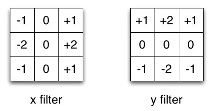

# 深度学习

## 1. Caffe

### 001 什么是 Caffe？

Caffe的全称应该是Convolutional Architecture for Fast Feature Embedding，它是一个清晰、高效的深度学习框架，它是开源的，核心语言是C++，它支持命令行、Python和Matlab接口，它既可以在CPU上运行也可以在GPU上运行。它的license是BSD 2-Clause。

### 002 Caffe的特点是什么？

（1）模块化：Caffe从一开始就设计得尽可能模块化，允许对新数据格式、网络层和损失函数进行扩展。
（2）表示和实现分离：Caffe的<u>模型(model)定义是用Protocol Buffer语言写进配置文件</u>的。以任意有向无环图的形式，Caffe支持网络架构。Caffe会根据网络的需要来正确占用内存。通过一个函数调用，实现CPU和GPU之间的切换。
（3）测试覆盖：在Caffe中，每一个单一的模块都对应一个测试。
（4）python和Matlab接口：同时提供Python和Matlab接口。
（5）预训练参考模型：针对视觉项目，Caffe提供了一些参考模型，这些模型仅应用在学术和非商业领域，它们的license不是BSD。

###  003 Caffe的设计思想是怎样的？

基本上，Caffe 沿用了神经网络的一个简单假设----<u>所有的计算都是以layer的形式表示的</u>，layer做的事情就是take一些数据，然后输出一些计算以后的结果，比如说卷积，就是输入一个图像，然后和这一层的参数（filter）做卷积，然后输出卷积的结果。每一个layer需要做两个计算：forward是从输入计算输出，然后backward是从上面给的gradient来计算相对于输入的gradient，只要这两个函数实现了以后，我们就可以把很多层连接成一个网络，这个网络做的事情就是输入我们的数据（图像或者语音或者whatever），然后来计算我们需要的输出（比如说识别的label），在training的时候，我们可以根据已有的label来计算loss和gradient，然后用gradient来update网络的参数，这个就是Caffe的一个基本流程。

最简单地用Caffe上手的方法就是先把数据写成Caffe的格式，然后设计一个网络，然后用Caffe提供的solver来做优化看效果如何，如果你的数据是图像的话，可以从现有的网络，比如说alexnet或者googlenet开始，然后做fine tuning，如果你的数据稍有不同，比如说是直接的float vector，你可能需要做一些custom的configuration，Caffe的logistic regression example兴许会很有帮助。

fine tune方法：fine tuning的想法就是说，在imagenet那么大的数据集上train好一个很牛的网络了，那别的task上肯定也不错，所以我们可以把pretrain的网络拿过来，然后只重新train最后几层，重新train的意思是说，比如我以前需要classify imagenet的一千类，现在我只想识别是狗还是猫，或者是不是车牌，于是我就可以把最后一层softmax从一个4096*1000的分类器变成一个4096*2的分类器，这个strategy在应用中非常好使，所以我们经常会先在imagenet上pretrain一个网络，因为我们知道imagenet上training的大概过程会怎么样。

### 004 Caffe架构是怎样的？

Caffe的架构与其它的深度学习框架稍微不同，它没有根据算法实现过程的方式来进行编码，而是以系统级的抽象作为整体架构，逐层的封装实现细节，使得上层的架构变得很清晰。Caffe的整体架构如下：

**SyncedMem**

这个类的主要功能是<u>封装CPU和GPU的数据交互操作</u>。一般来说，数据的流动形式都是：硬盘->CPU内存->GPU内存->CPU内存->（硬盘），所以在写代码的过程中经常会写CPU/GPU之间数据传输的代码，同时还要维护CPU和GPU两个处理端的内存指针。这些事情处理起来不会很难，但是会很繁琐。因此SyncedMem的出现就是把CPU/GPU的数据传输操作封装起来，只需要调用简单的接口就可以获得两个处理端同步后的数据。

**Blob**

Blob是<u>用于存储数据的对象</u>，在Caffe中各种数据(图像输入、模型参数)都是以Blob的形式在网络中传输的，Blob提供统一的存储操作接口，可用来保存训练数据、模型参数等，同时Blob还能在CPU和GPU之间进行同步以支持CPU/GPU的混合运算。

这个类做了两个封装：一个是操作数据的封装，使用Blob可以操纵高维的数据，快速访问其中的数据，变换数据的维度等；另一个是对原始数据和更新量的封装，<u>每一个Blob中都有data和diff两个数据指针，data用于存储原始数据，diff 用于存储反向传播（Backpropagation）的梯度更新值</u>。Blob使用了SyncedMem，这样便于访问不同的处理端。Blob基本实现了整个Caffe数据结构部分的封装，在Net类中可以看到所有的前后向数据和参数都用Blob来表示就足够了。数据的抽象到这个就可以了，接下来作层级的抽象。神经网络的前后向计算可以做到层与层之间完全独立，只要每个层按照一定的接口规则实现，就可以确保整个网络的正确性。

**Layer**

<u>Layer是网络Net的基本单元，也是Caffe中能在外部进行调整的最小网络结构单元，每个Layer都有输入Blob和输出Blob</u>。Layer（层）是Caffe中最庞大最繁杂的模块，它是神经网络的基本计算单元。由于Caffe强调模块化设计，因此只允许每个layer完成一类特定的计算，例如convolution操作、pooling、非线性变换、内积运算，以及数据加载、归一化和损失计算等。Caffe中layer的种类有很多，具体的种类及功能请看官方文档。在创建一个Caffe模型的时候，也是以Layer为基础进行的。Layer是一个父类，它的下面还有各种实现特定功能的子类，例如data_layer，conv_layer，loss_layer等。Layer是通过LayFactory来创建的。

**Net**

Net是一个完整的深度网络，包含输入层、隐藏层、输出层，在Caffe中一般是一个卷积神经网络(Convolution Neural Networ，CNN)。<u>通过定义不同类型的Layer，并用Blob将不同的Layer连接起来，就能产生一个Net。</u>Net将数据Blob和层Layer组合起来做进一步的封装，对外提供了初始化和前后传播的接口，使得整体看上去和一个层的功能类似，但内部的组合可以是多种多样的。值得一提的是，每一层的输入输出数据统一保存在Net中，同时每个层内的参数指针也保存在Net中，不同的层可以通过WeightShare共享相同的参数，因此可以通过配置来实现多个神经网络层之间共享参数的功能。一个Net由多个Layer组成。一个典型的网络从data layer（从磁盘中载入数据）出发到loss layer结束。

**Solver**

有了Net就可以进行神经网络的前后向传播计算了，但是还缺少神经网络的训练和预测功能，<u>Solver类进一步封装了训练和预测相关的一些功能</u>。它还提供了两个接口：一个是更新参数的接口，继承Solver可以实现不同的参数更新方法，如Momentum，Nesterov，Adagrad等，因此可以使用不同的优化算法。另一个接口是训练过程中每一轮特定状态下的可注入的一些回调函数，在代码中这个回调点的直接使用者就是多GPU训练算法。<u>Solver定义了针对Net网络模型的求解方法，记录网络的训练过程，保存网络模型参数，中断并恢复网络的训练过程</u>。自定义Solver能够实现不同的神经网络求解方式。阅读Solver的代码可以了解网络的求解优化过程。Solver是一个父类，它下面还有实现不同优化方法的子类，例如sgd_solver，adagrad_sovler等，Solver是通过SolverFactory来创建的。

**Proto**

caffe.proto位于…/src/caffe/proto目录下，在这个文件夹下还有一个.pb.cc和一个.pb.h文件，这两个文件都是由caffe.proto编译而来的。 在caffe.proto中定义了很多结构化数据，包括：
BlobProto、Datum、FillerParameter、NetParameter、SolverParameter、SolverState、LayerParameter、ConcatParameter、ConvolutionParameter、DataParameter、DropoutParameter、HDF5DataParameter、HDF5OutputParameter、ImageDataParameter、InfogainLossParameter、InnerProductParameter、LRNParameter、MemoryDataParameter、PoolingParameter、PowerParameter、WindowDataParameter、V0LayerParameter。

**IO**

除了上面的东西之外，还需要输入数据和参数。DataReader和DataTransformer帮助准备输入数据，Filler对参数进行初始化，一些Snapshot方法可以对模型进行持久化。

### 005 Caffe的有哪些接口？

Caffe深度学习框架支持多种编程接口，包括命令行、Python和Matlab,下面将介绍如何使用这些接口。

**Caffe Python接口**

Caffe提供 Python 接口，即Pycaffe，具体实现在caffe、python文件夹内。在Python代码中import caffe，可以load models（导入模型）、forward and backward （前向、反向迭代）、handle IO（数据输入输出）、visualize networks（绘制net）和instrument model solving（自定义优化方法)。所有的模型数据、计算参数都是暴露在外、可供读写的。
（1）caffe.Net 是主要接口，负责导入数据、校验数据、计算模型。
（2）caffe.Classsifier 用于图像分类。
（3）caffe.Detector 用于图像检测。
（4）caffe.SGDSolver 是露在外的 solver 的接口。
（5）caffe.io 处理输入输出，数据预处理。
（6）caffe.draw 可视化 net 的结构。
（7）caffe blobs 以 numpy ndarrys 的形式表示，方便而且高效。

**Caffe MATLAB接口**

MATLAB接口（Matcaffe）在 caffe/matlab 目录的 caffe 软件包。在 matcaffe 的基础上，可将Caffe整合到MATLAB代码中。MATLAB接口包括：
（1）MATLAB 中创建多个网络结构。
（2）网络的前向传播（Forward）与反向传播（Backward）计算。
（3）网络中的任意一层以及参数的存取。
（4）网络参数保存至文件或从文件夹加载。
（5）blob 和 network 形状调整。
（6）网络参数编辑和调整。
（7）创建多个 solvers 进行训练。
（8）从solver 快照（Snapshots）恢复并继续训练。
（9）访问训练网络（Train nets）和测试网络(Test nets)。
（10）迭代后网络交由 MATLAB 控制。
（11）MATLAB代码融合梯度算法。

**Caffe 命令行接口**

命令行接口 Cmdcaffe 是 Caffe 中用来训练模型、计算得分以及方法判断的工具。Cmdcaffe 存放在 caffe/build/tools 目录下。

*caffe train*
caffe train 命令用于模型学习，具体包括：
（1）caffe train 带 solver.prototxt 参数完成配置。
（2）caffe train 带 snapshot mode_iter_1000.solverstate 参数加载 solver snapshot。
（3）caffe train 带 weights 参数 model.caffemodel 完成 Fine-tuning 模型初始化。

*caffe test*
caffe test 命令用于测试运行模型的得分，并且用百分比表示网络输出的最终结果，比如 accuracyhuoloss 作为其结果。测试过程中，显示每个 batch 的得分，最后输出全部 batch 的平均得分值。

*caffe time*
caffe time 命令用来检测系统性能和测量模型相对执行时间，此命令通过逐层计时与同步，执行模型检测。

## 2. CNN

### 001 神经网络的组成

神经网络类型众多，其中最为重要的是多层感知机。为了详细地描述神经网络，我们先从最简单的神经网络说起。

**1、感知机**

多层感知机中的特征神经元模型称为感知机，由*Frank Rosenblatt*于1957年发明。简单的感知机如下图所示：


其中$x_1$，$x_2$，$x_3$为感知机的输入，其输出为：
$$
output = \left\{
\begin{aligned}
0, \quad if \ \ \sum_i w_i x_i \leqslant threshold \\
1, \quad if \ \ \sum_i w_i x_i > threshold
\end{aligned}
\right.
$$
假如把感知机想象成一个加权投票机制，比如 3 位评委给一个歌手打分，打分分别为$ 4 $分、$1$ 分、$-3 $分，这$3$位评分的权重分别是 $1、3、2$，则该歌手最终得分为 $4 \times 1 + 1 \times 3 + (-3) \times 2 = 1$ 。按照比赛规则，选取的 $threshold$ 为 $3$，说明只有歌手的综合评分大于$ 3$ 时，才可顺利晋级。对照感知机，该选手被淘汰，因为：
$$
\sum_i w_i x_i < threshold=3, output = 0
$$
用 $-b$  代替 $threshold$，输出变为：
$$
output = \left\{
\begin{aligned}
0, \quad if \ \ \boldsymbol{w} \cdot \boldsymbol{x} + b \leqslant 0 \\
1, \quad if \ \ \boldsymbol{w} \cdot \boldsymbol{x} + b > 0
\end{aligned}
\right.
$$
设置合适的  $\boldsymbol{x}$  和  $b$ ，一个简单的感知机单元的与非门表示如下：


当输入为 $0$，$1$ 时，感知机输出为 $ 0 \times (-2) + 1 \times (-2) + 3 = 1$。

复杂一些的感知机由简单的感知机单元组合而成：


**2、多层感知机**

多层感知机由感知机推广而来，最主要的特点是有多个神经元层，因此也叫深度神经网络。相比于单独的感知机，多层感知机的第 $ i $ 层的每个神经元和第 $ i-1 $ 层的每个神经元都有连接。


输出层可以不止有$ 1$ 个神经元。隐藏层可以只有$ 1$ 层，也可以有多层。输出层为多个神经元的神经网络例如下图所示：


**3、卷积神经网络凸显共性的方法？**

CNN本质是局部卷积+Pooling

**局部连接**

我们首先了解一个概念，感受野，即每个神经元仅与输入神经元相连接的一块区域。

在图像卷积操作中，<u>神经元在空间维度上是局部连接，但在深度上是全连接</u>。局部连接的思想，是受启发于生物学里的视觉系统结构，视觉皮层的神经元就是仅用局部接受信息。对于二维图像，局部像素关联性较强。这种局部连接保证了训练后的滤波器能够对局部特征有最强的响应，使神经网络可以提取数据的局部特征；下图是一个很经典的图示，左边是全连接，右边是局部连接。


对于一个1000 × 1000的输入图像而言，如果下一个隐藏层的神经元数目为10^6个，采用全连接则有1000 × 1000 × 10^6 = 10^12个权值参数，如此巨大的参数量几乎难以训练；而采用局部连接，隐藏层的每个神经元仅与图像中10 × 10的局部图像相连接，那么此时的权值参数数量为10 × 10 × 10^6 = 10^8，将直接减少4个数量级。

**权值共享**

权值共享，即<u>计算同一深度的神经元时采用的卷积核参数是共享的</u>。权值共享在一定程度上讲是有意义的，是由于在神经网络中，提取的底层边缘特征与其在图中的位置无关。但是在另一些场景中是无意的，如在人脸识别任务，我们期望在不同的位置学到不同的特征。

需要注意的是，权重只是对于同一深度切片的神经元是共享的。<u>在卷积层中，通常采用多组卷积核提取不同的特征，即对应的是不同深度切片的特征，而不同深度切片的神经元权重是不共享</u>。相反，偏置这一权值对于同一深度切片的所有神经元都是共享的。

权重共享的形式：

- 深度学习中，权重共享最具代表性的就是卷积网络的<u>卷积操作</u>。卷积相比于全连接神经网络参数大大减少；
- 多任务网络中，通常为了降低每个任务的计算量，会<u>共享一个骨干网络</u>。
- 一些<u>相同尺度下的结构化递归网络</u>

权重共享的好处：<u>权重共享一定程度上能增强参数之间的联系，获得更好的共性特征。同时很大程度上降低了网络的参数，节省计算量和计算所需内存（当然，结构化递归并不节省计算量）。此外权重共享能起到很好正则的作用。正则化的目的是为了降低模型复杂度，防止过拟合，而权重共享则正好降低了模型的参数和复杂度</u>。

因此一个设计优秀的权重共享方式，在降低计算量的同时，通常会较独享网络有更好的效果。

权值共享带来的好处是大大降低了网络的训练难度。如下图，假设在局部连接中隐藏层的每一个神经元连接的是一个10 × 10的局部图像，因此有10 × 10个权值参数，将这10 × 10个权值参数共享给剩下的神经元，也就是说隐藏层中10^6个神经元的权值参数相同，那么此时不管隐藏层神经元的数目是多少，需要训练的参数就是这 10 × 10个权值参数（也就是卷积核的大小）。


这里就体现了卷积神经网络的奇妙之处，使用少量的参数，却依然能有非常出色的性能。上述仅仅是提取图像一种特征的过程。如果要多提取出一些特征，可以增加多个卷积核，不同的卷积核能够得到图像不同尺度下的特征，称之为特征图（feature map）。

**4、神经网络有哪些常用模型结构？**

下图包含了大部分常用的模型：


**5、深度学习和机器学习有什么不同？**

**机器学习**：利用计算机、概率论、统计学等知识，输入数据，让计算机学会新知识。机器学习的过程，就是训练数据去优化目标函数。

**深度学习**：是一种特殊的机器学习，具有强大的能力和灵活性。它通过学习将世界表示为嵌套的层次结构，每个表示都与更简单的特征相关，而抽象的表示则用于计算更抽象的表示。


传统的机器学习需要定义一些手工特征，从而有目的的去提取目标信息， 非常依赖任务的特异性以及设计特征的专家经验。而深度学习可以从大数据中先学习简单的特征，并从其逐渐学习到更为复杂抽象的深层特征，不依赖人工的特征工程，这也是深度学习在大数据时代受欢迎的一大原因。


**6、卷积神经网络在不同领域的应用**

卷积神经网络中的卷积操作是其关键组成，而卷积操作只是一种数学运算方式，实际上对不同类型的数值表示数据都是通用的，尽管这些数值可能表示的是图像像素值、文本序列中单个字符或是语音片段中单字的音频。<u>只要使原始数据能够得到有效地数值化表示</u>，卷积神经网络能够在不同的领域中得到应用，要关注的是如何将卷积的特性更好地在不同领域中应用，如表XX所示。

|   应用领域   |                  输入数据图示                   | 说明                                                         |
| :----------: | :---------------------------------------------: | :----------------------------------------------------------- |
|   图像处理   |      | 卷积神经网络在图像处理领域有非常广泛的应用，这是因为图像数据本身具有的局部完整性非常 |
| 自然语言处理 |                          |                                                              |
|   语音处理   |  |                                                              |

**7、自然语言处理与计算机视觉任务的联系与区别**

**联系**
自然语言处理是对一维信号（词序列）做操作。
计算机视觉是对二维（图像）或三维（视频流）信号做操作。

**区别**
自然语言处理的输入数据通常是*离散取值*（例如表示一个单词或字母通常表示为词典中的one hot向量），计算机视觉则是*连续取值*（比如归一化到0，1之间的灰度值）。<u>CNN有两个主要特点，区域不变性(location invariance)和组合性(Compositionality)</u>。

1. 区域不变性：<u>滤波器在每层的输入向量(图像)上滑动，检测的是局部信息，然后通过pooling取最大值或均值</u>。pooling这步综合了局部特征，失去了每个特征的位置信息。这很适合基于图像的任务，比如要判断一幅图里有没有猫这种生物，你可能不会去关心这只猫出现在图像的哪个区域。但是在NLP里，词语在句子或是段落里出现的位置，顺序，都是很重要的信息。
2. 局部组合性：CNN中，<u>每个滤波器都把较低层的局部特征组合生成较高层的更全局化的特征</u>。这在CV里很好理解，像素组合成边缘，边缘生成形状，最后把各种形状组合起来得到复杂的物体表达。在语言里，当然也有类似的组合关系，但是远不如图像来的直接。而且在图像里，相邻像素必然是相关的，相邻的词语却未必相关。

### 002  深层神经网络 

**1、为什么使用深层表示？**

* 深度神经网络是一种特征递进式的学习算法，浅层的神经元直接从输入数据中学习一些低层次的简单特征，例如边缘、纹理等。而深层的特征则基于已学习到的浅层特征继续学习更高级的特征，从计算机的角度学习深层的语义信息。
* 深层的网络隐藏单元数量相对较少，隐藏层数目较多，如果浅层的网络想要达到同样的计算结果则需要指数级增长的单元数量才能达到。

**2、神经网络更“深”有什么意义？**

前提：在一定范围内。

- 在神经元数量相同的情况下，深层网络结构具有更大容量，分层组合带来的是指数级的表达空间，能够组合成更多不同类型的子结构，这样可以更容易地学习和表示各种特征。
- 隐藏层增加则意味着由激活函数带来的非线性变换的嵌套层数更多，就能构造更复杂的映射关系。

**3、为什么深层神经网络难以训练？**

（1）梯度消失

梯度消失是指通过隐藏层从后向前看，梯度会变的越来越小，说明前面层的学习会显著慢于后面层的学习，所以学习会卡住，除非梯度变大。

梯度消失的原因受到多种因素影响，例如学习率的大小，网络参数的初始化，激活函数的边缘效应等。在深层神经网络中，每一个神经元计算得到的梯度都会传递给前一层，较浅层的神经元接收到的梯度受到之前所有层梯度的影响。如果计算得到的梯度值非常小，随着层数增多，求出的梯度更新信息将会以指数形式衰减，就会发生梯度消失。下图是不同隐含层的学习速率：


（2）梯度爆炸

在深度网络或循环神经网络（Recurrent Neural Network, RNN）等网络结构中，梯度可在网络更新的过程中不断累积，变成非常大的梯度，导致网络权重值的大幅更新，使得网络不稳定；在极端情况下，权重值甚至会溢出，变为$NaN$值，再也无法更新。

（3）权重矩阵的退化导致模型的有效自由度减少。

参数空间中学习的退化速度减慢，导致减少了模型的有效维数，网络的可用自由度对学习中梯度范数的贡献不均衡，随着相乘矩阵的数量（即网络深度）的增加，矩阵的乘积变得越来越退化。在有硬饱和边界的非线性网络中（例如 ReLU 网络），随着深度增加，退化过程会变得越来越快。Duvenaud等人2014年的论文里展示了关于该退化过程的可视化：


随着深度的增加，输入空间（左上角所示）会在输入空间中的每个点处被扭曲成越来越细的单丝，只有一个与细丝正交的方向影响网络的响应。沿着这个方向，网络实际上对变化变得非常敏感。

**4、神经网络的深度和宽度作用**

### 003 前向传播与反向传播

神经网络的计算主要有两种：前向传播（foward propagation, FP）作用于每一层的输入，通过逐层计算得到输出结果；反向传播（backward propagation, BP）作用于网络的输出，通过计算梯度由深到浅更新网络参数。

**1、前向传播**


假设上一层结点 $ i,j,k,... $ 等一些结点与本层的结点 $ w $ 有连接，那么结点 $ w $ 的值怎么算呢？就是通过上一层的 $ i,j,k,... $ 等结点以及对应的连接权值进行加权和运算，最终结果再加上一个偏置项（图中为了简单省略了），最后在通过一个非线性函数（即激活函数），如 $ReLu$，$sigmoid$ 等函数，最后得到的结果就是本层结点 $ w $ 的输出。 

最终不断的通过这种方法一层层的运算，得到输出层结果。

（1）输入层 --> 隐含层

计算神经元 $ h1 $ 的输入加权和：
$$
net_{h1} = w_1 * i_1 + w_2 * i_2 + b_1 * 1\\

net_{h1} = 0.15 * 0.05 + 0.2 * 0.1 + 0.35 * 1 = 0.3775
$$
神经元 $ h1 $ 的输出 $ o1 $ ：（此处用到激活函数为 sigmoid 函数）：
$$
out_{h1} = \frac{1}{1 + e^{-net_{h1}}} = \frac{1}{1 + e^{-0.3775}} = 0.593269992
$$
同理，可计算出神经元 $ h2 $ 的输出 $ o1 $：
$$
out_{h2} = 0.596884378
$$

（2）隐含层-->输出层：  　　

计算输出层神经元 $ o1 $ 和 $ o2 $ 的值：
$$
net_{o1} = w_5 * out_{h1} + w_6 * out_{h2} + b_2 * 1
$$

$$
net_{o1} = 0.4 * 0.593269992 + 0.45 * 0.596884378 + 0.6 * 1 = 1.105905967
$$

$$
out_{o1} = \frac{1}{1 + e^{-net_{o1}}} = \frac{1}{1 + e^{1.105905967}} = 0.75136079
$$

这样前向传播的过程就结束了，我们得到输出值为 $ [0.75136079 ,  0.772928465] $，与实际值 $ [0.01 , 0.99] $ 相差还很远，现在我们对误差进行反向传播，更新权值，重新计算输出。

**如何计算神经网络的输出？**


如上图，输入层有三个节点，我们将其依次编号为 1、2、3；隐藏层的 4 个节点，编号依次为 4、5、6、7；最后输出层的两个节点编号为 8、9。比如，隐藏层的节点 4，它和输入层的三个节点 1、2、3 之间都有连接，其连接上的权重分别为是 $ w_{41}, w_{42}, w_{43} $。

为了计算节点 4 的输出值，我们必须先得到其所有上游节点（也就是节点 1、2、3）的输出值。节点 1、2、3 是输入层的节点，所以，他们的输出值就是输入向量本身。按照上图画出的对应关系，可以看到节点 1、2、3 的输出值分别是 $ x_1, x_2, x_3 $。
$$
a_4 = \sigma(w^T \cdot a) = \sigma(w_{41}x_4 + w_{42}x_2 + w_{43}a_3 + w_{4b})
$$
其中 $ w_{4b} $ 是节点 4 的偏置项。

同样，我们可以继续计算出节点 5、6、7 的输出值 $ a_5, a_6, a_7 $。

计算输出层的节点 8 的输出值 $ y_1 $：
$$
y_1 = \sigma(w^T \cdot a) = \sigma(w_{84}a_4 + w_{85}a_5 + w_{86}a_6 + w_{87}a_7 + w_{8b})
$$
其中 $ w_{8b} $ 是节点 8 的偏置项。

同理，我们还可以计算出 $ y_2 $。这样输出层所有节点的输出值计算完毕，我们就得到了在输入向量 $ x_1, x_2, x_3, x_4 $ 时，神经网络的输出向量 $ y_1, y_2 $ 。这里我们也看到，输出向量的维度和输出层神经元个数相同。

**如何计算卷积神经网络的输出值？**

假设有一个 5\*5 的图像，使用一个 3\*3 的 filter 进行卷积，想得到一个 3\*3 的 Feature Map，如下所示：


$ x_{i,j} $ 表示图像第  $ i $ 行第 $ j $ 列元素。$ w_{m,n} $ 表示 filter​ 第 $ m $ 行第 $ n $ 列权重。 $ w_b $ 表示 $filter$ 的偏置项。 表$a_i,_j$示 feature map 第 $ i$ 行第 $ j $ 列元素。 $f$ 表示激活函数，这里以$ ReLU$ 函数为例。

卷积计算公式如下：
$$
a_{i,j} = f(\sum_{m=0}^2 \sum_{n=0}^2 w_{m,n} x_{i+m, j+n} + w_b )
$$
当步长为 $1$ 时，计算 feature map 元素 $ a_{0,0} $ 如下：
$$
a_{0,0} = f(\sum_{m=0}^2 \sum_{n=0}^2 w_{m,n} x_{0+m, 0+n} + w_b )

= relu(w_{0,0} x_{0,0} + w_{0,1} x_{0,1} + w_{0,2} x_{0,2} + w_{1,0} x_{1,0} + \\w_{1,1} x_{1,1} + w_{1,2} x_{1,2} + w_{2,0} x_{2,0} + w_{2,1} x_{2,1} + w_{2,2} x_{2,2}) \\

= 1 + 0 + 1 + 0 + 1 + 0 + 0 + 0 + 1 \\

= 4
$$
其计算过程图示如下：


以此类推，计算出全部的Feature Map。


当步幅为 2 时，Feature Map计算如下


注：图像大小、步幅和卷积后的Feature Map大小是有关系的。它们满足下面的关系：
$$
W_2 = (W_1 - F + 2P)/S + 1\\
H_2 = (H_1 - F + 2P)/S + 1
$$
其中 $ W_2 $， 是卷积后 Feature Map 的宽度；$ W_1 $ 是卷积前图像的宽度；$ F $ 是 filter 的宽度；$ P $ 是 Zero Padding 数量，Zero Padding 是指在原始图像周围补几圈 $0$，如果 $P$ 的值是 $1$，那么就补 $1$ 圈 $0$；$S$ 是步幅；$ H_2 $ 卷积后 Feature Map 的高度；$ H_1 $ 是卷积前图像的宽度。

举例：假设图像宽度 $ W_1 = 5 $，filter 宽度 $ F=3 $，Zero Padding $ P=0 $，步幅 $ S=2 $，$ Z $ 则
$$
W_2 = (W_1 - F + 2P)/S + 1

= (5-3+0)/2 + 1

= 2
$$
说明 Feature Map 宽度是2。同样，我们也可以计算出 Feature Map 高度也是 2。

如果卷积前的图像深度为 $ D $，那么相应的 filter 的深度也必须为 $ D $。深度大于 1 的卷积计算公式：
$$
a_{i,j} = f(\sum_{d=0}^{D-1} \sum_{m=0}^{F-1} \sum_{n=0}^{F-1} w_{d,m,n} x_{d,i+m,j+n} + w_b)
$$
其中，$ D $ 是深度；$ F $ 是 filter 的大小；$ w_{d,m,n} $ 表示 filter 的第 $ d $ 层第 $ m $ 行第 $ n $ 列权重；$ a_{d,i,j} $ 表示 feature map 的第 $ d $ 层第 $ i $ 行第 $ j $ 列像素；其它的符号含义前面相同，不再赘述。

每个卷积层可以有多个 filter。每个 filter 和原始图像进行卷积后，都可以得到一个 Feature Map。卷积后 Feature Map 的深度(个数)和卷积层的 filter 个数相同。下面的图示显示了包含两个 filter 的卷积层的计算。$7*7*3$ 输入，经过两个 $3*3*3$ filter 的卷积(步幅为 $2$)，得到了 $3*3*2$ 的输出。图中的 Zero padding 是 $1$，也就是在输入元素的周围补了一圈 $0$。


以上就是卷积层的计算方法。这里面体现了局部连接和权值共享：每层神经元只和上一层部分神经元相连(卷积计算规则)，且 filter 的权值对于上一层所有神经元都是一样的。对于包含两个 $ 3 * 3 * 3 $ 的 fitler 的卷积层来说，其参数数量仅有 $ (3 * 3 * 3+1) * 2 = 56 $ 个，且参数数量与上一层神经元个数无关。与全连接神经网络相比，其参数数量大大减少了。

**如何计算Pooling层的输出值？**

Pooling 层主要的作用是下采样，通过去掉 Feature Map 中不重要的样本，进一步减少参数数量。Pooling 的方法很多，最常用的是 Max Pooling。Max Pooling 实际上就是在 n\*n 的样本中取最大值，作为采样后的样本值。下图是 2\*2 max pooling：


除了 Max Pooing 之外，常用的还有 Average Pooling ——取各样本的平均值。

对于深度为 $ D $ 的 Feature Map，各层独立做 Pooling，因此 Pooling 后的深度仍然为 $ D $。

**2、反向传播 **

（1）计算总误差

总误差：(这里使用Square Error)
$$
E_{total} = \sum \frac{1}{2}(target - output)^2
$$
但是有两个输出，所以分别计算 $ o1 $ 和 $ o2 $ 的误差，总误差为两者之和：

$E_{o1} = \frac{1}{2}(target_{o1} - out_{o1})^2 
= \frac{1}{2}(0.01 - 0.75136507)^2 = 0.274811083$.

$E_{o2} = 0.023560026$.

$E_{total} = E_{o1} + E_{o2} = 0.274811083 + 0.023560026 = 0.298371109$.

（2）输出层 --> 隐含层的权值更新：

以权重参数 $ w5 $ 为例，如果我们想知道 $ w5 $ 对整体误差产生了多少影响，可以用整体误差对 $ w5 $ 求偏导求出：（链式法则）
$$
\frac{\partial E_{total}}{\partial w5} = \frac{\partial E_{total}}{\partial out_{o1}} * \frac{\partial out_{o1}}{\partial net_{o1}} * \frac{\partial net_{o1}}{\partial w5}
$$
下面的图可以更直观的看清楚误差是怎样反向传播的：


由于我们前向传播最终得到的结果，以分类为例，最终总是有误差的，那么怎么减少误差呢，当前应用广泛的一个算法就是梯度下降算法，但是求梯度就要求偏导数，下面以图中字母为例讲解一下：

设最终误差为 $ E $且输出层的激活函数为线性激活函数，对于输出那么 $ E $ 对于输出节点 $ y_l $ 的偏导数是 $ y_l - t_l $，其中 $ t_l $ 是真实值，$ \frac{\partial y_l}{\partial z_l} $ 是指上面提到的激活函数，$ z_l $ 是上面提到的加权和，那么这一层的 $ E $ 对于 $ z_l $ 的偏导数为 $ \frac{\partial E}{\partial z_l} = \frac{\partial E}{\partial y_l} \frac{\partial y_l}{\partial z_l} $。同理，下一层也是这么计算，只不过 $ \frac{\partial E}{\partial y_k} $ 计算方法变了，一直反向传播到输入层，最后有 $ \frac{\partial E}{\partial x_i} = \frac{\partial E}{\partial y_j} \frac{\partial y_j}{\partial z_j} $，且 $ \frac{\partial z_j}{\partial x_i} = w_i j $。然后调整这些过程中的权值，再不断进行前向传播和反向传播的过程，最终得到一个比较好的结果。

一个典型的三层神经网络如下所示：


其中 Layer $ L_1 $ 是输入层，Layer $ L_2 $ 是隐含层，Layer $ L_3 $ 是输出层。假设输入数据集为 $ D={x_1, x_2, ..., x_n} $，输出数据集为 $ y_1, y_2, ..., y_n $。如果输入和输出是一样，即为自编码模型。如果原始数据经过映射，会得到不同于输入的输出。

假设有如下的网络层：


输入层包含神经元 $ i_1, i_2 $，偏置 $ b_1 $；隐含层包含神经元 $ h_1, h_2 $，偏置 $ b_2 $，输出层为  $ o_1, o_2 $，$ w_i $ 为层与层之间连接的权重，激活函数为 $sigmoid$ 函数。对以上参数取初始值，如下图所示：


其中：
- 输入数据 $ i1=0.05, i2 = 0.10 $
- 输出数据 $ o1=0.01, o2=0.99 $;
- 初始权重 $ w1=0.15, w2=0.20, w3=0.25,w4=0.30, w5=0.40, w6=0.45, w7=0.50, w8=0.55 $
- 目标：给出输入数据 $ i1,i2 $ ( $0.05$和$0.10$ )，使输出尽可能与原始输出 $ o1,o2 $，( $0.01$和$0.99$)接近。

### 004 卷积神经网络的组成层

以图像分类任务为例，在表5.1所示卷积神经网络中，一般包含5种类型的网络层次结构：

| CNN层次结构 |             输出尺寸              | 作用                                                         |
| :---------: | :-------------------------------: | :----------------------------------------------------------- |
|   输入层    |      $W_1\times H_1\times 3$      | 卷积网络的原始输入，可以是原始或预处理后的像素矩阵           |
|   卷积层    |      $W_1\times H_1\times K$      | 参数共享、局部连接，利用平移不变性从全局特征图提取局部特征   |
|   激活层    |      $W_1\times H_1\times K$      | 将卷积层的输出结果进行非线性映射                             |
|   池化层    |      $W_2\times H_2\times K$      | 进一步筛选特征，可以有效减少后续网络层次所需的参数量         |
|  全连接层   | $(W_2 \cdot H_2 \cdot K)\times C$ | 将多维特征展平为2维特征，通常低维度特征对应任务的学习目标（类别或回归值） |

$W_1\times H_1\times 3$对应原始图像或经过预处理的像素值矩阵，3对应RGB图像的通道;$K$表示卷积层中卷积核（滤波器）的个数;$W_2\times H_2$ 为池化后特征图的尺度，在全局池化中尺度对应$1\times 1$;$(W_2 \cdot H_2 \cdot K)$是将多维特征压缩到1维之后的大小，$C$对应的则是图像类别个数。

#### 004-1 输入层

输入层(Input Layer)通常是输入卷积神经网络的原始数据或经过预处理的数据，可以是图像识别领域中原始三维的多彩图像，也可以是音频识别领域中经过傅利叶变换的二维波形数据，甚至是自然语言处理中一维表示的句子向量。以图像分类任务为例，输入层输入的图像一般包含RGB三个通道，是一个由长宽分别为$H$和$W$组成的3维像素值矩阵$H\times W \times 3$，卷积网络会将输入层的数据传递到一系列卷积、池化等操作进行特征提取和转化，最终由全连接层对特征进行汇总和结果输出。根据计算能力、存储大小和模型结构的不同，卷积神经网络每次可以批量处理的图像个数不尽相同，若指定输入层接收到的图像个数为$N$，则输入层的输出数据为$N\times H\times W\times 3$。

#### 004-2 卷积层

卷积层(Convolution Layer)通常用作对输入层输入数据进行特征提取，通过卷积核矩阵对原始数据中隐含关联性的一种抽象。卷积操作原理上其实是对两张像素矩阵进行点乘求和的数学操作，其中一个矩阵为输入的数据矩阵，另一个矩阵则为卷积核（滤波器或特征矩阵），求得的结果表示为原始图像中提取的特定局部特征。图5.1表示卷积操作过程中的不同填充策略，<u>上半部分采用零填充，下半部分采用有效卷积（舍弃不能完整运算的边缘部分）</u>。


**1、卷积在图像中有什么直观作用**

在卷积神经网络中，卷积常用来提取图像的特征，但不同层次的卷积操作提取到的特征类型是不相同的，特征类型粗分如表5.2所示。

| 卷积层次 | 特征类型 |
| :------: | :------: |
| 浅层卷积 | 边缘特征 |
| 中层卷积 | 局部特征 |
| 深层卷积 | 全局特征 |

图像与不同卷积核的卷积可以用来执行边缘检测、锐化和模糊等操作。表5.3显示了应用不同类型的卷积核（滤波器）后的各种卷积图像。

|         卷积作用         |                            卷积核                            |                    卷积后图像                     |
| :----------------------: | :----------------------------------------------------------: | :-----------------------------------------------: |
|         输出原图         | $\begin{bmatrix} 0 & 0 & 0 \\ 0 & 1 & 0 \\ 0 & 0 & 0 \end{bmatrix}$ |                   |
| 边缘检测（突出边缘差异） | $\begin{bmatrix} 1 & 0 & -1 \\ 0 & 0 & 0 \\ -1 & 0 & 1 \end{bmatrix}$ |      |
|  边缘检测（突出中间值）  | $\begin{bmatrix} -1 & -1 & -1 \\ -1 & 8 & -1 \\ -1 & -1 & -1 \end{bmatrix}$ |    |
|         图像锐化         | $\begin{bmatrix} 0 & -1 & 0 \\ -1 & 5 & -1 \\ 0 & -1 & 0 \end{bmatrix}$ |          |
|         方块模糊         | $\begin{bmatrix} 1 & 1 & 1 \\ 1 & 1 & 1 \\ 1 & 1 & 1 \end{bmatrix} \times \frac{1}{9}$ |             |
|         高斯模糊         | $\begin{bmatrix} 1 & 2 & 1 \\ 2 & 4 & 2 \\ 1 & 2 & 1 \end{bmatrix} \times \frac{1}{16}$ |  |

**2、卷积层有哪些基本参数？**

卷积层中需要用到卷积核（滤波器或特征检测器）与图像特征矩阵进行点乘运算，利用卷积核与对应的特征感受域进行划窗式运算时，需要设定卷积核对应的<u>大小、步长、个数以及填充的</u>方式，如表5.4所示。

|          参数名           | 作用                                                         | 常见设置                                                     |
| :-----------------------: | :----------------------------------------------------------- | :----------------------------------------------------------- |
| 卷积核大小 (Kernel Size)  | 卷积核的大小定义了卷积的感受野                               | 在过去常设为5，如LeNet-5；现在多设为3，通过堆叠$3\times3$的卷积核来达到更大的感受域 |
|    卷积核步长 (Stride)    | 定义了卷积核在卷积过程中的步长                               | 常见设置为1，表示滑窗距离为1，可以覆盖所有相邻位置特征的组合；当设置为更大值时相当于对特征组合降采样 |
|    填充方式 (Padding)     | 在卷积核尺寸不能完美匹配输入的图像矩阵时需要进行一定的填充策略 | 设置为'SAME'表示对不足卷积核大小的边界位置进行某种填充（通常零填充）以保证卷积输出维度与与输入维度一致；当设置为'VALID'时则对不足卷积尺寸的部分进行舍弃，输出维度就无法保证与输入维度一致 |
| 输入通道数 (In Channels)  | 指定卷积操作时卷积核的深度                                   | 默认与输入的特征矩阵通道数（深度）一致；在某些压缩模型中会采用通道分离的卷积方式 |
| 输出通道数 (Out Channels) | 指定卷积核的个数                                             | 若设置为与输入通道数一样的大小，可以保持输入输出维度的一致性；若采用比输入通道数更小的值，则可以减少整体网络的参数量 |

> 卷积操作维度变换公式：
>
> $O_d =\begin{cases} \lceil \frac{(I_d - k_{size})+ 1)}{s}\rceil ,& \text{padding=VALID}\\ \lceil \frac{I_d}{s}\rceil,&\text{padding=SAME} \end{cases}$
>
> 其中，$I_d$为输入维度，$O_d$为输出维度，$k_{size}$为卷积核大小，$s$为步长

**3、卷积核有什么类型？**

常见的卷积主要是由连续紧密的卷积核对输入的图像特征进行滑窗式点乘求和操作，除此之外还有其他类型的卷积核在不同的任务中会用到，具体分类如表5.5所示。

|            卷积类别            |            示意图             | 作用                                                         |
| :----------------------------: | :---------------------------: | :----------------------------------------------------------- |
|            标准卷积            |   | 最常用的卷积核，连续紧密的矩阵形式可以提取图像区域中的相邻像素之间的关联关系，$3\times3$的卷积核可以获得$3\times3$像素范围的感受视野 |
| 扩张卷积（带孔卷积或空洞卷积） |   | 引入一个称作扩张率（Dilation Rate）的参数，使同样尺寸的卷积核可以获得更大的感受视野，相应的在相同感受视野的前提下比普通卷积采用更少的参数。同样是$3\times3$的卷积核尺寸，扩张卷积可以提取$5\times5$范围的区域特征，在实时图像分割领域广泛应用 |
|            转置卷积            |  | <u>先对原始特征矩阵进行填充使其维度扩大到适配卷积目标输出维度，然后进行普通的卷积操作的一个过程，其输入到输出的维度变换关系恰好与普通卷积的变换关系相反</u>，但这个变换并不是真正的逆变换操作，通常称为转置卷积(Transpose Convolution)而不是反卷积(Deconvolution)。转置卷积常见于目标检测领域中对小目标的检测和图像分割领域还原输入图像尺度。 |
|           可分离卷积           |  | 标准的卷积操作是同时对原始图像$H\times W\times C$三个方向的卷积运算，假设有$K$个相同尺寸的卷积核，这样的卷积操作需要用到的参数为$H\times W\times C\times K$个；若<u>将长宽与深度方向的卷积操作分离出变为$H\times W$与$C$的两步卷积操作</u>，则同样的卷积核个数$K$，只需要$(H\times W + C)\times K$个参数，便可得到同样的输出尺度。可分离卷积(Seperable Convolution)通常应用在模型压缩或一些轻量的卷积神经网络中，如MobileNet$^{[1]}$、Xception$^{[2]}$等 |

**4、卷积核是否一定越大越好？**

在早期的卷积神经网络中（如LeNet-5、AlexNet），用到了一些较大的卷积核（$11\times11$和$5\times 5$），受限于当时的计算能力和模型结构的设计，无法将网络叠加得很深，因此卷积网络中的卷积层需要设置较大的卷积核以获取更大的感受域。但是这种大卷积核反而会导致计算量大幅增加，不利于训练更深层的模型，相应的计算性能也会降低。后来的卷积神经网络（VGG、GoogLeNet等），发现通过堆叠2个$3\times 3$卷积核可以获得与$5\times 5$卷积核相同的感受视野，同时参数量会更少（$3×3×2+1$ < $ 5×5×1+1$），$3\times 3$卷积核被广泛应用在许多卷积神经网络中。因此可以认为，<u>在大多数情况下通过堆叠较小的卷积核比直接采用单个更大的卷积核会更加有效</u>。

但是，这并不是表示更大的卷积核就没有作用，在某些领域应用卷积神经网络时仍然可以采用较大的卷积核。譬如在自然语言处理领域，由于文本内容不像图像数据可以对特征进行很深层的抽象，往往在该领域的特征提取只需要较浅层的神经网络即可。<u>在将卷积神经网络应用在自然语言处理领域时，通常都是较为浅层的卷积层组成，但是文本特征有时又需要有较广的感受域让模型能够组合更多的特征（如词组和字符），此时直接采用较大的卷积核将是更好的选择</u>。

综上所述，卷积核的大小并没有绝对的优劣，需要视具体的应用场景而定，但是极大和极小的卷积核都是不合适的，单独的$1\times 1$极小卷积核只能用作分离卷积而不能对输入的原始特征进行有效的组合，极大的卷积核通常会组合过多的无意义特征从而浪费了大量的计算资源。

**参考资料**

- [Feature Extraction Using Convolution](http://ufldl.stanford.edu/tutorial/supervised/FeatureExtractionUsingConvolution/)
- [convolution](https://leonardoaraujosantos.gitbooks.io/artificial-inteligence/content/convolution.html)
- [理解图像卷积操作的意义](https://blog.csdn.net/chaipp0607/article/details/72236892?locationNum=9&fps=1)
- [关于深度学习中卷积核操作](https://www.cnblogs.com/Yu-FeiFei/p/6800519.html)

**5、二维卷积与三维卷积有什么区别？**

- *二维卷积*
  二维卷积操作如图5.3所示，为了更直观的说明，分别展示在单通道和多通道输入中，对单个通道输出的卷积操作。在单通道输入的情况下，若输入卷积核尺寸为 $(k_h, k_w, 1)$，卷积核在输入图像的空间维度上进行滑窗操作，每次滑窗和 $(k_h, k_w)$窗口内的值进行卷积操作，得到输出图像中的一个值。在多通道输入的情况下，假定输入图像特征通道数为3，卷积核尺寸则为$(k_h, k_w, 3)$，每次滑窗与3个通道上的$(k_h, k_w)$窗口内的所有值进行卷积操作，得到输出图像中的一个值。


- *三维卷积*
  3D卷积操作如图所示，同样分为单通道和多通道，且假定只使用1个卷积核，即输出图像仅有一个通道。对于单通道输入，<u>与2D卷积不同之处在于，输入图像多了一个深度(depth)维度</u>，卷积核也多了一个$k_d$维度，因此3D卷积核的尺寸为$(k_h, k_w, k_d)$，每次滑窗与$(k_h, k_w, k_d)$窗口内的值进行相关操作，得到输出3D图像中的一个值。对于多通道输入，则与2D卷积的操作一样，每次滑窗与3个channels上的$(k_h, k_w, k_d)$窗口内的所有值进行相关操作，得到输出3D图像中的一个值。


**6、$1\times1$卷积作用？**

NIN(Network in Network)$^{[4]}$是第一篇探索$1\times1$卷积核的论文，这篇论文通过在卷积层中使用MLP替代传统线性的卷积核，使单层卷积层内具有非线性映射的能力，也因其网络结构中嵌套MLP子网络而得名NIN。NIN对不同通道的特征整合到MLP自网络中，让不同通道的特征能够交互整合，使通道之间的信息得以流通，其中的MLP子网络恰恰可以用$1\times1$的卷积进行代替。

GoogLeNet$^{[5]}$则采用$1\times1$卷积核来减少模型的参数量。在原始版本的Inception模块中，由于每一层网络采用了更多的卷积核，大大增加了模型的参数量。此时在每一个较大卷积核的卷积层前引入$1\times1$卷积，可以通过分离通道与宽高卷积来减少模型参数量。以图5.2为例，在不考虑参数偏置项的情况下，若输入和输出的通道数为$C_1=16$，则左半边网络模块所需的参数为$(1\times1+3\times3+5\times5+0)\times C_1\times C_1=8960$；假定右半边网络模块采用的$1\times1$卷积通道数为$C_2=8$$(满足C_1>C_2)$，则右半部分的网络结构所需参数量为$(1\times1\times (3C_1+C_2)+3\times3\times C_2 +5\times5\times C_2)\times C_1=5248$ ，可以在不改变模型表达能力的前提下大大减少所使用的参数量。


综上所述，$1\times 1$卷积的作用主要为以下两点：
- 实现信息的跨通道交互和整合。
- 对卷积核通道数进行降维和升维，减小参数量。

**7、全连接、局部连接、全卷积与局部卷积**

大多数神经网络中高层网络通常会采用全连接层(Global Connected Layer)，通过多对多的连接方式对特征进行全局汇总，可以有效地提取全局信息。但是全连接的方式需要大量的参数，是神经网络中最占资源的部分之一，因此就需要局部连接(Local Connected Layer)，仅在局部区域范围内产生神经元连接，能够有效地减少参数量。根据卷积操作的作用范围可以分为全卷积(Global Convolution)和局部卷积(Local Convolution)。实际上这里所说的全卷积就是标准卷积，即在整个输入特征维度范围内采用相同的卷积核参数进行运算，全局共享参数的连接方式可以使神经元之间的连接参数大大减少;局部卷积又叫平铺卷积(Tiled Convolution)或非共享卷积(Unshared Convolution)，是局部连接与全卷积的折衷。四者的比较如表XX所示。

| 连接方式 |                     示意图                      | 说明                                                         |
| :------: | :---------------------------------------------: | :----------------------------------------------------------- |
|  全连接  |    | 层间神经元完全连接，每个输出神经元可以获取到所有输入神经元的信息，有利于信息汇总，常置于网络末层；连接与连接之间独立参数，大量的连接大大增加模型的参数规模。 |
| 局部连接 |  | 层间神经元只有局部范围内的连接，在这个范围内采用全连接的方式，超过这个范围的神经元则没有连接；连接与连接之间独立参数，相比于全连接减少了感受域外的连接，有效减少参数规模 |
|  全卷积  |                 | 层间神经元只有局部范围内的连接，在这个范围内采用全连接的方式，连接所采用的参数在不同感受域之间共享，有利于提取特定模式的特征；相比于局部连接，共用感受域之间的参数可以进一步减少参数量。 |
| 局部卷积 |            | 层间神经元只有局部范围内的连接，感受域内采用全连接的方式，而<u>感受域之间间隔采用局部连接与全卷积的连接方式</u>；相比与全卷积成倍引入额外参数，但有更强的灵活性和表达能力；相比于局部连接，可以有效控制参数量 |

**8、局部卷积的应用**

并不是所有的卷积都会进行权重共享，在某些特定任务中，会使用不权重共享的卷积。下面通过人脸这一任务来进行讲解。在读人脸方向的一些paper时，会发现很多都会在最后加入一个Local Connected Conv，也就是不进行权重共享的卷积层。总的来说，这一步的作用就是<u>使用3D模型来将人脸对齐</u>，从而使CNN发挥最大的效果。


截取论文中的一部分图，经过3D对齐以后，形成的图像均是152×152，输入到上述的网络结构中。该结构的参数如下：

> Conv：32个11×11×3的卷积核，
> Max-pooling: 3×3，stride=2，
> Conv: 16个9×9的卷积核，
> Local-Conv: 16个9×9的卷积核，
> Local-Conv: 16个7×7的卷积核，
> Local-Conv: 16个5×5的卷积核，
> Fully-connected: 4096维，
> Softmax: 4030维。

前三层的目的在于提取低层次的特征，比如简单的边和纹理。其中Max-pooling层使得卷积的输出对微小的偏移情况更加鲁棒。但不能使用更多的Max-pooling层，因为太多的Max-pooling层会使得网络损失图像信息。全连接层将上一层的每个单元和本层的所有单元相连，用来捕捉人脸图像不同位置特征之间的相关性。最后使用softmax层用于人脸分类。中间三层都是使用参数不共享的卷积核，之所以使用参数不共享，有如下原因：

（1）<u>对齐的人脸图片中，不同的区域会有不同的统计特征，因此并不存在特征的局部稳定性</u>，所以使用相同的卷积核会导致信息的丢失。
（2）<u>不共享的卷积核并不增加inference时特征的计算量，仅会增加训练时的计算量</u>。使用不共享的卷积核，由于需要训练的参数量大大增加，因此往往需要通过其他方法增加数据量。

**9、每层卷积是否只能用一种尺寸的卷积核？**

经典的神经网络一般都属于层叠式网络，每层仅用一个尺寸的卷积核，如VGG结构中使用了大量的$3×3$卷积层。事实上，<u>同一层特征图可以分别使用多个不同尺寸的卷积核，以获得不同尺度的特征，再把这些特征结合起来，得到的特征往往比使用单一卷积核的要好</u>，如GoogLeNet、Inception系列的网络，均是每层使用了多个卷积核结构。如图5.3所示，输入的特征在同一层分别经过$1×1$、$3×3$和$5×5$三种不同尺寸的卷积核，再将分别得到的特征进行整合，得到的新特征可以看作不同感受域提取的特征组合，相比于单一卷积核会有更强的表达能力。


**10、怎样才能减少卷积层参数量？**

减少卷积层参数量的方法可以简要地归为以下几点：
- 使用堆叠小卷积核代替大卷积核：VGG网络中2个$3\times 3$的卷积核可以代替1个$5\times 5$的卷积核
- 使用分离卷积操作：将原本$K\times K\times C$的卷积操作分离为$K\times K\times 1$和$1\times1\times C$的两部分操作
- 添加$1\times 1$的卷积操作：与分离卷积类似，但是通道数可变，在$K\times K\times C_1$卷积前添加$1\times1\times C_2$的卷积核（满足$C_2 <C_1$）
- 在卷积层前使用池化操作：池化可以降低卷积层的输入特征维度

**11、在进行卷积操作时，必须同时考虑通道和区域吗？**

标准卷积中，采用区域与通道同时处理的操作，如下图所示：


这样做可以简化卷积层内部的结构，每一个输出的特征像素都由所有通道的同一个区域提取而来。

但是这种方式缺乏灵活性，并且在深层的网络结构中使得运算变得相对低效，更为灵活的方式是使区域和通道的卷积分离开来，通道分离（深度分离）卷积网络由此诞生。如下图所示，Xception网络可解决上述问题。


我们首先对每一个通道进行各自的卷积操作，有多少个通道就有多少个过滤器。得到新的通道特征矩阵之后，再对这批新通道特征进行标准的$1×1$跨通道卷积操作。

**12、采用宽卷积的好处有什么？**

<u>宽卷积对应的是窄卷积，实际上并不是卷积操作的类型，指的是卷积过程中的填充方法，对应的是'SAME'填充和'VALID'填充</u>。'SAME'填充通常采用零填充的方式对卷积核不满足整除条件的输入特征进行补全，以使卷积层的输出维度保持与输入特征维度一致；'VALID'填充的方式则相反，实际并不进行任何填充，在输入特征边缘位置若不足以进行卷积操作，则对边缘信息进行舍弃，因此在步长为1的情况下该填充方式的卷积层输出特征维度可能会略小于输入特征的维度。此外，由于前一种方式通过补零来进行完整的卷积操作，可以有效地保留原始的输入特征信息。

比如下图左部分为窄卷积。注意到越在边缘的位置被卷积的次数越少。<u>宽卷积可以看作在卷积之前在边缘用0补充，常见有两种情况，一个是全补充，如下图右部分，这样输出大于输入的维度。另一种常用的方法是补充一一部分0值，使得输出和输入的维度一致</u>。


**13、标准卷积**

在理解转置卷积之前，需要先理解标准卷积的运算方式。

首先给出一个输入输出结果


那是怎样计算的呢？

<u>卷积的时候需要对卷积核进行180的旋转，同时卷积核中心与需计算的图像像素对齐</u>，输出结构为中心对齐像素的一个新的像素值，计算例子如下：


这样计算出左上角(即第一行第一列)像素的卷积后像素值。

给出一个更直观的例子，从左到右看，原像素经过卷积由1变成-8。


通过滑动卷积核，就可以得到整张图片的卷积结果。

**14、转置卷积**

图像的deconvolution过程如下：


输入：2x2， 卷积核：4x4， 滑动步长：3， 输出：7x7 

过程如下： 
1. 输入图片<u>每个像素进行一次full卷积</u>，根据full卷积大小计算可以知道每个像素的卷积后大小为 1+4-1=4， 即4x4大小的特征图，输入有4个像素所以4个4x4的特征图 
2. <u>将4个特征图进行步长为3的相加</u>； 输出的位置和输入的位置相同。步长为3是指每隔3个像素进行相加，重叠部分进行相加，即输出的第1行第4列是由红色特征图的第一行第四列与绿色特征图的第一行第一列相加得到，其他如此类推。  

可以看出反卷积的大小是由卷积核大小与滑动步长决定， in是输入大小， k是卷积核大小， s是滑动步长， out是输出大小 得到 out = (in - 1) * s + k 上图过程就是， (2 - 1) * 3 + 4 = 7。

**参考资料**

- [Transposed Convolution, Fractionally Strided Convolution or Deconvolution](https://buptldy.github.io/2016/10/29/2016-10-29-deconv/)
- [深度学习 | 反卷积/转置卷积 的理解 transposed conv/deconv](https://blog.csdn.net/u014722627/article/details/60574260)
- [反卷积(Deconvolution)、上采样(UNSampling)与上池化(UnPooling)](https://blog.csdn.net/a_a_ron/article/details/79181108)
- [Transposed Convolution, Fractionally Strided Convolution or Deconvolution](https://buptldy.github.io/2016/10/29/2016-10-29-deconv/)

**15、组卷积（group convolution）**

在说明分组卷积之前我们用一张图来体会一下一般的卷积操作。 


从上图可以看出，一般的卷积会对输入数据的整体一起做卷积操作，即输入数据：H1×W1×C1；而卷积核大小为h1×w1，通道为C1，一共有C2个，然后卷积得到的输出数据就是H2×W2×C2。这里我们假设输出和输出的分辨率是不变的。主要看这个过程是一气呵成的，这对于存储器的容量提出了更高的要求。 

但是分组卷积明显就没有那么多的参数。先用图片直观地感受一下分组卷积的过程。对于上面所说的同样的一个问题，分组卷积就如下图所示。 


可以看到，图中将输入数据分成了2组（组数为g），需要注意的是，这种分组只是在深度上进行划分，即某几个通道编为一组，这个具体的数量由（C1/g）决定。因为输出数据的改变，相应的，卷积核也需要做出同样的改变。即每组中卷积核的深度也就变成了（C1/g），而卷积核的大小是不需要改变的，此时每组的卷积核的个数就变成了（C2/g）个，而不是原来的C2了。然后用每组的卷积核同它们对应组内的输入数据卷积，得到了输出数据以后，再用concatenate的方式组合起来，最终的输出数据的通道仍旧是C2。也就是说，分组数g决定以后，那么我们将并行的运算g个相同的卷积过程，每个过程里（每组），输入数据为H1×W1×C1/g，卷积核大小为h1×w1×C1/g，一共有C2/g个，输出数据为H2×W2×C2/g。

举个例子：

Group conv本身就极大地减少了参数。比如当输入通道为256，输出通道也为256，kernel size为3×3，不做Group conv参数为256×3×3×256。实施分组卷积时，若group为8，每个group的input channel和output channel均为32，参数为8×32×3×3×32，是原来的八分之一。而Group conv最后每一组输出的feature maps应该是以concatenate的方式组合。 
Alex认为group conv的方式能够增加 filter之间的对角相关性，而且能够减少训练参数，不容易过拟合，这类似于正则的效果。

**参考资料**

- [A Tutorial on Filter Groups (Grouped Convolution)](https://blog.yani.io/filter-group-tutorial/)
- [深度可分离卷积、分组卷积、扩张卷积、转置卷积（反卷积）的理解](https://blog.csdn.net/chaolei3/article/details/79374563)

**16、交错组卷积（Interleaved group convolutions，IGC）**

**参考资料**

- [学界 | MSRA王井东详解ICCV 2017入选论文：通用卷积神经网络交错组卷积](https://www.sohu.com/a/161110049_465975)
- [视频：基于交错组卷积的高效深度神经网络](https://edu.csdn.net/course/play/8320/171433?s=1)

**17、空洞/扩张卷积（Dilated/Atrous Convolution）**

Dilated convolution/Atrous convolution可以叫空洞卷积或者扩张卷积。

背景：语义分割中pooling 和 up-sampling layer层。pooling会降低图像尺寸的同时增大感受野，而up-sampling操作扩大图像尺寸，这样虽然恢复了大小，但很多细节被池化操作丢失了。
需求：能不能设计一种新的操作，不通过pooling也能有较大的感受野看到更多的信息呢？
目的：替代pooling和up-sampling运算，既增大感受野又不减小图像大小。
简述：在标准的 convolution map 里注入空洞，以此来增加 reception field。相比原来的正常convolution，dilated convolution 多了一个 hyper-parameter 称之为 dilation rate 指的是kernel的间隔数量(e.g. 正常的 convolution 是 dilatation rate 1)。

空洞卷积诞生于图像分割领域，图像输入到网络中经过CNN提取特征，再经过pooling降低图像尺度的同时增大感受野。由于图像分割是pixel−wise预测输出，所以还需要通过upsampling将变小的图像恢复到原始大小。upsampling通常是通过deconv(转置卷积)完成。因此图像分割FCN有两个关键步骤：池化操作增大感受野，upsampling操作扩大图像尺寸。这儿有个问题，就是虽然图像经过upsampling操作恢复了大小，但是很多细节还是被池化操作丢失了。那么有没有办法既增大了感受野又不减小图像大小呢？Dilated conv横空出世。


注意事项：

（1）为什么不直接使用5x5或者7x7的卷积核？这不也增加了感受野么？
答：增大卷积核能增大感受野，但是只是线性增长，参考答案里的那个公式，(kernel-1)*layer，并不能达到空洞卷积的指数增长。
（2）2-dilated要在1-dilated的基础上才能达到7的感受野（如上图a、b所示）

关于空洞卷积的另一种概括：Dilated Convolution问题的引出，是因为down-sample之后的为了让input和output的尺寸一致。我们需要up-sample，但是up-sample会丢失信息。如果不采用pooling，就无需下采样和上采样步骤了。但是这样会导致kernel 的感受野变小，导致预测不精确。。如果采用大的kernel话，一来训练的参数变大。二来没有小的kernel叠加的正则作用，所以kernel size变大行不通。

由此Dilated Convolution是在不改变kernel size的条件下，增大感受野。

**参考资料**

- [《Multi-Scale Context Aggregation by Dilated Convolutions》](https://arxiv.org/abs/1511.07122) 
- [《Rethinking Atrous Convolution for Semantic Image Segmentation》](https://arxiv.org/abs/1706.05587)
- [如何理解空洞卷积（dilated convolution）？](https://www.zhihu.com/question/54149221)
- [Dilated/Atrous conv 空洞卷积/多孔卷积](https://blog.csdn.net/silence2015/article/details/79748729)
- [Multi-Scale Context Aggregation by Dilated Convolution 对空洞卷积（扩张卷积）、感受野的理解](https://blog.csdn.net/guvcolie/article/details/77884530?locationNum=10&fps=1)
- [tf.nn.atrous_conv2d](https://tensorflow.google.cn/api_docs/python/tf/nn/atrous_conv2d)

**18、网络设计中，为什么卷积核设计尺寸都是奇数?**

我们发现在很多大部分网络设计时都会使用例如3x3/5x5/7x7等奇数尺寸卷积核，主要原因有两点：

- <u>保证像素点中心位置，避免位置信息偏移</u>

- <u>填充边缘时能保证两边都能填充，原矩阵依然对称</u>

- 保证锚点刚好在中间，方便以 central pixel为标准进行滑动卷积，避免了位置信息发生偏移 。

- 保证在填充（Padding）时，在图像之间添加额外的零层，图像的两边仍然对称。

**参考资料**

- <https://www.zhihu.com/question/321773456>

**19、Octave Convolution**

**参考资料**

- [如何评价最新的Octave Convolution？](https://www.zhihu.com/question/320462422/)

#### 004-3  池化层

池化层又称为降采样层(Downsampling Layer)，作用是对感受域内的特征进行筛选，提取区域内最具代表性的特征，能够有效地降低输出特征尺度，进而减少模型所需要的参数量。按操作类型通常分为最大池化(Max Pooling)、平均池化(Average Pooling)和求和池化(Sum Pooling)，它们分别提取感受域内最大、平均与总和的特征值作为输出，最常用的是最大池化。

池化操作与多层次结构一起，实现了数据的降维，<u>将低层次的局部特征组合成为较高层次的特征</u>，从而对整个图片进行表示。如下图：


**1、有哪些池化方法？**

池化操作通常也叫做子采样(Subsampling)或降采样(Downsampling)，在构建卷积神经网络时，往往会用在卷积层之后，通过池化来降低卷积层输出的特征维度，有效减少网络参数的同时还可以防止过拟合现象。池化操作可以降低图像维度的原因，本质上是因为<u>图像具有一种“静态性”的属性，这个意思是说在一个图像区域有用的特征极有可能在另一个区域同样有用</u>。因此，为了描述一个大的图像，很直观的想法就是<u>对不同位置的特征进行聚合统计</u>。例如，可以计算图像在固定区域上特征的平均值 (或最大值)来代表这个区域的特征。

|                  池化类型                   |                      示意图                       | 作用                                                         |
| :-----------------------------------------: | :-----------------------------------------------: | :----------------------------------------------------------- |
|          一般池化(General Pooling)          |      | 通常包括最大池化(Max Pooling)和平均池化(Mean Pooling)。以最大池化为例，<u>池化范围$(2\times2)$和滑窗步长$(stride=2)$ 相同</u>，仅提取一次相同区域的范化特征。 |
|        重叠池化(Overlapping Pooling)        |  | 与一般池化操作相同，但是<u>池化范围$P_{size}$与滑窗步长$stride$关系为$P_{size}>stride$，</u>同一区域内的像素特征可以参与多次滑窗提取，得到的特征表达能力更强，但计算量更大。 |
| 空间金字塔池化$^*$(Spatial Pyramid Pooling) |  | 在进行多尺度目标的训练时，卷积层允许输入的图像特征尺度是可变的，紧接的池化层若采用一般的池化方法会使得不同的输入特征输出相应变化尺度的特征，而卷积神经网络中最后的全连接层则无法对可变尺度进行运算，因此需要<u>对不同尺度的输出特征采样到相同输出尺度</u>。 |

> SPPNet$^{[3]}$就引入了空间池化的组合，<u>对不同输入尺度采用不同的滑窗大小和步长以确保输出尺度相同$(win_{size}=\lceil \frac{in}{out}\rceil; stride=\lfloor \frac{in}{out}\rfloor; )$，</u>同时<u>用如金字塔式叠加的多种池化尺度组合</u>，以提取更加丰富的图像特征。常用于多尺度训练和目标检测中的区域提议网络(Region Proposal Network)的兴趣区域(Region of Interest)提取

**2、卷积层和池化层有什么区别？**

卷积层和池化层在结构上具有一定的相似性，都是对感受域内的特征进行提取，并且根据步长设置获取到不同维度的输出，但是其内在操作是有本质区别的，如表5.7所示。

|            |                 卷积层                 |                池化层                 |
| :--------: | :------------------------------------: | :-----------------------------------: |
|  **结构**  |   零填充时输出维度不变，而通道数改变   |    通常特征维度会降低，通道数不变     |
| **稳定性** | 输入特征发生细微改变时，输出结果会改变 |   感受域内的细微变化不影响输出结果    |
|  **作用**  |    感受域内提取<u>局部关联特征</u>     | 感受域内提取<u>泛化特征</u>，降低维度 |
| **参数量** |      与卷积核尺寸、卷积核个数相关      |            不引入额外参数             |

**3、为什么降采用使用max pooling，而分类使用average pooling？**

**4、池化层怎么接收后面传过来的损失**

*平均池化（Mean Pooling）*

mean pooling的前向传播就是把一个patch中的值求取平均来做pooling，那么反向传播的过程也就是把某个元素的梯度等分为n份分配给前一层，这样就保证池化前后的梯度（残差）之和保持不变，还是比较理解的，图示如下 

*最大池化（Max Pooling）*

max pooling也要满足梯度之和不变的原则，max pooling的前向传播是把patch中最大的值传递给后一层，而其他像素的值直接被舍弃掉。那么反向传播也就是把梯度直接传给前一层某一个像素，而其他像素不接受梯度，也就是为0。所以max pooling操作和mean pooling操作不同点在于需要记录下池化操作时到底哪个像素的值是最大，也就是max id，这个可以看caffe源码的pooling_layer.cpp，下面是caffe框架max pooling部分的源码

**参考资料**

- [深度学习笔记（3）——CNN中一些特殊环节的反向传播](https://blog.csdn.net/qq_21190081/article/details/72871704)

**5、NetVLAD池化**

NetVLAD是论文\[15\]提出的一个*局部特征聚合*的方法。

在传统的网络里面，例如VGG啊，最后一层卷积层输出的特征都是类似于Batchsize x 3 x 3 x 512的这种东西，然后会经过FC聚合，或者进行一个Global Average Pooling（NIN里的做法），或者怎么样，变成一个向量型的特征，然后进行Softmax or 其他的Loss。

这种方法说简单点也就是输入一个图片或者什么的结构性数据，然后经过特征提取得到一个长度固定的向量，之后可以用度量的方法去进行后续的操作，比如分类啊，检索啊，相似度对比等等。

那么NetVLAD考虑的主要是最后一层卷积层输出的特征这里，我们不想直接进行欠采样或者全局映射得到特征，<u>对于最后一层输出的W x H x D，设计一个新的池化，去聚合一个“局部特征“</u>，这即是NetVLAD的作用。

NetVLAD的一个输入是一个W x H x D的图像特征，例如VGG-Net最后的3 x 3 x 512这样的矩阵，在网络中还需加一个维度为Batchsize。

NetVLAD还需要另输入一个标量K即表示VLAD的聚类中心数量，它主要是来构成一个矩阵C，是通过原数据算出来的每一个$W \times H$特征的聚类中心，C的shape即$C: K \times D$，然后根据三个输入，VLAD是计算下式的V:

$$
V(j, k) = \sum_{i=1}^{N}{a_k(x_i)(x_i(j) - c_k(j))} 
$$

其中j表示维度，从1到D，可以看到V的j是和输入与c对应的，对每个类别k，都对所有的x进行了计算，如果$x_i$属于当前类别k，$a_k=1$，否则$a_k=0$，计算每一个x和它聚类中心的残差，然后把残差加起来，即是每个类别k的结果，最后分别*L2正则*后拉成一个长向量后再做L2正则，正则非常的重要，因为这样才能统一所有聚类算出来的值，而*残差和*的目的主要是消减不同聚类上的分布不均，两者共同作用才能得到最后正常的输出。

输入与输出如下图所示：


中间得到的K个D维向量即是对N个x都进行了与聚类中心计算残差和的过程，最终把K个D维向量合起来后进行L2正则，即得到最终输出的$K \times D$长度的一维向量。

而VLAD本身是不可微的，因为上面的a要么是0要么是1，表示要么当前描述x是当前聚类，要么不是，是个离散的，NetVLAD为了能够在深度卷积网络里使用反向传播进行训练，对a进行了修正。

那么问题就是如何重构一个a，使其能够评估当前的这个x和各个聚类的关联程度？用softmax来得到：

$$
a_k = \frac{e^{W_k^T x_i + b_k}}{e^{W_{k'}^T x_i + b_{k'}}} 
$$

将这个把上面的a替换后，即是NetVLAD的公式，可以进行反向传播更新参数。

所以一共有三个可训练参数，上式a中的$W: K \times D$，上式a中的$b: K \times 1$，聚类中心$c: K \times D$，而原始VLAD只有一个参数c。

最终池化得到的输出是一个恒定的K x D的一维向量（经过了L2正则），如果带Batchsize，输出即为Batchsize x (K x D)的二维矩阵。

NetVLAD作为池化层嵌入CNN网络即如下图所示：


原论文中采用将传统图像检索方法VLAD进行改进后应用在CNN的池化部分作为一种另类的局部特征池化，在场景检索上取得了很好的效果。

后续相继又提出了ActionVLAD、ghostVLAD等改进。

#### 004-4 全连接层

全连接层(Full Connected Layer)负责对卷积神经网络学习提取到的特征进行汇总，将多维的特征输入映射为二维的特征输出，高维表示样本批次，低维常常对应任务目标。

#### 004-5  激活函数

激活层(Activation Layer)负责对卷积层抽取的特征进行激活，由于卷积操作是由输入矩阵与卷积核矩阵进行相乘的线性变化关系，需要激活层对其进行非线性的映射。激活层主要由激活函数组成，即在卷积层输出结果的基础上嵌套一个非线性函数，让输出的特征图具有非线性关系。卷积网络中通常采用ReLU来充当激活函数（还包括tanh和sigmoid等），ReLU的函数形式如公式（5-1）所示，能够限制小于0的值为0,同时大于等于0的值保持不变。

$$
f(x)=\begin{cases}
   0 &\text{if } x<0 \\
   x &\text{if } x\ge 0
\end{cases}
\tag{5-1}
$$

**1、为什么需要激活函数？**

（1）非线性：即导数不是常数。这个条件是多层神经网络的基础，保证多层网络不退化成单层线性网络。如果不使用激活函数，则输出信号仅是一个简单的线性函数。线性函数一个一级多项式，线性方程的复杂度有限，从数据中学习复杂函数映射的能力很小。
（2）几乎处处可微：可微性保证了在优化中梯度的可计算性。传统的激活函数如sigmoid等满足处处可微。对于分段线性函数比如ReLU，只满足几乎处处可微（即仅在有限个点处不可微）。对于SGD算法来说，由于几乎不可能收敛到梯度接近零的位置，有限的不可微点对于优化结果不会有很大影响[1]。
（3）计算简单：非线性函数有很多。极端的说，一个多层神经网络也可以作为一个非线性函数，类似于Network In Network[2]中把它当做卷积操作的做法。但激活函数在神经网络前向的计算次数与神经元的个数成正比，因此简单的非线性函数自然更适合用作激活函数。这也是ReLU之流比其它使用Exp等操作的激活函数更受欢迎的其中一个原因。
（4）非饱和性（saturation）：饱和指的是在某些区间梯度接近于零（即梯度消失），使得参数无法继续更新的问题。最经典的例子是Sigmoid，它的导数在x为比较大的正值和比较小的负值时都会接近于0。更极端的例子是阶跃函数，由于它在几乎所有位置的梯度都为0，因此处处饱和，无法作为激活函数。ReLU在x>0时导数恒为1，因此对于再大的正值也不会饱和。但同时对于x<0，其梯度恒为0，这时候它也会出现饱和的现象（在这种情况下通常称为dying ReLU）。Leaky ReLU[3]和PReLU[4]的提出正是为了解决这一问题。
（5）单调性（monotonic）：即导数符号不变。这个性质大部分激活函数都有，除了诸如sin、cos等。个人理解，<u>单调性使得在激活函数处的梯度方向不会经常改变，从而让训练更容易收敛</u>。
（6）输出范围有限：有限的输出范围使得网络对于一些比较大的输入也会比较稳定，这也是为什么早期的激活函数都以此类函数为主，如Sigmoid、TanH。但这导致了前面提到的梯度消失问题，而且强行让每一层的输出限制到固定范围会限制其表达能力。因此现在这类函数仅用于某些需要特定输出范围的场合，比如概率输出（此时loss函数中的log操作能够抵消其梯度消失的影响[1]）、LSTM里的gate函数。
（7）接近恒等变换（identity）：即约等于x。这样的好处是使得输出的幅值不会随着深度的增加而发生显著的增加，从而使网络更为稳定，同时梯度也能够更容易地回传。这个与非线性是有点矛盾的，因此激活函数基本只是部分满足这个条件，比如TanH只在原点附近有线性区（在原点为0且在原点的导数为1），而ReLU只在x>0时为线性。这个性质也让初始化参数范围的推导更为简单[5][4]。额外提一句，这种恒等变换的性质也被其他一些网络结构设计所借鉴，比如CNN中的ResNet[6]和RNN中的LSTM。
（8）参数少：大部分激活函数都是没有参数的。像PReLU带单个参数会略微增加网络的大小。还有一个例外是Maxout[7]，尽管本身没有参数，但在同样输出通道数下k路Maxout需要的输入通道数是其它函数的k倍，这意味着神经元数目也需要变为k倍；但如果不考虑维持输出通道数的情况下，该激活函数又能将参数个数减少为原来的k倍。
（9）归一化（normalization）：这个是最近才出来的概念，对应的激活函数是SELU[8]，主要思想是使样本分布自动归一化到零均值、单位方差的分布，从而稳定训练。在这之前，这种归一化的思想也被用于网络结构的设计，比如Batch Normalization[9]。

**2、为什么激活函数需要非线性函数？**

（1）假若网络中全部是线性部件，那么线性的组合还是线性，与单独一个线性分类器无异。这样就做不到用非线性来逼近任意函数。
（2）使用非线性激活函数 ，以便使网络更加强大，增加它的能力，使它可以学习复杂的事物，复杂的表单数据，以及表示输入输出之间非线性的复杂的任意函数映射。使用非线性激活函数，能够从输入输出之间生成非线性映射。

**3、常见激活函数**

**（1）sigmoid 激活函数**

函数的定义为：$ f(x) = \frac{1}{1 + e^{-x}} $，其值域为 $ (0,1) $。函数图像如下：


**（2）tanh激活函数**

函数的定义为：$ f(x) = tanh(x) = \frac{e^x - e^{-x}}{e^x + e^{-x}} $，值域为 $ (-1,1) $。函数图像如下：


**为什么Tanh收敛速度比Sigmoid快？**

首先看如下两个函数的求导：

$tanh^{,}(x)=1-tanh(x)^{2}\in (0,1)$

$s^{,}(x)=s(x)*(1-s(x))\in (0,\frac{1}{4}]$

由上面两个公式可知tanh(x)梯度消失的问题比sigmoid轻，所以Tanh收敛速度比Sigmoid快。

**（3）Relu激活函数**

函数的定义为：$ f(x) = max(0, x) $  ，值域为 $ [0,+∞) $；函数图像如下：


**使用 ReLu 激活函数的优点？**

1. 在区间变动很大的情况下，ReLu 激活函数的导数或者激活函数的斜率都会远大于 0，在程序实现就是一个 if-else 语句，而 sigmoid 函数需要进行浮点四则运算，在实践中，使用 ReLu 激活函数神经网络通常会比使用 sigmoid 或者 tanh 激活函数学习的更快。
2. sigmoid 和 tanh 函数的导数在正负饱和区的梯度都会接近于 0，这会造成梯度弥散，而 Relu 和Leaky ReLu 函数大于 0 部分都为常数，不会产生梯度弥散现象。
3. 需注意，Relu 进入负半区的时候，梯度为 0，神经元此时不会训练，产生所谓的稀疏性，而 Leaky ReLu 不会产生这个问题。

**怎样理解 Relu（< 0 时）是非线性激活函数？**

根据图像可看出具有如下特点：
1. 单侧抑制；
2. 相对宽阔的兴奋边界；
3. 稀疏激活性；

ReLU 函数从图像上看，是一个分段线性函数，把所有的负值都变为 0，而正值不变，这样就成为单侧抑制。因为有了这单侧抑制，才使得神经网络中的神经元也具有了稀疏激活性。

**稀疏激活性**：从信号方面来看，即神经元同时只对输入信号的少部分选择性响应，大量信号被刻意的屏蔽了，这样可以提高学习的精度，更好更快地提取稀疏特征。当 $ x<0 $ 时，ReLU 硬饱和，而当 $ x>0 $ 时，则不存在饱和问题。ReLU 能够在 $ x>0 $ 时保持梯度不衰减，从而缓解梯度消失问题。

**（4）Leak Relu 激活函数** 

函数定义为： $ f(x) =  \left\{
\begin{aligned}
ax, \quad x<0 \\
x, \quad x>0
\end{aligned}
\right. $，值域为 $ (-∞,+∞) $。 

图像如下（$ a = 0.5 $）：


**（5）SoftPlus 激活函数**

函数的定义为：$ f(x) = ln( 1 + e^x) $，值域为 $ (0,+∞) $。函数图像如下:


**（6）softmax 函数**

函数定义为： $ \sigma(z)_j = \frac{e^{z_j}}{\sum_{k=1}^K e^{z_k}} $。Softmax 多用于多分类神经网络输出。

**Softmax 定义及作用**

Softmax 是一种形如下式的函数：
$$
P(i) = \frac{exp(\theta_i^T x)}{\sum_{k=1}^{K} exp(\theta_i^T x)}
$$
其中，$ \theta_i $ 和 $ x $ 是列向量，$ \theta_i^T x $ 可能被换成关于 $ x $ 的函数 $ f_i(x) $
通过 softmax 函数，可以使得 $ P(i) $ 的范围在 $ [0,1] $ 之间。在回归和分类问题中，通常 $ \theta $ 是待求参数，通过寻找使得 $ P(i) $ 最大的 $ \theta_i $ 作为最佳参数。	
但是，使得范围在 $ [0,1] $  之间的方法有很多，为啥要在前面加上以 $ e $ 的幂函数的形式呢？参考 logistic 函数：
$$
P(i) = \frac{1}{1+exp(-\theta_i^T x)}
$$
这个函数的作用就是使得 $ P(i) $ 在负无穷到 0 的区间趋向于 0， 在 0 到正无穷的区间趋向 1,。同样 softmax 函数加入了 $ e $ 的幂函数正是为了两极化：正样本的结果将趋近于 1，而负样本的结果趋近于 0。这样为多类别提供了方便（可以把 $ P(i) $ 看做是样本属于类别的概率）。可以说，Softmax 函数是 logistic 函数的一种泛化。

softmax 函数可以把它的输入，通常被称为 logits 或者 logit scores，处理成 0 到 1 之间，并且能够把输出归一化到和为 1。这意味着 softmax 函数与分类的概率分布等价。它是一个网络预测多分类问题的最佳输出激活函数。

**softmax函数如何应用于多分类？**

softmax 用于多分类过程中，它将多个神经元的输出，映射到 $ (0,1) $ 区间内，可以看成概率来理解，从而来进行多分类！

假设我们有一个数组，$ V_i $ 表示 $ V $  中的第 $ i $ 个元素，那么这个元素的 softmax 值就是
$$
S_i = \frac{e^{V_i}}{\sum_j e^{V_j}}
$$
从下图看，神经网络中包含了输入层，然后通过两个特征层处理，最后通过 softmax 分析器就能得到不同条件下的概率，这里需要分成三个类别，最终会得到 $ y=0, y=1, y=2 $ 的概率值。


继续看下面的图，三个输入通过 softmax 后得到一个数组 $ [0.05 , 0.10 , 0.85] $，这就是 soft 的功能。


更形象的映射过程如下图所示：


softmax 直白来说就是将原来输出是 $ 3,1,-3 $ 通过 softmax 函数一作用，就映射成为 $ (0,1) $ 的值，而这些值的累和为 $ 1 $（满足概率的性质），那么我们就可以将它理解成概率，在最后选取输出结点的时候，我们就可以选取概率最大（也就是值对应最大的）结点，作为我们的预测目标！

**4、常见激活函数的导数计算？**

对常见激活函数，导数计算如下：

| 原函数          | 函数表达式                                   | 导数                                                         | 备注                                                         |
| --------------- | -------------------------------------------- | ------------------------------------------------------------ | ------------------------------------------------------------ |
| Sigmoid激活函数 | $f(x)=\frac{1}{1+e^{-x}}$                    | $f^{'}(x)=\frac{1}{1+e^{-x}}\left( 1- \frac{1}{1+e^{-x}} \right)=f(x)(1-f(x))$ | 当$x=10$,或$x=-10$，$f^{'}(x) \approx0$,当$x=0$$f^{'}(x) =0.25$ |
| Tanh激活函数    | $f(x)=tanh(x)=\frac{e^x-e^{-x}}{e^x+e^{-x}}$ | $f^{'}(x)=-(tanh(x))^2$                                      | 当$x=10$,或$x=-10$，$f^{'}(x) \approx0$,当$x=0$$f^{`}(x) =1$ |
| Relu激活函数    | $f(x)=max(0,x)$                              | $c(u)=\begin{cases} 0,x<0 \\ 1,x>0 \\ undefined,x=0\end{cases}$ | 通常$x=0$时，给定其导数为1和0                                |

**5、激活函数有哪些性质？**

1. 非线性： 当激活函数是线性的，一个两层的神经网络就可以基本上逼近所有的函数。但如果激活函数是恒等激活函数的时候，即 $ f(x)=x $，就不满足这个性质，而且如果 MLP 使用的是恒等激活函数，那么其实整个网络跟单层神经网络是等价的；
2. 可微性： 当优化方法是基于梯度的时候，就体现了该性质；
3. 单调性： 当激活函数是单调的时候，单层网络能够保证是凸函数；
4. $ f(x)≈x $： 当激活函数满足这个性质的时候，如果参数的初始化是随机的较小值，那么神经网络的训练将会很高效；如果不满足这个性质，那么就需要详细地去设置初始值；
5. 输出值的范围： 当激活函数输出值是有限的时候，基于梯度的优化方法会更加稳定，因为特征的表示受有限权值的影响更显著；当激活函数的输出是无限的时候，模型的训练会更加高效，不过在这种情况小，一般需要更小的 Learning Rate。

**6、如何选择激活函数？**

选择一个适合的激活函数并不容易，需要考虑很多因素，通常的做法是，如果不确定哪一个激活函数效果更好，可以把它们都试试，然后在验证集或者测试集上进行评价。然后看哪一种表现的更好，就去使用它。

以下是常见的选择情况：
1. 如果输出是 0、1 值（二分类问题），则输出层选择 sigmoid 函数，然后其它的所有单元都选择 Relu 函数。
2. 如果在隐藏层上不确定使用哪个激活函数，那么通常会使用 Relu 激活函数。有时，也会使用 tanh 激活函数，但 Relu 的一个优点是：当是负值的时候，导数等于 0。
3. sigmoid 激活函数：除了输出层是一个二分类问题基本不会用它。
4. tanh 激活函数：tanh 是非常优秀的，几乎适合所有场合。
5. ReLu 激活函数：最常用的默认函数，如果不确定用哪个激活函数，就使用 ReLu 或者 Leaky ReLu，再去尝试其他的激活函数。
6. 如果遇到了一些死的神经元，我们可以使用 Leaky ReLU 函数。

**7、什么时候可以用线性激活函数？**

1. 输出层，大多使用线性激活函数。
2. 在隐含层可能会使用一些线性激活函数。
3. 一般用到的线性激活函数很少。

#### 004-6  损失函数

**1、常见的损失函数有哪些？**

损失函数主要分为两大类:分类损失和回归损失

> 1.回归损失：
>
> > - 1 均方误差(MSE 二次损失 L2损失)
> >   它是我们的目标变量与预测值变量差值平方。
> > - 2 平均绝对误差(MAE L1损失)
> >   它是我们的目标变量与预测值变量差值绝对值。
> >   关于MSE与MAE的比较。MSE更容易解决问题，但是MAE对于异常值更加鲁棒。更多关于MAE和MSE的性能，可以参考[L1vs.L2 Loss Function](https://rishy.github.io/ml/2015/07/28/l1-vs-l2-loss/)

> 2.分类损失：
>
> > - 1 交叉熵损失函数。
> >   是目前神经网络中最常用的分类目标损失函数。
> > - 2 合页损失函数
> >   合页损失函数广泛在支持向量机中使用，有时也会在损失函数中使用。缺点:合页损失函数是对错误越大的样本施以更严重的惩罚，但是这样会导致损失函数对噪声敏感。

机器学习通过对算法中的目标函数进行不断求解优化，得到最终想要的结果。分类和回归问题中，通常使用损失函数或代价函数作为目标函数。

损失函数用来评价预测值和真实值不一样的程度。通常损失函数越好，模型的性能也越好。

损失函数可分为**经验风险损失**和**结构风险损失**。<u>经验风险损失是根据已知数据得到的损失。结构风险损失是为了防止模型被过度拟合已知数据而加入的惩罚项</u>。

下面介绍常用的损失函数:

**（1）0-1 损失函数** 

如果预测值和目标值相等，值为 0，如果不相等，值为 1：
$$
L(Y,f(x))=
\left\{
\begin{array}{}
1\;\;\;,\;\;Y\ne f(x), \\
0\;\;\;,\;\;Y=f(x).
\end{array}
\right.
$$

一般的在实际使用中，相等的条件过于严格，可适当放宽条件：
$$
L(Y,f(x))=
\left\{
\begin{array}{}
1\;\;\;,\;\;|Y - f(x)| \ge T, \\
0\;\;\;,\;\;|Y-f(x)| < T.
\end{array}
\right.
$$

**（2）绝对值损失函数** 

和 0-1 损失函数相似，绝对值损失函数表示为：
$$
L(Y,f(x))=|Y-f(x)|.
$$

**（3）平方损失函数** 

$$
L(Y|f(x))=\sum_{N}(Y-f(x))^2.
$$

这点可从最小二乘法和欧几里得距离角度理解。最小二乘法的原理是，最优拟合曲线应该 使所有点到回归直线的距离和最小。

**（4）log 对数损失函数**

$$
L(Y,P(Y|X))=-logP(Y|X).
$$

<u>常见的逻辑回归使用的就是对数损失函数</u>，有很多人认为逻辑回归的损失函数是平方损失， 其实不然。逻辑回归它假设样本服从伯努利分布，进而求得满足该分布的似然函数，接着取对 数求极值等。逻辑回归推导出的经验风险函数是最小化负的似然函数，从损失函数的角度看， 就是 log 损失函数。

**（5）指数损失函数**

指数损失函数的标准形式为：
$$
L(Y|f(x))=exp[-yf(x)].
$$

例如 <u>AdaBoost 就是以指数损失函数为损失函数</u>。

**（6）Hinge 损失函数** （SVM） 

Hinge 损失函数的标准形式如下：
$$
L(y)=max(0, 1-ty).
$$

其中 y 是预测值，范围为(-1,1), t 为目标值，其为-1 或 1。  

在线性支持向量机中，最优化问题可等价于：
$$
\underset{w,b}{min}\sum_{i=1}^{N}(1-y_i(wx_i+b))+\lambda \lVert w^2 \rVert
$$

$$
\frac{1}{m}\sum_{i=1}^{N}l(wx_i+by_i))+\lVert w^2 \rVert
$$

其中$l(wx_i+by_i))$是Hinge损失函数，$\lVert w^2 \rVert$可看做为正则化项。

**2、交叉熵代价函数定义及其求导推导**

神经元的输出就是 a = σ(z)，其中$z=\sum w_{j}i_{j}+b$是输⼊的带权和。

$$
C=-\frac{1}{n}\sum[ylna+(1-y)ln(1-a)]
$$

其中 n 是训练数据的总数，求和是在所有的训练输⼊ x 上进⾏的， y 是对应的⽬标输出。

表达式是否解决学习缓慢的问题并不明显。实际上，甚⾄将这个定义看做是代价函数也不是显⽽易⻅的！在解决学习缓慢前，我们来看看交叉熵为何能够解释成⼀个代价函数。

将交叉熵看做是代价函数有两点原因。

第⼀，它是⾮负的， C > 0。可以看出：式子中的求和中的所有独⽴的项都是负数的，因为对数函数的定义域是 (0，1)，并且求和前⾯有⼀个负号，所以结果是非负。
第⼆，如果对于所有的训练输⼊ x，神经元实际的输出接近⽬标值，那么交叉熵将接近 0。

假设在这个例⼦中， y = 0 ⽽ a ≈ 0。这是我们想到得到的结果。我们看到公式中第⼀个项就消去了，因为 y = 0，⽽第⼆项实际上就是 − ln(1 − a) ≈ 0。反之， y = 1 ⽽ a ≈ 1。所以在实际输出和⽬标输出之间的差距越⼩，最终的交叉熵的值就越低了。（这里假设输出结果不是0，就是1，实际分类也是这样的）

综上所述，交叉熵是⾮负的，在神经元达到很好的正确率的时候会接近 0。这些其实就是我们想要的代价函数的特性。其实这些特性也是⼆次代价函数具备的。所以，交叉熵就是很好的选择了。但是交叉熵代价函数有⼀个⽐⼆次代价函数更好的特性就是它避免了学习速度下降的问题。为了弄清楚这个情况，我们来算算交叉熵函数关于权重的偏导数。我们将$a={\varsigma}(z)$代⼊到 公式中应⽤两次链式法则，得到：

$$
\begin{eqnarray}\frac{\partial C}{\partial w_{j}}&=&-\frac{1}{n}\sum \frac{\partial }{\partial w_{j}}[ylna+(1-y)ln(1-a)]\\&=&-\frac{1}{n}\sum \frac{\partial }{\partial a}[ylna+(1-y)ln(1-a)]*\frac{\partial a}{\partial w_{j}}\\&=&-\frac{1}{n}\sum (\frac{y}{a}-\frac{1-y}{1-a})*\frac{\partial a}{\partial w_{j}}\\&=&-\frac{1}{n}\sum (\frac{y}{\varsigma(z)}-\frac{1-y}{1-\varsigma(z)})\frac{\partial \varsigma(z)}{\partial w_{j}}\\&=&-\frac{1}{n}\sum (\frac{y}{\varsigma(z)}-\frac{1-y}{1-\varsigma(z)}){\varsigma}'(z)x_{j}\end{eqnarray}
$$

根据$\varsigma(z)=\frac{1}{1+e^{-z}}$ 的定义，和⼀些运算，我们可以得到 ${\varsigma}'(z)=\varsigma(z)(1-\varsigma(z))$。化简后可得：

$$
\frac{\partial C}{\partial w_{j}}=\frac{1}{n}\sum x_{j}({\varsigma}(z)-y)
$$

这是⼀个优美的公式。它告诉我们权重学习的速度受到$\varsigma(z)-y$，也就是输出中的误差的控制。更⼤的误差，更快的学习速度。这是我们直觉上期待的结果。特别地，这个代价函数还避免了像在⼆次代价函数中类似⽅程中${\varsigma}'(z)$导致的学习缓慢。当我们使⽤交叉熵的时候，${\varsigma}'(z)$被约掉了，所以我们不再需要关⼼它是不是变得很⼩。这种约除就是交叉熵带来的特效。实际上，这也并不是⾮常奇迹的事情。我们在后⾯可以看到，交叉熵其实只是满⾜这种特性的⼀种选择罢了。

根据类似的⽅法，我们可以计算出关于偏置的偏导数。我这⾥不再给出详细的过程，你可以轻易验证得到：

$$
\frac{\partial C}{\partial b}=\frac{1}{n}\sum ({\varsigma}(z)-y)
$$

再⼀次, 这避免了⼆次代价函数中类似${\varsigma}'(z)$项导致的学习缓慢。

### 005 优化算法

**为什么需要梯度下降？**

1. 梯度下降是迭代法的一种，可以用于求解最小二乘问题。
2. 在求解机器学习算法的模型参数，即无约束优化问题时，主要有梯度下降法（Gradient Descent）和最小二乘法。
3. 在求解损失函数的最小值时，可以通过梯度下降法来一步步的迭代求解，得到最小化的损失函数和模型参数值。
4. 如果我们需要求解损失函数的最大值，可通过梯度上升法来迭代。梯度下降法和梯度上升法可相互转换。
5. 在机器学习中，梯度下降法主要有随机梯度下降法和批量梯度下降法。

**梯度下降法缺点？**

1. 靠近极小值时收敛速度减慢。
2. 直线搜索时可能会产生一些问题。
3. 可能会“之字形”地下降。

梯度概念需注意：

1. 梯度是一个向量，即有方向有大小。 
2. 梯度的方向是最大方向导数的方向。 
3. 梯度的值是最大方向导数的值。

**梯度下降法直观理解**

梯度下降法经典图示：


形象化举例，由上图，假如最开始，我们在一座大山上的某处位置，因为到处都是陌生的，不知道下山的路，所以只能摸索着根据直觉，走一步算一步，在此过程中，每走到一个位置的时候，都会求解当前位置的梯度，沿着梯度的负方向，也就是当前最陡峭的位置向下走一步，然后继续求解当前位置梯度，向这一步所在位置沿着最陡峭最易下山的位置走一步。不断循环求梯度，就这样一步步地走下去，一直走到我们觉得已经到了山脚。当然这样走下去，有可能我们不能走到山脚，而是到了某一个局部的山势低处。
由此，从上面的解释可以看出，梯度下降不一定能够找到全局的最优解，有可能是一个局部的最优解。当然，如果损失函数是凸函数，梯度下降法得到的解就一定是全局最优解。

**核心思想归纳**：

1. 初始化参数，随机选取取值范围内的任意数；
2. 迭代操作：
   a）计算当前梯度；
   b）修改新的变量；
   c）计算朝最陡的下坡方向走一步；
   d）判断是否需要终止，如否，返回a）；
3. 得到全局最优解或者接近全局最优解。

**梯度下降法算法描述**

1. 确定优化模型的假设函数及损失函数。

举例，对于线性回归，假设函数为：

$$
  h_\theta(x_1,x_2,...,x_n)=\theta_0+\theta_1x_1+...+\theta_nx_n
$$

其中，$\theta_i,x_i(i=0,1,2,...,n)$分别为模型参数、每个样本的特征值。对于假设函数，损失函数为：
$$
  J(\theta_0,\theta_1,...,\theta_n)=\frac{1}{2m}\sum^{m}_{j=0}(h_\theta (x^{(j)}_0
  	,x^{(j)}_1,...,x^{(j)}_n)-y_j)^2
$$

2. 相关参数初始化。

主要初始化${\theta}_i$、算法迭代步长${\alpha} $、终止距离${\zeta} $。初始化时可以根据经验初始化，即${\theta} $初始化为0，步长${\alpha} $初始化为1。当前步长记为${\varphi}_i $。当然，也可随机初始化。

3. 迭代计算。

1）计算当前位置时损失函数的梯度，对${\theta}_i $，其梯度表示为：

$$
\frac{\partial}{\partial \theta_i}J({\theta}_0,{\theta}_1,...,{\theta}_n)=\frac{1}{2m}\sum^{m}_{j=0}(h_\theta (x^{(j)}_0
	,x^{(j)}_1,...,x^{(j)}_n)-y_j)^2
$$

2）计算当前位置下降的距离。

$$
{\varphi}_i={\alpha} \frac{\partial}{\partial \theta_i}J({\theta}_0,{\theta}_1,...,{\theta}_n)
$$

3）判断是否终止。
确定是否所有${\theta}_i$梯度下降的距离${\varphi}_i$都小于终止距离${\zeta}$，如果都小于${\zeta}$，则算法终止，当然的值即为最终结果，否则进入下一步。

4）更新所有的${\theta}_i$，更新后的表达式为：

$$
{\theta}_i={\theta}_i-\alpha \frac{\partial}{\partial \theta_i}J({\theta}_0,{\theta}_1,...,{\theta}_n)
$$

$$
\theta_i=\theta_i - \alpha \frac{1}{m} \sum^{m}_{j=0}(h_\theta (x^{(j)}_0
	,x^{(j)}_1,...,x^{(j)}_n)-y_j)x^{(j)}_i
$$

5）令上式$x^{(j)}_0=1$，更新完毕后转入1)。
由此，可看出，当前位置的梯度方向由所有样本决定，上式中 $\frac{1}{m}$、$\alpha \frac{1}{m}$ 的目的是为了便于理解。

**如何对梯度下降法进行调优？**

实际使用梯度下降法时，各项参数指标不能一步就达到理想状态，对梯度下降法调优主要体现在以下几个方面：

1. **算法迭代步长$\alpha$选择**

在算法参数初始化时，有时根据经验将步长初始化为1。实际取值取决于数据样本。可以从大到小，多取一些值，分别运行算法看迭代效果，如果损失函数在变小，则取值有效。如果取值无效，说明要增大步长。但步长太大，有时会导致迭代速度过快，错过最优解。步长太小，迭代速度慢，算法运行时间长。

2. **参数的初始值选择**

初始值不同，获得的最小值也有可能不同，梯度下降有可能得到的是局部最小值。如果损失函数是凸函数，则一定是最优解。由于有局部最优解的风险，需要多次用不同初始值运行算法，关键损失函数的最小值，选择损失函数最小化的初值。

3. **标准化处理**

由于样本不同，特征取值范围也不同，导致迭代速度慢。为了减少特征取值的影响，可对特征数据标准化，使新期望为0，新方差为1，可节省算法运行时间。

**随机梯度和批量梯度区别？**

随机梯度下降（SDG）和批量梯度下降（BDG）是两种主要梯度下降法，其目的是增加某些限制来加速运算求解。

下面通过介绍两种梯度下降法的求解思路，对其进行比较。假设函数为：
$$
h_\theta (x_0,x_1,...,x_3) = \theta_0 x_0 + \theta_1 x_1 + ... + \theta_n x_n
$$
损失函数为：
$$
J(\theta_0, \theta_1, ... , \theta_n) = 
			\frac{1}{2m} \sum^{m}_{j=0}(h_\theta (x^{j}_0
	,x^{j}_1,...,x^{j}_n)-y^j)^2
$$
其中，$m$为样本个数，$j$为参数个数。

1、 **批量梯度下降的求解思路如下：**

a) 得到每个$ \theta $对应的梯度：
$$
\frac{\partial}{\partial \theta_i}J({\theta}_0,{\theta}_1,...,{\theta}_n)=\frac{1}{m}\sum^{m}_{j=0}(h_\theta (x^{j}_0
	,x^{j}_1,...,x^{j}_n)-y^j)x^{j}_i
$$
b) 由于是求最小化风险函数，所以按每个参数 $ \theta $ 的梯度负方向更新 $ \theta_i $ ：
$$
\theta_i=\theta_i - \frac{1}{m} \sum^{m}_{j=0}(h_\theta (x^{j}_0
	,x^{j}_1,...,x^{j}_n)-y^j)x^{j}_i
$$
c) 从上式可以注意到，它得到的虽然是一个全局最优解，但每迭代一步，都要用到训练集所有的数据，如果样本数据很大，这种方法迭代速度就很慢。
相比而言，随机梯度下降可避免这种问题。

2、**随机梯度下降的求解思路如下：**

a) 相比批量梯度下降对应所有的训练样本，随机梯度下降法中损失函数对应的是训练集中每个样本的粒度。
损失函数可以写成如下这种形式，
$$
J(\theta_0, \theta_1, ... , \theta_n) = 
			\frac{1}{m} \sum^{m}_{j=0}(y^j - h_\theta (x^{j}_0
			,x^{j}_1,...,x^{j}_n))^2 = 
			\frac{1}{m} \sum^{m}_{j=0} cost(\theta,(x^j,y^j))
$$
b）对每个参数 $ \theta$ 按梯度方向更新 $ \theta$：
$$
\theta_i = \theta_i + (y^j - h_\theta (x^{j}_0, x^{j}_1, ... ,x^{j}_n))
$$
c) 随机梯度下降是通过每个样本来迭代更新一次。
随机梯度下降伴随的一个问题是噪音较批量梯度下降要多，使得随机梯度下降并不是每次迭代都向着整体最优化方向。

**小结：**
随机梯度下降法、批量梯度下降法相对来说都比较极端，简单对比如下：

|     方法     | 特点                                                         |
| :----------: | :----------------------------------------------------------- |
| 批量梯度下降 | a）采用所有数据来梯度下降。<br/>b）批量梯度下降法在样本量很大的时候，训练速度慢。 |
| 随机梯度下降 | a）随机梯度下降用一个样本来梯度下降。<br/>b）训练速度很快。<br />c）随机梯度下降法仅仅用一个样本决定梯度方向，导致解有可能不是全局最优。<br />d）收敛速度来说，随机梯度下降法一次迭代一个样本，导致迭代方向变化很大，不能很快的收敛到局部最优解。 |

下面介绍能结合两种方法优点的小批量梯度下降法。

3、 **小批量（Mini-Batch）梯度下降的求解思路如下**
对于总数为$m$个样本的数据，根据样本的数据，选取其中的$n(1< n< m)$个子样本来迭代。其参数$\theta$按梯度方向更新$\theta_i$公式如下：
$$
\theta_i = \theta_i - \alpha \sum^{t+n-1}_{j=t}
		( h_\theta (x^{j}_{0}, x^{j}_{1}, ... , x^{j}_{n} ) - y^j ) x^{j}_{i}
$$

**各种梯度下降法性能比较**

下表简单对比随机梯度下降（SGD）、批量梯度下降（BGD）、小批量梯度下降（Mini-batch GD）、和Online GD的区别：

|                |    BGD     |   SGD    | Mini-batch GD |   Online GD    |
| :------------: | :--------: | :------: | :-----------: | :------------: |
|     训练集     |    固定    |   固定   |     固定      |    实时更新    |
| 单次迭代样本数 | 整个训练集 | 单个样本 | 训练集的子集  | 根据具体算法定 |
|   算法复杂度   |     高     |    低    |     一般      |       低       |
|     时效性     |     低     |   一般   |     一般      |       高       |
|     收敛性     |    稳定    |  不稳定  |    较稳定     |     不稳定     |

BGD、SGD、Mini-batch GD，前面均已讨论过，这里介绍一下Online GD。

Online GD于Mini-batch GD/SGD的区别在于，所有训练数据只用一次，然后丢弃。这样做的优点在于可预测最终模型的变化趋势。

Online GD在互联网领域用的较多，比如搜索广告的点击率（CTR）预估模型，网民的点击行为会随着时间改变。用普通的BGD算法（每天更新一次）一方面耗时较长（需要对所有历史数据重新训练）；另一方面，无法及时反馈用户的点击行为迁移。而Online GD算法可以实时的依据网民的点击行为进行迁移。

**如何加快梯度下降收敛速度？**

**计算图的导数计算？**

计算图导数计算是反向传播，利用链式法则和隐式函数求导。

假设 $z = f(u,v)$ 在点 $(u,v)$ 处偏导连续，$(u,v)$是关于 $t$ 的函数，在 $t$ 点可导，求 $z$ 在 $t$ 点的导数。

根据链式法则有
$$
\frac{dz}{dt}=\frac{\partial z}{\partial u}.\frac{du}{dt}+\frac{\partial z}{\partial v}
				.\frac{dv}{dt}
$$

链式法则用文字描述:“由两个函数凑起来的复合函数，其导数等于里边函数代入外边函数的值之导数，乘以里边函数的导数。  为了便于理解，下面举例说明：

$$
f(x)=x^2,g(x)=2x+1
$$

则:

$$
{f[g(x)]}'=2[g(x)] \times g'(x)=2[2x+1] \times 2=8x+4
$$

**1、常见优化算法**

- mini-batch
- 随机梯度下降（SGD）
- 动量（Momentum）
- Nesterov 动量
- AdaGrad
- AdaDelta
- RMSProp
- Adam
- Adamax
- Nadam
- [AMSGrad](http://ruder.io/optimizing-gradient-descent/index.html#amsgrad)
- AdaBound

**（1）梯度下降法**
**（2）mini-batch梯度下降法**
**（3）随机梯度下降法**
**（4）动量梯度下降法（Momentum）**

**（5）RMSprop**
$$
S_{dW}=\beta S_{dW}+\left ( 1-\beta  \right )dW^{2}
$$

$$
S_{db}=\beta S_{db}+\left ( 1-\beta  \right )db^{2}
$$

$$
W=W-\alpha\frac{dW}{\sqrt{S_{dW}}}, b=b-\alpha\frac{db}{\sqrt{S_{db}}}
$$

**（6）Adam**

Adam算法结合了Momentum和RMSprop梯度下降法，是一种极其常见的学习算法，被证明能有效适用于不同神经网络，适用于广泛的结构。
$$
v_{dW}=\beta_{1} v_{dW}+\left ( 1-\beta_{1}  \right )dW
$$

$$
v_{db}=\beta_{1} v_{db}+\left ( 1-\beta_{1}  \right )db
$$

$$
S_{dW}=\beta_{2} S_{dW}+\left ( 1-\beta_{2}  \right )dW^{2}
$$

$$
S_{db}=\beta_{2} S_{db}+\left ( 1-\beta_{2}  \right )db^{2}
$$

$$
v_{dW}^{corrected}=\frac{v_{dW}}{1-\beta_{1}^{t}}
$$

$$
v_{db}^{corrected}=\frac{v_{db}}{1-\beta_{1}^{t}}
$$

$$
S_{dW}^{corrected}=\frac{S_{dW}}{1-\beta_{2}^{t}}
$$

$$
S_{db}^{corrected}=\frac{S_{db}}{1-\beta_{2}^{t}}
$$

$$
W:=W-\frac{av_{dW}^{corrected}}{\sqrt{S_{dW}^{corrected}}+\varepsilon }
$$

超参数：
$$
\alpha ,\beta _{1},\beta_{2},\varepsilon
$$

$$
\alpha ,\beta _{1},\beta_{2},\varepsilon
$$

**2、如何防止梯度下降陷入局部最优解？**

梯度下降法(GD)及其一些变种算法是目前深度学习里最常用于求解凸优化问题的优化算法。神经网络很可能存在很多局部最优解，而非全局最优解。 为了防止陷入局部最优，通常会采用如下一些方法，当然，这并不能保证一定能找到全局最优解，或许能得到一个比目前更优的局部最优解也是不错的：

**（1）stochastic GD** /**Mini-Batch GD** 

在GD算法中，每次的梯度都是从所有样本中累计获取的，这种情况最容易导致梯度方向过于稳定一致，且更新次数过少，容易陷入局部最优。而stochastic GD是GD的另一种极端更新方式，其每次都只使用一个样本进行参数更新，这样更新次数大大增加也就不容易陷入局部最优。但引出的一个问题的在于其更新方向过多，导致不易于进一步优化。Mini-Batch GD便是两种极端的折中，即<u>每次更新使用一小批样本进行参数更新</u>。Mini-Batch GD是目前最常用的优化算法，严格意义上Mini-Batch GD也叫做stochastic GD，所以很多深度学习框架上都叫做SGD。

**（2）动量 ** 

动量也是GD中常用的方式之一，SGD的更新方式虽然有效，但每次只依赖于当前批样本的梯度方向，这样的梯度方向依然很可能很随机。<u>动量就是用来减少随机，增加稳定性</u>。其思想是模仿物理学的动量方式，<u>每次更新前加入部分上一次的梯度量，这样整个梯度方向就不容易过于随机</u>。一些常见情况时，如上次梯度过大，导致进入局部最小点时，下一次更新能很容易借助上次的大梯度跳出局部最小点。

**（3）自适应学习率 ** 

无论是GD还是动量重点优化角度是梯度方向。而学习率则是用来直接控制梯度更新幅度的超参数。自适应学习率的优化方法有很多，例如Adagrad和RMSprop。两种自适应学习率的方式稍有差异，但主要思想都是<u>基于历史的累计梯度去计算一个当前较优的学习率</u>。

**3、哪些神经网络优化算法可自动变更学习率？**

**参考资料**

- [Notes on Convolutional Neural Network](http://cogprints.org/5869/1/cnn_tutorial.pdf)
- [Deep Learning论文笔记之（四）CNN卷积神经网络推导和实现](https://blog.csdn.net/zouxy09/article/details/9993371)
- [反向传导算法](http://deeplearning.stanford.edu/wiki/index.php/%E5%8F%8D%E5%90%91%E4%BC%A0%E5%AF%BC%E7%AE%97%E6%B3%95)
- [Deep learning：五十一(CNN的反向求导及练习)](https://www.cnblogs.com/tornadomeet/p/3468450.html)
- [卷积神经网络(CNN)反向传播算法](https://www.cnblogs.com/pinard/p/6494810.html)
- [卷积神经网络(CNN)反向传播算法公式详细推导](https://blog.csdn.net/walegahaha/article/details/51945421)
- [全连接神经网络中反向传播算法数学推导](https://zhuanlan.zhihu.com/p/61863634)
- [卷积神经网络(CNN)反向传播算法推导](https://zhuanlan.zhihu.com/p/61898234)
- [《Deep Learning》第八章：深度模型中的优化](https://exacity.github.io/deeplearningbook-chinese/Chapter8_optimization_for_training_deep_models/)
- [从 SGD 到 Adam —— 深度学习优化算法概览(一)](https://zhuanlan.zhihu.com/p/32626442)
- [Adam 究竟还有什么问题 —— 深度学习优化算法概览(二)](https://zhuanlan.zhihu.com/p/37269222)
- [An overview of gradient descent optimization algorithms](http://ruder.io/optimizing-gradient-descent/)
- [简述动量Momentum梯度下降](https://blog.csdn.net/yinruiyang94/article/details/77944338)

**4、深度学习为什么不用二阶优化？**

目前深度学习中，反向传播主要是依靠一阶梯度。二阶梯度在理论和实际上都是可以应用都网络中的，但相比于一阶梯度，二阶优化会存在以下一些主要问题： 

（1）<u>计算量大，训练非常慢</u>。 
（2）二阶方法能够更快地求得更高精度的解，这在浅层模型是有益的。而在神经网络这类<u>深层模型中对参数的精度要求不高</u>，甚至不高的精度对模型还有益处，能够提高模型的泛化能力。
（3）稳定性。二阶方法能更快求高精度的解，同样<u>对数据本身上的精度也会相应的变高</u>，这就会导致稳定性上的问题。

**5、为什么要使用梯度更新规则？**

目前深度学习的火热，其最大的功臣之一就是反向传播。反向传播，即根据损失评价函数计算的误差得到梯度，通过梯度反向传播的方式，指导深度网络权值的更新优化。这样做的原因在于，深层网络由许多非线性层堆叠而来，每一层非线性层都可以视为是一个非线性函数，因此整个深度网络可以视为是一个<u>复合的非线性多元函数</u>：
$$
F(x)=f_n(\cdots f_3(f_2(f_1(x)*\theta_1+b)*\theta_2+b)\cdots)
$$
我们最终的目的是希望这个多元函数可以很好的完成输入到输出之间的映射，假设不同的输入，输出的最优解是g(x) ，那么，优化深度网络就是为了寻找到合适的权值，满足 Loss=L(g(x),F(x))取得极小值点，比如最简单的损失函数：
$$
Loss = \lVert g(x)-f(x) \rVert^2_2.
$$
假设损失函数的数据空间是下图这样的，我们最优的权值就是为了寻找下图中的最小值点， 对于这种数学寻找最小值问题，采用梯度下降的方法再适合不过了。


###  005 模型评估

**1、误差、偏差和方差有什么区别和联系？**

在机器学习中，Bias(偏差)，Error(误差)，和Variance(方差)存在以下区别和联系：

**对于Error **：

- 误差（error）：一般地，我们把学习器的实际预测输出与样本的真是输出之间的差异称为“误差”。
- Error = Bias + Variance + Noise，Error反映的是整个模型的准确度。

**对于Noise:**

噪声：描述了在当前任务上任何学习算法所能达到的期望泛化误差的下界，即刻画了学习问题本身的难度。

**对于Bias：**

- Bias衡量模型拟合训练数据的能力（训练数据不一定是整个 training dataset，而是只用于训练它的那一部分数据，例如：mini-batch），Bias反映的是模型在样本上的输出与真实值之间的误差，即模型本身的精准度。
- Bias 越小，拟合能力越高（可能产生overfitting）；反之，拟合能力越低（可能产生underfitting）。
- 偏差越大，越偏离真实数据，如下图第二行所示。

**对于Variance：**

- 方差公式：$S_{N}^{2}=\frac{1}{N}\sum_{i=1}^{N}(x_{i}-\bar{x})^{2}$
- Variance描述的是预测值的变化范围，离散程度，也就是离其期望值的距离。方差越大，数据的分布越分散，模型的稳定程度越差。
- Variance反映的是模型每一次输出结果与模型输出期望之间的误差，即模型的稳定性。
- Variance越小，模型的泛化的能力越高；反之，模型的泛化的能力越低。
- 如果模型在训练集上拟合效果比较优秀，但是在测试集上拟合效果比较差劣，则方差较大，说明模型的稳定程度较差，出现这种现象可能是由于模型对训练集过拟合造成的。 如下图右列所示。


**2、经验误差与泛化误差**

经验误差（empirical error）：也叫训练误差（training error），模型在训练集上的误差。 

泛化误差（generalization error）：模型在新样本集（测试集）上的误差称为“泛化误差”。

**3、为什么使用标准差？ **

方差公式为：$S^2_{N}=\frac{1}{N}\sum_{i=1}^{N}(x_{i}-\bar{x})^{2}$

标准差公式为：$S_{N}=\sqrt{\frac{1}{N}\sum_{i=1}^{N}(x_{i}-\bar{x})^{2}}$

样本标准差公式为：$S_{N}=\sqrt{\frac{1}{N-1}\sum_{i=1}^{N}(x_{i}-\bar{x})^{2}}$

与方差相比，使用标准差来表示数据点的离散程度有3个好处：
1、表示离散程度的数字与样本数据点的数量级一致，更适合对数据样本形成感性认知。

2、表示离散程度的数字单位与样本数据的单位一致，更方便做后续的分析运算。

3、在样本数据大致符合正态分布的情况下，标准差具有方便估算的特性：68%的数据点落在平均值前后1个标准差的范围内、95%的数据点落在平均值前后2个标准差的范围内，而99%的数据点将会落在平均值前后3个标准差的范围内。

**4、图解欠拟合、过拟合**

根据不同的坐标方式，欠拟合与过拟合图解不同。

1. **横轴为训练样本数量，纵轴为误差**


如上图所示，我们可以直观看出欠拟合和过拟合的区别：

- 模型欠拟合：在训练集以及测试集上同时具有较高的误差，此时模型的偏差较大；
- 模型过拟合：在训练集上具有较低的误差，在测试集上具有较高的误差，此时模型的方差较大。
- 模型正常：在训练集以及测试集上，同时具有相对较低的偏差以及方差。

2. **横轴为模型复杂程度，纵轴为误差**


- 红线为测试集上的Error，蓝线为训练集上的Error
- 模型欠拟合：模型在点A处，在训练集以及测试集上同时具有较高的误差，此时模型的偏差较大。
- 模型过拟合：模型在点C处，在训练集上具有较低的误差，在测试集上具有较高的误差，此时模型的方差较大。 
- 模型正常：模型复杂程度控制在点B处为最优。

3. **横轴为正则项系数，纵轴为误差**


- 红线为测试集上的Error,蓝线为训练集上的Error
- 模型欠拟合：模型在点C处，在训练集以及测试集上同时具有较高的误差，此时模型的偏差较大。
- 模型过拟合：模型在点A处，在训练集上具有较低的误差，在测试集上具有较高的误差，此时模型的方差较大。 它通常发生在模型过于复杂的情况下，如参数过多等，会使得模型的预测性能变弱，并且增加数据的波动性。虽然模型在训练时的效果可以表现的很完美，基本上记住了数据的全部特点，但这种模型在未知数据的表现能力会大减折扣，因为简单的模型泛化能力通常都是很弱的。
- 模型正常：模型复杂程度控制在点B处为最优。

**5、如何解决过拟合与欠拟合？**

**过拟合（Over-Fitting）**

高方差，在训练集上误差小，但在测试集上误差大，我们将这种情况称为高方差（high variance），也叫过拟合。

**欠拟合（Under-Fitting）**

在训练集上训练效果不好（测试集上也不好），准确率不高，我们将这种情况称为高偏差（high bias），也叫欠拟合。


**如何解决过拟合？**

- 数据增广（Data Augmentation）
- 正则化（L0正则、L1正则和L2正则），也叫限制权值Weight-decay
- Dropout
- Early Stopping
- 简化模型
- 增加噪声
- Bagging
- 贝叶斯方法

**如何解决欠拟合？**

- 添加新特征
- 添加多项式特征
- 减少正则化参数
- 增加网络复杂度
- 使用集成学习方法，如Bagging

**如何解决欠拟合：**

1. 添加其他特征项。组合、泛化、相关性、上下文特征、平台特征等特征是特征添加的重要手段，有时候特征项不够会导致模型欠拟合。
2. 添加多项式特征。例如将线性模型添加二次项或三次项使模型泛化能力更强。例如，FM（Factorization Machine）模型、FFM（Field-aware Factorization Machine）模型，其实就是线性模型，增加了二阶多项式，保证了模型一定的拟合程度。
3. 可以增加模型的复杂程度。
4. 减小正则化系数。正则化的目的是用来防止过拟合的，但是现在模型出现了欠拟合，则需要减少正则化参数。

**如何解决过拟合：**

1. 重新清洗数据，数据不纯会导致过拟合，此类情况需要重新清洗数据。 
2. 增加训练样本数量。 
3. 降低模型复杂程度。 
4. 增大正则项系数。 
5. 采用dropout方法，dropout方法，通俗的讲就是在训练的时候让神经元以一定的概率不工作。 
6. early stopping。 
7. 减少迭代次数。 
8. 增大学习率。 
9. 添加噪声数据。 
10. 树结构中，可以对树进行剪枝。 
11. 减少特征项。

欠拟合和过拟合这些方法，需要根据实际问题，实际模型，进行选择。

**6、交叉验证的主要作用**

- 为了得到更为稳健可靠的模型，对模型的泛化误差进行评估，得到模型泛化误差的近似值。当有多个模型可以选择时，我们通常选择“泛化误差”最小的模型。 
- 交叉验证的方法有许多种，但是最常用的是：留一交叉验证、k折交叉验证。

**7、理解k折交叉验证**

1. 将含有N个样本的数据集，分成K份，每份含有N/K个样本。选择其中1份作为测试集，另外K-1份作为训练集，测试集就有K种情况。 
2. 在每种情况中，用训练集训练模型，用测试集测试模型，计算模型的泛化误差。 
3. 交叉验证重复K次，每份验证一次，平均K次的结果或者使用其它结合方式，最终得到一个单一估测，得到模型最终的泛化误差。 
4. 将K种情况下，模型的泛化误差取均值，得到模型最终的泛化误差。  
5. 一般$2\leqslant K \leqslant10$。 k折交叉验证的优势在于，同时重复运用随机产生的子样本进行训练和验证，每次的结果验证一次，10折交叉验证是最常用的。 
6. 训练集中样本数量要足够多，一般至少大于总样本数的50%。 
7. 训练集和测试集必须从完整的数据集中均匀取样。均匀取样的目的是希望减少训练集、测试集与原数据集之间的偏差。当样本数量足够多时，通过随机取样，便可以实现均匀取样的效果。 

**8、混淆矩阵**

第一种混淆矩阵:

|             真实情况T or F             | 预测为正例1，P       | 预测为负例0，N         |
| :------------------------------------: | :------------------- | :--------------------- |
| 本来label标记为1，预测结果真为T、假为F | TP(预测为1，实际为1) | FN(预测为0，实际为1)   |
| 本来label标记为0，预测结果真为T、假为F | FP(预测为1，实际为0) | TN(预测为0，实际也为0) |

第二种混淆矩阵:

| 预测情况P or N | 实际label为1,预测对了为T | 实际label为0,预测对了为T |
| :------------: | :----------------------- | :----------------------- |
| 预测为正例1，P | TP(预测为1，实际为1)     | FP(预测为1，实际为0)     |
| 预测为负例0，N | FN(预测为0，实际为1)     | TN(预测为0，实际也为0)   |

**9、模型有哪些比较检验方法？**

正确性分析：模型稳定性分析，稳健性分析，收敛性分析，变化趋势分析，极值分析等。
有效性分析：误差分析，参数敏感性分析，模型对比检验等。
有用性分析：关键数据求解，极值点，拐点，变化趋势分析，用数据验证动态模拟等。
高效性分析：时空复杂度分析与现有进行比较等。

### 006 模型评估常用方法

一般情况来说，单一评分标准无法完全评估一个机器学习模型。只用good和bad偏离真实场景去评估某个模型，都是一种欠妥的评估方式。下面介绍常用的分类模型和回归模型评估方法。

首先，列出一个清单：

- TP（true positive，真正）: 预测为正，实际为正

- FP（false positive，假正）: 预测为正，实际为负

- TN（true negative，真负）：预测为负，实际为负

- FN（false negative，假负）: 预测为负，实际为正

- ACC（accuracy，准确率）：ACC = (TP+TN)/(TP+TN+FN+FP)

- P（precision精确率、精准率、查准率P = TP/ (TP+FP)

- R（recall，召回率、查全率）： R = TP/ (TP+FN)

- TPR（true positive rate，，真正类率同召回率、查全率）：TPR = TP/ (TP+FN)

  注：Recall = TPR

- FPR（false positive rate，假正类率）：FPR =FP/ (FP+TN)

- F-Score: F-Score = (1+β^2) x (PxR) / (β^2x(P+R)) = 2xTP/(2xTP + FP + FN)

- 当β=1是，F1-score = 2xPxR/(P+R)

- P-R曲线（precision-recall，查准率-查全率曲线）

- ROC曲线（receiver operating characteristic，接收者操作特征曲线）

- AUC（area under curve）值

|       指标       |               描述               |
| :--------------: | :------------------------------: |
|     Accuracy     |              准确率              |
|    Precision     |          精准度/查准率           |
|      Recall      |          召回率/查全率           |
|     P-R曲线      | 查准率为纵轴，查全率为横轴，作图 |
|        F1        |               F1值               |
| Confusion Matrix |             混淆矩阵             |
|       ROC        |             ROC曲线              |
|       AUC        |         ROC曲线下的面积          |

**回归模型常用评估方法：**

|             指标              |   描述   |
| :---------------------------: | :------: |
| Mean Square Error (MSE, RMSE) | 平均方差 |
|   Absolute Error (MAE, RAE)   | 绝对误差 |
|           R-Squared           | R平方值  |

**错误率及精度**

1. 错误率（Error Rate）：分类错误的样本数占样本总数的比例。
2. 精度（accuracy）：分类正确的样本数占样本总数的比例。

**1、TP、TN、FP和FN**

**True positives（TP，真正）** : 预测为正，实际为正
**True negatives（TN，真负）**：预测为负，实际为负
**False positives（FP，假正**）: 预测为正，实际为负 
**False negatives（FN，假负）**: 预测为负，实际为正

为了更好的理解，这里二元分类问题的例子：

假设，我们要对某一封邮件做出一个判定，判定这封邮件是垃圾邮件、还是这封邮件不是垃圾邮件？

如果判定是垃圾邮件，那就是做出（Positive）的判定； 如果判定不是垃圾邮件，那就做出（Negative）的判定。

True Positive（TP）意思表示做出Positive的判定，而且判定是正确的。因此，TP的数值表示正确的Positive判定的个数。同理，False Positive（TP）数值表示错误的Positive判定的个数。 依此，True Negative（TN）数值表示正确的Negative判定个数。False Negative（FN）数值表示错误的Negative判定个数。

**2、TPR、FPR和TNR**

**TPR（true positive rate，真正类率）**

TPR = TP/(TP+FN)

真正类率TPR代表分类器预测的正类中实际正实例占所有正实例的比例。

**FPR（false positive rate，假正类率）**

FPR = FP/(FP+TN)

假正类率FPR代表分类器预测的正类中实际负实例占所有负实例的比例。

**TNR（ture negative rate，真负类率）**

TNR = TN/(FP+TN)

真负类率TNR代表分类器预测的负类中实际负实例占所有负实例的比例。

**3、Accuracy**

准确率（accuracy，ACC）

ACC = (TP+TN)/(TP+TN+FN+FP)

**4、Precision & Recall**

[Precision精确率](https://en.wikipedia.org/wiki/Precision_and_recall)：

P = TP/(TP+FP)，表示当前划分到正样本类别中，被正确分类的比例（正确正样本所占比例）。

[Recall召回率](https://en.wikipedia.org/wiki/Precision_and_recall)：

R = TP/(TP+FN)，表示当前划分到正样本类别中，真实正样本占所有正样本的比例。

**查准率与查全率**

将算法预测的结果分成四种情况： 

1. 正确肯定（True Positive,TP）：预测为真，实际为真 
2. 正确否定（True Negative,TN）：预测为假，实际为假 
3. 错误肯定（False Positive,FP）：预测为真，实际为假 
4. 错误否定（False Negative,FN）：预测为假，实际为真

则： 查准率（Precision）=TP/（TP+FP）

**理解**：预测出为阳性的样本中，正确的有多少。区别准确率（正确预测出的样本，包括正确预测为阳性、阴性，占总样本比例）。

例，在所有我们预测有恶性肿瘤的病人中，实际上有恶性肿瘤的病人的百分比，越高越好。 

查全率（Recall）=TP/（TP+FN）

**理解**：正确预测为阳性的数量占总样本中阳性数量的比例。
例，在所有实际上有恶性肿瘤的病人中，成功预测有恶性肿瘤的病人的百分比，越高越好。 

**5、F-Score**

F-Score 是精确率Precision和召回率Recall的加权调和平均值。该值是为了综合衡量Precision和Recall而设定的。

F-Score = (1+β^2) x (PxR) / (β^2x(P+R)) = 2xTP/(2xTP + FP + FN)

当β=1时，F1-score = 2xPxR/(P+R)。这时，Precision和Recall都很重要，权重相同。

当有些情况下，我们认为Precision更重要，那就调整β的值小于1；如果我们认为Recall更加重要，那就调整β的值大于1。

一般来说，当F-Score或F1-score较高

**ROC与AUC**

**7、ROC曲线**

横轴：负正类率(false postive rate FPR)
纵轴：真正类率(true postive rate TPR)


**8、AUC值**

上面都是理论，看起来很迷糊，这里举个真实应用的实例，加强理解。

对于那些不熟悉的人，我将解释精确度和召回率，对于那些熟悉的人，我将在比较精确召回曲线时解释文献中的一些混淆。

下面从图像分类的角度举个例子：

假设现在有这样一个测试集，测试集中的图片只由大雁和飞机两种图片组成，如下图所示： 


假设你的分类系统最终的目的是：能取出测试集中所有飞机的图片，而不是大雁的图片。

现在做如下的定义： 

True positives（TP，真正） : 飞机的图片被正确的识别成了飞机。 
True negatives（TN，真负）: 大雁的图片没有被识别出来，系统正确地认为它们是大雁。 
False positives（FP，假正）: 大雁的图片被错误地识别成了飞机。 
False negatives（FN，假负）: 飞机的图片没有被识别出来，系统错误地认为它们是大雁。


**实战**

```python
'''In binary classification settings'''

######### Create simple data ##########

from sklearn import svm, datasets
from sklearn.model_selection import train_test_split
import numpy as np

iris = datasets.load_iris()
X = iris.data
y = iris.target

# Add noisy features
random_state = np.random.RandomState(0)
n_samples, n_features = X.shape
X = np.c_[X, random_state.randn(n_samples, 200 * n_features)]

# Limit to the two first classes, and split into training and test
X_train, X_test, y_train, y_test = train_test_split(X[y < 2], y[y < 2],
                                                    test_size=.5,
                                                    random_state=random_state)

# Create a simple classifier
classifier = svm.LinearSVC(random_state=random_state)
classifier.fit(X_train, y_train)
y_score = classifier.decision_function(X_test)

######## Compute the average precision score ######## 

from sklearn.metrics import average_precision_score
average_precision = average_precision_score(y_test, y_score)

print('Average precision-recall score: {0:0.2f}'.format(
      average_precision))
	  
######## Plot the Precision-Recall curve   ######
	  
from sklearn.metrics import precision_recall_curve
import matplotlib.pyplot as plt

precision, recall, _ = precision_recall_curve(y_test, y_score)

plt.step(recall, precision, color='b', alpha=0.2,
         where='post')
plt.fill_between(recall, precision, step='post', alpha=0.2,
                 color='b')

plt.xlabel('Recall')
plt.ylabel('Precision')
plt.ylim([0.0, 1.05])
plt.xlim([0.0, 1.0])
plt.title('2-class Precision-Recall curve: AP={0:0.2f}'.format(
          average_precision))
plt.show()
```

- ROC全称是“受试者工作特征”（Receiver Operating Characteristic）。
- ROC曲线的面积就是AUC（Area Under Curve）。
- AUC用于衡量“二分类问题”机器学习算法性能（泛化能力）。
- ROC曲线，通过将连续变量设定出多个不同的临界值，从而计算出一系列真正率和假正率，再以假正率为横坐标、真正率为纵坐标绘制成曲线，曲线下面积越大，推断准确性越高。在ROC曲线上，最靠近坐标图左上方的点为假正率和真正率均较高的临界值。 
- 对于分类器，或者说分类算法，评价指标主要有Precision，Recall，F-score。下图是一个ROC曲线的示例。


ROC曲线的横坐标为False Positive Rate（FPR），纵坐标为True Positive Rate（TPR）。其中
$$
TPR = \frac{TP}{TP+FN} ,FPR = \frac{FP}{FP+TN}
$$
下面着重介绍ROC曲线图中的四个点和一条线。

第一个点(0,1)，即FPR=0, TPR=1，这意味着FN（False Negative）=0，并且FP（False Positive）=0。意味着这是一个完美的分类器，它将所有的样本都正确分类。第二个点(1,0)，即FPR=1，TPR=0，意味着这是一个最糟糕的分类器，因为它成功避开了所有的正确答案。第三个点(0,0)，即FPR=TPR=0，即FP（False Positive）=TP（True Positive）=0，可以发现该分类器预测所有的样本都为负样本（Negative）。第四个点(1,1)，即FPR=TPR=1，分类器实际上预测所有的样本都为正样本。

经过以上分析，ROC曲线越接近左上角，该分类器的性能越好。

ROC曲线所覆盖的面积称为AUC（Area Under Curve），可以更直观的判断学习器的性能，AUC越大则性能越好。  

**如何画ROC曲线？**

下图是一个示例，图中共有20个测试样本，“Class”一栏表示每个测试样本真正的标签（p表示正样本，n表示负样本），“Score”表示每个测试样本属于正样本的概率。

步骤：
1、假设已经得出一系列样本被划分为正类的概率，按照大小排序。
2、从高到低，依次将“Score”值作为阈值threshold，当测试样本属于正样本的概率大于或等于这个threshold时，我们认为它为正样本，否则为负样本。举例来说，对于图中的第4个样本，其“Score”值为0.6，那么样本1，2，3，4都被认为是正样本，因为它们的“Score”值都大于等于0.6，而其他样本则都认为是负样本。
3、每次选取一个不同的threshold，得到一组FPR和TPR，即ROC曲线上的一点。以此共得到20组FPR和TPR的值。
4、根据3、中的每个坐标点，画图。


**如何计算TPR，FPR？**

1、分析数据
y_true = [0, 0, 1, 1]；scores = [0.1, 0.4, 0.35, 0.8]；
2、列表

| 样本 | 预测属于P的概率(score) | 真实类别 |
| ---- | ---------------------- | -------- |
| y[0] | 0.1                    | N        |
| y[1] | 0.4                    | N        |
| y[2] | 0.35                   | P        |
| y[3] | 0.8                    | P        |

3、将截断点依次取为score值，计算TPR和FPR。

当截断点为0.1时：说明只要score>=0.1，它的预测类别就是正例。 因为4个样本的score都大于等于0.1，所以，所有样本的预测类别都为P。
scores = [0.1, 0.4, 0.35, 0.8]；y_true = [0, 0, 1, 1]；y_pred = [1, 1, 1, 1]；
正例与反例信息如下：

|          | 正例 | 反例 |
| -------- | ---- | ---- |
| **正例** | TP=2 | FN=0 |
| **反例** | FP=2 | TN=0 |

由此可得：TPR = TP/(TP+FN) = 1； FPR = FP/(TN+FP) = 1；

当截断点为0.35时：scores = [0.1, 0.4, 0.35, 0.8]；y_true = [0, 0, 1, 1]；y_pred = [0, 1, 1, 1];
正例与反例信息如下：

|          | 正例 | 反例 |
| -------- | ---- | ---- |
| **正例** | TP=2 | FN=0 |
| **反例** | FP=1 | TN=1 |

由此可得：TPR = TP/(TP+FN) = 1； FPR = FP/(TN+FP) = 0.5；

当截断点为0.4时：scores = [0.1, 0.4, 0.35, 0.8]；y_true = [0, 0, 1, 1]；y_pred = [0, 1, 0, 1]；
正例与反例信息如下：

|          | 正例 | 反例 |
| -------- | ---- | ---- |
| **正例** | TP=1 | FN=1 |
| **反例** | FP=1 | TN=1 |

由此可得：TPR = TP/(TP+FN) = 0.5； FPR = FP/(TN+FP) = 0.5；

当截断点为0.8时：
scores = [0.1, 0.4, 0.35, 0.8]；y_true = [0, 0, 1, 1]；y_pred = [0, 0, 0, 1]；

正例与反例信息如下：

|          | 正例 | 反例 |
| -------- | ---- | ---- |
| **正例** | TP=1 | FN=1 |
| **反例** | FP=0 | TN=2 |

由此可得：TPR = TP/(TP+FN) = 0.5； FPR = FP/(TN+FP) = 0；

4、根据TPR、FPR值，以FPR为横轴，TPR为纵轴画图。

**如何计算AUC？**

- 将坐标点按照横坐标FPR排序 。
- 计算第$i$个坐标点和第$i+1$个坐标点的间距$dx$ 。 
- 获取第$i$或者$i+1$个坐标点的纵坐标y。
- 计算面积微元$ds=ydx$。
- 对面积微元进行累加，得到AUC。

**为什么使用ROC和AUC评价分类器？**

- 模型有很多评估方法，为什么还要使用ROC和AUC呢？
- 因为ROC曲线有个很好的特性：当测试集中的正负样本的分布变换的时候，ROC曲线能够保持不变。在实际的数据集中经常会出现样本类不平衡，即正负样本比例差距较大，而且测试数据中的正负样本也可能随着时间变化。

**直观理解AUC**

下图展现了三种AUC的值： 


AUC是衡量二分类模型优劣的一种评价指标，表示正例排在负例前面的概率。其他评价指标有精确度、准确率、召回率，而AUC比这三者更为常用。

一般在分类模型中，预测结果都是以概率的形式表现，如果要计算准确率，通常都会手动设置一个阈值来将对应的概率转化成类别，这个阈值也就很大程度上影响了模型准确率的计算。

举例：
现在假设有一个训练好的二分类器对10个正负样本（正例5个，负例5个）预测，得分按高到低排序得到的最好预测结果为[1, 1, 1, 1, 1, 0, 0, 0, 0, 0]，即5个正例均排在5个负例前面，正例排在负例前面的概率为100%。然后绘制其ROC曲线，由于是10个样本，除去原点我们需要描10个点，如下：


描点方式按照样本预测结果的得分高低从左至右开始遍历。从原点开始，每遇到1便向y轴正方向移动y轴最小步长1个单位，这里是1/5=0.2；每遇到0则向x轴正方向移动x轴最小步长1个单位，这里也是0.2。不难看出，上图的AUC等于1，印证了正例排在负例前面的概率的确为100%。

假设预测结果序列为[1, 1, 1, 1, 0, 1, 0, 0, 0, 0]。


计算上图的AUC为0.96与计算正例与排在负例前面的概率0.8 × 1 + 0.2 × 0.8 = 0.96相等，而左上角阴影部分的面积则是负例排在正例前面的概率0.2 × 0.2 = 0.04。

假设预测结果序列为[1, 1, 1, 0, 1, 0, 1, 0, 0, 0]。


计算上图的AUC为0.88与计算正例与排在负例前面的概率0.6 × 1 + 0.2 × 0.8 + 0.2 × 0.6 = 0.88相等，左上角阴影部分的面积是负例排在正例前面的概率0.2 × 0.2 × 3 = 0.12。

**10、代价敏感错误率与代价曲线**

不同的错误会产生不同代价。以二分法为例，设置代价矩阵如下：


当判断正确的时候，值为0，不正确的时候，分别为$Cost_{01}$和$Cost_{10}$ 。

$Cost_{10}$:表示实际为反例但预测成正例的代价。
$Cost_{01}$:表示实际为正例但是预测为反例的代价。

**代价敏感错误率**=样本中由模型得到的错误值与代价乘积之和 / 总样本。
其数学表达式为：
$$
E(f;D;cost)=\frac{1}{m}\left( \sum_{x_{i} \in D^{+}}({f(x_i)\neq y_i})\times Cost_{01}+ \sum_{x_{i} \in D^{-}}({f(x_i)\neq y_i})\times Cost_{10}\right)
$$
$D^{+}、D^{-}$分别代表样例集的正例子集和反例子集，x是预测值，y是真实值。

**代价曲线**：在均等代价时，ROC曲线不能直接反应出模型的期望总体代价，而代价曲线可以。代价曲线横轴为[0,1]的正例函数代价：
$$
P(+)Cost=\frac{p*Cost_{01}}{p*Cost_{01}+(1-p)*Cost_{10}}
$$
其中p是样本为正例的概率。

代价曲线纵轴维[0,1]的归一化代价：
$$
Cost_{norm}=\frac{FNR*p*Cost_{01}+FNR*(1-p)*Cost_{10}}{p*Cost_{01}+(1-p)*Cost_{10}}
$$
其中FPR为假阳率，FNR=1-TPR为假阴率。

注：ROC每个点，对应代价平面上一条线。

例如，ROC上(TPR,FPR),计算出FNR=1-TPR，在代价平面上绘制一条从(0,FPR)到(1,FNR)的线段，面积则为该条件下期望的总体代价。所有线段下界面积，所有条件下学习器的期望总体代价。


**参考资料**

- [Accuracy, Precision, Recall & F1 Score: Interpretation of Performance Measures](http://blog.exsilio.com/all/accuracy-precision-recall-f1-score-interpretation-of-performance-measures/)
- [Precision and recall](https://en.wikipedia.org/wiki/Precision_and_recall)
- [average precision](https://sanchom.wordpress.com/tag/average-precision/)
- [Precision-Recall](http://scikit-learn.org/stable/auto_examples/model_selection/plot_precision_recall.html)
- [【YOLO学习】召回率（Recall），精确率（Precision），平均正确率（Average_precision(AP) ），交除并（Intersection-over-Union（IoU））](https://blog.csdn.net/hysteric314/article/details/54093734)
- [Precision，Recall，F1score，Accuracy的理解](https://blog.csdn.net/u014380165/article/details/77493978)
- [ROC、Precision、Recall、TPR、FPR理解](https://www.jianshu.com/p/be2e037900a1)
- [推荐系统评测指标—准确率(Precision)、召回率(Recall)、F值(F-Measure) ](http://bookshadow.com/weblog/2014/06/10/precision-recall-f-measure/)
- [机器学习之分类器性能指标之ROC曲线、AUC值](http://www.cnblogs.com/dlml/p/4403482.html)

### 006 归一化

**1、如何理解归一化（Normalization）对于神经网络（深度学习）的帮助？**

BN最早被认为通过降低所谓**Internal Covariate Shift**，这种想法的出处可考至[Understanding the difficulty of training deep feedforward neural networks](https://link.zhihu.com/?target=http%3A//proceedings.mlr.press/v9/glorot10a/glorot10a.pdf)，想必这也是batch norm作者这么设计的初衷。但是这种想法并没有过多实验支持，比如说去年NeurlPS这篇paper作者做了实验，在batch norm之后加上一些随机扰动（non-zero mean and non-unit variance，人为引入covariate shift），发现效果仍然比不加好很多。为什么放在batch norm layer之后而不是之前？因为为了证伪batch norm通过forward pass这一步降低covariate shift来提升网络训练效率的。这样说来故事就变得很有趣了，也就是说我们大概都理解一些BN对BN层之前网络噪音的好处，那么能不能研究一下它对它后面layer的影响？所以这些研究从优化的角度，有如下几种观点。

1. BN通过修改loss function， 可以令loss的和loss的梯度均满足更强的Lipschitzness性质，BN做的是问题reparametrization而不是简单的scaling。 [1]
2. BN把优化这件事情分解成了优化参数的方向和长度两个任务，这么做呢可以解耦层与层之间的dependency因此会让curvature结构更易于优化。这篇证了convergence rate。[2]

归一化手段是否殊途同归？很可能是的，在[1]的3.3作者也尝试了Lp normalization，也得到了和BN差不多的效果。至于Layer norm还是weight norm，可能都可以顺着这个思路进行研究鸭，无论是通过[1]还是[2]，可能今年的paper里就见分晓了，let's see。

- [How Does Batch Normalization Help Optimization?](https://link.zhihu.com/?target=https%3A//arxiv.org/abs/1805.11604) 
- [Exponential convergence rates for Batch Normalization: The power of length-direction decoupling in non-convex optimization](https://link.zhihu.com/?target=https%3A//arxiv.org/abs/1805.10694)
- [如何理解归一化（Normalization）对于神经网络（深度学习）的帮助？](https://www.zhihu.com/question/326034346/answer/708331566)

**2、归一化含义？**

1. 归纳统一样本的统计分布性。归一化在 $ 0-1$ 之间是统计的概率分布，归一化在$ -1--+1$ 之间是统计的坐标分布。
2. 无论是为了建模还是为了计算，首先基本度量单位要统一，神经网络是以样本在事件中的统计分别几率来进行训练（概率计算）和预测，且 sigmoid 函数的取值是 0 到 1 之间的，网络最后一个节点的输出也是如此，所以经常要对样本的输出归一化处理。
3. 归一化是统一在 $ 0-1 $ 之间的统计概率分布，当所有样本的输入信号都为正值时，与第一隐含层神经元相连的权值只能同时增加或减小，从而导致学习速度很慢。
4. 另外在数据中常存在奇异样本数据，奇异样本数据存在所引起的网络训练时间增加，并可能引起网络无法收敛。为了避免出现这种情况及后面数据处理的方便，加快网络学习速度，可以对输入信号进行归一化，使得所有样本的输入信号其均值接近于 0 或与其均方差相比很小。

例子：

假设 $ w1 $ 的范围在 $ [-10, 10] $，而 $ w2 $ 的范围在 $ [-100, 100] $，梯度每次都前进 1 单位，那么在 $ w1 $ 方向上每次相当于前进了 $ 1/20 $，而在 $ w2 $ 上只相当于 $ 1/200 $！某种意义上来说，在 $ w2 $ 上前进的步长更小一些,而 $ w1 $ 在搜索过程中会比 $ w2 $ “走”得更快。这样会导致，在搜索过程中更偏向于 $ w1 $ 的方向。走出了“L”形状，或者成为“之”字形。


**3、为什么要归一化？**

1. 为了后面数据处理的方便，归一化的确可以避免一些不必要的数值问题。
2. 为了程序运行时收敛加快。 
3. 同一量纲。样本数据的评价标准不一样，需要对其量纲化，统一评价标准。这算是应用层面的需求。
4. 避免神经元饱和。啥意思？就是当神经元的激活在接近 0 或者 1 时会饱和，在这些区域，梯度几乎为 0，这样，在反向传播过程中，局部梯度就会接近 0，这会有效地“杀死”梯度。
5. 保证输出数据中数值小的不被吞食。 

**4、为什么归一化能提高求解最优解速度？**


上图是代表数据是否均一化的最优解寻解过程（圆圈可以理解为等高线）。左图表示未经归一化操作的寻解过程，右图表示经过归一化后的寻解过程。

当使用梯度下降法寻求最优解时，很有可能走“之字型”路线（垂直等高线走），从而导致需要迭代很多次才能收敛；而右图对两个原始特征进行了归一化，其对应的等高线显得很圆，在梯度下降进行求解时能较快的收敛。

因此如果机器学习模型使用梯度下降法求最优解时，归一化往往非常有必要，否则很难收敛甚至不能收敛。

**5、归一化有哪些类型？**

1. 线性归一化

$$
x^{\prime} = \frac{x-min(x)}{max(x) - min(x)}
$$

适用范围：比较适用在数值比较集中的情况。
缺点：如果 max 和 min 不稳定，很容易使得归一化结果不稳定，使得后续使用效果也不稳定。

2. 标准差标准化

$$
x^{\prime} = \frac{x-\mu}{\sigma}
$$

含义：经过处理的数据符合标准正态分布，即均值为 0，标准差为 1 其中 $ \mu $ 为所有样本数据的均值，$ \sigma $ 为所有样本数据的标准差。

3. 非线性归一化

适用范围：经常用在数据分化比较大的场景，有些数值很大，有些很小。通过一些数学函数，将原始值进行映射。该方法包括 $ log $、指数，正切等。

**6、理解局部响应归一化**

LRN 是一种提高深度学习准确度的技术方法。LRN 一般是在激活、池化函数后的一种方法。在 AlexNet 中，提出了 LRN 层，对局部神经元的活动创建竞争机制，<u>使其中响应比较大对值变得相对更大，并抑制其他反馈较小的神经元，增强了模型的泛化能力。</u>

局部响应归一化原理是仿造生物学上活跃的神经元对相邻神经元的抑制现象（侧抑制），其公式如下：
$$
b_{x,y}^i = a_{x,y}^i / (k + \alpha \sum_{j=max(0, i-n/2)}^{min(N-1, i+n/2)}(a_{x,y}^j)^2 )^\beta
$$
其中
1)  $ a $：表示卷积层（包括卷积操作和池化操作）后的输出结果，是一个四维数组[batch,height,width,channel]。

- batch：批次数(每一批为一张图片)。
- height：图片高度。
- width：图片宽度。
- channel：通道数。可以理解成一批图片中的某一个图片经过卷积操作后输出的神经元个数，或理解为处理后的图片深度。

2)  $ a_{x,y}^i $ 表示在这个输出结构中的一个位置 $ [a,b,c,d] $，可以理解成在某一张图中的某一个通道下的某个高度和某个宽度位置的点，即第 $ a $ 张图的第 $ d $ 个通道下的高度为b宽度为c的点。

3)  $ N $：论文公式中的 $ N $ 表示通道数 (channel)。

4)  $ a $，$ n/2 $， $ k $ 分别表示函数中的 input,depth_radius,bias。参数 $ k, n, \alpha, \beta $ 都是超参数，一般设置 $ k=2, n=5, \alpha=1*e-4, \beta=0.75 $

5)  $ \sum $：$ \sum $ 叠加的方向是沿着通道方向的，即每个点值的平方和是沿着 $ a $ 中的第 3 维 channel 方向的，也就是一个点同方向的前面 $ n/2 $ 个通道（最小为第 $ 0 $ 个通道）和后 $ n/2 $ 个通道（最大为第 $ d-1 $ 个通道）的点的平方和(共 $ n+1 $ 个点)。而函数的英文注解中也说明了把 input 当成是 $ d $ 个 3 维的矩阵，说白了就是把 input 的通道数当作 3 维矩阵的个数，叠加的方向也是在通道方向。 

简单的示意图如下：


**7、什么是批归一化（Batch Normalization）**

以前在神经网络训练中，只是对输入层数据进行归一化处理，却没有在中间层进行归一化处理。要知道，虽然我们对输入数据进行了归一化处理，但是输入数据经过 $ \sigma(WX+b) $ 这样的矩阵乘法以及非线性运算之后，其数据分布很可能被改变，而随着深度网络的多层运算之后，数据分布的变化将越来越大。如果我们能在网络的中间也进行归一化处理，是否对网络的训练起到改进作用呢？答案是肯定的。 

这种在神经网络中间层也进行归一化处理，使训练效果更好的方法，就是批归一化Batch Normalization（BN）。

下面我们来说一下**BN算法的优点**： 

1. 减少了人为选择参数。在某些情况下可以取消 dropout 和 L2 正则项参数，或者采取更小的 L2 正则项约束参数； 
2. 减少了对学习率的要求。现在我们可以使用初始很大的学习率或者选择了较小的学习率，算法也能够快速训练收敛； 
3. 可以不再使用局部响应归一化。BN 本身就是归一化网络(局部响应归一化在 AlexNet 网络中存在) ；
4. 破坏原来的数据分布，一定程度上缓解过拟合（防止每批训练中某一个样本经常被挑选到，文献说这个可以提高 1% 的精度）。 
5. 减少梯度消失，加快收敛速度，提高训练精度。

下面给出 **BN 算法在训练时的过程**：

输入：上一层输出结果 $ X = {x_1, x_2, ..., x_m} $，学习参数 $ \gamma, \beta $

算法流程：

1. 计算上一层输出数据的均值

$$
\mu_{\beta} = \frac{1}{m} \sum_{i=1}^m(x_i)
$$

其中，$ m $ 是此次训练样本 batch 的大小。

2. 计算上一层输出数据的标准差

$$
\sigma_{\beta}^2 = \frac{1}{m} \sum_{i=1}^m (x_i - \mu_{\beta})^2
$$

3. 归一化处理，得到

$$
\hat x_i = \frac{x_i + \mu_{\beta}}{\sqrt{\sigma_{\beta}^2} + \epsilon}
$$

其中 $ \epsilon $ 是为了避免分母为 0 而加进去的接近于 0 的很小值

4. 重构，对经过上面归一化处理得到的数据进行重构，得到

$$
y_i = \gamma \hat x_i + \beta
$$

其中，$ \gamma, \beta $ 为可学习参数。

注：上述是 BN 训练时的过程，但是当在投入使用时，往往只是输入一个样本，没有所谓的均值 $ \mu_{\beta} $ 和标准差 $ \sigma_{\beta}^2 $。此时，均值 $ \mu_{\beta} $ 是计算所有 batch $ \mu_{\beta} $ 值的平均值得到，标准差 $ \sigma_{\beta}^2 $ 采用每个batch $ \sigma_{\beta}^2 $  的无偏估计得到。

**Batch Normalization在什么时候用比较合适？**

在CNN中，<u>BN应作用在非线性映射前</u>。在神经网络训练时遇到收敛速度很慢，或梯度爆炸等无法训练的状况时可以尝试BN来解决。另外，在一般使用情况下也可以加入BN来加快训练速度，提高模型精度。

BN比较适用的场景是：每个mini-batch比较大，数据分布比较接近。在进行训练之前，要做好充分的shuffle，否则效果会差很多。另外，由于BN需要在运行过程中统计每个mini-batch的一阶统计量和二阶统计量，因此不适用于动态的网络结构和RNN网络。

**BN为什么可以防止过拟？**

**8、BN、LN和WN的区别**

**批归一化和群组归一化比较**

| 名称                                           | 特点                                                         |
| ---------------------------------------------- | :----------------------------------------------------------- |
| 批量归一化（Batch Normalization，以下简称 BN） | 可让各种网络并行训练。但是，批量维度进行归一化会带来一些问题——批量统计估算不准确导致批量变小时，BN 的误差会迅速增加。在训练大型网络和将特征转移到计算机视觉任务中（包括检测、分割和视频），内存消耗限制了只能使用小批量的 BN。 |
| 群组归一化 （Group Normalization ,简称 GN)     | GN 将通道分成组，并在每组内计算归一化的均值和方差。GN 的计算与批量大小无关，并且其准确度在各种批量大小下都很稳定。 |
| 比较                                           | 在 ImageNet 上训练的 ResNet-50上，GN 使用批量大小为 2 时的错误率比 BN 的错误率低 10.6％ ;当使用典型的批量时，GN 与 BN 相当，并且优于其他标归一化变体。而且，GN 可以自然地从预训练迁移到微调。在进行 COCO 中的目标检测和分割以及 Kinetics 中的视频分类比赛中，GN 可以胜过其竞争对手，表明 GN 可以在各种任务中有效地取代强大的 BN。 |

**Weight Normalization和Batch Normalization比较**

- Weight Normalization 和 Batch Normalization 都属于<u>参数重写</u>（Reparameterization）的方法，只是采用的方式不同。
- Weight Normalization 是对网络权值$  W $ 进行 normalization，因此也称为 Weight Normalization；
- Batch Normalization 是对网络某一层输入数据进行 normalization。
- Weight Normalization相比Batch Normalization有以下三点优势：

1. Weight Normalization 通过重写深度学习网络的权重W的方式来加速深度学习网络参数收敛，没有引入 minbatch 的依赖，适用于 RNN（LSTM）网络（<u>Batch Normalization 不能直接用于RNN</u>，进行 normalization 操作，原因在于：1) RNN 处理的 Sequence 是变长的；2) RNN 是基于 time step 计算，如果直接使用 Batch Normalization 处理，需要保存每个 time step 下mini btach 的均值和方差，效率低且占内存）。
2. Batch Normalization 基于一个 mini batch 的数据计算均值和方差，而不是基于整个 Training set 来做，相当于进行梯度计算式引入噪声。因此，<u>Batch Normalization 不适用于对噪声敏感的强化学习、生成模型</u>（Generative model：GAN，VAE）使用。相反，Weight Normalization 对通过标量 $ g $ 和向量 $ v $ 对权重 $ W $ 进行重写，重写向量 $ v $ 是固定的，因此，基于 Weight Normalization 的 Normalization 可以看做比 Batch Normalization 引入更少的噪声。    
3. 不需要额外的存储空间来保存 mini batch 的均值和方差，同时实现 Weight Normalization 时，对深度学习网络进行正向信号传播和反向梯度计算带来的额外计算开销也很小。因此，要比采用 Batch Normalization 进行 normalization 操作时，速度快。  但是 <u>Weight Normalization 不具备 Batch Normalization 把网络每一层的输出 Y 固定在一个变化范围的作用。因此，采用 Weight Normalization 进行 Normalization 时需要特别注意参数初始值的选择</u>。

### 007 正则化

**1、为什么要正则化？**

- 深度学习可能存在<u>过拟合问题——高方差，有两个解决方法，一个是正则化，另一个是准备更多的数据</u>，这是非常可靠的方法，但你可能无法时时刻刻准备足够多的训练数据或者获取更多数据的成本很高，但正则化通常有助于避免过拟合或减少你的网络误差。  
- 如果你怀疑神经网络过度拟合了数据，即存在高方差问题，那么最先想到的方法可能是正则化，另一个解决高方差的方法就是准备更多数据，这也是非常可靠的办法，但你可能无法时时准备足够多的训练数据，或者，获取更多数据的成本很高，但正则化有助于避免过度拟合，或者减少网络误差。

**2、为什么正则化有利于预防过拟合？ **


左图是高偏差，右图是高方差，中间是Just Right，这几张图我们在前面课程中看到过。  

**3、正则化方法**

- L1 范数
- L2 范数
- 数据集增广
- Dropout
- Batch Normaliztion

**参考资料**

- [[Deep Learning\] 正则化](https://www.cnblogs.com/maybe2030/p/9231231.html)

**3、理解dropout正则化**

Dropout可以随机删除网络中的神经单元，它为什么可以通过正则化发挥如此大的作用呢？  

直观上理解：不要依赖于任何一个特征，因为该单元的输入可能随时被清除，因此该单元通过这种方式传播下去，并为单元的四个输入增加一点权重，<u>通过传播所有权重，dropout将产生收缩权重的平方范数的效果</u>，和之前讲的L2正则化类似；实施dropout的结果时它会压缩权重，并完成一些预防过拟合的外层正则化；L2对不同权重的衰减是不同的，它取决于激活函数倍增的大小。 

**dropout率的选择**

- 经过交叉验证，<u>隐含节点 dropout 率等于 0.5 的时候效果最好</u>，原因是 0.5 的时候 dropout 随机生成的网络结构最多。
- dropout 也可以被用作一种添加噪声的方法，直接对 input 进行操作。<u>输入层设为更接近 1 的数，使得输入变化不会太大（0.8）。</u> 
- 对参数 $ w $ 的训练进行球形限制 (max-normalization)，对 dropout 的训练非常有用，球形半径 $ c $ 是一个需要调整的参数，可以使用验证集进行参数调优。
- dropout 自己虽然也很牛，但是 dropout、max-normalization、large decaying learning rates and high momentum 组合起来效果更好，比如 max-norm regularization 就可以防止大的learning rate 导致的参数 blow up。
- 使用 pretraining 方法也可以帮助 dropout 训练参数，在<u>使用 dropout 时，要将所有参数都乘以 $ 1/p $。</u>

**dropout有什么缺点？**

dropout一大缺点就是<u>代价函数J不再被明确定义</u>，每次迭代，都会随机移除一些节点，如果再三检查梯度下降的性能，实际上是很难进行复查的。定义明确的代价函数J每次迭代后都会下降，因为我们所优化的代价函数J实际上并没有明确定义，或者说在某种程度上很难计算，所以我们失去了调试工具来绘制这样的图片。我通常会关闭dropout函数，将keep-prob的值设为1，运行代码，确保J函数单调递减。然后打开dropout函数，希望在dropout过程中，代码并未引入bug。我觉得你也可以尝试其它方法，虽然我们并没有关于这些方法性能的数据统计，但你可以把它们与dropout方法一起使用。  

**dropout原理（在训练和测试的区别）**

**参考资料**

- [理解dropout](https://blog.csdn.net/stdcoutzyx/article/details/49022443)
- [BN和Dropout在训练和测试时的差别](https://zhuanlan.zhihu.com/p/61725100)

**4、L1和L2正则化**

目的：降低损失函数

机器学习中几乎都可以看到损失函数后面会添加一个额外项，常用的额外项一般有两种，一般英文称作ℓ1-norm和ℓ2-norm，中文称作L1正则化和L2正则化，或者L1范数和L2范数。

L1正则化和L2正则化可以看做是损失函数的惩罚项。所谓『惩罚』是指对损失函数中的某些参数做一些限制。对于线性回归模型，使用L1正则化的模型建叫做Lasso回归，使用L2正则化的模型叫做Ridge回归（岭回归）。下图是Python中Lasso回归的损失函数，式中加号后面一项α||w||1即为L1正则化项。


下图是Python中Ridge回归的损失函数，式中加号后面一项即为L2正则化项。


一般回归分析中回归w表示特征的系数，从上式可以看到正则化项是对系数做了处理（限制）。L1正则化和L2正则化的说明如下：

- L1正则化是指权值向量w中各个元素的绝对值之和，通常表示为||w||1
- L2正则化是指权值向量w中各个元素的平方和然后再求平方根（可以看到Ridge回归的L2正则化项有平方符号），通常表示为||w||2
  一般都会在正则化项之前添加一个系数，Python中用α表示，一些文章也用λ表示。这个系数需要用户指定。

那添加L1和L2正则化有什么用？下面是L1正则化和L2正则化的作用，这些表述可以在很多文章中找到。

- L1正则化可以产生稀疏权值矩阵，即产生一个稀疏模型，可以用于特征选择
- L2正则化可以防止模型过拟合（overfitting）；一定程度上，L1也可以防止过拟合

**L1和L2正则化的直观理解**

这部分内容将解释为什么L1正则化可以产生稀疏模型（L1是怎么让系数等于零的），以及为什么L2正则化可以防止过拟合。

假设有如下带L1正则化的损失函数：


其中J0是原始的损失函数，加号后面的一项是L1正则化项，α是正则化系数。注意到L1正则化是权值的绝对值之和，J是带有绝对值符号的函数，因此J是不完全可微的。机器学习的任务就是要通过一些方法（比如梯度下降）求出损失函数的最小值。当我们在原始损失函数J0后添加L1正则化项时，相当于对J0做了一个约束。令L=α∑w|w|，则J=J0+L，此时我们的任务变成在L约束下求出J0取最小值的解。考虑二维的情况，即只有两个权值w1和w2，此时L=|w1|+|w2|对于梯度下降法，求解J0的过程可以画出等值线，同时L1正则化的函数L也可以在w1w2的二维平面上画出来。如下图：


图中等值线是J0的等值线，黑色方形是L函数的图形。在图中，当J0等值线与L图形首次相交的地方就是最优解。上图中J0与L在L的一个顶点处相交，这个顶点就是最优解。注意到这个顶点的值是(w1,w2)=(0,w)。可以直观想象，因为L函数有很多『突出的角』（二维情况下四个，多维情况下更多），J0与这些角接触的机率会远大于与L其它部位接触的机率，而在这些角上，会有很多权值等于0，这就是为什么L1正则化可以产生稀疏模型，进而可以用于特征选择。

而正则化前面的系数α，可以控制L图形的大小。α越小，L的图形越大（上图中的黑色方框）；α越大，L的图形就越小，可以小到黑色方框只超出原点范围一点点，这是最优点的值(w1,w2)=(0,w)中的w可以取到很小的值。

类似，假设有如下带L2正则化的损失函数： 


同样可以画出它们在二维平面上的图形，如下：


二维平面下L2正则化的函数图形是个圆，与方形相比，被磨去了棱角。因此J0与L相交时使得w1或w2等于零的机率小了许多，这就是为什么L2正则化不具有稀疏性的原因。

注：以二维平面举例，借助可视化L1和L2，可知L1正则化具有稀疏性。

**深度学习训练中是否有必要使用L1获得稀疏解？**

**参考资料**

- https://www.zhihu.com/question/51822759

**L2正则化和过拟合**

拟合过程中通常都倾向于让权值尽可能小，最后构造一个所有参数都比较小的模型。因为一般认为参数值小的模型比较简单，能适应不同的数据集，也在一定程度上避免了过拟合现象。可以设想一下对于一个线性回归方程，若参数很大，那么只要数据偏移一点点，就会对结果造成很大的影响；但如果参数足够小，数据偏移得多一点也不会对结果造成什么影响，专业一点的说法是『抗扰动能力强』。

那为什么L2正则化可以获得值很小的参数？

以线性回归中的梯度下降法为例。假设要求的参数为θ，hθ(x)是我们的假设函数，那么线性回归的代价函数如下： 


那么在梯度下降法中，最终用于迭代计算参数θ的迭代式为： 


其中α是learning rate. 上式是没有添加L2正则化项的迭代公式，如果在原始代价函数之后添加L2正则化，则迭代公式会变成下面的样子： 


其中λ就是正则化参数。从上式可以看到，与未添加L2正则化的迭代公式相比，每一次迭代，θj都要先乘以一个小于1的因子，从而使得θj不断减小，因此总得来看，θ是不断减小的。 最开始也提到L1正则化一定程度上也可以防止过拟合。之前做了解释，当L1的正则化系数很小时，得到的最优解会很小，可以达到和L2正则化类似的效果。

从上述公式可以看到，λ越大，θj衰减得越快。另一个理解可以参考图2，λ越大，L2圆的半径越小，最后求得代价函数最值时各参数也会变得很小。

**什么是参数范数惩罚？**

**4、稀疏模型与特征选择**

上面提到L1正则化有助于生成一个稀疏权值矩阵，进而可以用于特征选择。为什么要生成一个稀疏矩阵？

稀疏矩阵指的是很多元素为0，只有少数元素是非零值的矩阵，即得到的线性回归模型的大部分系数都是0. 通常机器学习中特征数量很多，例如文本处理时，如果将一个词组（term）作为一个特征，那么特征数量会达到上万个（bigram）。在预测或分类时，那么多特征显然难以选择，但是如果代入这些特征得到的模型是一个稀疏模型，表示只有少数特征对这个模型有贡献，绝大部分特征是没有贡献的，或者贡献微小（因为它们前面的系数是0或者是很小的值，即使去掉对模型也没有什么影响），此时我们就可以只关注系数是非零值的特征。这就是稀疏模型与特征选择的关系。

### 008 计算flops和参数量（parameters）

**参考资料**

- [CNN 模型所需的计算力（flops）和参数（parameters）数量是怎么计算的？](https://www.zhihu.com/question/65305385)
- [CNN中parameters和FLOPs计算](https://blog.csdn.net/sinat_34460960/article/details/84779219)
- [FLOPS理解](https://blog.csdn.net/smallhujiu/article/details/80876875)
- [PyTorch-OpCounter](https://github.com/Lyken17/pytorch-OpCounter)

### 009 计算感受野

**参考资料**

- [卷积神经网络物体检测之感受野大小计算](https://www.cnblogs.com/objectDetect/p/5947169.html)
- [卷积神经网络的感受野](https://zhuanlan.zhihu.com/p/44106492)

### 010 梯度消失/爆炸

**1、梯度消失/爆炸产生的原因？**

本质上，梯度消失和爆炸是一种情况。在深层网络中，<u>由于网络过深，如果初始得到的梯度过小，或者传播途中在某一层上过小，则在之后的层上得到的梯度会越来越小，即产生了梯度消失</u>。梯度爆炸也是同样的。一般地，<u>不合理的初始化以及激活函数，如sigmoid等，都会导致梯度过大或者过小，从而引起消失/爆炸</u>。

下面分别从网络深度角度以及激活函数角度进行解释：

（1）网络深度 

若**在网络很深**时，若权重初始化较小，各层上的相乘得到的数值都会0-1之间的小数，而激活函数梯度也是0-1之间的数。那么连乘后，结果数值就会变得非常小，导致**梯度消失**。若权重初始化较大，大到乘以激活函数的导数都大于1，那么连乘后，可能会导致求导的结果很大，形成**梯度爆炸**。

（2）激活函数 

如果**激活函数选择不合适**，比如使用 sigmoid，梯度消失就会很明显了，原因看下图，左图是sigmoid的函数图，右边是其导数的图像，如果使用sigmoid作为损失函数，其梯度是不可能超过0.25的，这样经过链式求导之后，很容易发生梯度消失。


**2、梯度消失、爆炸的解决方案**

（1）预训练加微调 

此方法来自Hinton在2006年发表的一篇论文，Hinton为了解决梯度的问题，提出采取无监督逐层训练方法，其基本思想是每次训练一层隐节点，训练时将上一层隐节点的输出作为输入，而本层隐节点的输出作为下一层隐节点的输入，此过程就是<u>逐层“预训练”（pre-training）；在预训练完成后，再对整个网络进行“微调”（fine-tunning）</u>。Hinton在训练深度信念网络（Deep Belief Networks中，使用了这个方法，在各层预训练完成后，再利用BP算法对整个网络进行训练。此思想相当于是先寻找局部最优，然后整合起来寻找全局最优，此方法有一定的好处，但是目前应用的不是很多了。

（2）梯度剪切、正则 

梯度剪切这个方案主要是针对梯度爆炸提出的，其思想是<u>设置一个梯度剪切阈值，然后更新梯度的时候，如果梯度超过这个阈值，那么就将其强制限制在这个范围之内。这可以防止梯度爆炸</u>。 
另外一种解决梯度爆炸的手段是采用<u>权重正则化</u>（weithts regularization）比较常见的是L1和L2正则。

（3）sigmod函数与其导数

- ReLu：其函数的导数在正数部分是恒等于1，这样在深层网络中，在激活函数部分就不存在导致梯度过大或者过小的问题，缓解了梯度消失或者爆炸。同时也方便计算。当然，其也存在存在一些缺点，例如过滤到了负数部分，导致部分信息的丢失，输出的数据分布不在以0为中心，改变了数据分布。  
- leakrelu：就是为了解决relu的0区间带来的影响，其数学表达为：leakrelu=max(k*x,0)其中k是leak系数，一般选择0.01或者0.02，或者通过学习而来。

（4）batchnorm 

Batchnorm是深度学习发展以来提出的最重要的成果之一了，目前已经被广泛的应用到了各大网络中，具有加速网络收敛速度，提升训练稳定性的效果，<u>Batchnorm本质上是解决反向传播过程中的梯度问题</u>。Batchnorm全名是Batch Normalization，简称BN，即批规范化，通过规范化操作将输出信号x规范化到均值为0，方差为1保证网络的稳定性。  

（5）残差结构 

残差的方式，能使得深层的网络梯度通过跳级连接路径直接返回到浅层部分，使得网络无论多深都能将梯度进行有效的回传。

（6）LSTM 

<u>LSTM全称是长短期记忆网络（long-short term memory networks），是不那么容易发生梯度消失的</u>，主要原因在于LSTM内部复杂的“门”(gates)。在计算时，将过程中的梯度进行了抵消。

### 011 深度学习模型改进

**1、有哪些改善模型的思路？**

改善模型本质是如何优化模型，这本身是个很宽泛的问题。也是目前学界一直探索的目的，而从目前常规的手段上来说，一般可取如下几点。

（1）数据角度

增强数据集。无论是有监督还是无监督学习，数据永远是最重要的驱动力。更多的类型数据对良好的模型能带来更好的稳定性和对未知数据的可预见性。对模型来说，“看到过的总比没看到的更具有判别的信心”。但增大数据并不是盲目的，模型容限能力不高的情况下即使增大数据也对模型毫无意义。而从数据获取的成本角度，对现有数据进行有效的扩充也是个非常有效且实际的方式。良好的数据处理，常见的处理方式如数据缩放、归一化和标准化等。

（2）模型角度

<u>模型的容限能力决定着模型可优化的空间</u>。在数据量充足的前提下，对同类型的模型，增大模型规模来提升容限无疑是最直接和有效的手段。但越大的参数模型优化也会越难，所以需要在合理的范围内对模型进行参数规模的修改。而不同类型的模型，在不同数据上的优化成本都可能不一样，所以在探索模型时需要尽可能挑选优化简单，训练效率更高的模型进行训练。

（3）调参优化角度

如果你知道模型的性能为什么不再提高了，那已经向提升性能跨出了一大步。 超参数调整本身是一个比较大的问题。一般可以包含<u>模型初始化的配置，优化算法的选取、学习率的策略以及如何配置正则和损失函数</u>等等。这里需要提出的是对于同一优化算法，相近参数规模的前提下，不同类型的模型总能表现出不同的性能。这实际上就是模型优化成本。从这个角度的反方向来考虑，同一模型也总能找到一种比较适合的优化算法。所以确定了模型后选择一个适合模型的优化算法也是非常重要的手段。

（4）训练角度

很多时候我们会把优化和训练放一起。但这里我们分开来讲，主要是为了强调充分的训练。在越大规模的数据集或者模型上，诚然一个好的优化算法总能加速收敛。但你在未探索到模型的上限之前，永远不知道训练多久算训练完成。所以在改善模型上<u>充分训练</u>永远是最必要的过程。<u>充分训练的含义不仅仅只是增大训练轮数。有效的学习率衰减和正则同样是充分训练中非常必要的手段</u>。

**2、如何提高深度学习系统的性能**

当我们要试图提高深度学习系统的性能时，目前我们大致可以从三方面考虑：

1、提高**模型**的结构，比如增加神经网络的层数，或者将简单的神经元单位换成复杂的 LSTM 神经元，比如在自然语言处理领域内，利用 LSTM 模型挖掘语法分析的优势。
2、改进模型的**初始化**方式，保证早期梯度具有某些有益的性质，或者具备大量的稀疏性，或者利用线性代数原理的优势。  
3、选择更强大的**学习算法**，比如对度梯度更新的方式（优化），也可以是采用除以先前梯度 L2 范数来更新所有参数，甚至还可以选用计算代价较大的二阶算法。

**3、什么是泛化误差，如何理解方差和偏差？**

一般情况下，我们评价模型性能时都会使用泛化误差。泛化误差越低，模型性能越好。<u>泛化误差可分解为方差、偏差和噪声三部分</u>。这三部分中，噪声是个不可控因素，它的存在是算法一直无法解决的问题，很难约减，所以我们更多考虑的是方差和偏差。

方差和偏差在泛化误差上可做如下分解，假设我们的预测值为g(x)，真实值为f(x)，则均方误差为
$$
E((g(x)−f(x))^2)
$$
这里假设不考虑噪声，g来代表预测值，f代表真实值，g¯=E(g)代表算法的期望预测，则有如下表达：
$$
\begin{align}
E(g-f)^2&=E(g^2-2gf+f^2)
\\&=E(g^2)-\bar g^2+(\bar g-f)^2
\\&=E(g^2)-2\bar g^2+\bar g^2+(\bar g-f)^2
\\&=E(g^2-2g\bar g^2+\bar g^2)+(\bar g-f)^2
\\&=\underbrace{E(g-\bar g)^2}_{var(x)}+\underbrace{(\bar g-f)^2}_{bias^2(x)}
\end{align}
$$
有上述公式可知，<u>方差描述是理论期望和预测值之间的关系</u>，这里的理论期望通常是指所有适用于模型的各种不同分布类型的数据集；<u>偏差描述为真实值和预测值之间的关系</u>，这里的真实值通常指某一个特定分布的数据集合。

所以综上，<u>方差表现为模型在各类分布数据的适应能力，方差越大，说明数据分布越分散，而偏差则表现为在特定分布上的适应能力，偏差越大越偏离真实值</u>。

**4、提高卷积神经网络的泛化能力**

卷积神经网络与其他类型的神经网络类似，在采用反向传播进行训练的过程中比较依赖输入的数据分布，当数据分布较为极端的情况下容易导致模型欠拟合或过拟合，表XX记录了提高卷积网络泛化能力的方法。

|        方法         | 说明                                                         |
| :-----------------: | :----------------------------------------------------------- |
|    使用更多数据     | 在有条件的前提下，<u>尽可能多地获取训练数据</u>是最理想的方法，更多的数据可以让模型得到充分的学习，也更容易提高泛化能力 |
|    使用更大批次     | 在相同迭代次数和学习率的条件下，<u>每批次采用更多的数据</u>将有助于模型更好的学习到正确的模式，模型输出结果也会更加稳定 |
|    调整数据分布     | 大多数场景下的数据分布是不均匀的，模型过多地学习某类数据容易导致其输出结果偏向于该类型的数据，此时通过<u>调整输入的数据分布</u>可以一定程度提高泛化能力 |
|    调整目标函数     | 在某些情况下，<u>目标函数的选择</u>会影响模型的泛化能力，如目标函数$f(y,y')=|y-y'|$在某类样本已经识别较为准确而其他样本误差较大的侵害概况下，不同类别在计算损失结果的时候距离权重是相同的，若将目标函数改成$f(y,y')=(y-y')^2$则可以使误差小的样本计算损失的梯度比误差大的样本更小，进而有效地平衡样本作用，提高模型泛化能力 |
| 调整<u>网络结构</u> | 在浅层卷积神经网络中，参数量较少往往使模型的泛化能力不足而导致欠拟合，此时通过叠加卷积层可以有效地增加网络参数，提高模型表达能力；在深层卷积网络中，若没有充足的训练数据则容易导致模型过拟合，此时通过简化网络结构减少卷积层数可以起到提高模型泛化能力的作用 |
|      数据增强       | <u>数据增强</u>又叫数据增广，在有限数据的前提下通过平移、旋转、加噪声等一些列变换来增加训练数据，同类数据的表现形式也变得更多样，有助于模型提高泛化能力，需要注意的是数据变化应尽可能不破坏元数数据的主体特征(如在图像分类任务中对图像进行裁剪时不能将分类主体目标裁出边界)。 |
|     权值正则化      | <u>权值正则化就是通常意义上的正则化</u>，一般是在损失函数中添加一项权重矩阵的正则项作为惩罚项，用来惩罚损失值较小时网络权重过大的情况，此时往往是网络权值过拟合了数据样本(如$Loss=f(WX+b,y')+\frac{\lambda}{\eta}\sum{|W|}$)。 |
|    屏蔽网络节点     | 该方法可以认为是<u>网络结构上的正则化</u>，通过随机性地屏蔽某些神经元的输出让剩余激活的神经元作用，可以使模型的容错性更强（Dropout）。 |

> 对大多数神经网络模型同样通用

**5、如何提升模型的稳定性？**

评价模型不仅要从模型的主要指标上的性能，也要注重模型的稳定性。模型的稳定性体现在对不同样本之间的体现的差异。如模型的方差很大（过拟合），那可以从如下几个方面进行考虑：

（1）**正则化**（L2, L1, dropout）：模型方差大，很可能来自于过拟合。正则化能有效的降低模型的复杂度，增加对更多分布的适应性。

（2）**提前停止训练**：提前停止是指模型在验证集上取得不错的性能时停止训练。这种方式本质和正则化是一个道理，能减少方差的同时增加的偏差。目的为了平衡训练集和未知数据之间在模型的表现差异。

（3）**扩充训练集**：正则化通过控制模型复杂度，来增加更多样本的适应性。那增加训练集让模型适应不同类型的数据本身就是一种最简单直接的方式提升模型稳定的方法，也是最可靠的一种方式。  与正则有所不同的是，扩充数据集既可以减小偏差又能减小方差。

（4）**特征选择**：过高的特征维度会使模型过拟合，减少特征维度和正则一样可能会处理好方差问题，但是同时会增大偏差。但需要注意的是若过度删减特征，很可能会删除很多有用的特征，降低模型的性能。所以需要多注意删减的特征对模型的性能的影响。

**6、如何快速构建有效初始模型？**

构建一个有效的初始模型能帮助我们快速了解数据的质量和确定模型构建的方向。构建一个良好的初始模型，一般需要注意如下几点：

1、了解"对手"。这里的“对手”通常是指数据，我们在得到数据时，第一步是需要了解数据特点和使用场合。<u>了解数据特点能帮助我们快速定位如何进行建模。确定使用场合能帮助我们进一步确定模型需要优化的方向</u>。数据特点一般需要了解例如<u>数据集规模、训练集和验证集是否匹配、样本的分布是否均匀、数据是否存在缺失值等等</u>。

2、站在巨人肩膀上。根据数据特点，我们通常能匹配到一个<u>现有比较优秀的模型</u>。这类模型都通常能在类似数据上表现出一个比较不错的性能。

3、一切从简。初始模型的作用在于迅速了解数据质量和特点，所以模型的性能通常不需要达到很高，模型复杂度也不需要很高。例如，做图像分类时，我们在使用预训练模型时，不需要一开始就使用例如ResNet152这类模型巨大，复杂度过高的模型。这在数据量较小时，很容易造成过拟合而导致出现我们对数据产生一些误导性的判断，此外也增加了额外训练构建时间。所以<u>使用更小更简单的模型以及损失函数来试探数据是相比更明智的选择</u>。

4、总比瞎猜强。构建模型的意义在于建立一个高效的模型，虽然初始模型我们不对性能做过高的要求。但前提在于必须要比随机猜测好，不然构建模型的意义就不存在了。

5、解剖模型。一旦确定了一个初始模型时，无论你对该模型多熟悉，当其面对一批新数据时，你永远需要重新去认识这个模型，因为你永远不确定模型内部到底发生了些什么。解剖模型一般需要<u>在训练时注意误差变化、注意训练和验证集的差异；出现一些NAN或者INf等情况时，需要打印观察内部输出，确定问题出现的时间和位置；在完成训练后，需要测试模型的输出是否正确合理，以确认评价指标是否符合该数据场景</u>。无论使用任何一种模型，我们都不能把它当做黑盒去看待。

**7、如何进行特征选择(feature selection)？**

**特征类型有哪些？**

对象本身会有许多属性。所谓特征，即能在某方面最能表征对象的一个或者一组属性。一般地，我们可以把特征分为如下三个类型：

（1）**相关特征**：对于特定的任务和场景具有一定帮助的属性，这些属性通常能有效提升算法性能；
（2）**无关特征**：在特定的任务和场景下完全无用的属性，这些属性对对象在本目标环境下完全无用；
（3）**冗余特征**：同样是在特定的任务和场景下具有一定帮助的属性，但这类属性已过多的存在，不具有产生任何新的信息的能力。

**如何考虑特征选择？**

当完成数据预处理之后，对特定的场景和目标而言很多维度上的特征都是不具有任何判别或者表征能力的，所以需要对数据在维度上进行筛选。一般地，可以从以下两个方面考虑来选择特征:

（1）特征是否具有发散性：<u>某个特征若在所有样本上的都是一样的或者接近一致，即方差非常小。 也就是说所有样本的都具有一致的表现，那这些就不具有任何信息</u>。
（2）特征与目标的相关性：<u>与目标相关性高的特征，应当优先选择</u>。

**特征选择方法分类**

根据特征选择的形式又可以将特征选择方法分为 3 种:
（1）**过滤法**：按照<u>发散性或者相关性</u>对各个特征进行评分，设定阈值或者待选择阈值的个数，选择特征。  
（2）**包装法**：<u>根据目标函数(通常是预测效果评分)，每次选择若干特征，或者排除若干特征</u>。  
（3）**嵌入法**：先使用某些机器学习的算法和模型进行训练，得到<u>各个特征的权值系数，根据系数从大到小选择特征</u>。

**特征选择目的**

（1）减少特征维度，使模型泛化能力更强，减少过拟合;   
（2）降低任务目标的学习难度；
（3）一组优秀的特征通常能有效的降低模型复杂度，提升模型效率 

### 012 Epoch、Iteration、Batchsize

神经网络中epoch与iteration是不相等的

- batchsize：中文翻译为批大小（批尺寸）。在深度学习中，一般采用SGD训练，即每次训练在训练集中取batchsize个样本训练；
- iteration：中文翻译为迭代，1个iteration等于使用batchsize个样本训练一次；一个迭代 = 一个正向通过+一个反向通过
- epoch：迭代次数，1个epoch等于使用训练集中的全部样本训练一次；一个epoch = 所有训练样本的一个正向传递和一个反向传递

举个例子，训练集有1000个样本，batchsize=10，那么：训练完整个样本集需要：100次iteration，1次epoch。


**1、为什么需要 Batch_Size？**

Batch的选择，首先决定的是下降的方向。如果数据集比较小，可采用全数据集的形式，好处是：

1. 由全数据集确定的方向能够更好地代表样本总体，从而更准确地朝向极值所在的方向。
2. 由于不同权重的梯度值差别巨大，因此选取一个全局的学习率很困难。 Full Batch Learning 可以使用 Rprop 只基于梯度符号并且针对性单独更新各权值。

对于更大的数据集，假如采用全数据集的形式，坏处是：

1. 随着数据集的海量增长和内存限制，一次性载入所有的数据进来变得越来越不可行。
2. 以 Rprop 的方式迭代，会由于各个 Batch 之间的采样差异性，各次梯度修正值相互抵消，无法修正。这才有了后来 RMSProp 的妥协方案。 

**2、Batch_Size 值的选择 **

假如每次只训练一个样本，即 Batch_Size = 1。线性神经元在均方误差代价函数的错误面是一个抛物面，横截面是椭圆。对于多层神经元、非线性网络，在局部依然近似是抛物面。此时，每次修正方向以各自样本的梯度方向修正，横冲直撞各自为政，难以达到收敛。

既然 Batch_Size 为全数据集或者Batch_Size = 1都有各自缺点，可不可以选择一个适中的Batch_Size值呢？

此时，可采用批梯度下降法（Mini-batches Learning）。因为如果数据集足够充分，那么用一半（甚至少得多）的数据训练算出来的梯度与用全部数据训练出来的梯度是几乎一样的。

**3、在合理范围内，增大Batch_Size有何好处？**

1. 内存利用率提高了，大矩阵乘法的并行化效率提高。
2. 跑完一次 epoch（全数据集）所需的迭代次数减少，对于相同数据量的处理速度进一步加快。
3. 在一定范围内，一般来说 Batch_Size 越大，其确定的下降方向越准，引起训练震荡越小。

**4、盲目增大 Batch_Size 有何坏处？**

1. 内存利用率提高了，但是内存容量可能撑不住了。
2. 跑完一次 epoch（全数据集）所需的迭代次数减少，要想达到相同的精度，其所花费的时间大大增加了，从而对参数的修正也就显得更加缓慢。
3. Batch_Size 增大到一定程度，其确定的下降方向已经基本不再变化。

**5、调节 Batch_Size 对训练效果影响到底如何？**

1. Batch_Size 太小，模型表现效果极其糟糕(error飙升)。
2. 随着 Batch_Size 增大，处理相同数据量的速度越快。
3. 随着 Batch_Size 增大，达到相同精度所需要的 epoch 数量越来越多。
4. 由于上述两种因素的矛盾， Batch_Size 增大到某个时候，达到时间上的最优。
5. 由于最终收敛精度会陷入不同的局部极值，因此 Batch_Size 增大到某些时候，达到最终收敛精度上的最优。 

**参考资料**

- [怎么选取训练神经网络时的Batch size?](https://www.zhihu.com/question/61607442)
- [谈谈深度学习中的 Batch_Size](https://blog.csdn.net/lien0906/article/details/79166196)
- [神经网络中的Epoch、Iteration、Batchsize](https://zhuanlan.zhihu.com/p/67414365)
- [神经网络中epoch与iteration相等吗](https://zhidao.baidu.com/question/716300338908227765.html)

### 013 常用的数据增强方法

- Color Jittering：对颜色的数据增强：图像亮度、饱和度、对比度变化（此处对色彩抖动的理解不知是否得当）；
- PCA  Jittering：首先按照RGB三个颜色通道计算均值和标准差，再在整个训练集上计算协方差矩阵，进行特征分解，得到特征向量和特征值，用来做PCA Jittering；
- Random Scale：尺度变换；
- Random Crop：采用随机图像差值方式，对图像进行裁剪、缩放；包括Scale Jittering方法（VGG及ResNet模型使用）或者尺度和长宽比增强变换；
- Horizontal/Vertical Flip：水平/垂直翻转；
- Shift：平移变换；
- Rotation/Reflection：旋转/仿射变换；
- Noise：高斯噪声、模糊处理；
- Label Shuffle：类别不平衡数据的增广；

###  014 如何理解 Internal Covariate Shift？

深度神经网络模型的训练为什么会很困难？其中一个重要的原因是，<u>深度神经网络涉及到很多层的叠加，而每一层的参数更新会导致上层的输入数据分布发生变化，通过层层叠加，高层的输入分布变化会非常剧烈，这就使得高层需要不断去重新适应底层的参数更新</u>。为了训好模型，我们需要非常谨慎地去设定学习率、初始化权重、以及尽可能细致的参数更新策略。

Google 将这一现象总结为 Internal Covariate Shift，简称 ICS。 什么是 ICS 呢？

大家都知道在统计机器学习中的一个经典假设是“源空间（source domain）和目标空间（target domain）的数据分布（distribution）是一致的”。如果不一致，那么就出现了新的机器学习问题，如 transfer learning / domain adaptation 等。而 <u>covariate shift 就是分布不一致假设之下的一个分支问题，它是指源空间和目标空间的条件概率是一致的，但是其边缘概率不同</u>。

大家细想便会发现，的确，对于神经网络的各层输出，由于它们经过了层内操作作用，其分布显然与各层对应的输入信号分布不同，而且差异会随着网络深度增大而增大，可是它们所能“指示”的样本标记（label）仍然是不变的，这便符合了covariate shift的定义。由于是对层间信号的分析，也即是“internal”的来由。

**那么ICS会导致什么问题？**

简而言之，每个神经元的输入数据不再是“独立同分布”。
其一，上层参数需要不断适应新的输入数据分布，降低学习速度。
其二，下层输入的变化可能趋向于变大或者变小，导致上层落入饱和区，使得学习过早停止。
其三，每层的更新都会影响到其它层，因此每层的参数更新策略需要尽可能的谨慎

###  015 如何解决训练样本少的问题

目前大部分的深度学习模型仍然需要海量的数据支持。例如 ImageNet 数据就拥有1400多万的图片。而现实生产环境中，数据集通常较小，只有几万甚至几百个样本。这时候，如何在这种情况下应用深度学习呢?  

（1）<u>利用预训练模型进行迁移微调（fine-tuning）</u>，预训练模型通常在特征上拥有很好的语义表达。此时，只需将模型在小数据集上进行微调就能取得不错的效果。这也是目前大部分小数据集常用的训练方式。视觉领域内，通常会ImageNet上训练完成的模型。自然语言处理领域，也有BERT模型等预训练模型可以使用。
&emsp;&emsp;
（2）<u>单样本或者少样本学习（one-shot，few-shot learning）</u>，这种方式适用于样本类别远远大于样本数量的情况等极端数据集。例如有1000个类别，每个类别只提供1-5个样本。少样本学习同样也需要借助预训练模型，但有别于微调的在于，微调通常仍然在学习不同类别的语义，而少样本学习通常需要学习样本之间的距离度量。例如孪生网络（Siamese Neural Networks）就是通过训练两个同种结构的网络来判别输入的两张图片是否属于同一类。

上述两种是常用训练小样本数据集的方式。此外，也有些常用的手段，例如<u>数据集增强、正则或者半监督学习</u>等方式来解决小样本数据集的训练问题。

### 016 如何解决数据不匹配问题？

**举例常见几个数据不匹配的场景？**

例如设计一款识别物体的app时,实际场景的图片均来自于手机拍摄，而训练集确是来自于网上各类抓取下来的图片。例如在图像去噪、去模糊、去雾、超分辨率等图像处理场景时,由于大量数据的难以获取,因此都会采用人为

假设合成的图像进行训练，这时候应用到实际场景中也容易出现不匹配的问题

**如何定位数据不匹配?**

数据不匹配问题是个不容易定位和解决的问题。这个问题出现总会和模型过拟合表现很相似,即在训练集上能体现非常不错的性能,但在测试集上表现总是差强人意。但区别在于<u>如果遇到是数据不匹配的问题，通常在用一批和训练集有相同或者相似分布的数据上仍然能取得不错的结果</u>。但很多时候,当测试集上结果表现很差时,很多初学

者可能会直接将问题定位在模型过拟合上,最后对模型尝试各种方法后,性能却始终不能得到有效提升。当遇到这种情况时,建议先定位出是否存在数据不匹配的问题。最简单的验证方式就是可以<u>从训练集中挑选出一部分数据作</u><u>为验证集，重新划分后训练和验证模型表现</u>。

**如何解决数据不匹配问题？**

数据不匹配是个很难有固定方法来解决的问题。这里提供几条供参考的途径：
1、<u>收集更多符合实际场最需要的数据</u>。这似乎是最简单但也最难方式
2、对结果做错误分析。<u>找出数据集中出错的数据和正确数据之间的特点和区别</u>,这对你无论是进行后续模型的分析或者是数据的处理提供非常有效的思路。注意,这里的数据集包括训练集和测试集
3、<u>数据集增强</u>。数据集增强并不意味看数据集越大越好,其目的是丰富数据的分布以适应更多的变化当遇到数

据不匹配时,对数据处理般可以有两种方式。其一,<u>合成或处理更多接近需要的数据特点</u>。其二,<u>对所有数据包</u><u>括实际场景数据都进行处理,将所有数据都统一到另一个分布上,统一出一种新的特点</u>。

**参考资料**

- [卷积神经网络(CNN)基础介绍](https://blog.csdn.net/fengbingchun/article/details/50529500)

### 018 深度学习是否能胜任所有数据集?

深度学习并不能胜任目前所有的数据环境，以下列举两种情况：

（1）深度学习能取得目前的成果，很大一部分原因依赖于海量的数据集以及高性能密集计算硬件。因此，当数据集过小时，需要考虑与传统机器学习相比，是否在性能和硬件资源效率更具有优势。
（2）深度学习目前在视觉，自然语言处理等领域都有取得不错的成果。这些领域最大的特点就是<u>具有局部相关性</u>。例如图像中，人的耳朵位于两侧，鼻子位于两眼之间，文本中单词组成句子。这些都是具有局部相关性的，一旦被打乱则会破坏语义或者有不同的语义。所以当数据不具备这种相关性的时候，深度学习就很难取得效果。

### 019 有没有可能找到比已知算法更好的算法?

在最优化理论发展中，有个没有免费午餐的定律，其主要含义在于，在不考虑具体背景和细节的情况下，任何算法和随机猜的效果期望是一样的。即，没有任何一种算法能优于其他一切算法，甚至不比随机猜好。深度学习作为机器学习领域的一个分支同样符合这个定律。所以，虽然目前深度学习取得了非常不错的成果，但是我们同样不能盲目崇拜。

优化算法本质上是在寻找和探索更符合数据集和问题的算法，这里数据集是算法的驱动力，而需要通过数据集解决的问题就是算法的核心，任何算法脱离了数据都会没有实际价值，任何算法的假设都不能脱离实际问题。因此，实际应用中，面对不同的场景和不同的问题，可以从多个角度针对问题进行分析，寻找更优的算法。

### 020 什么是共线性，如何判断和解决共线性问题?

对于回归算法，无论是一般回归还是逻辑回归，在使用多个变量进行预测分析时，都可能存在多变量相关的情况，这就是多重共线性。<u>共线性的存在，使得特征之间存在冗余，导致过拟合</u>。

常用判断是否存在共线性的方法有：

（1）**相关性分析**。当相关性系数高于0.8，表明存在多重共线性；但相关系数低，并不能表示不存在多重共线性；
（2）**方差膨胀因子VIF**。当VIF大于5或10时，代表模型存在严重的共线性问题；
（3）**条件系数检验**。 当条件数大于100、1000时，代表模型存在严重的共线性问题。

通常可通过<u>PCA降维、逐步回归法和LASSO回归</u>等方法消除共线性。

## 3. 训练

关于训练深度学习模型最难的事情之一是你要处理的参数的数量。无论是从网络本身的层宽（宽度）、层数（深度）、连接方式，还是损失函数的超参数设计和调试，亦或者是学习率、批样本数量、优化器参数等等。这些大量的参数都会有网络模型最终的有效容限直接或者间接的影响。面对如此众多的参数，如果我们要一一对其优化调整，所需的无论是时间、资源都是不切实际。结果证实一些超参数比其它的更为重要，因此认识各个超参数的作用和其可能会造成的影响是深度学习训练中必不可少的一项重要技能。

超参数调整可以说是深度学习中理论和实际联系最重要的一个环节。目前，深度学习仍存在很多不可解释的部分，如何设计优化出好的网络可以为深度学习理论的探索提供重要的支持。超参数调整一般分为手动调整和自动优化超参数两种。读者可先浏览思维导图，本章节不会过多阐述所有超参数的详细原理，如果需要了解这部分，您可以翻阅前面的基础章节或者查阅相关文献资料。当然，下面会讲到的一些超参数优化的建议是根据笔者们的实践以及部分文献资料得到认知建议，并不是非常严格且一定有效的，很多研究者可能会很不同意某些的观点或有着不同的直觉，这都是可保留讨论的，因为这很依赖于数据本身情况。


### 001 超参数

**1、什么是超参数？**

**超参数** : 在机器学习的上下文中，超参数是在开始学习过程之前设置值的参数，而不是通过训练得到的参数数据。通常情况下，需要对超参数进行优化，给学习机选择一组最优超参数，以提高学习的性能和效果。超参数通常存在于：

1.  定义关于模型的更高层次的概念，如复杂性或学习能力。
2.  不能直接从标准模型培训过程中的数据中学习，需要预先定义。
3.  可以通过设置不同的值，训练不同的模型和选择更好的测试值来决定

超参数具体来讲比如算法中的学习率（learning rate）、梯度下降法迭代的数量（iterations）、隐藏层数目（hidden layers）、隐藏层单元数目、激活函数（ activation function）都需要根据实际情况来设置，这些数字实际上控制了最后的参数和的值，所以它们被称作超参数。

**2、参数和超参数的区别？**

区分两者最大的一点就是是否通过数据来进行调整，<u>模型参数通常是有数据来驱动调整，超参数则不需要数据来驱动，而是在训练前或者训练中人为的进行调整的参数</u>。例如卷积核的具体核参数就是指模型参数，这是有数据驱动的。而学习率则是人为来进行调整的超参数。这里需要注意的是，通常情况下卷积核数量、卷积核尺寸这些也是超参数，注意与卷积核的核参数区分。

**3、为什么要进行超参数调优？**

本质上，这是模型优化寻找最优解和正则项之间的关系。网络模型优化调整的目的是为了寻找到全局最优解（或者相比更好的局部最优解），而正则项又希望模型尽量拟合到最优。两者通常情况下，存在一定的对立，但两者的目标是一致的，即最小化期望风险。<u>模型优化希望最小化经验风险，而容易陷入过拟合，正则项用来约束模型复杂度</u>。<u>所以如何平衡两者之间的关系，得到最优或者较优的解就是超参数调整优化的目的</u>。

**4、神经网络中包含哪些超参数？**

通常可以将超参数分为三类：<u>网络参数、优化参数、正则化参数</u>。

（1）网络参数：可指网络层与层之间的交互方式（相加、相乘或者串接等）、卷积核数量和卷积核尺寸、网络层数（也称深度）和激活函数等。
（2）优化参数：一般指学习率（learning rate）、批样本数量（batch size）、不同优化器的参数以及部分损失函数的可调参数。
（3）正则化：权重衰减系数，丢弃法比率（dropout）

**5、如何寻找超参数的最优值？**

超参数搜索一般过程：

1. 将数据集划分成训练集、验证集及测试集。
2. 在训练集上根据模型的性能指标对模型参数进行优化。
3. 在验证集上根据模型的性能指标对模型的超参数进行搜索。
4. 步骤 2 和步骤 3 交替迭代，最终确定模型的参数和超参数，在测试集中验证评价模型的优劣。

其中，搜索过程需要搜索算法，一般有：网格搜索、随机搜过、启发式智能搜索、贝叶斯搜索。

在使用机器学习算法时，总有一些难调的超参数。例如权重衰减大小，高斯核宽度等等。这些参数需要人为设置，设置的值对结果产生较大影响。常见设置超参数的方法有：

1. 猜测和检查：根据经验或直觉，选择参数，一直迭代。
2. 网格搜索：让计算机尝试在一定范围内均匀分布的一组值。
3. 随机搜索：让计算机随机挑选一组值。
4. 贝叶斯优化：使用贝叶斯优化超参数，会遇到贝叶斯优化算法本身就需要很多的参数的困难。
5. MITIE方法，好初始猜测的前提下进行局部优化。它使用BOBYQA算法，并有一个精心选择的起始点。由于BOBYQA只寻找最近的局部最优解，所以这个方法是否成功很大程度上取决于是否有一个好的起点。在MITIE的情况下，我们知道一个好的起点，但这不是一个普遍的解决方案，因为通常你不会知道好的起点在哪里。从好的方面来说，这种方法非常适合寻找局部最优解。稍后我会再讨论这一点。
6. 最新提出的LIPO的全局优化方法。这个方法没有参数，而且经验证明比随机搜索方法好。

**6、超参数的重要性顺序**

- 首先， **学习率，损失函数上的可调参数**。在网络参数、优化参数、正则化参数中最重要的超参数可能就是学习率了。学习率直接控制着训练中网络梯度更新的量级，直接影响着模型的**有效容限能力**；损失函数上的可调参数，这些参数通常情况下需要结合实际的损失函数来调整，大部分情况下这些参数也能很直接的影响到模型的有效容限能力。这些损失一般可分成三类，第一类<u>辅助损失结合常见的损失函数</u>，起到辅助优化特征表达的作用。例如度量学习中的Center loss，通常结合交叉熵损失伴随一个权重完成一些特定的任务。这种情况下一般建议辅助损失值不高于或者不低于交叉熵损失值的两个数量级；第二类，<u>多任务模型的多个损失函数</u>，每个损失函数之间或独立或相关，用于各自任务，这种情况取决于任务之间本身的相关性，目前笔者并没有一个普适的经验由于提供参考；第三类，<u>独立损失函数</u>，这类损失通常会在特定的任务有显著性的效果。例如RetinaNet中的focal loss，其中的参数γ，α，对最终的效果会产生较大的影响。这类损失通常论文中会给出特定的建议值。
- 其次，**批样本数量，动量优化器（Gradient Descent with Momentum）的动量参数*β***。批样本决定了数量梯度下降的方向。过小的批数量，极端情况下，例如batch size为1，即每个样本都去修正一次梯度方向，样本之间的差异越大越难以收敛。<u>若网络中存在批归一化（batchnorm），batch size过小则更难以收敛，甚至垮掉</u>。这是因为数据样本越少，统计量越不具有代表性，噪声也相应的增加。而过大的batch size，会使得梯度方向基本稳定，容易陷入局部最优解，降低精度。一般参考范围会取在[1:1024]之间，当然这个不是绝对的，需要结合具体场景和样本情况；动量衰减参数*β*是计算梯度的指数加权平均数，并利用该值来更新参数，设置为 0.9 是一个常见且效果不错的选择；
- 最后，**Adam优化器的超参数、权重衰减系数、丢弃法比率（dropout）和网络参数**。在这里说明下，这些参数重要性放在最后**并不等价于这些参数不重要**。而是表示这些参数在大部分实践中**不建议过多尝试**，例如<u>Adam优化器中的*β1，β2，ϵ*，常设为 0.9、0.999、10−8</u>就会有不错的表现。<u>权重衰减系数通常会有个建议值，例如0.0005</u> ，使用建议值即可，不必过多尝试。<u>dropout通常会在全连接层之间使用防止过拟合，建议比率控制在[0.2,0.5]之间</u>。使用dropout时需要特别注意两点：一、<u>在RNN中，如果直接放在memory cell中,循环会放大噪声，扰乱学习。一般会建议放在输入和输出层</u>；二、<u>不建议dropout后直接跟上batchnorm，dropout很可能影响batchnorm计算统计量，导致方差偏移</u>，这种情况下会使得推理阶段出现模型完全垮掉的极端情况；网络参数通常也属于超参数的范围内，通常情况下增加网络层数能增加模型的容限能力，但模型真正有效的容限能力还和样本数量和质量、层之间的关系等有关，所以一般情况下会选择先固定网络层数，调优到一定阶段或者有大量的硬件资源支持可以在网络深度上进行进一步调整。

**7、卷积神经网络的参数设置**

卷积神经网络中常见的参数在其他类型的神经网络中也是类似的，但是参数的设置还得结合具体的任务才能设置在合理的范围，具体的参数列表如表XX所示。

|           参数名           | 常见设置  | 参数说明                                                     |
| :------------------------: | :-------: | :----------------------------------------------------------- |
|   学习率(Learning Rate)    |   $0-1$   | 反向传播网络中更新权值矩阵的步长，在一些常见的网络中会在固定迭代次数或模型不再收敛后对学习率进行指数下降(如$lr=lr\times 0.1$)。当学习率越大计算误差对权值矩阵的影响越大，容易在某个局部最优解附近震荡；越小的学习率对网络权值的更新越精细，但是需要花费更多的时间去迭代 |
|    批次大小(Batch Size)    |   $1-N$   | 批次大小指定一次性流入模型的数据样本个数，根据任务和计算性能限制判断实际取值，在一些图像任务中往往由于计算性能和存储容量限制只能选取较小的值。在相同迭代次数的前提下，数值越大模型越稳定，泛化能力越强，损失值曲线越平滑，模型也更快地收敛，但是每次迭代需要花费更多的时间 |
|      数据轮次(Epoch)       |   $1-N$   | 数据轮次指定所有训练数据在模型中训练的次数，根据数据集规模和分布情况会设置为不同的值。当模型较为简单或训练数据规模较小时，通常轮次不宜过高，否则模型容易过拟合；模型较为复杂或训练数据规模足够大时，可适当提高数据的训练轮次。 |
| 权重衰减系数(Weight Decay) | $0-0.001$ | 模型训练过程中反向传播权值更新的权重衰减值                   |

**8、部分超参数如何影响模型性能？**

|       超参数       |         如何影响模型容量         |                             原因                             |                           注意事项                           |
| :----------------: | :------------------------------: | :----------------------------------------------------------: | :----------------------------------------------------------: |
|       学习率       |      调至最优，提升有效容量      | 过高或者过低的学习率，都会由于优化失败而导致降低模型有效容限 | 学习率最优点，在训练的不同时间点都可能变化，所以需要一套有效的学习率衰减策略 |
| 损失函数部分超参数 |      调至最优，提升有效容量      | 损失函数超参数大部分情况都会可能影响优化，不合适的超参数会使即便是对目标优化非常合适的损失函数同样难以优化模型，降低模型有效容限。 | 对于部分损失函数超参数其变化会对结果十分敏感，而有些则并不会太影响。在调整时，建议参考论文的推荐值，并在该推荐值数量级上进行最大最小值调试该参数对结果的影响。 |
|     批样本数量     |    过大过小，容易降低有效容量    | 大部分情况下，选择适合自身硬件容量的批样本数量，并不会对模型容限造成。 | 在一些特殊的目标函数的设计中，如何选择样本是很可能影响到模型的有效容限的，例如度量学习（metric learning）中的N-pair loss。这类损失因为需要样本的多样性，可能会依赖于批样本数量。 |
|       丢弃法       |     比率降低会提升模型的容量     | 较少的丢弃参数意味着模型参数量的提升，参数间适应性提升，模型容量提升，但不一定能提升模型有效容限 |                                                              |
|    权重衰减系数    |      调至最优，提升有效容量      | 权重衰减可以有效的起到限制参数变化的幅度，起到一定的正则作用 |                                                              |
|     优化器动量     |    调至最优，可能提升有效容量    | 动量参数通常用来加快训练，同时更容易跳出极值点，避免陷入局部最优解。 |                                                              |
|      模型深度      | 同条件下，深度增加，模型容量提升 | 同条件，下增加深度意味着模型具有更多的参数，更强的拟合能力。 | 同条件下，深度越深意味着参数越多，需要的时间和硬件资源也越高。 |
|     卷积核尺寸     |      尺寸增加，模型容量提升      | 增加卷积核尺寸意味着参数量的增加，同条件下，模型参数也相应的增加。 |                                                              |

**9、部分超参数合适的范围 **

|       超参数       |                           建议范围                           |                           注意事项                           |
| :----------------: | :----------------------------------------------------------: | :----------------------------------------------------------: |
|     初始学习率     | SGD: [1e-2, 1e-1]<br />momentum: [1e-3, 1e-2]<br />Adagrad: [1e-3, 1e-2]<br />Adadelta: [1e-2, 1e-1]<br />RMSprop: [1e-3, 1e-2]<br />Adam: [1e-3, 1e-2]<br />Adamax: [1e-3, 1e-2]<br />Nadam: [1e-3, 1e-2] | 这些范围通常是指从头开始训练的情况。<u>若是微调，初始学习率可在降低一到两个数量级。</u> |
| 损失函数部分超参数 | 多个损失函数之间，<u>损失值之间尽量相近，不建议超过或者低于两个数量级</u> | 这是指多个损失组合的情况，不一定完全正确。单个损失超参数需结合实际情况。 |
|     批样本数量     |                           [1:1024]                           | 当批样本数量过大(大于6000)或者等于1时，需要注意学习策略或者内部归一化方式的调整。 |
|     丢弃法比率     |                           [0, 0.5]                           |                                                              |
|    权重衰减系数    |                          [0, 1e-4]                           |                                                              |
|     卷积核尺寸     |              [7x7],[5x5],[3x3],[1x1], [7x1,1x7]              |                                                              |

### 002  网络训练中的超参调整策略

**1、如何调试模型？**

在讨论如何调试模型之前，我们先来纠正一个误区。通常理解如何调试模型的时候，我们想到一系列优秀的神经网络模型以及调试技巧。但这里需要指出的是<u>数据才是模型的根本</u>，如果有一批质量优秀的数据，或者说你能将数据质量处理的很好的时候，往往比挑选或者设计模型的收益来的更大。那在这之后才是模型的设计和挑选以及训练技巧上的事情。

（1）<u>探索和清洗数据</u>。探索数据集是设计算法之前最为重要的一步，以图像分类为例，我们需要重点知道给定的数据集样本类别和各类别样本数量是否平衡，图像之间是否存在跨域问题（例如网上爬取的图像通常质量各异，存在噪声）。若是类别数远远超过类别样本数（比如类别10000，每个类别却只有10张图像），那通常的方法可能效果并不显著，这时候few-shot learning或者对数据集做进一步增强可能是你比较不错的选择。再如目标检测，待检测目标在数据集中的尺度范围是对检测器的性能有很大影响的部分。因此重点是检测大目标还是小目标、目标是否密集完全取决于数据集本身。所以，探索和进一步清洗数据集一直都是深度学习中最重要的一步。这是很多新手通常会忽略的一点。

（2）探索模型结果。探索模型的结果，通常是需要对模型在验证集上的性能进行进一步的分析，这是如何进一步提升模型性能很重要的步骤。<u>将模型在训练集和验证集都进行结果的验证和可视化</u>，可直观的分析出模型是否存在较大偏差以及结果的正确性。以图像分类为例，若类别间样本数量很不平衡时，我们需要重点关注少样本类别在验证集的结果是否和训练集的出入较大，对出错类别可进一步进行模型数值分析以及可视化结果分析，进一步确认模型的行为。

（3）监控训练和验证误差。首先很多情况下，我们忽略代码的规范性和算法撰写正确性验证，这点上容易产生致命的影响。在训练和验证都存在问题时，<u>首先请确认自己的代码是否正确。其次，根据训练和验证误差进一步追踪模型的拟合状态</u>。若训练数据集很小，此时监控误差则显得格外重要。确定了模型的拟合状态对进一步调整学习率的策略的选择或者其他有效超参数的选择则会更得心应手。

（4）反向传播数值的计算，这种情况通常适合自己设计一个新操作的情况。目前大部分流行框架都已包含自动求导部分，但并不一定是完全符合你的要求的。<u>验证求导是否正确的方式是比较自动求导的结果和有限差分计算结果是否一致</u>。所谓有限差分即导数的定义，使用一个极小的值近似导数。
$$
f^{'}(x_0) = \lim_{n\rightarrow0}\frac{\Delta y}{\Delta x} = \lim_{n\rightarrow0}\frac{f(x_0+\Delta x -f(x_0))}{\Delta x}
$$

**2、为什么要做学习率调整?**

学习率可以说是模型训练最为重要的超参数。通常情况下，一个或者一组优秀的学习率既能加速模型的训练，又能得到一个较优甚至最优的精度。过大或者过小的学习率会直接影响到模型的收敛。我们知道，当模型训练到一定程度的时候，损失将不再减少，这时候模型的一阶梯度接近零，对应Hessian 矩阵通常是两种情况，一、正定，即所有特征值均为正，此时通常可以得到一个局部极小值，若这个局部极小值接近全局最小则模型已经能得到不错的性能了，但若差距很大，则模型性能还有待于提升，通常情况下后者在训练初最常见。二，特征值有正有负，此时模型很可能陷入了鞍点，若陷入鞍点，模型性能表现就很差。以上两种情况在训练初期以及中期，此时若仍然以固定的学习率，会使模型陷入左右来回的震荡或者鞍点，无法继续优化。所以，学习率衰减或者增大能帮助模型有效的减少震荡或者逃离鞍点。

在机器学习中，监督式学习通过定义一个模型，并根据训练集上的数据估计最优参数。梯度下降法是一个广泛被用来最小化模型误差的参数优化算法。梯度下降法通过多次迭代，并在每一步中最小化成本函数（cost 来估计模型的参数。<u>学习率 (learning rate)，在迭代过程中会控制模型的学习进度</u>。

在梯度下降法中，都是给定的统一的学习率，整个优化过程中都以确定的步长进行更新， 在迭代优化的前期中，学习率较大，则前进的步长就会较长，这时便能以较快的速度进行梯度下降，而在迭代优化的后期，逐步减小学习率的值，减小步长，这样将有助于算法的收敛，更容易接近最优解。故而如何对学习率的更新成为了研究者的关注点。

在模型优化中，<u>常用到的几种学习率衰减方法有：分段常数衰减、多项式衰减、指数衰减、自然指数衰减、余弦衰减、线性余弦衰减、噪声线性余弦衰减</u>

**3、学习率衰减常用参数有哪些**

| 参数名称          | 参数说明                                           |
| ----------------- | -------------------------------------------------- |
| learning_rate     | 初始学习率                                         |
| global_step       | 用于衰减计算的全局步数，非负，用于逐步计算衰减指数 |
| decay_steps       | 衰减步数，必须是正值，决定衰减周期                 |
| decay_rate        | 衰减率                                             |
| end_learning_rate | 最低的最终学习率                                   |
| cycle             | 学习率下降后是否重新上升                           |
| alpha             | 最小学习率                                         |
| num_periods       | 衰减余弦部分的周期数                               |
| initial_variance  | 噪声的初始方差                                     |
| variance_decay    | 衰减噪声的方差                                     |

**4、学习率调整策略有哪些？**

通常情况下，大部分学习率调整策略都是衰减学习率，但有时若增大学习率也同样起到奇效。这里结合TensorFlow的内置方法来举例。

（1）exponential_decay和natural_exp_decay

```python
exponential_decay(learning_rate, global_step, decay_steps, decay_rate,
                   staircase=False, name=None)

natural_exp_decay(learning_rate, global_step, decay_steps, decay_rate,
                   staircase=False, name=None)
```

<u>指数衰减是最常用的衰减方式</u>，这种方式简单直接，在训练初期衰减较大利于收敛，在后期衰减较小利于精调。以上两种均为指数衰减，区别在于后者使用以自然指数下降。


（2）piecewise_constant

```python
piecewise_constant(x, boundaries, values, name=None)
```

<u>分段设置学习率法</u>，跟指数型类似，区别在于每个阶段的衰减并不是按指数调整。可在不同阶段设置手动不同的学习率。这种学习率重点在有利于精调。

（3）polynomial_decay

```python
polynomial_decay(learning_rate, global_step, decay_steps,
                  end_learning_rate=0.0001, power=1.0,
                  cycle=False, name=None)
```

应用多项式衰减的方式进行更新学习率，这里会给定初始学习率和最低学习率取值，然后将会按照
给定的衰减方式将学习率从初始值衰减到最低值,其更新规则如下式所示。
$$
global{\_}step=min(global{\_}step,decay{\_}steps)
$$

$$
decayed{\_}learning{\_}rate =(learning{\_}rate-end{\_}learning{\_}rate)* \left( 1-\frac{global{\_step}}{decay{\_}steps}\right)^{power} \\
 +end{\_}learning{\_}rate
$$

需要注意的是，有两个机制，降到最低学习率后，到训练结束可以一直使用最低学习率进行更新，另一个是再次将学习率调高，使用 decay_steps 的倍数，取第一个大于 global_steps 的结果，如下式所示.它是用来<u>防止神经网络在训练的后期由于学习率过小而导致的网络一直在某个局部最小值附近震荡，这样可以通过在后期增大学习率跳出局部极小值</u>。
$$
decay{\_}steps = decay{\_}steps*ceil \left( \frac{global{\_}step}{decay{\_}steps}\right)
$$
如下图所示，<u>红色线代表学习率降低至最低后，一直保持学习率不变进行更新，绿色线代表学习率衰减到最低后，又会再次循环往复的升高降低</u>。有别于上述两种，<u>多项式衰减则是在每一步迭代上都会调整学习率</u>。主要看Power参数，若Power为1，则是下图中的红色直线；若power小于1，则是开1/power次方，为蓝色线；绿色线为指数，power大于1。


此外，需要注意的是参数cycle，cycle对应的是一种周期循环调整的方式。这种cycle策略主要目的在后期防止在一个局部极小值震荡，若跳出该区域或许能得到更有的结果。这里说明cycle的方式不止可以在多项式中应用，可配合类似的周期函数进行衰减，如下图。


（4）inverse_time_decay

```python
inverse_time_decay(learning_rate, global_step, decay_steps, decay_rate,
                   staircase=False, name=None)
```

<u>逆时衰减</u>，这种方式和指数型类似。如图：


（5）cosine_decay

```python
cosine_decay(learning_rate, global_step, decay_steps, alpha=0.0,
                 name=None)
```

余弦衰减就是采用余弦的相关方式进行学习率的衰减，衰减图和余弦函数相似。其更新机制如下式所示：
$$
global{\_}step=min(global{\_}step,decay{\_}steps)
$$

$$
cosine{\_}decay=0.5*\left( 1+cos\left( \pi* \frac{global{\_}step}{decay{\_}steps}\right)\right)
$$

$$
decayed=(1-\alpha)*cosine{\_}decay+\alpha
$$

$$
decayed{\_}learning{\_}rate=learning{\_}rate*decayed
$$


（6）cosine_decay_restarts

```python
cosine_decay_restarts(learning_rate, global_step, first_decay_steps,
                           t_mul=2.0, m_mul=1.0, alpha=0.0, name=None)
```

余弦衰减，即余弦版本的cycle策略，作用与多项式衰减中的cycle相同。区别在于<u>余弦重启衰减会重新回到初始学习率，拉长周期，而多项式版本则会逐周期衰减</u>。


（7）linear_cosine_decay

```python
linear_cosine_decay(learning_rate, global_step, decay_steps,
                        num_periods=0.5, alpha=0.0, beta=0.001,
                        name=None)
```

<u>线性余弦衰减，主要应用于增强学习领域</u>。


（8）noisy_linear_cosine_decay

<u>噪声线性余弦衰减，即在线性余弦衰减中加入随机噪声</u>，增大寻优的随机性。


**参考资料**

- <https://www.zhihu.com/question/25097993/answer/651617880>

### 003 训练与预训练

**1、为什么无监督预训练可以帮助深度学习？**

深度网络存在问题:

1. 网络越深，需要的训练样本数越多。若用监督则需大量标注样本，不然小规模样本容易造成过拟合。深层网络特征比较多，会出现的多特征问题主要有多样本问题、规则化问题、特征选择问题。
2. 多层神经网络参数优化是个高阶非凸优化问题，经常得到收敛较差的局部解；
3. 梯度扩散问题，BP算法计算出的梯度随着深度向前而显著下降，导致前面网络参数贡献很小，更新速度慢。

解决方法：

逐层贪婪训练，<u>无监督预训练（unsupervised pre-training）即训练网络的第一个隐藏层，再训练第二个…最后用这些训练好的网络参数值作为整体网络参数的初始值</u>。

经过预训练最终能得到比较好的局部最优解。

**2、网络训练有哪些技巧吗？**

**（1）合适的数据集**

- 1 没有明显脏数据(可以极大避免Loss输出为NaN)。
- 2 样本数据分布均匀。

**（2）合适的预处理方法**

关于数据预处理，在Batch Normalization未出现之前预处理的主要做法是减去均值，然后除去方差。在Batch Normalization出现之后，减均值除方差的做法已经没有必要了。对应的预处理方法主要是<u>数据筛查、数据增强</u>等。

**（3）网络的初始化**

网络初始化最粗暴的做法是参数赋值为全0，这是绝对不可取的。因为如果所有的参数都是0，那么所有神经元的输出都将是相同的，那在back propagation的时候同一层内所有神经元的行为也是相同的，这可能会直接导致模型失效，无法收敛。吴恩达视频中介绍的方法是<u>将网络权重初始化均值为0、方差为1符合的正态分布的随机数据</u>。

**（4）小规模数据试练**

在正式开始训练之前，可以先用小规模数据进行试练。原因如下：
- 可以验证自己的训练流程对否。
- 可以观察收敛速度，帮助调整学习速率。
- 查看GPU显存占用情况，最大化batch_size(前提是进行了batch normalization，只要显卡不爆，尽量挑大的)。

**（5）设置合理Learning Rate**

- 1 太大。Loss爆炸、输出NaN等。
- 2 太小。收敛速度过慢，训练时长大大延长。
- 3 可变的学习速率。比如当输出准确率到达某个阈值后，可以让Learning Rate减半继续训练。

### 004 微调（fine-tune）

微调（fine-tune），顾名思义指稍微调整参数即可得到优秀的性能，是迁移学习的一种实现方式。微调和从头训练（train from scratch）的本质区别在于模型参数的初始化，train from scratch通常指对网络各类参数进行随机初始化（当然随机初始化也存在一定技巧），随机初始化模型通常不具有任何预测能力，通常需要大量的数据或者特定域的数据进行从零开始的训练，这样需要训练到优秀的模型通常是稍困难的。而微调的网络，网络各类参数已经在其他数据集（例如ImageNet数据集）完成较好调整的，具备了较优秀的表达能力。因此，我们只需要以较小的学习速率在自己所需的数据集领域进行学习即可得到较为优秀的模型。微调通常情况下，无须再重新设计网络结构，预训练模型提供了优秀的结构，只需稍微修改部分层即可。<u>在小数据集上，通常微调的效果比从头训练要好很多</u>，原因在于数据量较小的前提下，训练更多参数容易导致过度拟合。

**1、什么是模型微调fine tuning**

用别人的参数、修改后的网络和自己的数据进行训练，使得参数适应自己的数据，这样一个过程，通常称之为微调（fine tuning). 

模型的微调举例说明：

我们知道，CNN 在图像识别这一领域取得了巨大的进步。如果想将 CNN 应用到我们自己的数据集上，这时通常就会面临一个问题：通常我们的 dataset 都不会特别大，一般不会超过 1 万张，甚至更少，每一类图片只有几十或者十几张。这时候，直接应用这些数据训练一个网络的想法就不可行了，因为深度学习成功的一个关键性因素就是大量带标签数据组成的训练集。如果只利用手头上这点数据，即使我们利用非常好的网络结构，也达不到很高的 performance。这时候，fine-tuning 的思想就可以很好解决我们的问题：我们通过对 ImageNet 上训练出来的模型（如CaffeNet,VGGNet,ResNet) 进行微调，然后应用到我们自己的数据集上。

**2、微调时候网络参数是否更新？**

答案：会更新。

1. finetune 的过程相当于继续训练，跟直接训练的区别是初始化的时候。 
2. 直接训练是按照网络定义指定的方式初始化。
3. finetune是用你已经有的参数文件来初始化。

**3、模型的三种状态**

1. 状态一：只预测，不训练。
   特点：相对快、简单，针对那些已经训练好，现在要实际对未知数据进行标注的项目，非常高效；
2. 状态二：训练，但只训练最后分类层。
   特点：fine-tuning的模型最终的分类以及符合要求，现在只是在他们的基础上进行类别降维。
3. 状态三：完全训练，分类层+之前卷积层都训练
   特点：跟状态二的差异很小，当然状态三比较耗时和需要训练GPU资源，不过非常适合fine-tuning到自己想要的模型里面，预测精度相比状态二也提高不少。

**4、微调有哪些不同方法？**

以图像分类为例，通常情况下由于不同数据集需要的类别数不同，我们需要修改网络的输出顶层。这种情况下有两种微调方式：

- <u>不冻结网络模型的任何层，对最后的改动层使用较大的学习率，对未改动层以较小的学习率进行训练全模型训练</u>，进行多轮训练即可。即一步完成训练。
- <u>冻结除了顶部改动层以外的所有层参数，即不对冻结部分的层进行参数训练更新，进行若干轮的微调训练后，放开顶部层以下的若干层或者全部放开所有层的参数，再次进行若干轮训练即可</u>。即分多步训练。

以上两种都属于微调。目前由于存在大量优秀的预训练模型，如何确定哪个模型适合自己的任务并能得到最佳性能需要花大量的时间探索。此时，上述的前者是种不错训练方式，你无须进行过多分步的操作。而当探索到一个比较适合的模型时，你不妨可以再次重新尝试下以第二种方式进行训练，或许能得到相比于前者稍高些的性能，因为小数据集上调整过多的参数过拟合的机率也会增大，当然这并不是绝对的。

**5、微调先冻结底层，训练顶层的原因？**

首先冻结除了顶部改动层以外的所有层参数，对顶层进行训练，这个过程可以理解为**顶层的域适应训练**，主要用来训练适应模型的现有特征空间，防止顶层糟糕的初始化，对已经具备一定表达能力的层的干扰和破坏，影响最终的性能。之后，在很多深度学习框架教程中会使用放开顶层往下一半的层数，继续进行微调。这样的好处在于<u>越底层的特征通常是越通用的特征，越往上其整体的高层次语义越完备</u>，这通过感受野很容易理解。所以，若预训练模型的数据和微调训练的数据语义差异越大（例如ImageNet的预模型用于医学图像的训练），那越往顶层的特征语义差异就越大，因此通常也需要进行相应的调整。

**6、不同的数据集特性下如何微调？**

- 数据集数据量少，数据和原数据集类似。这是通常做法只需修改最后的输出层，训练即可，训练过多参数容易过拟合。
- 数据集数据量少，数据和原数据集差异较大。由于数据差异较大，<u>可以在完成输出顶层的微调后，微调顶层往下一半的层数，进行微调</u>。
- 数据集数据量大，数据与原数据集差异较大。这种情况下，通常已经不需要用预训练模型进行微调，通常直接重新训练即可。
- 数据集数据量大，数据与原数据类似。这时预训练模型的参数是个很好的初始化，可利用预训练模型放开所有层以较小的学习率微调即可。

### 005 权值初始化方法

在深度学习的模型中，从零开始训练时，权重的初始化有时候会对模型训练产生较大的影响。良好的初始化能让模型快速、有效的收敛，而糟糕的初始化会使得模型无法训练。

目前，大部分深度学习框架都提供了各类初始化方式，其中一般常用的会有如下几种：

**（1）常数初始化(constant)** 

<u>把权值或者偏置初始化为一个常数</u>。例如设置为0，偏置初始化为0较为常见，权重很少会初始化为0。TensorFlow中也有zeros_initializer、ones_initializer等特殊常数初始化函数。  

**（2）高斯初始化(gaussian)** 

 <u>给定一组均值和标准差，随机初始化的参数会满足给定均值和标准差的高斯分布</u>。高斯初始化是很常用的初始化方式。特殊地，在TensorFlow中还有一种截断高斯分布初始化（truncated_normal_initializer），其主要为了将超过两个标准差的随机数重新随机，使得随机数更稳定。

**（3）均匀分布初始化(uniform)**

<u>给定最大最小的上下限，参数会在该范围内以均匀分布方式进行初始化</u>，常用上下限为（0，1）。

**（4）xavier 初始化(uniform)**  

在batchnorm还未出现之前，要训练较深的网络，防止梯度弥散，需要依赖非常好的初始化方式。**xavier** 就是一种比较优秀的初始化方式，也是目前最常用的初始化方式之一。其目的是为了使得模型各层的激活值和梯度在传播过程中的方差保持一致。<u>本质上xavier 还是属于均匀分布初始化</u>，但与上述的均匀分布初始化有所不同，xavier 的上下限将在如下范围内进行均匀分布采样：

$$
[-\sqrt{\frac{6}{n+m}},\sqrt{\frac{6}{n+m}}]
$$

其中，n为所在层的输入维度，m为所在层的输出维度。

**（5）kaiming初始化（msra 初始化）** 

kaiming初始化，在caffe中也叫**msra** 初始化。kaiming初始化和xavier 一样都是为了防止梯度弥散而使用的初始化方式。kaiming初始化的出现是因为xavier存在一个不成立的假设。xavier在推导中假设激活函数都是线性的，而在深度学习中常用的ReLu等都是非线性的激活函数。而<u>kaiming初始化本质上是高斯分布初始化</u>，与上述高斯分布初始化有所不同，其是个满足均值为0，方差为2/n的高斯分布：

$$
[0,\sqrt{\frac{2}{n}}]
$$

其中，n为所在层的输入维度。

除上述常见的初始化方式以外，不同深度学习框架下也会有不同的初始化方式，读者可自行查阅官方文档。

### 005 权重偏差初始化方法

**（1）全都初始化为 0**

**偏差初始化陷阱**： 都初始化为 0。

**产生陷阱原因**：因为并不知道在训练神经网络中每一个权重最后的值，但是如果进行了恰当的数据归一化后，我们可以有理由认为有一半的权重是正的，另一半是负的。令所有权重都初始化为 0，如果神经网络计算出来的输出值是一样的，神经网络在进行反向传播算法计算出来的梯度值也一样，并且参数更新值也一样。更一般地说，<u>如果权重初始化为同一个值，网络就是对称的</u>。

**形象化理解**：在神经网络中考虑梯度下降的时候，设想你在爬山，但身处直线形的山谷中，两边是对称的山峰。由于对称性，你所在之处的梯度只能沿着山谷的方向，不会指向山峰；你走了一步之后，情况依然不变。结果就是你只能收敛到山谷中的一个极大值，而走不到山峰上去。

**（2）全都初始化为同样的值**

偏差初始化陷阱： 都初始化为一样的值。
以一个三层网络为例：首先看下结构


它的表达式为： 
$$
a_1^{(2)} = f(W_{11}^{(1)} x_1 + W_{12}^{(1)} x_2 + W_{13}^{(1)} x_3 + b_1^{(1)})
$$

$$
a_2^{(2)} = f(W_{21}^{(1)} x_1 + W_{22}^{(1)} x_2 + W_{23}^{(1)} x_3 + b_2^{(1)})
$$

$$
a_3^{(2)} = f(W_{31}^{(1)} x_1 + W_{32}^{(1)} x_2 + W_{33}^{(1)} x_3 + b_3^{(1)})
$$

$$
h_{W,b}(x) = a_1^{(3)} = f(W_{11}^{(2)} a_1^{(2)} + W_{12}^{(2)} a_2^{(2)} + W_{13}^{(2)} a_3^{(2)} + b_1^{(2)})
$$

$$
xa_1^{(2)} = f(W_{11}^{(1)} x_1 + W_{12}^{(1)} x_2 + W_{13}^{(1)} x_3 + b_1^{(1)})a_2^{(2)} = f(W_{21}^{(1)} x_1 + W_{22}^{(1)} x_2 + W_{23}^{(1)} x_3 +
$$

如果每个权重都一样，那么在多层网络中，从第二层开始，每一层的输入值都是相同的了也就是$ a1=a2=a3=.... $，既然都一样，就相当于一个输入了，为啥呢？？

如果是反向传递算法（如果这里不明白请看上面的连接），其中的偏置项和权重项的迭代的偏导数计算公式如下
$$
\frac{\partial}{\partial W_{ij}^{(l)}} J(W,b;x,y) = a_j^{(l)} \delta_i^{(l+1)}

\frac{\partial}{\partial b_{i}^{(l)}} J(W,b;x,y) = \delta_i^{(l+1)}
$$
$ \delta $ 的计算公式
$$
\delta_i^{(l)} = (\sum_{j=1}^{s_{t+1}} W_{ji}^{(l)} \delta_j^{(l+1)} ) f^{\prime}(z_i^{(l)})
$$
如果用的是 sigmoid 函数
$$
f^{\prime}(z_i^{(l)}) = a_i^{(l)}(1-a_i^{(l)})
$$
把后两个公式代入，可以看出所得到的梯度下降法的偏导相同，不停的迭代，不停的相同，不停的迭代，不停的相同......，<u>最后就得到了相同的值（权重和截距）</u>。

**（3）初始化为小的随机数**

将权重初始化为很小的数字是一个普遍的打破网络对称性的解决办法。这个想法是，神经元在一开始都是随机的、独一无二的，所以它们会计算出不同的更新，并将自己整合到整个网络的各个部分。一个权重矩阵的实现可能看起来像 $ W=0.01∗np.random.randn(D,H) $，其中 randn 是从均值为 0 的单位标准高斯分布进行取样。通过这个公式(函数)，每个神经元的权重向量初始化为一个从多维高斯分布取样的随机向量，所以神经元在输入空间中指向随机的方向(so the neurons point in random direction in the input space，应该是指输入空间对于随机方向有影响)。其实也可以从均匀分布中来随机选取小数，但是在实际操作中看起来似乎对最后的表现并没有太大的影响。

备注：并不是数字越小就会表现的越好。比如，如果一个神经网络层的权重非常小，那么在反向传播算法就会计算出很小的梯度(因为梯度 gradient 是与权重成正比的)。在网络不断的反向传播过程中将极大地减少“梯度信号”，并可能成为深层网络的一个需要注意的问题。

**（4）用 $ 1/\sqrt n $ 校准方差**

上述建议的一个问题是，随机初始化神经元的输出的分布有一个随输入量增加而变化的方差。结果证明，我们可以通过将其权重向量按其输入的平方根(即输入的数量)进行缩放，从而将每个神经元的输出的方差标准化到 1。也就是说推荐的启发式方法 (heuristic) 是<u>将每个神经元的权重向量按下面的方法进行初始化: $ w=np.random.randn(n)/\sqrt n $，其中 n 表示输入的数量</u>。这保证了网络中所有的神经元最初的输出分布大致相同，并在经验上提高了收敛速度。

**（5）稀疏初始化(Sparse Initialazation)**

另一种解决未校准方差问题的方法是<u>把所有的权重矩阵都设为零，但是为了打破对称性，每个神经元都是随机连接地(从如上面所介绍的一个小的高斯分布中抽取权重)到它下面的一个固定数量的神经元</u>。一个典型的神经元连接的数目可能是小到 10 个。

**（6）初始化偏差**

将偏差初始化为零是可能的，也是很常见的，因为非对称性破坏是由权重的小随机数导致的。因为 ReLU 具有非线性特点，所以有些人喜欢使用将所有的偏差设定为小的常数值如 0.01，因为这样可以确保所有的 ReLU 单元在最开始就激活触发(fire)并因此能够获得和传播一些梯度值。然而，这是否能够提供持续的改善还不太清楚(实际上一些结果表明这样做反而使得性能更加糟糕)，所以<u>更通常的做法是简单地将偏差初始化为 0</u>.

### 006 极端批样本数量下，如何训练网络？

极端批样本情况一般是指batch size为1或者batch size在6000以上的情况。这两种情况，在使用不合理的情况下都会导致模型最终性能无法达到最优甚至是崩溃的情况。

在目标检测、分割或者3D图像等输入图像尺寸较大的场景，通常batch size 会非常小。而在14.2.4中，我们已经讲到这种情况会导致梯度的不稳定以及batchnorm统计的不准确。针对梯度不稳定的问题，通常不会太致命，<u>若训练中发现梯度不稳定导致性能的严重降低时可采用累计梯度的策略，即每次计算完不反向更新，而是累计多次的误差后进行一次更新</u>，这是一种在内存有限情况下实现有效梯度更新的一个策略。<u>batch size过小通常对batchnorm的影响是最大的</u>，若网络模型中存在batchnorm，batch size若只为1或者2时会对训练结果产生非常大的影响。这时通常有两种策略，一、<u>若模型使用了预训练网络，可冻结预训练网络中batchnorm的模型参数</u>，有效降低batch size引起的统计量变化的影响。二、<u>在网络不是过深或者过于复杂时可直接移除batchnorm或者使用groupnorm代替batchnorm</u>，前者不多阐释，后者是有FAIR提出的一种用于减少batch对batchnorm影响，其主要策略是先将特征在通道上进行分组，然后在组内进行归一化。即归一化操作上完全与batch size无关。这种groupnorm的策略被证实在极小批量网络训练上能达到较优秀的性能。当然这里也引入里group这个超参数，一般情况下建议不宜取group为1或者各通道单独为组的group数量，可结合实际网络稍加调试。（batch size较小）

为了降低训练时间的成本，多机多卡的分布式系统通常会使用超大的batch size进行网络训练。同样的在14.2.4中，我们提到了超大batch size会带来梯度方向过于一致而导致的精度大幅度降低的问题。这时通常可采用<u>层自适应速率缩放（LARS）算法</u>。从理论认知上将，batch size增大会减少反向传播的梯度更新次数，但为了达到相同的模型效果，需要增大学习率。但学习率一旦增大，又会引起模型的不收敛。为了解决这一矛盾，LARS算法就在各层上自适应的计算一个本地学习率用于更新本层的参数，这样能有效的提升训练的稳定性。目前利用LARS算法，腾讯公司使用65536的超大batch size能将ResNet50在ImageNet在4分钟完成训练，而谷歌使用32768的batch size使用TPU能将该时间缩短至2分钟。（batch size较大）

### 007 如何通过模型重新观察数据？

对于这个问题，与其说如何做，倒不如说这个问题是用来强调这样做的重要性。如何重新观察数据其实不难，而是很多读者，会忽略这一项过程的重要性。

通过模型重新观察数据，不仅能让我们了解模型情况，也能让我们对数据质量产生进一步的理解。目前深度学习在监督学习领域成就是非常显著的。监督学习需要依赖大量的人为标注，人为标注很难确定是否使用的数据中是否存在错误标注或者漏标注等问题。这无论是哪种情况都会影响我们对模型的判断。所以<u>通过模型重新验证数据质量是非常重要的一步</u>。很多初学者，通常会忽略这一点，而导致出现对模型的一些误判，严重时甚至会影响整个建模方向。此外，对于若出现一些过拟合的情况，我们也可以通过观察来了解模型。例如分类任务，样本严重不平衡时，模型全预测到了一边时，其正确率仍然很高，但显然模型已经出现了问题。

### 008 为什么要设置单一数字评估指标，设置指标的意义？

在训练模型时，无论是调整超参数，还是调整不同的模型算法，我们都需要一个有效的评价指标，这个评价标准能帮助我们快速了解新的尝试后模型的性能是否更优。例如在分类时，我们通常会选择选择准确率，当样本不平衡时，查准率和查全率又会是更好的评价指标。所以在训练模型时，如果<u>设置了单一数字的评估指标通常能很快的反应出我们模型的改进是否直接产生了收益，从而加速我们的算法改进过程</u>。若在训练过程中，发现优化目标进一步深入，现有指标无法完全反应进一步的目标时，就需要重新选择评估指标了。

### 010 训练/验证/测试集的定义及划分

训练、验证、测试集在机器学习领域是非常重要的三个内容。三者共同组成了整个项目的性能的上限和走向。

训练集：用于模型训练的样本集合，样本占用量是最大的；
验证集：用于训练过程中的模型性能评价，跟着性能评价才能更好的调参；
测试集：用于最终模型的一次最终评价，直接反应了模型的性能。

在划分上，可以分两种情况：

1、在样本量有限的情况下，有时候会把验证集和测试集合并。实际中，若划分为三类，那么<u>训练集：验证集：测试集=6:2:2；若是两类，则训练集：验证集=7:3</u>。这里需要主要在数据量不够多的情况，验证集和测试集需要占的数据比例比较多，以充分了解模型的泛化性。

2、在海量样本的情况下，这种情况在目前深度学习中会比较常见。此时由于数据量巨大，我们不需要将过多的数据用于验证和测试集。例如拥有1百万样本时，我们按训练集：验证集：测试集=98:1:1的比例划分，1%的验证和1%的测试集都已经拥有了1万个样本。这已足够验证模型性能了。

此外，三个数据集的划分不是一次就可以的，若调试过程中发现，三者得到的性能评价差异很大时，可以重新划分以确定是数据集划分的问题导致还是由模型本身导致的。其次，若评价指标发生变化，而导致模型性能差异在三者上很大时，同样可重新划分确认排除数据问题，以方便进一步的优化。

###  011 什么是TOP5错误率？

通常对于分类系统而言，系统会对某个未知样本进行所有已知样本的匹配，并给出该未知样本在每个已知类别上的概率。其中最大的概率就是系统系统判定最可能的一个类别。TOP5则就是在前五个最大概率的类别。<u>TOP5错误率，即预测最可能的五类都不是该样本类别的错误率</u>。  

TOP5错误率通常会用于在类别数量很多或者细粒度类别的模型系统。典型地，例如著名的ImageNet ，其包含了1000个类别。通常就会采用TOP5错误率。

### 012 目标检测中使用预训练模型的优劣？

目标检测中无论是一阶段的YOLO、SSD或者RetinaNet 还是二阶段的Faster R-CNN、R-FCN 和 FPN都是基于ImageNet上预训练好的分类模型。

优势在于：
（1）正如大部分微调的情况一样，使用预训练网络已拥有优秀的语义特征，能有效的加快训练速度；
（2）其次，对于大部分二阶段的模型来说，并未实现严格意义上的完全端对端的训练，所以使用预训练模型能直接提取到语义特征，能使两个阶段的网络更容易实现模型的优化。

劣势在于，分类模型和检测模型之间仍然存在一定任务上的差异：
（1）分类模型大部分训练于单目标数据，对同时进行多目标的捕捉能力稍弱，且不关注目标的位置，在一定程度上让模型损失部分空间信息，这对检测模型通常是不利的；
（2）域适应问题，若预训练模型（ImageNet）和实际检测器的使用场景（医学图像，卫星图像）差异较大时，性能会受到影响；
（3）使用预训练模型就意味着难以自由改变网络结构和参数限制了应用场合。

### 013 目标检测中如何从零开始训练(train from scratch)？

结合FAIR相关的研究，我们可以了解目标检测和其他任务从零训练模型一样，只要拥有足够的数据以及充分而有效的训练，同样能训练出不亚于利用预训练模型的检测器。这里我们提供如下几点建议：
（1）数据集不大时，同样需要进行数据集增强。
（2）预训练模型拥有更好的初始化，train from scratch需要更多的迭代次数以及时间训练和优化检测器。而二阶段模型由于并不是严格的端对端训练，此时可能需要更多的迭代次数以及时间，而一阶段检测模型训练会相对更容易些（例如DSOD以ScratchDet及）。
（3）目标检测中train from scratch最大的问题还是batch size过小。所以可采取的策略是增加GPU使用异步batchnorm增大batch size，若条件限制无法使用更多GPU时，可使用groupnorm代替batchnorm
（4）由于分类模型存在对多目标的捕捉能力弱以及对物体空间位置信息不敏感等问题，可借鉴DetNet训练一个专属于目标检测的模型网络，增强对多目标、尺度和位置拥有更强的适应性。

### 014  AutoML

**1、什么是AutoML？**

目前一个优秀的机器学习和深度学习模型，离不开这几个方面：
- 优秀的数据预处理；
- 合适的模型结构和功能；
- 优秀的训练策略和超参数；
- 合适的后处理操作；
- 严格的结果分析。

这几方面都对最终的结果有着举足轻重的影响，这也是目前的数据工程师和学者们的主要工作。但由于这每一方面都十分繁琐，尤其是在构建模型和训练模型上。而大部分情况下，这些工作有无须过深专业知识就能使用起来。所以<u>AutoML主要的作用就是来帮助实现高效的模型构建和超参数调整</u><u>。例如深度学习网络的架构搜索、超参数的重要性分析等等</u>。当然AutoML并不简单的进行暴力或者随机的搜索，其仍然需要机器学习方面的知识，例如贝叶斯优化、强化学习、元学习以及迁移学习等等。目前也有些不错的AutoML工具包，例如Alex Honchar的Hyperopt、微软的NNI、Autokeras等。

**2、自动化超参数搜索方法有哪些？**

目前自动化搜索主要包含<u>网格搜索，随机搜索，基于模型的超参优化</u>

1、网格搜索：

通常当超参数量较少的时候，可以使用网格搜索法。即列出每个超参数的大致候选集合。利用这些集合		进行逐项组合优化。在条件允许的情况下，重复进行网格搜索会当优秀，当然每次重复需要根据上一步得到的最优参数组合，进行进一步的细粒度的调整。网格搜索最大的问题就在于<u>计算时间会随着超参数的数量指数级的增长</u>。

2、随机搜索：

随机搜索，是一种用来替代网格搜索的搜索方式。随机搜索有别于网格搜索的一点在于，我们<u>不需要设定一个离散的超参数集合，而是对每个超参数定义一个分布函数来生成随机超参数</u>。随机搜索相比于网格搜索在一些不敏感超参上拥有明显优势。例如网格搜索对于批样本数量（batch size），在[16,32,64]这些范围内进行逐项调试，这样的调试显然收益更低下。当然随机搜索也可以进行细粒度范围内的重复的搜索优化。


3、基于模型的超参优化：

有别于上述两种的搜索策略，基于模型的超参调优问题转化为了优化问题。直觉上会考虑是否进行一个可导建模，然后利用梯度下降进行优化。但不幸的是我们的超参数通常情况下是离散的，而且其计算代价依旧很高。

基于模型的搜索算法，最常见的就是<u>贝叶斯超参优化</u>。有别于的<u>网格搜索和随机搜索独立于前几次搜索结果的搜索，贝叶斯则是利用历史的搜索结果进行优化搜索</u>。其主要有四部分组成，1.目标函数，大部分情况下就是模型验证集上的损失。2、搜索空间，即各类待搜索的超参数。3、优化策略，建立的概率模型和选择超参数的方式。4、历史的搜索结果。首先对搜索空间进行一个先验性的假设猜想，即假设一种选择超参的方式，然后不断的优化更新概率模型，最终的目标是找到验证集上误差最小的一组超参数。

### 015 什么是神经网络架构搜索（NAS）

2015至2017年间，是CNN网络设计最兴盛的阶段，大多都是由学者人工设计的网络结构。这个过程通常会很繁琐。其主要原因在于对不同模块组件的组成通常是个黑盒优化的问题，此外，在不同结构超参数以及训练超参数的选择优化上非凸优化问题，或者是个混合优化问题，既有离散空间又有连续空间。<u>NAS（Neural Architecture Search）的出现就是为了解决如何通过机器策略和自动化的方式设计出优秀高效的网络</u>。而这种策略通常不是统一的标准，不同的网络结合实际的需求通常会有不同的设计，比如移动端的模型会在效率和精度之间做平衡。目前，NAS也是AUTOML中最重要的部分。NAS通常会分为三个方面，<u>搜索空间（在哪搜索），搜索策略（如何搜索）及评价预估</u>。

- 搜索空间，即在哪搜索，定义了优化问题所需变量。不同规模的搜索空间的变量其对于的难度也是不一样的。早期由于网络结构以及层数相对比较简单，参数量较少，因此会更多的使用遗传算法等进化算法对网络的超参数和权重进行优化。深度学习发展到目前，模型网络结构越来越复杂，参数量级越来越庞大，这些进化算法已经无法继续使用。但若我们<u>先验给定一些网络结构和超参数</u>，模型的性能已经被限制在给定的空间，此时搜索的空间已变得有限，所以只需对复杂模型的架构参数和对应的超参数进行优化即可。
- 搜索策略， 即如何搜索，定义了如何快速、准确找到最优的网络结构参数配置的策略。常见的搜索方法包括：<u>随机搜索、贝叶斯优化以及基于模型的搜索算法</u>。其中主要代表为2017 年谷歌大脑的使用强化学习的搜索方法。
- 评价预估，定义了如何高效对搜索的评估策略。深度学习中，数据规模往往是庞大的，模型要在如此庞大的数据规模上进行搜索，这无疑是非常耗时的，对优化也会造成非常大的困难，所以需要一些高效的策略做近似的评估。 这里一般会有如下三种思路：

（1）使用些<u>低保真的训练集</u>来训练模型。低保真在实际中可以用不同的理解，比如较少的迭代次数，用一小部分数据集或者保证结构的同时减少通道数等。这些方法都可以在测试优化结构时大大降低计算时间，当然也会存在一定的偏差。但架构搜索从来并不是要一组固定的参数，而是一种优秀的模型结构。最终选取时，只需在较优秀的几组结构中进行全集训练，进行择优选取即可。
（2）使用<u>代理模型</u>。除了低保真的训练方式外，学者们提出了一种叫做代理模型的回归模型，采用例如插值等策略对已知的一些参数范围进行预测，目的是为了用尽可能少的点预测到最佳的结果。
（3）<u>参数级别的迁移</u>。例如**知识蒸馏**等。用已训练好的模型权重参数对目标问题搜索，通常会让搜索拥有一个优秀的起点。由于积累了大量的历史寻优数据，对新问题的寻优将会起到很大的帮助。

**NASNet的设计策略**

NASNet是最早由google brain 通过网络架构搜索策略搜索并成功训练ImageNet的网络，其性能超越所有手动设计的网络模型。关于NASNet的搜索策略，首先需要参考google brain发表在ICLR2017的论文《Neural Architecture Search with Reinforcement Learning》。该论文是最早成功通过架构搜索策略在cifar-10数据集上取得比较不错效果的工作。NASNet很大程度上是沿用该搜索框架的设计思想。

NASNet的核心思想是利用强化学习对搜索空间内的结构进行反馈探索。架构搜索图如下，定义了一个以RNN为核心的搜索控制器。在搜索空间以概率p对模型进行搜索采样。得到网络模型A后，对该模型进行训练，待模型收敛得到设定的准确率R后，将梯度传递给控制器RNN进行梯度更新。


RNN控制器会对卷积层的滤波器的尺寸、数量以及滑动间隔进行预测。每次预测的结果都会作为下一级的输入，档层数达到设定的阈值时，会停止预测。而这个阈值也会随着训练的进行而增加。这里的控制器之预测了卷积，并没有对例如inception系列的分支结构或者ResNet的跳级结构等进行搜索。所以，控制器需要进一步扩展到预测这些跳级结构上，这样搜索空间相应的也会增大。为了预测这些结构，RNN控制器内每一层都增加了一个预测跳级结构的神经元，文中称为锚点，稍有不同的是该锚点的预测会由前面所有层的锚点状态决定。


NASNet大体沿用了上述生成网络结构的机器，并在此基础上做了如下两点改进：

1、先验行地加入inception系列和ResNet的堆叠模块的思想。其定义了两种卷积模块，Normal Cell和Reduction Cell，前者不进行降采样，而后者是个降采样的模块。而由这两种模块组成的结构可以很方便的通过不同数量的模块堆叠将其从小数据集搜索到的架构迁移到大数据集上，大大提高了搜索效率。


2、对RNN控制进行优化，先验性地将各种尺寸和类型的卷积和池化层加入到搜索空间内，用预测一个卷积模块代替原先预测一层卷积。如图，控制器RNN不在预测单个卷积内的超参数组成，而是对一个模块内的每一个部分进行搜索预测，搜索的空间则限定在如下这些操作中：

```
					• identity					  • 1x3 then 3x1 convolution
					• 1x7 then 7x1 convolution	  • 3x3 dilated convolution
					• 3x3 average pooling 			  • 3x3 max pooling
					• 5x5 max pooling			  • 7x7 max pooling
					• 1x1 convolution				  • 3x3 convolution
					• 3x3 depthwise-separable conv • 5x5 depthwise-seperable conv
					• 7x7 depthwise-separable conv
```

在模块内的连接方式上也提供了element-wise addition和concatenate两种方式。NASNet的搜索方式和过程对NAS的一些后续工作都具有非常好的参考借鉴意义。

## 4. 经典网络

提起经典的网络模型就不得不提起计算机视觉领域的经典比赛：ILSVRC .其全称是 ImageNet Large Scale Visual Recognition Challenge.正是因为ILSVRC 2012挑战赛上的AlexNet横空出世，使得全球范围内掀起了一波深度学习热潮。这一年也被称作“深度学习元年”。

| 序号 | 年份 | 网络名称  | 获得荣誉           |
| ---- | ---- | --------- | ------------------ |
| 1    | 2012 | AlexNet   | ILSVRC图像分类冠军 |
| 2    | 2014 | VGGNet    | ILSVRC图像分类亚军 |
| 3    | 2014 | GoogLeNet | ILSVRC图像分类冠军 |
| 4    | 2015 | ResNet    | ILSVRC图像分类冠军 |
| 5    | 2017 | SeNet     | ILSVRC图像分类冠军 |

> - 5 SeNet
>   论文:[Squeeze-and-Excitation Networks](https://arxiv.org/abs/1709.01507)
>   代码实现:[tensorflow](https://github.com/ry/tensorflow-resnet)
>   主要特点：提出了feature recalibration，通过引入 attention 重新加权，可以得到抑制无效特征，提升有效特征的权重，并很容易地和现有网络结合，提升现有网络性能，而计算量不会增加太多。
>

**CV领域网络结构演进历程：**


**ILSVRC挑战赛历年冠军:**


此后，ILSVRC挑战赛的名次一直是衡量一个研究机构或企业技术水平的重要标尺。<u>ILSVRC 2017 已是最后一届举办.2018年起，将由WebVision竞赛（Challenge on Visual Understanding by Learning from Web Data）来接棒</u>。因此，即使ILSVRC挑战赛停办了，但其对深度学习的深远影响和巨大贡献，将永载史册。

### 001 LeNet-5

**模型介绍**

LeNet-5是由$LeCun$ 提出的一种用于识别手写数字和机器印刷字符的卷积神经网络（Convolutional Neural Network，CNN）$^{[1]}$，其命名来源于作者$LeCun$的名字，5则是其研究成果的代号，在LeNet-5之前还有LeNet-4和LeNet-1鲜为人知。LeNet-5阐述了图像中像素特征之间的相关性能够由参数共享的卷积操作所提取，同时使用卷积、下采样（池化）和非线性映射这样的组合结构，是当前流行的大多数深度图像识别网络的基础。

**模型结构**


如上图所示，LeNet-5一共包含7层（输入层不作为网络结构），分别由2个卷积层、2个下采样层和3个连接层组成，网络的参数配置如表4.1所示，其中下采样层和全连接层的核尺寸分别代表采样范围和连接矩阵的尺寸（如卷积核尺寸中的$“5\times5\times1/1,6”$表示核大小为$5\times5\times1$、步长为$1$且核个数为6的卷积核）。


|     网络层      |       输入尺寸       |          核尺寸          |       输出尺寸       |          可训练参数量           |
| :-------------: | :------------------: | :----------------------: | :------------------: | :-----------------------------: |
|   卷积层$C_1$   | $32\times32\times1$  |  $5\times5\times1/1,6$   | $28\times28\times6$  |  $(5\times5\times1+1)\times6$   |
|  下采样层$S_2$  | $28\times28\times6$  |       $2\times2/2$       | $14\times14\times6$  |       $(1+1)\times6$ $^*$       |
|   卷积层$C_3$   | $14\times14\times6$  |  $5\times5\times6/1,16$  | $10\times10\times16$ |            $1516^*$             |
|  下采样层$S_4$  | $10\times10\times16$ |       $2\times2/2$       |  $5\times5\times16$  |         $(1+1)\times16$         |
| 卷积层$C_5$$^*$ |  $5\times5\times16$  | $5\times5\times16/1,120$ | $1\times1\times120$  | $(5\times5\times16+1)\times120$ |
|  全连接层$F_6$  | $1\times1\times120$  |      $120\times84$       |  $1\times1\times84$  |        $(120+1)\times84$        |
|     输出层      |  $1\times1\times84$  |       $84\times10$       |  $1\times1\times10$  |        $(84+1)\times10$         |

在LeNet中，下采样操作和池化操作类似，但是在得到采样结果后会乘以一个系数和加上一个偏置项，所以下采样的参数个数是$(1+1)\times6$而不是零。

$C_3$卷积层可训练参数并未直接连接$S_2$中所有的特征图（Feature Map），而是采用如图4.2所示的采样特征方式进行连接（稀疏连接），生成的16个通道特征图中分别按照相邻3个特征图、相邻4个特征图、非相邻4个特征图和全部6个特征图进行映射，得到的参数个数计算公式为$6\times(25\times3+1)+6\times(25\times4+1)+3\times(25\times4+1)+1\times(25\times6+1)=1516$，在原论文中解释了使用这种采样方式原因包含两点：限制了连接数不至于过大（当年的计算能力比较弱）;强制限定不同特征图的组合可以使映射得到的特征图学习到不同的特征模式。


 $C_5$卷积层在图4.1中显示为全连接层，原论文中解释这里实际采用的是卷积操作，只是刚好在$5\times5$卷积后尺寸被压缩为$1\times1$，输出结果看起来和全连接很相似。

**模型特性**

- 卷积网络使用一个3层的序列组合：卷积、下采样（池化）、非线性映射（LeNet-5最重要的特性，奠定了目前深层卷积网络的基础）
- 使用卷积提取空间特征
- 使用映射的空间均值进行下采样
- 使用$tanh$或$sigmoid$进行非线性映射
- 多层神经网络（MLP）作为最终的分类器
- 层间的稀疏连接矩阵以避免巨大的计算开销

### 002 AlexNet

> 论文:[ImageNet Classification with Deep Convolutional Neural Networks](https://papers.nips.cc/paper/4824-imagenet-classification-with-deep-convolutional-neural-networks.pdf)
> 代码实现:[tensorflow](https://github.com/tensorflow/tensorflow/blob/361a82d73a50a800510674b3aaa20e4845e56434/tensorflow/contrib/slim/python/slim/nets/alexnet.py)
> 主要特点：
> 第一次使用非线性激活函数ReLU。
> 增加防过拟合方法：Droupout层,提升了模型鲁棒性。
> 首次使用数据增强。 
> 首次使用GPU加速运算。

**模型介绍**

AlexNet是由$Alex$ $Krizhevsky $提出的首个应用于图像分类的深层卷积神经网络，该网络在2012年ILSVRC（ImageNet Large Scale Visual Recognition Competition）图像分类竞赛中以15.3%的top-5测试错误率赢得第一名$^{[2]}$。AlexNet使用GPU代替CPU进行运算，使得在可接受的时间范围内模型结构能够更加复杂，它的出现证明了深层卷积神经网络在复杂模型下的有效性，使CNN在计算机视觉中流行开来，直接或间接地引发了深度学习的热潮。

**模型结构**


如图4.3所示，除去下采样（池化层）和局部响应规范化操作（Local Responsible Normalization, LRN），AlexNet一共包含8层，前5层由卷积层组成，而剩下的3层为全连接层。网络结构分为上下两层，分别对应两个GPU的操作过程，除了中间某些层（$C_3$卷积层和$F_{6-8}$全连接层会有GPU间的交互），其他层两个GPU分别计算结果。最后一层全连接层的输出作为$softmax$的输入，得到1000个图像分类标签对应的概率值。除去GPU并行结构的设计，AlexNet网络结构与LeNet十分相似，其网络的参数配置如下表所示。

先给出AlexNet的一些参数和结构图： 

> 卷积层：5层 
> 全连接层：3层 
> 深度：8层 
> 参数个数：60M 
> 神经元个数：650k 
> 分类数目：1000类


|        网络层         |               输入尺寸               |                  核尺寸                  |               输出尺寸               |              可训练参数量               |
| :-------------------: | :----------------------------------: | :--------------------------------------: | :----------------------------------: | :-------------------------------------: |
|   卷积层$C_1$    |        $224\times224\times3$         | $11\times11\times3/4,48(\times2_{GPU})$  | $55\times55\times48(\times2_{GPU})$  | $(11\times11\times3+1)\times48\times2$  |
| 下采样层$S_{max}$ | $55\times55\times48(\times2_{GPU})$  |       $3\times3/2(\times2_{GPU})$        | $27\times27\times48(\times2_{GPU})$  |                    0                    |
|      卷积层$C_2$      | $27\times27\times48(\times2_{GPU})$  | $5\times5\times48/1,128(\times2_{GPU})$  | $27\times27\times128(\times2_{GPU})$ | $(5\times5\times48+1)\times128\times2$  |
|   下采样层$S_{max}$   | $27\times27\times128(\times2_{GPU})$ |       $3\times3/2(\times2_{GPU})$        | $13\times13\times128(\times2_{GPU})$ |                    0                    |
|   卷积层$C_3$   |  $13\times13\times128\times2_{GPU}$  | $3\times3\times256/1,192(\times2_{GPU})$ | $13\times13\times192(\times2_{GPU})$ | $(3\times3\times256+1)\times192\times2$ |
|      卷积层$C_4$      | $13\times13\times192(\times2_{GPU})$ | $3\times3\times192/1,192(\times2_{GPU})$ | $13\times13\times192(\times2_{GPU})$ | $(3\times3\times192+1)\times192\times2$ |
|      卷积层$C_5$      | $13\times13\times192(\times2_{GPU})$ | $3\times3\times192/1,128(\times2_{GPU})$ | $13\times13\times128(\times2_{GPU})$ | $(3\times3\times192+1)\times128\times2$ |
|   下采样层$S_{max}$   | $13\times13\times128(\times2_{GPU})$ |       $3\times3/2(\times2_{GPU})$        |  $6\times6\times128(\times2_{GPU})$  |                    0                    |
|  全连接层$F_6$  |   $6\times6\times128\times2_{GPU}$   |     $9216\times2048(\times2_{GPU})$      | $1\times1\times2048(\times2_{GPU})$  |       $(9216+1)\times2048\times2$       |
|     全连接层$F_7$     |  $1\times1\times2048\times2_{GPU}$   |     $4096\times2048(\times2_{GPU})$      | $1\times1\times2048(\times2_{GPU})$  |       $(4096+1)\times2048\times2$       |
|     全连接层$F_8$     |  $1\times1\times2048\times2_{GPU}$   |             $4096\times1000$             |         $1\times1\times1000$         |       $(4096+1)\times1000\times2$       |

- 卷积层$C_1$输入为$224\times224\times3$的图片数据，分别在两个GPU中经过核为$11\times11\times3$、步长（stride）为4的卷积卷积后，分别得到两条独立的$55\times55\times48$的输出数据。

- 下采样层$S_{max}$实际上是嵌套在卷积中的最大池化操作，但是为了区分没有采用最大池化的卷积层单独列出来。在$C_{1-2}$卷积层中的池化操作之后（ReLU激活操作之前），还有一个LRN操作，用作对相邻特征点的归一化处理。

- 卷积层$C_3$ 的输入与其他卷积层不同，$13\times13\times192\times2_{GPU}$表示汇聚了上一层网络在两个GPU上的输出结果作为输入，所以在进行卷积操作时通道上的卷积核维度为384。

- 全连接层$F_{6-8}$中输入数据尺寸也和$C_3$类似，都是融合了两个GPU流向的输出结果作为输入。

**模型特性**

- 所有卷积层都使用ReLU作为非线性映射函数，使模型收敛速度更快
- 在多个GPU上进行模型的训练，不但可以提高模型的训练速度，还能提升数据的使用规模
- 使用LRN对局部的特征进行归一化，结果作为ReLU激活函数的输入能有效降低错误率
- 重叠最大池化（overlapping max pooling），即池化范围z与步长s存在关系$z>s$（如$S_{max}$中核尺度为$3\times3/2$），避免平均池化（average pooling）的平均效应
- 使用随机丢弃技术（dropout）选择性地忽略训练中的单个神经元，避免模型的过拟合

**参考资料**

[AlexNet](https://dgschwend.github.io/netscope/#/preset/alexnet)

###  003  ZFNet

**模型介绍**

ZFNet是由$Matthew$ $D. Zeiler$和$Rob$ $Fergus$在AlexNet基础上提出的大型卷积网络，在2013年ILSVRC图像分类竞赛中以11.19%的错误率获得冠军（实际上原ZFNet所在的队伍并不是真正的冠军，原ZFNet以13.51%错误率排在第8，真正的冠军是$Clarifai$这个队伍，而$Clarifai$这个队伍所对应的一家初创公司的CEO又是$Zeiler$，而且$Clarifai$对ZFNet的改动比较小，所以通常认为是ZFNet获得了冠军）$^{[3-4]}$。ZFNet实际上是微调（fine-tuning）了的AlexNet，并通过反卷积（Deconvolution）的方式可视化各层的输出特征图，进一步解释了卷积操作在大型网络中效果显著的原因。

**模型结构**


如图4.4所示，ZFNet与AlexNet类似，都是由8层网络组成的卷积神经网络，其中包含5层卷积层和3层全连接层。两个网络结构最大的不同在于，ZFNet第一层卷积采用了$7\times7\times3/2$的卷积核替代了AlexNet中第一层卷积核$11\times11\times3/4$的卷积核。图4.5中ZFNet相比于AlexNet在第一层输出的特征图中包含更多中间频率的信息，而AlexNet第一层输出的特征图大多是低频或高频的信息，对中间频率特征的缺失导致后续网络层次如图4.5（c）能够学习到的特征不够细致，而导致这个问题的根本原因在于AlexNet在第一层中采用的卷积核和步长过大。


图4.5 （a）ZFNet第一层输出的特征图（b）AlexNet第一层输出的特征图（c）AlexNet第二层输出的特征图（d）ZFNet第二层输出的特征图

									表4.3 ZFNet网络参数配置

|      网络层       |        输入尺寸        |          核尺寸           |        输出尺寸        |           可训练参数量           |
| :---------------: | :--------------------: | :-----------------------: | :--------------------: | :------------------------------: |
| 卷积层$C_1$ $^*$  | $224\times224\times3$  |  $7\times7\times3/2,96$   | $110\times110\times96$ |  $(7\times7\times3+1)\times96$   |
| 下采样层$S_{max}$ | $110\times110\times96$ |       $3\times3/2$        |  $55\times55\times96$  |                0                 |
| 卷积层$C_2$ $^*$  |  $55\times55\times96$  | $5\times5\times96/2,256$  | $26\times26\times256$  | $(5\times5\times96+1)\times256$  |
| 下采样层$S_{max}$ | $26\times26\times256$  |       $3\times3/2$        | $13\times13\times256$  |                0                 |
|    卷积层$C_3$    | $13\times13\times256$  | $3\times3\times256/1,384$ | $13\times13\times384$  | $(3\times3\times256+1)\times384$ |
|    卷积层$C_4$    | $13\times13\times384$  | $3\times3\times384/1,384$ | $13\times13\times384$  | $(3\times3\times384+1)\times384$ |
|    卷积层$C_5$    | $13\times13\times384$  | $3\times3\times384/1,256$ | $13\times13\times256$  | $(3\times3\times384+1)\times256$ |
| 下采样层$S_{max}$ | $13\times13\times256$  |       $3\times3/2$        |  $6\times6\times256$   |                0                 |
|   全连接层$F_6$   |  $6\times6\times256$   |     $9216\times4096$      |  $1\times1\times4096$  |       $(9216+1)\times4096$       |
|   全连接层$F_7$   |  $1\times1\times4096$  |     $4096\times4096$      |  $1\times1\times4096$  |       $(4096+1)\times4096$       |
|   全连接层$F_8$   |  $1\times1\times4096$  |     $4096\times1000$      |  $1\times1\times1000$  |       $(4096+1)\times1000$       |

- 卷积层$C_1$与AlexNet中的$C_1$有所不同，采用$7\times7\times3/2$的卷积核代替$11\times11\times3/4$，使第一层卷积输出的结果可以包含更多的中频率特征，对后续网络层中多样化的特征组合提供更多选择，有利于捕捉更细致的特征。

- 卷积层$C_2$采用了步长2的卷积核，区别于AlexNet中$C_2$的卷积核步长，所以输出的维度有所差异。

**模型特性**

ZFNet与AlexNet在结构上几乎相同，此部分虽属于模型特性，但准确地说应该是ZFNet原论文中可视化技术的贡献。

- 可视化技术揭露了激发模型中每层单独的特征图。
- 可视化技术允许观察在训练阶段特征的演变过程且诊断出模型的潜在问题。
- 可视化技术用到了多层解卷积网络，即由特征激活返回到输入像素空间。
- 可视化技术进行了分类器输出的敏感性分析，即通过阻止部分输入图像来揭示那部分对于分类是重要的。
- 可视化技术提供了一个非参数的不变性来展示来自训练集的哪一块激活哪个特征图，不仅需要裁剪输入图片，而且自上而下的投影来揭露来自每块的结构激活一个特征图。
- 可视化技术依赖于解卷积操作，即卷积操作的逆过程，将特征映射到像素上。

### 004 Network in Network

**模型介绍**

Network In Network (NIN)是由$Min Lin$等人提出，在CIFAR-10和CIFAR-100分类任务中达到当时的最好水平，因其网络结构是由三个多层感知机堆叠而被成为NIN$^{[5]}$。NIN以一种全新的角度审视了卷积神经网络中的卷积核设计，通过引入子网络结构代替纯卷积中的线性映射部分，这种形式的网络结构激发了更复杂的卷积神经网络的结构设计，其中下一节中介绍的GoogLeNet的Inception结构就是来源于这个思想。

**模型结构**


NIN由三层的多层感知卷积层（MLPConv Layer）构成，每一层多层感知卷积层内部由若干层的局部全连接层和非线性激活函数组成，代替了传统卷积层中采用的线性卷积核。在网络推理（inference）时，这个多层感知器会对输入特征图的局部特征进行划窗计算，并且每个划窗的局部特征图对应的乘积的权重是共享的，这两点是和传统卷积操作完全一致的，最大的不同在于多层感知器对局部特征进行了非线性的映射，而传统卷积的方式是线性的。NIN的网络参数配置表4.4所示（原论文并未给出网络参数，表中参数为编者结合网络结构图和CIFAR-100数据集以$3\times3$卷积为例给出）。

					表4.4 NIN网络参数配置（结合原论文NIN结构和CIFAR-100数据给出）

|          网络层           |       输入尺寸        |         核尺寸          |       输出尺寸        |            参数个数             |
| :-----------------------: | :-------------------: | :---------------------: | :-------------------: | :-----------------------------: |
| 局部全连接层$L_{11}$ $^*$ |  $32\times32\times3$  | $(3\times3)\times16/1$  | $30\times30\times16$  |  $(3\times3\times3+1)\times16$  |
|   全连接层$L_{12}$ $^*$   | $30\times30\times16$  |      $16\times16$       | $30\times30\times16$  |       $((16+1)\times16)$        |
|   局部全连接层$L_{21}$    | $30\times30\times16$  | $(3\times3)\times64/1$  | $28\times28\times64$  | $(3\times3\times16+1)\times64$  |
|     全连接层$L_{22}$      | $28\times28\times64$  |      $64\times64$       | $28\times28\times64$  |       $((64+1)\times64)$        |
|   局部全连接层$L_{31}$    | $28\times28\times64$  | $(3\times3)\times100/1$ | $26\times26\times100$ | $(3\times3\times64+1)\times100$ |
|     全连接层$L_{32}$      | $26\times26\times100$ |     $100\times100$      | $26\times26\times100$ |      $((100+1)\times100)$       |
|  全局平均采样$GAP$ $^*$   | $26\times26\times100$ | $26\times26\times100/1$ |  $1\times1\times100$  |               $0$               |

- 局部全连接层$L_{11}$实际上是对原始输入图像进行划窗式的全连接操作，因此划窗得到的输出特征尺寸为$30\times30$（$\frac{32-3_k+1}{1_{stride}}=30$）

- 全连接层$L_{12}$是紧跟$L_{11}$后的全连接操作，输入的特征是划窗后经过激活的局部响应特征，因此仅需连接$L_{11}$和$L_{12}$的节点即可，而每个局部全连接层和紧接的全连接层构成代替卷积操作的多层感知卷积层（MLPConv）。

- 全局平均采样层或全局平均池化层$GAP$（Global Average Pooling）将$L_{32}$输出的每一个特征图进行全局的平均池化操作，直接得到最后的类别数，可以有效地减少参数量。

**模型特点**

- 使用多层感知机结构来代替卷积的滤波操作，不但有效减少卷积核数过多而导致的参数量暴涨问题，还能通过引入非线性的映射来提高模型对特征的抽象能力。
- 使用全局平均池化来代替最后一个全连接层，能够有效地减少参数量（没有可训练参数），同时池化用到了整个特征图的信息，对空间信息的转换更加鲁棒，最后得到的输出结果可直接作为对应类别的置信度。

### 005 VGGNet

> 论文: [Very Deep Convolutional Networks for Large-Scale Image Recognition](https://arxiv.org/abs/1409.1556)
> 代码实现: [tensorflow](https://github.com/tensorflow/tensorflow/blob/361a82d73a50a800510674b3aaa20e4845e56434/tensorflow/contrib/slim/python/slim/nets/vgg.py)
> 主要特点：
> 网络结构更深。
> 普遍使用小卷积核。

**模型介绍**

VGGNet是由牛津大学视觉几何小组（Visual Geometry Group, VGG）提出的一种深层卷积网络结构，他们以7.32%的错误率赢得了2014年ILSVRC分类任务的亚军（冠军由GoogLeNet以6.65%的错误率夺得）和25.32%的错误率夺得定位任务（Localization）的第一名（GoogLeNet错误率为26.44%）$^{[5]}$，网络名称VGGNet取自该小组名缩写。VGGNet是首批把图像分类的错误率降低到10%以内模型，同时该网络所采用的$3\times3$卷积核的思想是后来许多模型的基础，该模型发表在2015年国际学习表征会议（International Conference On Learning Representations, ICLR）后至今被引用的次数已经超过1万4千余次。

VGG16相比AlexNet的一个改进是采用**连续的几个3x3的卷积核代替AlexNet中的较大卷积核（11x11，7x7，5x5）**。对于给定的感受野（与输出有关的输入图片的局部大小），**采用堆积的小卷积核是优于采用大的卷积核，因为多层非线性层可以增加网络深度来保证学习更复杂的模式，而且代价还比较小（参数更少）**。

简单来说，在VGG中，使用了3个3x3卷积核来代替7x7卷积核，使用了2个3x3卷积核来代替5*5卷积核，这样做的主要目的是在保证具有相同感知野的条件下，提升了网络的深度，在一定程度上提升了神经网络的效果。

比如，3个步长为1的3x3卷积核的一层层叠加作用可看成一个大小为7的感受野（其实就表示3个3x3连续卷积相当于一个7x7卷积），其参数总量为 3x(9xC^2) ，如果直接使用7x7卷积核，其参数总量为 49xC^2 ，这里 C 指的是输入和输出的通道数。很明显，27xC^2小于49xC^2，即减少了参数；而且3x3卷积核有利于更好地保持图像性质。

这里解释一下为什么使用2个3x3卷积核可以来代替5*5卷积核：

5x5卷积看做一个小的全连接网络在5x5区域滑动，我们可以先用一个3x3的卷积滤波器卷积，然后再用一个全连接层连接这个3x3卷积输出，这个全连接层我们也可以看做一个3x3卷积层。这样我们就可以用两个3x3卷积级联（叠加）起来代替一个 5x5卷积。

具体如下图所示：


至于为什么使用3个3x3卷积核可以来代替7*7卷积核，推导过程与上述类似，大家可以自行绘图理解。

**VGG优点：**

- VGGNet的结构非常简洁，整个网络都使用了同样大小的卷积核尺寸（3x3）和最大池化尺寸（2x2）。
- 几个小滤波器（3x3）卷积层的组合比一个大滤波器（5x5或7x7）卷积层好。
- 验证了通过不断加深网络结构可以提升性能。

**VGG缺点**：

VGG耗费更多计算资源，并且使用了更多的参数（这里不是3x3卷积的锅），导致更多的内存占用（140M）。其中绝大多数的参数都是来自于第一个全连接层。VGG可是有3个全连接层啊！

PS：有的文章称：发现这些全连接层即使被去除，对于性能也没有什么影响，这样就显著降低了参数数量。

注：很多pretrained的方法就是使用VGG的model（主要是16和19），VGG相对其他的方法，参数空间很大，最终的model有500多m，AlexNet只有200m，GoogLeNet更少，所以train一个vgg模型通常要花费更长的时间，所幸有公开的pretrained model让我们很方便的使用。

关于感受野：假设你一层一层地重叠了3个3x3的卷积层（层与层之间有非线性激活函数）。在这个排列下，第一个卷积层中的每个神经元都对输入数据体有一个3x3的视野。

**模型结构**


下面是VGG网络的结构（VGG16和VGG19都在）：


- VGG16包含了16个隐藏层（13个卷积层和3个全连接层），如上图中的D列所示
- VGG19包含了19个隐藏层（16个卷积层和3个全连接层），如上图中的E列所示

VGG网络的结构非常一致，从头到尾全部使用的是3x3的卷积和2x2的max pooling。

在原论文中的VGGNet包含了6个版本的演进，分别对应VGG11、VGG11-LRN、VGG13、VGG16-1、VGG16-3和VGG19，不同的后缀数值表示不同的网络层数（VGG11-LRN表示在第一层中采用了LRN的VGG11，VGG16-1表示后三组卷积块中最后一层卷积采用卷积核尺寸为$1\times1$，相应的VGG16-3表示卷积核尺寸为$3\times3$），本节介绍的VGG16为VGG16-3。图4.7中的VGG16体现了VGGNet的核心思路，使用$3\times3$的卷积组合代替大尺寸的卷积（2个$3\times3卷积即可与$$5\times5$卷积拥有相同的感受视野），网络参数设置如表4.5所示。

									表4.5 VGG16网络参数配置

|       网络层       |        输入尺寸         |             核尺寸              |        输出尺寸         |             参数个数              |
| :----------------: | :---------------------: | :-----------------------------: | :---------------------: | :-------------------------------: |
|   卷积层$C_{11}$   |  $224\times224\times3$  |      $3\times3\times64/1$       | $224\times224\times64$  |   $(3\times3\times3+1)\times64$   |
|   卷积层$C_{12}$   | $224\times224\times64$  |      $3\times3\times64/1$       | $224\times224\times64$  |  $(3\times3\times64+1)\times64$   |
| 下采样层$S_{max1}$ | $224\times224\times64$  |          $2\times2/2$           | $112\times112\times64$  |                $0$                |
|   卷积层$C_{21}$   | $112\times112\times64$  |      $3\times3\times128/1$      | $112\times112\times128$ |  $(3\times3\times64+1)\times128$  |
|   卷积层$C_{22}$   | $112\times112\times128$ |      $3\times3\times128/1$      | $112\times112\times128$ | $(3\times3\times128+1)\times128$  |
| 下采样层$S_{max2}$ | $112\times112\times128$ |          $2\times2/2$           |  $56\times56\times128$  |                $0$                |
|   卷积层$C_{31}$   |  $56\times56\times128$  |      $3\times3\times256/1$      |  $56\times56\times256$  | $(3\times3\times128+1)\times256$  |
|   卷积层$C_{32}$   |  $56\times56\times256$  |      $3\times3\times256/1$      |  $56\times56\times256$  | $(3\times3\times256+1)\times256$  |
|   卷积层$C_{33}$   |  $56\times56\times256$  |      $3\times3\times256/1$      |  $56\times56\times256$  | $(3\times3\times256+1)\times256$  |
| 下采样层$S_{max3}$ |  $56\times56\times256$  |          $2\times2/2$           |  $28\times28\times256$  |                $0$                |
|   卷积层$C_{41}$   |  $28\times28\times256$  |      $3\times3\times512/1$      |  $28\times28\times512$  | $(3\times3\times256+1)\times512$  |
|   卷积层$C_{42}$   |  $28\times28\times512$  |      $3\times3\times512/1$      |  $28\times28\times512$  | $(3\times3\times512+1)\times512$  |
|   卷积层$C_{43}$   |  $28\times28\times512$  |      $3\times3\times512/1$      |  $28\times28\times512$  | $(3\times3\times512+1)\times512$  |
| 下采样层$S_{max4}$ |  $28\times28\times512$  |          $2\times2/2$           |  $14\times14\times512$  |                $0$                |
|   卷积层$C_{51}$   |  $14\times14\times512$  |      $3\times3\times512/1$      |  $14\times14\times512$  | $(3\times3\times512+1)\times512$  |
|   卷积层$C_{52}$   |  $14\times14\times512$  |      $3\times3\times512/1$      |  $14\times14\times512$  | $(3\times3\times512+1)\times512$  |
|   卷积层$C_{53}$   |  $14\times14\times512$  |      $3\times3\times512/1$      |  $14\times14\times512$  | $(3\times3\times512+1)\times512$  |
| 下采样层$S_{max5}$ |  $14\times14\times512$  |          $2\times2/2$           |   $7\times7\times512$   |                $0$                |
|  全连接层$FC_{1}$  |   $7\times7\times512$   | $(7\times7\times512)\times4096$ |      $1\times4096$      | $(7\times7\times512+1)\times4096$ |
|  全连接层$FC_{2}$  |      $1\times4096$      |        $4096\times4096$         |      $1\times4096$      |       $(4096+1)\times4096$        |
|  全连接层$FC_{3}$  |      $1\times4096$      |        $4096\times1000$         |      $1\times1000$      |       $(4096+1)\times1000$        |

**模型特性**

- 整个网络都使用了同样大小的卷积核尺寸$3\times3$和最大池化尺寸$2\times2$。
- $1\times1$卷积的意义主要在于线性变换，而输入通道数和输出通道数不变，没有发生降维。
- 两个$3\times3$的卷积层串联相当于1个$5\times5$的卷积层，感受野大小为$5\times5$。同样地，3个$3\times3$的卷积层串联的效果则相当于1个$7\times7$的卷积层。这样的连接方式使得网络参数量更小，而且多层的激活函数令网络对特征的学习能力更强。
- VGGNet在训练时有一个小技巧，先训练浅层的的简单网络VGG11，再复用VGG11的权重来初始化VGG13，如此反复训练并初始化VGG19，能够使训练时收敛的速度更快。
- 在训练过程中使用多尺度的变换对原始数据做数据增强，使得模型不易过拟合。

**参考资料**

- [《Very Deep Convolutional Networks for Large-Scale Image Recognition》](https://arxiv.org/abs/1409.1556)
- [深度网络VGG理解](https://blog.csdn.net/wcy12341189/article/details/56281618)
- [深度学习经典卷积神经网络之VGGNet](https://blog.csdn.net/marsjhao/article/details/72955935)
- [VGG16 结构可视化](https://dgschwend.github.io/netscope/#/preset/vgg-16)
- [tensorflow-vgg](https://github.com/machrisaa/tensorflow-vgg)
- [VGG-in TensorFlow](https://www.cs.toronto.edu/~frossard/post/vgg16/)
- [机器学习进阶笔记之五 | 深入理解VGG\Residual Network](https://zhuanlan.zhihu.com/p/23518167)

### 006 GoogLeNet

> 论文:[Going Deeper with Convolutions](https://arxiv.org/abs/1409.4842)
> 代码实现:[tensorflow](https://github.com/tensorflow/tensorflow/blob/361a82d73a50a800510674b3aaa20e4845e56434/tensorflow/contrib/slim/python/slim/nets/inception_v1.py)
> 主要特点：
> 增强卷积模块功能。
> 主要的创新在于他的Inception，这是一种网中网（Network In Network）的结构，即原来的结点也是一个网络。Inception一直在不断发展，目前已经V2、V3、V4。其中1*1卷积主要用来降维，用了Inception之后整个网络结构的宽度和深度都可扩大，能够带来2-3倍的性能提升。
> 连续小卷积代替大卷积，保证感受野不变的同时，减少了参数数目。

**模型介绍**

GoogLeNet作为2014年ILSVRC在分类任务上的冠军，以6.65%的错误率力压VGGNet等模型，在分类的准确率上面相比过去两届冠军ZFNet和AlexNet都有很大的提升。从名字**GoogLe**Net可以知道这是来自谷歌工程师所设计的网络结构，而名字中Goog**LeNet**更是致敬了LeNet$^{[0]}$。GoogLeNet中最核心的部分是其内部子网络结构Inception，该结构灵感来源于NIN，至今已经经历了四次版本迭代（Inception$_{v1-4}$）。


**模型结构**


如图4.9中所示，GoogLeNet相比于以前的卷积神经网络结构，除了在深度上进行了延伸，还对网络的宽度进行了扩展，整个网络由许多块状子网络的堆叠而成，这个子网络构成了Inception结构。图4.9为Inception的四个版本：$Inception_{v1}$在同一层中采用不同的卷积核，并对卷积结果进行合并;$Inception_{v2}$组合不同卷积核的堆叠形式，并对卷积结果进行合并;$Inception_{v3}$则在$v_2$基础上进行深度组合的尝试;$Inception_{v4}$结构相比于前面的版本更加复杂，子网络中嵌套着子网络。

$Inception_{v1}$


$Inception_{v2}$


$Inception_{v3}$


$Inception_{v4}$


								图 4.10 Inception$_{v1-4}$结构图

|      网络层      |                      输入尺寸                      |         核尺寸          |                      输出尺寸                      |               参数个数               |
| :--------------: | :------------------------------------------------: | :---------------------: | :------------------------------------------------: | :----------------------------------: |
|  卷积层$C_{11}$  |              $H\times{W}\times{C_1}$               | $1\times1\times{C_2}/2$ |     $\frac{H}{2}\times\frac{W}{2}\times{C_2}$      | $(1\times1\times{C_1}+1)\times{C_2}$ |
|  卷积层$C_{21}$  |              $H\times{W}\times{C_2}$               | $1\times1\times{C_2}/2$ |     $\frac{H}{2}\times\frac{W}{2}\times{C_2}$      | $(1\times1\times{C_2}+1)\times{C_2}$ |
|  卷积层$C_{22}$  |              $H\times{W}\times{C_2}$               | $3\times3\times{C_2}/1$ |             $H\times{W}\times{C_2}/1$              | $(3\times3\times{C_2}+1)\times{C_2}$ |
|  卷积层$C_{31}$  |              $H\times{W}\times{C_1}$               | $1\times1\times{C_2}/2$ |     $\frac{H}{2}\times\frac{W}{2}\times{C_2}$      | $(1\times1\times{C_1}+1)\times{C_2}$ |
|  卷积层$C_{32}$  |              $H\times{W}\times{C_2}$               | $5\times5\times{C_2}/1$ |             $H\times{W}\times{C_2}/1$              | $(5\times5\times{C_2}+1)\times{C_2}$ |
| 下采样层$S_{41}$ |              $H\times{W}\times{C_1}$               |      $3\times3/2$       |     $\frac{H}{2}\times\frac{W}{2}\times{C_2}$      |                 $0$                  |
|  卷积层$C_{42}$  |     $\frac{H}{2}\times\frac{W}{2}\times{C_2}$      | $1\times1\times{C_2}/1$ |     $\frac{H}{2}\times\frac{W}{2}\times{C_2}$      | $(3\times3\times{C_2}+1)\times{C_2}$ |
|    合并层$M$     | $\frac{H}{2}\times\frac{W}{2}\times{C_2}(\times4)$ |          拼接           | $\frac{H}{2}\times\frac{W}{2}\times({C_2}\times4)$ |                 $0$                  |

**模型特性**

- 采用不同大小的卷积核意味着不同大小的感受野，最后拼接意味着不同尺度特征的融合； 
- 之所以卷积核大小采用1、3和5，主要是为了方便对齐。设定卷积步长stride=1之后，只要分别设定pad=0、1、2，那么卷积之后便可以得到相同维度的特征，然后这些特征就可以直接拼接在一起了；
- 网络越到后面，特征越抽象，而且每个特征所涉及的感受野也更大了，因此随着层数的增加，3x3和5x5卷积的比例也要增加。但是，使用5x5的卷积核仍然会带来巨大的计算量。 为此，文章借鉴NIN2，采用1x1卷积核来进行降维。

### 007 Xception

Xception是Google提出的，arXiv 的V1于2016年10月公开《Xception: Deep Learning with Depthwise Separable Convolutions 》，Xception是对Inception v3的另一种改进，主要是采用depthwise separable convolution来替换原来Inception v3中的卷积操作。

**设计思想**

- <u>采用depthwise separable convolution来替换原来Inception v3中的卷积操作</u>  
  与原版的Depth-wise convolution有两个不同之处：
  - 第一个：<u>原版Depth-wise convolution，先逐通道卷积，再1*1卷积; 而Xception是反过来，先1\*1卷积，再逐通道卷积</u>；
  - 第二个：<u>原版Depth-wise convolution的两个卷积之间是不带激活函数的，而Xception在经过1\*1卷积之后会带上一个Relu的非线性激活函数？？</u>；

**网络架构**

feature map在空间和通道上具有一定的相关性，通过Inception模块和非线性激活函数实现通道之间的解耦。<u>增多3\*3的卷积的分支的数量，使它与1\*1的卷积的输出通道数相等，此时每个3\*3的卷积只作用与一个通道的特征图上</u>，作者称之为“极致的Inception（Extream Inception）”模块，这就是Xception的基本模块。


### 008 ResNet

> ResNet
> 论文:[Deep Residual Learning for Image Recognition](https://arxiv.org/abs/1512.03385)
> 代码实现:[tensorflow](https://github.com/tensorflow/tensorflow/blob/361a82d73a50a800510674b3aaa20e4845e56434/tensorflow/contrib/slim/python/slim/nets/inception_v1.py)
> 主要特点：解决了“退化”问题，即当模型的层次加深时，错误率却提高了。

**1、ResNet意义**

随着网络的加深，出现了训练集准确率下降的现象，我们可以确定这不是由于Overfit过拟合造成的(过拟合的情况训练集应该准确率很高)；所以作者针对这个问题提出了一种全新的网络，叫深度残差网络，它允许网络尽可能的加深，其中引入了全新的结构如图1。 

这里问大家一个问题 ：残差指的是什么？ 

其中ResNet提出了两种mapping：一种是identity mapping，指的就是图1中”弯弯的曲线”，另一种residual mapping，指的就是除了”弯弯的曲线“那部分，所以最后的输出是 y=F(x)+x，identity mapping顾名思义，就是指本身，也就是公式中的x，而residual mapping指的是“差”，也就是y−x，所以残差指的就是F(x)部分。 

为什么ResNet可以解决”随着网络加深，准确率不下降”的问题？ 

理论上，对于“随着网络加深，准确率下降”的问题，Resnet提供了两种选择方式，也就是identity mapping和residual mapping，如果网络已经到达最优，继续加深网络，residual mapping将被push为0，只剩下identity mapping，这样理论上网络一直处于最优状态了，网络的性能也就不会随着深度增加而降低了。

**2、ResNet结构**

它使用了一种连接方式叫做“shortcut connection”，顾名思义，shortcut就是“抄近道”的意思，看下图我们就能大致理解： 


原因：7x7卷积实际上是用来直接对**输入图片**降采样(early downsampling), 注意像7x7这样的大卷积核一般只出现在**input layer**

**目的是:**  尽可能**保留原始图像的信息,** 而不需要增加channels数.

**本质上是:** 多channels的非线性激活层是非常昂贵的, 在**input laye**r用**big kernel**换多channels是划算的

注意一下，resnet接入residual block前pixel为56x56的layer，channels数才**64**，但是同样大小的layer，在vgg-19里已经有**256**个channels了。

这里要强调一下，只有在input layer层，也就是**最靠近输入图片**的那层，才用大卷积，原因如下:

深度学习领域，有一种广泛的直觉，即更大的卷积更好，但更昂贵。输入层中的特征数量(224x224)是如此之小（相对于隐藏层），第一卷积可以非常大而不会大幅增加实际的权重数。**如果你想在某个地方进行大卷积，第一层通常是唯一的选择**。

我认为神经网络的第一层是最基本的，因为它基本上只是将数据嵌入到一个新的更大的向量空间中。ResNet在第二层之前没有开始其特征层跳过，所以看起来作者想要在开始整花里胡哨的layers之前尽可能保留图像里更多的primary features.

题外话, 同时期的GoogLeNet也在input layer用到了7x7大卷积, 所以resnet作者的灵感来源于GoogLeNet也说不定, 至于非要追问为啥这么用, 也许最直接的理由就是"深度学习就像炼丹, 因为这样网络工作得更好, 所以作者就这么用了". 

再说个有趣的例子，resnet模型是实验先于理论，实验证明有效，后面才陆续有人研究为啥有效，比如[The Shattered Gradients Problem: If resnets are the answer, then what is the question?](https://link.zhihu.com/?target=https%3A//arxiv.org/abs/1702.08591)  可不就是炼丹么?

**3、ResNet为什么不用Dropout？**

**参考资料**

- <https://www.zhihu.com/question/325139089>
- https://zhuanlan.zhihu.com/p/60923972

**4、ResNet如何解决梯度消失？**

**5、ResNet网络越来越深，准确率会不会提升？**

**6、为什么resnet不在一开始就使用residual block，而是使用一个7×7的卷积？**

**参考资料**

- [为什么resnet不在一开始就使用residual block,而是使用一个7×7的卷积？](https://www.zhihu.com/question/330735327/answer/725695411)

**7、ResNet的F(x)究竟长什么样子？**

**参考资料**

- [resnet（残差网络）的F（x）究竟长什么样子？](https://www.zhihu.com/question/53224378)

**8、为什么现在的CNN模型都是在GoogleNet、VGGNet或者AlexNet上调整的？**

- 评测对比：为了让自己的结果更有说服力，在发表自己成果的时候会同一个标准的baseline及在baseline上改进而进行比较，常见的比如各种检测分割的问题都会基于VGG或者Resnet101这样的基础网络。
- 时间和精力有限：在科研压力和工作压力中，时间和精力只允许大家在有限的范围探索。
- 模型创新难度大：进行基本模型的改进需要大量的实验和尝试，并且需要大量的实验积累和强大灵感，很有可能投入产出比比较小。
- 资源限制：创造一个新的模型需要大量的时间和计算资源，往往在学校和小型商业团队不可行。
- 在实际的应用场景中，其实是有大量的非标准模型的配置。

**参考资料**

- [ResNet解析](https://blog.csdn.net/lanran2/article/details/79057994)
- [ResNet论文笔记](https://blog.csdn.net/wspba/article/details/56019373)
- [残差网络ResNet笔记](https://www.jianshu.com/p/e58437f39f65)
- [Understand Deep Residual Networks — a simple, modular learning framework that has redefined state-of-the-art](https://blog.waya.ai/deep-residual-learning-9610bb62c355)
- [An Overview of ResNet and its Variants](https://towardsdatascience.com/an-overview-of-resnet-and-its-variants-5281e2f56035)    
- [译文](https://www.jianshu.com/p/46d76bd56766)
- [Understanding and Implementing Architectures of ResNet and ResNeXt for state-of-the-art Image Classification: From Microsoft to Facebook [Part 1]](https://medium.com/@14prakash/understanding-and-implementing-architectures-of-resnet-and-resnext-for-state-of-the-art-image-cf51669e1624)
- [给妹纸的深度学习教学(4)——同Residual玩耍](https://zhuanlan.zhihu.com/p/28413039)
- [Residual Networks 理解](https://zhuanlan.zhihu.com/p/32173684)
- [Identity Mapping in ResNet](https://zhuanlan.zhihu.com/p/32206896)

### 009 ResNet v2


**1、ResNet v1与ResNet v2的区别**

**2、ResNet v2的ReLU激活函数有什么不同？**

**参考资料**

- [《Identity Mappings in Deep Residual Networks》](https://arxiv.org/abs/1603.05027)
- [Feature Extractor[ResNet v2]](https://www.cnblogs.com/shouhuxianjian/p/7770658.html)
- [ResNetV2：ResNet深度解析](https://blog.csdn.net/lanran2/article/details/80247515)
- [ResNet v2论文笔记](https://blog.csdn.net/u014061630/article/details/80558661)
- [[ResNet系] 002 ResNet-v2](https://segmentfault.com/a/1190000011228906)

### 010 ResNeXt

**参考资料**

- [ResNeXt算法详解](https://blog.csdn.net/u014380165/article/details/71667916)

### 011 SequeezeNet

SqueenzeNet出自F. N. Iandola, S.Han等人发表的论文《SqueezeNet: AlexNet-level accuracy with 50x fewer parameters and < 0.5MB model size》，作者在保证精度不损失的同时，将原始AlexNet压缩至原来的510倍。  

**设计思想**

在网络结构设计方面主要采取以下三种方式：

- <u>用1\*1卷积核替换3\*3卷积</u>
  - 理论上一个1\*1卷积核的参数是一个3\*3卷积核的1/9，可以将模型尺寸压缩9倍。
- <u>减小3\*3卷积的输入通道数</u>
  - 根据上述公式，减少输入通道数不仅可以减少卷积的运算量，而且输入通道数与输出通道数相同时还可以减少MAC。
- <u>延迟降采样</u>
  - 分辨率越大的输入能够提供更多特征的信息，有利于网络的训练判断，延迟降采样可以提高网络精度。

**网络架构**

SqueezeNet提出一种多分支结构——fire model，其中是由Squeeze层和expand层构成。Squeeze层是由s1个1\*1卷积组成，主要是通过1\*1的卷积降低expand层的输入维度；expand层利用e1个1\*1和e3个3\*3卷积构成多分支结构提取输入特征，以此提高网络的精度(其中e1=e3=4*s1)。


SqueezeNet整体网络结构如下图所示：


**实验结果**

不同压缩方法在ImageNet上的对比实验结果


由实验结果可知，SqueezeNet不仅保证了精度，而且将原始AlexNet从240M压缩至4.8M，压缩50倍，说明此轻量级网络设计是可行。

### 012 MobileNet

MobileNet 是Google团队于CVPR-2017的论文《MobileNets: Efficient Convolutional Neural Networks for Mobile Vision Applications》中针对手机等嵌入式设备提出的一种轻量级的深层神经网络，该网络结构在VGG的基础上使用DW+PW的组合，在保证不损失太大精度的同时，降低模型参数量。

**设计思想**

- <u>采用深度可分离卷积代替传统卷积</u>
  - 采用DW卷积在减少参数数量的同时提升运算速度。但是由于每个feature map只被一个卷积核卷积，因此经过DW输出的feature map不能只包含输入特征图的全部信息，而且特征之间的信息不能进行交流，导致“信息流通不畅”。
  - 采用PW卷积实现通道特征信息交流，解决DW卷积导致“信息流通不畅”的问题。
- <u>使用stride=2的卷积替换pooling</u>
  - 直接在卷积时利用stride=2完成了下采样，从而节省了需要再去用pooling再去进行一次下采样的时间，可以提升运算速度。同时，因为<u>pooling之前需要一个stride=1的 conv</u>，而与stride=2 conv的计算量想比要高近4倍(**个人理解**)。

**网络架构**

- DW conv和PW conv
  MobileNet的网络架构主要是由DW conv和PW conv组成，相比于传统卷积可以降低$\frac{1}{N} + \frac{1}{Dk}$倍的计算量。
标准卷积与DW conv和PW conv如图所示：


深度可分离卷积与传统卷积运算量对比：


网络结构：


MobileNets的架构


**实验结果**


由上表可知，使用相同的结构，深度可分离卷积虽然准确率降低1%，但是参数量减少了6~7。

### 013 MobileNet-v2

MobileNet-V2是2018年1月公开在arXiv上论文《Inverted Residuals and Linear Bottlenecks: Mobile Networks for Classification, Detection and Segmentation》，是对MobileNet-V1的改进，同样是一个轻量化卷积神经网络。

**1、设计思想**

- <u>采用Inverted residuals</u>
  - 为了保证网络可以提取更多的特征，在residual block中第一个1\*1 Conv和3*3 DW Conv之前进行通道扩充
- <u>Linear bottlenecks</u>
  - 为了避免Relu对特征的破坏，在residual block的Eltwise sum之前的那个 1\*1 Conv 不再采用Relu
- <u>stride=2的conv不使用shot-cot，stride=1的conv使用shot-cut</u>

**2、网络架构**

- Inverted residuals 
  ResNet中Residuals block先经过1\*1的Conv layer，把feature map的通道数降下来，再经过3\*3 Conv layer，最后经过一个1\*1 的Conv layer，将feature map 通道数再“扩张”回去。即采用先压缩，后扩张的方式。而 inverted residuals采用先扩张，后压缩的方式。  
  MobileNet采用DW conv提取特征，由于DW conv本身提取的特征数就少，再经过传统residuals block进行“压缩”，此时提取的特征数会更少，因此inverted residuals对其进行“扩张”，保证网络可以提取更多的特征。


- Linear bottlenecks 
  ReLu激活函数会破坏特征。ReLu对于负的输入，输出全为0，而本来DW conv特征通道已经被“压缩”，再经过ReLu的话，又会损失一部分特征。采用Linear，目的是防止Relu破坏特征。


- shortcut
  stride=2的conv不使用shot-cot，stride=1的conv使用shot-cut


- 网络架构


**3、MobileNetv2为什么会加shotcut？**

### 014 MobileNet-V3

> MobileNet-V3是谷歌大牛Quoc V. Le的在AutoML领域的又一力作。
> arXiv：https://arxiv.org/abs/1907.09595
> github：https://github.com/tensorflow/tpu/tree/master/models/official/mnasnet/mixnet
> github：https://github.com/rwightman/pytorch-image-models

**1、设计思想**

组合多尺寸卷积核可以取得更好的精度与效率。基于此，作者提出一种新的混合深度卷积(Mixed Depthwise Convolution, MDConv)，它很自然的将多个尺寸卷积核混叠到同一个卷积中。MixNet-L取得了78.9%的top-1分类精度(ImageNet) ，同时FLOPs小于600M。

- 更大的核可以取得更高的精度


**2、MobileNetV1、MobileNetV2和MobileNetV3有什么区别**

MobileNetv1：在depthwise separable convolutions（参考Xception）方法的基础上提供了高校模型设计的两个选择：宽度因子（width multiplie）和分辨率因子（resolution multiplier）。深度可分离卷积depthwise separable convolutions（参考Xception）的本质是冗余信息更小的稀疏化表达。

下面介绍两幅Xception中 depthwise separable convolution的图示：


深度可分离卷积的过程是①用16个3×3大小的卷积核（1通道）分别与输入的16通道的数据做卷积（这里使用了16个1通道的卷积核，输入数据的每个通道用1个3×3的卷积核卷积），得到了16个通道的特征图，我们说该步操作是depthwise（逐层）的，在叠加16个特征图之前，②接着用32个1×1大小的卷积核（16通道）在这16个特征图进行卷积运算，将16个通道的信息进行融合（用1×1的卷积进行不同通道间的信息融合），我们说该步操作是pointwise（逐像素）的。这样我们可以算出整个过程使用了3×3×16+（1×1×16）×32 =656个参数。

注：上述描述与标准的卷积非常的不同，第一点在于使用非1x1卷积核时，是单channel的（可以说是1通道），即上一层输出的每个channel都有与之对应的卷积核。而标准的卷积过程，卷积核是多channel的。第二点在于使用1x1卷积核实现多channel的融合，并利用多个1x1卷积核生成多channel。表达的可能不是很清楚，但结合图示其实就容易明白了。

一般卷积核的channel也常称为深度（depth），所以叫做深度可分离，即原来为多channel组合，现在变成了单channel分离。

**3、MobileNet系列为什么快？各有多少层？多少参数？**

**参考资料**

- [深度解读谷歌MobileNet](https://blog.csdn.net/t800ghb/article/details/78879612)
- [如何评价google Searching for MobileNetV3？](https://www.zhihu.com/question/323419310)

### 015 ShuffleNet-v1

ShuffleNet 是Face++团队提出的，晚于MobileNet两个月在arXiv上公开《ShuffleNet： An Extremely Efficient Convolutional Neural Network for Mobile Devices 》用于移动端前向部署的网络架构。ShuffleNet基于MobileNet的group思想，<u>将卷积操作限制到特定的输入通道</u>。而与之不同的是，ShuffleNet将输入的group进行打散，从而保证每个卷积核的感受野能够分散到不同group的输入中，增加了模型的学习能力。

**设计思想**

- <u>采用group conv减少大量参数</u>（将1*1 Conv变成GC）
  - group conv与DW conv存在相同的“信息流通不畅”问题 
- <u>采用channel shuffle解决上述问题</u>
  - MobileNet中采用PW conv解决上述问题，SheffleNet中采用channel shuffle
- <u>采用concat（增加通道数）替换add操作</u>
  - avg pooling和DW conv(s=2)会减小feature map的分辨率，采用concat增加通道数从而弥补分辨率减小而带来信息的损失

**网络架构**

MobileNet中1\*1卷积的操作占据了约95%的计算量，所以作者将1\*1也更改为group卷积，使得相比MobileNet的计算量大大减少。


group卷积与DW存在同样使“通道信息交流不畅”的问题，MobileNet中采用PW conv解决上述问题，SheffleNet中采用channel shuffle。

ShuffleNet的shuffle操作如图所示


avg pooling和DW conv(s=2)会减小feature map的分辨率，采用concat增加通道数从而弥补分辨率减小而带来信息的损失；实验表明：<u>多多使用通道(提升通道的使用率)，有助于提高小模型的准确率</u>。


网络结构：


**参考资料**

- [轻量级网络--ShuffleNet论文解读](https://blog.csdn.net/u011974639/article/details/79200559)
- [轻量级网络ShuffleNet v1](https://www.jianshu.com/p/29f4ec483b96)
- [CNN模型之ShuffleNet](https://zhuanlan.zhihu.com/p/32304419)

### 016 ShuffleNet-v2

ShuffleNet-v2 是Face++团队提出的《ShuffleNet V2: Practical Guidelines for Ecient CNN Architecture Design》，旨在设计一个轻量级但是保证精度、速度的深度网络。

**1、设计思想**

- 文中提出影响神经网络速度的4个因素：
  - a. FLOPs(FLOPs就是网络执行了多少multiply-adds操作)
  - b. MAC(内存访问成本)
  - c. 并行度(如果网络并行度高，速度明显提升)
  - d. 计算平台(GPU，ARM)
- ShuffleNet-v2 提出了4点网络结构设计策略（同17.8所述）：
  - G1.输入输出的channel相同时，MAC最小
  - G2.过度的组卷积会增加MAC
  - G3.网络碎片化（fragment）会降低并行度
  - G4.元素级运算不可忽视  

**2、网络结构**

depthwise convolution 和 瓶颈结构增加了 MAC，用了太多的 group，跨层连接中的 element-wise Add 操作也是可以优化的点。所以在 shuffleNet V2 中增加了几种新特性。  
所谓的 <u>channel split 其实就是将通道数一分为2，化成两分支来代替原先的分组卷积结构（G2）</u>，并且<u>每个分支中的卷积层都是保持输入输出通道数相同（G1）</u>，<u>其中一个分支不采取任何操作减少基本单元数（G3）</u>，最后<u>使用了 concat 代替原来的 elementy-wise add，并且后面不加 ReLU 直接（G4）</u>，再<u>加入channle shuffle 来增加通道之间的信息交流</u>。 对于下采样层，在这一层中对通道数进行翻倍。 在网络结构的最后，即平均值池化层前加入一层 1x1 的卷积层来进一步的混合特征。


网络结构 ：


**3、ShuffleNet-v2具有高精度的原因**

- 由于高效，可以增加更多的channel，增加网络容量
- 采用split使得一部分特征直接与下面的block相连，特征复用(DenseNet)

**参考资料**

- [ShuffleNetV2：轻量级CNN网络中的桂冠](https://zhuanlan.zhihu.com/p/48261931)
- [轻量级神经网络“巡礼”（一）—— ShuffleNetV2](https://zhuanlan.zhihu.com/p/67009992)
- [ShufflenetV2_高效网络的4条实用准则](https://zhuanlan.zhihu.com/p/42288448)
- [ShuffNet v1 和 ShuffleNet v2](https://zhuanlan.zhihu.com/p/51566209)

### 017 DenseNet

**为什么DenseNet比ResNet好？**

### 018 SENet

> 论文：《Squeeze-and-Excitation Networks》 
> 论文链接：https://arxiv.org/abs/1709.01507 
> 代码地址：https://github.com/hujie-frank/SENet

论文的动机是从特征通道之间的关系入手，希望显式地建模特征通道之间的相互依赖关系。另外，没有引入一个新的空间维度来进行特征通道间的融合，而是采用了一种全新的“特征重标定”策略。具体来说，就是通过学习的方式来自动获取到每个特征通道的重要程度，然后依照这个重要程度去增强有用的特征并抑制对当前任务用处不大的特征，通俗来讲，就是让网络利用全局信息有选择的增强有益feature通道并抑制无用feature通道，从而能实现feature通道自适应校准。 


**参考资料**

- [SENet学习笔记](https://blog.csdn.net/xjz18298268521/article/details/79078551)

### 019 EfficientNet

**参考资料**

- [如何评价谷歌大脑的EfficientNet？](https://www.zhihu.com/question/326833457)
- [EfficientNet-可能是迄今为止最好的CNN网络](https://zhuanlan.zhihu.com/p/67834114)
- [EfficientNet论文解读](https://zhuanlan.zhihu.com/p/70369784)
- [EfficientNet：调参侠的福音（ICML 2019）](https://zhuanlan.zhihu.com/p/69349360)

### 020 SKN

**参考资料**

- [SKNet——SENet孪生兄弟篇](https://zhuanlan.zhihu.com/p/59690223)
- [后ResNet时代：SENet与SKNet](https://zhuanlan.zhihu.com/p/60187262)

### 021 GCNet

**参考资料**

- [GCNet：当Non-local遇见SENet](https://zhuanlan.zhihu.com/p/64988633)

## 5. 目标检测

### 001 基本概念

**1、什么是目标检测？**

目标检测（Object Detection）的任务是找出图像中所有感兴趣的目标（物体），确定它们的类别和位置，是计算机视觉领域的核心问题之一。由于各类物体有不同的外观、形状和姿态，加上成像时光照、遮挡等因素的干扰，目标检测一直是计算机视觉领域最具有挑战性的问题。

计算机视觉中关于图像识别有四大类任务：

**分类-Classification**：解决“是什么？”的问题，即给定一张图片或一段视频判断里面包含什么类别的目标。

**定位-Location**：解决“在哪里？”的问题，即定位出这个目标的的位置。

**检测-Detection**：解决“是什么？在哪里？”的问题，即定位出这个目标的的位置并且知道目标物是什么。

**分割-Segmentation**：分为实例的分割（Instance-level）和场景分割（Scene-level），解决“每一个像素属于哪个目标物或场景”的问题。


**2、目标检测要解决的核心问题？**

除了图像分类之外，目标检测要解决的核心问题是：

1.目标可能出现在图像的任何位置。
2.目标有各种不同的大小。
3.目标可能有各种不同的形状。

**3、目标检测算法分类？**

基于深度学习的目标检测算法主要分为两类：

- Two stage目标检测算法

先进行区域生成（region proposal，RP）（一个有可能包含待检物体的预选框），再通过卷积神经网络进行样本分类。

任务：特征提取—>生成RP—>分类/定位回归。

常见的two stage目标检测算法有：R-CNN、SPP-Net、Fast R-CNN、Faster R-CNN和R-FCN等。

- One stage目标检测算法

不用RP，直接在网络中提取特征来预测物体分类和位置。

任务：特征提取—>分类/定位回归。

常见的one stage目标检测算法有：OverFeat、YOLOv1、YOLOv2、YOLOv3、SSD和RetinaNet等。


### 002 计算IoU？

IoU（Intersection over Union），又称重叠度/交并比。
**1、NMS**：当在图像中预测多个proposals、pred bboxes时，由于预测的结果间可能存在高冗余（即同一个目标可能被预测多个矩形框），因此可以过滤掉一些彼此间高重合度的结果；具体操作就是<u>根据各个bbox的score降序排序，剔除与高score bbox有较高重合度的低score bbox</u>，那么重合度的度量指标就是IoU；
**2、mAP**：得到检测算法的预测结果后，需要对pred bbox与gt bbox一起评估检测算法的性能，涉及到的评估指标为mAP，那么<u>当一个pred bbox与gt bbox的重合度较高（如IoU score > 0.5），且分类结果也正确时，就可以认为是该pred bbox预测正确</u>，这里也同样涉及到IoU的概念；

提到IoU，大家都知道怎么回事，讲起来也都头头是道，我拿两个图示意下（以下两张图都不是本人绘制）：


绿框：gt bbox，红框：pred bbox，那么IoU的计算如下：


简单点说，就是**gt bbox、pred bbox交集的面积 / 二者并集的面积**；

好了，现在理解IoU的原理和计算方法了，就应该思考如何函数实现了，这也是我写本笔记的原因。有次面试实习生的时候，一位同学讲各类目标检测算法头头是道，说到自己复现某某算法的mAP高达多少多少，问完他做的各种改进后，觉得小伙子还是挺不错的。后来我是想着问问mAP的概念吧，但又觉得有点太复杂，不容易一下讲清楚细节，那就问问IoU吧，结果那位小朋友像傻逼一样看着我，说就是两个bbox的交并比啊，我说那要不你写段伪代码实现下吧，既然简单的话，应该实现起来还是很快的（一般我们也都会有这么个写伪代码的面试步骤，考考动手能力和思考能力吧）；然后那位自信满满的小伙子就立马下手开始写了，一般听完题目直接写代码的面试者，有两种可能性：

1、确实写过类似的代码，已经知道里面有哪些坑了，直接信手拈来；
2、没写过类似的代码，且把问题考虑简单化了；

我说你不用着急写，可以先想想两个bbox出现交集的各种情况，如两个bbox如何摆放，位置，以及二者不存在交集的情况等等（看到IoU的具体代码后，你会发现虽然只有寥寥几行代码，但其实已经处理好此类情况了）。然后他画了几个图，瞬间表情严肃起来，然后我继续说你还得考虑一个bbox包围另一个bbox；两bbox并不是边角相交，而是两条边相交的特殊情况等等（说到这里我觉得自己也坏坏滴，故意把人家往歪路上牵，但主要是看得出来他确实不熟悉IoU的实现了），他就又画了若干种情况，最后开始写代码，刚开始还ok，写了十几行，后来越加越多，草稿纸上也涂涂改改越来越夸张，脸也越胀越红；我看了下他的代码，觉得他思路还行，考虑的还挺周全的，就给了他一个提示：你有没有考虑到你列举的这些情况，有一些可以合并的？他看了下，觉得是可以合并一些情况，就删减了部分代码，稿纸上就更乱了，然后又问他：可不可以继续合并；他就又继续思考了。大概是后来越想越复杂，就给我说这个原理他懂的，代码也看过，但现在确实是没能写出来；然后我安慰他，说如果没写过的话，确实是会把问题考虑简单化 / 复杂化，不过我并不是专门考个题目刁难你，而是因为你一直都在做目标检测，所以以为IoU的原理、实现你应该会比较熟悉的，写起代码也应该没问题的，而且你的思路也挺好的，先考虑各种复杂情况，再慢慢合并一些情况，先从1到N，再回到1就行，只不过可能到了N，没考虑到如何再回到1了。再后来，也面试过其他实习生同学，问到了IoU的实现，很可惜，好像还没有一位同学能圆满写出来的。

好了，以上都是废话，看看如何实现吧；

```python
# -*- coding: utf-8 -*-
#
# This is the python code for calculating bbox IoU,
# By running the script, we can get the IoU score between pred / gt bboxes
#
# Author: hzhumeng01 2018-10-19
# copyright @ netease, AI group

from __future__ import print_function, absolute_import
import numpy as np

def get_IoU(pred_bbox, gt_bbox):
    """
    return iou score between pred / gt bboxes
    :param pred_bbox: predict bbox coordinate
    :param gt_bbox: ground truth bbox coordinate
    :return: iou score
    """

    # bbox should be valid, actually we should add more judgements, just ignore here...
    # assert ((abs(pred_bbox[2] - pred_bbox[0]) > 0) and
    #         (abs(pred_bbox[3] - pred_bbox[1]) > 0))
    # assert ((abs(gt_bbox[2] - gt_bbox[0]) > 0) and
    #         (abs(gt_bbox[3] - gt_bbox[1]) > 0))

    # -----0---- get coordinates of inters
    ixmin = max(pred_bbox[0], gt_bbox[0])
    iymin = max(pred_bbox[1], gt_bbox[1])
    ixmax = min(pred_bbox[2], gt_bbox[2])
    iymax = min(pred_bbox[3], gt_bbox[3])
    iw = np.maximum(ixmax - ixmin + 1., 0.)
    ih = np.maximum(iymax - iymin + 1., 0.)

    # -----1----- intersection
    inters = iw * ih

    # -----2----- union, uni = S1 + S2 - inters
    uni = ((pred_bbox[2] - pred_bbox[0] + 1.) * (pred_bbox[3] - pred_bbox[1] + 1.) + (gt_bbox[2] - gt_bbox[0] + 1.) * (gt_bbox[3] - gt_bbox[1] + 1.) - inters)

    # -----3----- iou
    overlaps = inters / uni

    return overlaps

def get_max_IoU(pred_bboxes, gt_bbox):
    """
    given 1 gt bbox, >1 pred bboxes, return max iou score for the given gt bbox and pred_bboxes
    :param pred_bbox: predict bboxes coordinates, we need to find the max iou score with gt bbox for these pred bboxes
    :param gt_bbox: ground truth bbox coordinate
    :return: max iou score
    """

    # bbox should be valid, actually we should add more judgements, just ignore here...
    # assert ((abs(gt_bbox[2] - gt_bbox[0]) > 0) and
    #         (abs(gt_bbox[3] - gt_bbox[1]) > 0))

    if pred_bboxes.shape[0] > 0:
        # -----0---- get coordinates of inters, but with multiple predict bboxes
        ixmin = np.maximum(pred_bboxes[:, 0], gt_bbox[0])
        iymin = np.maximum(pred_bboxes[:, 1], gt_bbox[1])
        ixmax = np.minimum(pred_bboxes[:, 2], gt_bbox[2])
        iymax = np.minimum(pred_bboxes[:, 3], gt_bbox[3])
        iw = np.maximum(ixmax - ixmin + 1., 0.)
        ih = np.maximum(iymax - iymin + 1., 0.)

        # -----1----- intersection
        inters = iw * ih

        # -----2----- union, uni = S1 + S2 - inters
        uni = ((gt_bbox[2] - gt_bbox[0] + 1.) * (gt_bbox[3] - gt_bbox[1] + 1.) + (pred_bboxes[:, 2] - pred_bboxes[:, 0] + 1.) * (pred_bboxes[:, 3] - pred_bboxes[:, 1] + 1.) - inters)

        # -----3----- iou, get max score and max iou index
        overlaps = inters / uni
        ovmax = np.max(overlaps)
        jmax = np.argmax(overlaps)

    return overlaps, ovmax, jmax

if __name__ == "__main__":

    # test1
    pred_bbox = np.array([50, 50, 90, 100])   # top-left: <50, 50>, bottom-down: <90, 100>, <x-axis, y-axis>
    gt_bbox = np.array([70, 80, 120, 150])
    print (get_IoU(pred_bbox, gt_bbox))
    
    # test2
    pred_bboxes = np.array([[15, 18, 47, 60],
                          [50, 50, 90, 100],
                          [70, 80, 120, 145],
                          [130, 160, 250, 280],
                          [25.6, 66.1, 113.3, 147.8]])
    gt_bbox = np.array([70, 80, 120, 150])
    print (get_max_IoU(pred_bboxes, gt_bbox))
```

其实计算bbox间IoU唯一的难点就在计算intersection，代码的实现很简单：

```python
ixmin = max(pred_bbox[0], gt_bbox[0])
iymin = max(pred_bbox[1], gt_bbox[1])
ixmax = min(pred_bbox[2], gt_bbox[2])
iymax = min(pred_bbox[3], gt_bbox[3])
iw = np.maximum(ixmax - ixmin + 1., 0.)
ih = np.maximum(iymax - iymin + 1., 0.)
```

比较厉害的就是，以上短短六行代码就可以囊括所有pred bbox与gt bbox间的关系，不管是bboxes间相交 / 不相交，各种相交形式等等。我们在画图分析两个bbox间的关系时，会考虑各种情况，动手实践时会发现很复杂，是因为我们**陷入了一种先入为主的思维**，就是pred bbox与gt bbox有一个先后顺序，即我们认定了pred bbox为画图中的第一个bbox，gt bbox为第二个，这样在二者有不同位置关系时，就得考虑各种坐标判断情况，但若此时交换二者位置，其实并不影响我们计算IoU；以上六行代码也印证了这个观点，<u>直接计算两个bbox的相交边框坐标即可</u><u>，若不相交得到的结果中，必有ixmax < ixmin、iymax - iymin其一成立，此时iw、ih就为0了</u>。

**参考资料**

* [目标检测番外篇(1)_IoU](https://zhuanlan.zhihu.com/p/47189358)
* [目标检测之 IoU](<https://blog.csdn.net/u014061630/article/details/82818112>)
* [Detection基础模块之（一）IoU](https://zhuanlan.zhihu.com/p/70768666)

### 003 计算mIoU

Mean Intersection over Union(MIoU，均交并比)，为<u>语义分割的标准度量</u>。其计算两个集合的交集和并集之比，在语义分割问题中，这两个集合为真实值（ground truth）和预测值（predicted segmentation）。这个比例可以变形为TP（交集）比上TP、FP、FN之和（并集）。在每个类上计算IoU，然后取平均。
$$
MIoU=\frac{1}{k+1}\sum^{k}_{i=0}{\frac{p_{ii}}{\sum_{j=0}^{k}{p_{ij}+\sum_{j=0}^{k}{p_{ji}-p_{ii}}}}}
$$
$p_{ij}$表示真实值为$i$，被预测为$j$的数量。

**直观理解**


红色圆代表真实值，黄色圆代表预测值。橙色部分为两圆交集部分。
- <u>MPA（Mean Pixel Accuracy，均像素精度）：计算橙色与红色圆的比例</u>；
- <u>MIoU：计算两圆交集（橙色部分）与两圆并集（红色+橙色+黄色）之间的比例</u>，理想情况下两圆重合，比例为1。

**Tensorflow源码解析**

Tensorflow主要用`tf.metrics.mean_iou`来计算mIoU，下面解析源码：

**第一步：计算混淆矩阵**

混淆矩阵例子


```python
# 主要代码
def confusion_matrix(labels, predictions, num_classes=None, dtype=dtypes.int32, name=None, weights=None): 
    # 例子：labels =     [0, 1, 2, 0, 3]
    #      predictions =[0, 1, 1, 3, 3]
    if num_classes is None: # 不指定类别个数，就以labels或者predictions最大的指定,即4
      num_classes = math_ops.maximum(math_ops.reduce_max(predictions),
                                     math_ops.reduce_max(labels)) + 1 
    else:
      num_classes_int64 = math_ops.cast(num_classes, dtypes.int64)
      labels = control_flow_ops.with_dependencies(
          [check_ops.assert_less(
              labels, num_classes_int64, message='`labels` out of bound')],
          labels)
      predictions = control_flow_ops.with_dependencies(
          [check_ops.assert_less(
              predictions, num_classes_int64,
              message='`predictions` out of bound')],
          predictions)

    if weights is not None:
      predictions.get_shape().assert_is_compatible_with(weights.get_shape())
      weights = math_ops.cast(weights, dtype)

    shape = array_ops.stack([num_classes, num_classes])
    indices = array_ops.stack([labels, predictions], axis=1) 
    # indices = [[0,0],[1,1],[2,1],[0,3],[3,3]]
    values = (array_ops.ones_like(predictions, dtype)
              if weights is None else weights)
    # 对应位置的values，若不指定，则全为1
    cm_sparse = sparse_tensor.SparseTensor(
        indices=indices, values=values, dense_shape=math_ops.to_int64(shape))
    # 稀疏张量，指定indices位置为指定value，其他位置为0
    # 多次指定一个位置，value为多次相加的结果
    zero_matrix = array_ops.zeros(math_ops.to_int32(shape), dtype)

    return sparse_ops.sparse_add(zero_matrix, cm_sparse)
```

SparseTensor例子：

```python
import tensorflow as tf
a = tf.SparseTensor(indices=[[0,0], [1,2], [0, 0]], values=[1, 1, 1], dense_shape=[3, 4])
zero_m = array_ops.zeros(math_ops.to_int32([3,4]),dtype=tf.int32) 
r = sparse_ops.sparse_add(zero_m, a)
sess = tf.Session(config=tf.ConfigProto(device_count={'cpu':0}))
sess.run(r) 
# array([[2, 0, 0, 0],
#       [0, 0, 1, 0],
#       [0, 0, 0, 0]], dtype=int32)
```

**第二步：计算mIoU**

```python
def compute_mean_iou(total_cm, name):
  """Compute the mean intersection-over-union via the confusion matrix."""
  sum_over_row = math_ops.to_float(math_ops.reduce_sum(total_cm, 0))
  sum_over_col = math_ops.to_float(math_ops.reduce_sum(total_cm, 1))
  cm_diag = math_ops.to_float(array_ops.diag_part(total_cm)) # 交集
  denominator = sum_over_row + sum_over_col - cm_diag # 分母，即并集

  # The mean is only computed over classes that appear in the
  # label or prediction tensor. If the denominator is 0, we need to
  # ignore the class.
  num_valid_entries = math_ops.reduce_sum(
      math_ops.cast(
          math_ops.not_equal(denominator, 0), dtype=dtypes.float32)) # 类别个数

  # If the value of the denominator is 0, set it to 1 to avoid
  # zero division.
  denominator = array_ops.where(
      math_ops.greater(denominator, 0), denominator,
      array_ops.ones_like(denominator))
  iou = math_ops.div(cm_diag, denominator) # 各类IoU

  # If the number of valid entries is 0 (no classes) we return 0.
  result = array_ops.where(
      math_ops.greater(num_valid_entries, 0),
      math_ops.reduce_sum(iou, name=name) / num_valid_entries, 0) #mIoU
  return result
```

通过`tf.metrics.mean_iou`的API可以得到mIoU，但并没有把各类IoU释放出来，为了计算各类IoU，可以修改上面的代码，获取IoU中间结果，也可以用weight的方式变相计算。基本思路就是把只保留一类的IoU，其他类IoU置零，然后最后将`mIoU * num_classes`就可以了。

```python
tp_position = tf.equal(tf.to_int32(labels), tf.to_int32(predictions))
label_0_weight = tf.where((tp_position & tf.not_equal(labels, 0)), tf.zeros_like(labels),
                                  tf.ones_like(labels))
## 混淆矩阵对角线上只保留一类非0，其他类都置0
metric_map['IOU/class_0_iou'] = tf.metrics.mean_iou(
            predictions, labels, dataset.num_classes, weights=label_0_weight)
## 结果是0类IoU/num_classes
```

**Pytorch源码解析**

Pytorch基本计算思路和上面是一样的，代码很简洁，就不过多介绍了。

```python
class IOUMetric:
    """
    Class to calculate mean-iou using fast_hist method
    """

    def __init__(self, num_classes):
        self.num_classes = num_classes
        self.hist = np.zeros((num_classes, num_classes))

    def _fast_hist(self, label_pred, label_true):
        mask = (label_true >= 0) & (label_true < self.num_classes)
        hist = np.bincount(
            self.num_classes * label_true[mask].astype(int) +
            label_pred[mask], minlength=self.num_classes ** 2).reshape(self.num_classes, self.num_classes)
        return hist

    def add_batch(self, predictions, gts):
        for lp, lt in zip(predictions, gts):
            self.hist += self._fast_hist(lp.flatten(), lt.flatten())

    def evaluate(self):
        acc = np.diag(self.hist).sum() / self.hist.sum()
        acc_cls = np.diag(self.hist) / self.hist.sum(axis=1)
        acc_cls = np.nanmean(acc_cls)
        iu = np.diag(self.hist) / (self.hist.sum(axis=1) + self.hist.sum(axis=0) - np.diag(self.hist))
        mean_iu = np.nanmean(iu)
        freq = self.hist.sum(axis=1) / self.hist.sum()
        fwavacc = (freq[freq > 0] * iu[freq > 0]).sum()
        return acc, acc_cls, iu, mean_iu, fwavacc
```

**参考资料**

* <https://github.com/rafaelpadilla/Object-Detection-Metrics>
* [mIoU（平均交并比）计算代码与逐行解析](https://blog.csdn.net/jiongnima/article/details/84750819)
* <https://github.com/wasidennis/AdaptSegNet/blob/master/compute_iou.py>
* [mIoU源码解析](https://tianws.github.io/skill/2018/10/30/miou/)

### 004 什么是 mAP？

**1、mAP定义及相关概念**

- mAP: mean Average Precision, 即各类别AP的平均值
- AP: PR曲线下面积，后文会详细讲解
- PR曲线: Precision-Recall曲线
- Precision: TP / (TP + FP)
- Recall: TP / (TP + FN)
- TP: IoU>0.5的检测框数量（同一Ground Truth只计算一次）
- FP: IoU<=0.5的检测框，或者是检测到同一个GT的多余检测框的数量
- FN: 没有检测到的GT的数量

本笔记介绍目标检测的一个基本概念：AP、mAP（mean Average Precision），做目标检测的同学想必对这个词语耳熟能详了，不管是Pascal VOC，还是COCO，甚至是人脸检测的wider face数据集，都使用到了AP、mAP的评估方式，那么AP、mAP到底是什么？如何计算的？
如果希望一篇笔记讲明白目标检测中的mAP，感觉自己表达能力有限，可能搞不定，但如果希望一下能明白mAP含义的，可以参照引用链接；今天主要介绍下mAP的计算方式，假定前提为已经明白了precision、recall、tp、fp等概念，当然了，不明白也没关系，下一篇介绍Pascal VOC评估工具时会再详细介绍；

**2、图像检索mAP**

那么mAP到底是什么东西，如何计算？网上已经有了很多很多资料，但其实很多感觉都讲不清楚，我看到过一个在图像检索里面介绍得最好的示意图，我们先以图像检索中的mAP为例说明，其实目标检测中mAP与之几乎一样：


以上是图像检索中mAP的计算案例，简要说明下：
（1）查询图片1在图像库中检索相似图像，假设图像库中有五张相似图像，表示为图片1、...、图片5，排名不分先后；
（2）检索（过程略），返回了top-10图像，如上图第二行，橙色表示相似的图像，灰色为无关图像；
（3）接下来就是precision、recall的计算过程了，结合上图比较容易理解；

以返回图片6的节点为例：
top-6中，有3张图像确实为相似图像，另三张图像为无关图像，因此precision = 3 / 6；同时，总共五张相似图像，top-6检索出来了三张，因此recall = 3 / 5；

（4）然后计算AP，可以看右边的计算方式，可以发现是<u>把列出来的查询率(precision)相加取平均</u>，那么最关键的问题来了：为什么选择这几张图像的precision求平均？可惜图中并没有告诉我们原因；

但其实不难，一句话就是：**选择每个recall区间内对应的最高precision**；

举个栗子，以上图橙色检索案例为例，当我们只选择top-1作为检索结果返回（也即只返回一个检索结果）时，检索性能为：

```text
top-1：recall = 1 / 5、precision = 1 / 1；# 以下类推；
top-2：recall = 1 / 5、precision = 1 / 2；
top-3：recall = 2 / 5、precision = 2 / 3；
top-4：recall = 2 / 5、precision = 2 / 4；
top-5：recall = 2 / 5、precision = 2 / 5；
top-6：recall = 3 / 5、precision = 3 / 6；
top-7：recall = 3 / 5、precision = 3 / 7；
top-8：recall = 3 / 5、precision = 3 / 8；
top-9：recall = 4 / 5、precision = 4 / 9；
top-10：recall = 5 / 5、precision = 5 / 10；
```

结合上面清单，先找找recall = 1 / 5区间下的最高precision，对应着precision = 1 / 1；
同理，recall = 2 / 5区间下的最高precision，对应着precision = 2 / 3；
recall = 3 / 5区间下的最高precision，对应着precision = 3 / 6；依次类推；
这样AP = (1 / 1 + 2 / 3 + 3 / 6 + 4 / 9 + 5 / 10) / 5；

那么mAP是啥？计算所有检索图像返回的AP均值，对应上图就是橙、绿图像计算AP求均值，对应红色框；这样mAP就计算完毕啦。

**3、目标检测中mAP计算流程**

这里面我引用的是一篇博文，以下内容大多参考该博文，做了一些小修改；
下面的例子也很容易理解，假设检测人脸吧，gt label表示1为人脸，0为bg，某张图像中共检出了20个pred bbox，id：1 ~ 20，并对应了confidence score，gt label也很容易获得，pred bbox与gt bbox算IoU，给定一个threshold，那么就**知道该pred bbox是否为正确的预测结果了，就对应了其gt label**。table 1：


接下来对confidence score排序，得到table 2：


*这张表很重要，接下来的precision和recall都是依照这个表计算的，那么这里的confidence score其实就和图像检索中的相似度关联上了，具体地，就是如第一节的图像检索中，虽然我们计算mAP没在乎其检索返回的先后顺序，但top1肯定是与待检索图像最相似的，对应的similarity score最高，对人脸检测而言，pred bbox的confidence score最高，也说明该bbox最有可能是人脸；*

然后计算precision和recall，这两个标准的定义如下：


上面的图看看就行，能理解就理解，不理解可以参照第一节图像检索的例子来理解；现以返回的top-5结果为例，如table 3：


在这个例子中，true positives就是指id = 4、2的pred bbox，false positives就是指id = 13、19、6的pred bbox。方框内圆圈外的元素（false negatives + true negatives）是相对于方框内的元素而言，在这个例子中，是指confidence score排在top-5之外的元素，即table 4：


其中，false negatives是指id = 9、16、7、20的4个pred bbox，true negatives是指id = 1、18、5、15、10、17、12、14、8、11、3的11个pred bbox；那么，这个例子中Precision = 2 / 5 = 40%，意思是对于人脸检测而言，我们选定了5 pred bbox，其中正确的有2个，即准确率为40%；Recall = 2 / 6 = 33%，意思是该图像中共有6个人脸，但是因为我们只召回了2个，所以召回率为33%；实际的目标检测任务中，我们通常不满足只通过top-5来衡量一个模型的好坏，而是需要知道从top-1到top-N（N是所有pred bbox，本文中为20）对应的precision和recall；显然随着我们选定的pred bbox越来也多，recall一定会越来越高，而precision整体上会呈下降趋势；把recall当成横坐标，precision当成纵坐标，即可得到常用的precision-recall曲线，以上例子的precision-recall曲线如fig 1：


以上图像如何计算的？可以参照第一节图像检索中的栗子，还是比较容易理解的吧；上面的每个红点，就相当于根据table 2，按照第一节中图像检索的方式计算出来的，也可以直接参照下面的table 5，自己心里算一算；那么按照**选择每个recall区间内对应的最高precision**的计算方案，各个recall区间内对应的top-precision，就刚好如fig 1中的绿色框位置，可以进一步结合table 5中的绿色框理解；好了，那么对这张图像而言，其AP = （1 / 1 + 2 / 2 + 3 / 6 + 4 / 7 + 5 / 11 + 6 / 16）/ 6；这是针对单张图像而言，所有图像也类似方式计算，那么就可以根据所有图像上的pred bbox，采用同样的方式，就计算出了所有图像上人脸这个类的AP；因为人脸检测只有一个类，如Pascal VOC这种20类的，每类都可以计算出一个AP，那么AP_total / 20，就是mAP啦。但是等等，有没有发现table 5中，计算方式好像跟我们讲的有一点不一样？

**4、Pascal VOC的两套mAP评估标准**

Pascal VOC中对mAP的计算经历了两次迭代，一种是VOC07的计算标准，对应绿色框：

首先设定一组阈值，T = [0、0.1、0.2、…、1]，然后对于recall大于每一个阈值Ti（比如recall > 0.3），我们都会在该recall区间内得到一个对应的最大precision，这样我们就计算出了11个precision；----- 这里与上两节介绍的概念是一样的，只不过<u>上面recall的区间是参照gt label来划分的，这里是我们人为划分的11个节点</u>；

AP即为这11个precision的平均值，这种方法英文叫做11-point interpolated average precision；有了一个类的AP，所有类的AP均值即为mAP；另一种是VOC10的计算标准，对应白色框：

新的计算方法假设N个pred bbox中有M个gt bbox，那么我们会得到M个recall节点（1 / M、2 / M、...、 M / M），对于**每个recall值 r，我们可以计算出对应（r' > r）的最大precision，然后对这M个precision值取平均即得到最后的AP值**，计算方法如table 5：


从VOC07的绿框、VOC10的白框对比可知，差异主要在recall = 3 / 6下的precision，可以发现VOC07找的top-precision是在该recall区间段内的，但**VOC10相当于是向后查找的，需确保该recall阈值以后的区间内，对应的是top-precision**，可知4 / 7 > 3 / 6，因此使用4 / 7替换了3 / 6，其他recall阈值下的操作方式类似。

**那么代码的实操中，就得从按照recall阈值从后往前计算了，这样就可以一遍就梭哈出所有结果，如果按recall从前往后计算，就有很多重复性计算（不断地重复向后recall区间内查找top-precision），然后呢，就可以使用到动态规划的方式做了，理论结合实践啊有木有**

那么VOC10下，相应的Precision-Recall曲线如fig 2，可以发现这条曲线是单调递减的，剩下的AP计算方式就与VOC07相同了：

这里还需要继续一点，**VOC07是11点插值的AP方式，等于是卡了11个离散的点，划分10个区间来计算AP**，但VOC10是是**根据recall值变化的区间来计算的**，在这个栗子里，recall只变化了6次，但如果recall变化很多次，如100次、1000次、9999次等，就可以认为是**一种 “伪” 连续的方式计算**了；


**总结**：

AP衡量的是模型在每个类别上的好坏，mAP衡量的是模型在所有类别上的好坏，得到AP后mAP的计算就变得很简单了，就是取所有类别AP的平均值。

**5、代码**

直接上代码吧，这个函数假设我们已经得到了排序好的precision、recall的list，对应上图fig 2，进一步可以参照第一节中的清单理解；

```python
# VOC-style mAP，分为两个计算方式，之所有两个计算方式，是因为2010年后VOC更新了评估方法，因此就有了07-metric和else...
def voc_ap(rec, prec, use_07_metric=False):
    """
    average precision calculations
    [precision integrated to recall]
    :param rec: recall list
    :param prec: precision list
    :param use_07_metric: 2007 metric is 11-recall-point based AP
    :return: average precision
    """
    if use_07_metric:
        # 11 point metric
        ap = 0.
        # VOC07是11点插值的AP方式，等于是卡了11个离散的点，划分10个区间来计算AP
        for t in np.arange(0., 1.1, 0.1):
            if np.sum(rec >= t) == 0:
                p = 0    # recall卡的阈值到顶了，1.1
            else:
                p = np.max(prec[rec >= t])   # VOC07：选择每个recall区间内对应的最高precision的计算方案
            ap = ap + p / 11.    # 11-recall-point based AP
    else:
        # correct AP calculation
        # first append sentinel values at the end
        mrec = np.concatenate(([0.], rec, [1.]))
        mpre = np.concatenate(([0.], prec, [0.]))

        # compute the precision envelope
        for i in range(mpre.size - 1, 0, -1):
            mpre[i - 1] = np.maximum(mpre[i - 1], mpre[i])    # 这个是不是动态规划？从后往前找之前区间内的top-precision，多么优雅的代码呀~~~

        # to calculate area under PR curve, look for points where X axis (recall) changes value
        # 上面的英文，可以结合着fig 2的绿框理解，一目了然
        # VOC10是是根据recall值变化的区间来计算的，如果recall变化很多次，就可以认为是一种 “伪” 连续的方式计算了，以下求的是recall的变化
        i = np.where(mrec[1:] != mrec[:-1])[0]

        # 计算AP，这个计算方式有点玄乎，是一个积分公式的简化，应该是对应的fig 2中红色曲线以下的面积，之前公式的推导我有看过，现在有点忘了，麻烦各位同学补充一下
        # 现在理解了，不难，公式：sum (\Delta recall) * prec，其实结合fig2和下面的图，不就是算的积分么？如果recall划分得足够细，就可以当做连续数据，然后以下公式就是积分公式，算的precision、recall下面的面积了
        ap = np.sum((mrec[i + 1] - mrec[i]) * mpre[i + 1])
    return ap
```
**参考资料**

- [目标检测番外篇(2)_mAP](https://zhuanlan.zhihu.com/p/48992451)
- [目标检测中的mAP是什么含义？](https://www.zhihu.com/question/53405779)
- [Object-Detection-Metrics](https://github.com/rafaelpadilla/Object-Detection-Metrics)
- [【目标检测】VOC mAP](https://zhuanlan.zhihu.com/p/67279824)
- [白话mAP](https://zhuanlan.zhihu.com/p/60834912)
- [Detection基础模块之（二）mAP](https://zhuanlan.zhihu.com/p/60319755)
- https://github.com/Cartucho/mAP
- <https://github.com/rafaelpadilla/Object-Detection-Metrics>
- [【目标检测】VOC mAP](https://zhuanlan.zhihu.com/p/67279824)
- [Object-Detection-Metrics](https://github.com/rafaelpadilla/Object-Detection-Metrics)

### 005 Bounding Box Regression

**参考资料**

- [【目标检测】基础知识：IoU、NMS、Bounding box regression](https://zhuanlan.zhihu.com/p/60794316)
- [bounding box regression](http://caffecn.cn/?/question/160)
- [边框回归(Bounding Box Regression)详解](https://blog.csdn.net/zijin0802034/article/details/77685438)
- [什么是边框回归Bounding-Box regression，以及为什么要做、怎么做](https://www.julyedu.com/question/big/kp_id/26/ques_id/2139)

### 006 NMS

在检测图像中的目标时，不可避免地会检出很多bboxes + cls scores，这些bbox之间有很多是冗余的，一个目标可能会被多个bboxes检出，如果所有bboxes都输出，就很影响体验和美观了（同一个目标输出100个bboxes，想想都后怕~~~），一种方案就是提升cls scores的阈值，减少bbox数量的输出；另一种方案就是使用NMS，将同一目标内的bboxes按照cls score + IoU阈值做筛选，剔除冗余地、低置信度的bbox；

可能又会问了：为什么目标检测时，会有这么多无效、冗余检测框呢？是因为图像中没有目标尺度、位置的先验知识，为保证对目标的高召回，就必须使用滑窗、anchor / default bbox密集采样的方式，尽管检测模型能对每个anchor / default bbox做出 cls + reg，可以一定程度上剔除误检，但没有结合检出bbox的cls score + IoU阈值做筛选，而NMS就可以做到这一点。

**1、NMS操作流程**

NMS用于剔除图像中检出的冗余bbox，标准NMS的具体做法为：

**step-1**：将所有检出的output_bbox按cls score划分（如pascal voc分20个类，也即将output_bbox按照其对应的cls score划分为21个集合，1个bg类，只不过bg类就没必要做NMS而已）；

**step-2**：在每个集合内根据各个bbox的cls score做降序排列，得到一个降序的list_k；

**step-3**：从list_k中top1 cls score开始，计算该bbox_x与list中其他bbox_y的IoU，若IoU大于阈值T，则剔除该bbox_y，最终保留bbox_x，从list_k中取出；

**step-4**：选择list_k中top2 cls score(步骤3取出top 1 bbox_x后，原list_k中的top 2就相当于现list_k中的top 1了，但如果step-3中剔除的bbox_y刚好是原list_k中的top 2，就依次找top 3即可，理解这么个意思就行)，重复step-3中的迭代操作，直至list_k中所有bbox都完成筛选；

**step-5**：对每个集合的list_k，重复step-3、4中的迭代操作，直至所有list_k都完成筛选；

以上操作写的有点绕，不过如果理解NMS操作流程的话，再结合下图，应该还是非常好理解的；


**2、代码学习**

**2.1 test_RFB.py**

我选择了RFBNet里的代码介绍NMS，因为里面的流程基本上就是按照我说的操作进行了。

先看看test_RFB.py中的片段，通过以下代码可以发现，其对应着step-1、step5操作，就是说NMS操作是逐类进行的，图像中检出的所有bboxes，按照 cls 做划分，再每个类的bbox进一步做NMS。

```python
out = net(x)      # forward pass，这里相当于将图像 x 输入RFBNet，得到了pred cls + reg
boxes, scores = detector.forward(out,priors) # 结合priors，将pred reg（也即预测的offsets）解码成最终的pred bbox，如果理解anchor / default bbox操作流程，这个应该很好理解的；
boxes = boxes[0]
scores=scores[0]

# scale each detection back up to the image
boxes *= scale   # （0，1）区间坐标的bbox做尺度反正则化
boxes = boxes.cpu().numpy()
scores = scores.cpu().numpy()

for j in range(1, num_classes):      # 对每个类 j 的pred bbox单独做NMS，为什么index从1开始？因为0是bg，做NMS无意义
    inds = np.where(scores[:, j] > thresh)[0]     # 找到该类 j 下，所有cls score大于thresh的bbox，为什么选择大于thresh的bbox？因为score小于阈值的bbox，直接可以过滤掉，无需劳烦NMS
    if len(inds) == 0:    # 没有满足条件的bbox，返回空，跳过；
        all_boxes[j][i] = np.empty([0, 5], dtype=np.float32)
        continue
    c_bboxes = boxes[inds]
    c_scores = scores[inds, j]   # 找到对应类 j 下的score即可
    c_dets = np.hstack((c_bboxes, c_scores[:, np.newaxis])).astype(
        np.float32, copy=False)   # 将满足条件的bbox + cls score的bbox通过hstack完成合体

    keep = nms(c_dets, 0.45, force_cpu=args.cpu)    # NMS，返回需保存的bbox index：keep
    c_dets = c_dets[keep, :]
    all_boxes[j][i] = c_dets     # i 对应每张图像，j 对应图像中类别 j 的bbox清单
```
介绍以上代码处理流程，**两个目的**：

- test_RFB.py的处理流程非常清晰，也很方便我们的理解；
- for j in range(1, num_classes)操作表明了，NMS是逐类进行的，也即参与NMS的bbox都属于同一类；

**2.2 py_cpu_nms.py**

代码同样来自于FRBNet，结合注释可以发现引自Fast R-CNN；

这个代码是最简版的nms，跟第一节中NMS处理流程一致，非常适合学习，可以作为baseline，我加了个简单的main函数做测试；

```python
# --------------------------------------------------------
# Fast R-CNN
# Copyright (c) 2015 Microsoft
# Licensed under The MIT License [see LICENSE for details]
# Written by Ross Girshick
# --------------------------------------------------------

import numpy as np

def py_cpu_nms(dets, thresh):
    """Pure Python NMS baseline."""
    x1 = dets[:, 0]                     # pred bbox top_x
    y1 = dets[:, 1]                     # pred bbox top_y
    x2 = dets[:, 2]                     # pred bbox bottom_x
    y2 = dets[:, 3]                     # pred bbox bottom_y
    scores = dets[:, 4]              # pred bbox cls score

    areas = (x2 - x1 + 1) * (y2 - y1 + 1)    # pred bbox areas
    order = scores.argsort()[::-1]              # 对pred bbox按score做降序排序，对应step-2

    keep = []    # NMS后，保留的pred bbox
    while order.size > 0:
        i = order[0]          # top-1 score bbox
        keep.append(i)   # top-1 score的话，自然就保留了
        xx1 = np.maximum(x1[i], x1[order[1:]])   # top-1 bbox（score最大）与order中剩余bbox计算NMS
        yy1 = np.maximum(y1[i], y1[order[1:]])
        xx2 = np.minimum(x2[i], x2[order[1:]])
        yy2 = np.minimum(y2[i], y2[order[1:]])

        w = np.maximum(0.0, xx2 - xx1 + 1)
        h = np.maximum(0.0, yy2 - yy1 + 1)
        inter = w * h
        ovr = inter / (areas[i] + areas[order[1:]] - inter)      # 无处不在的IoU计算~~~

        inds = np.where(ovr <= thresh)[0]     # 这个操作可以对代码断点调试理解下，结合step-3，我们希望剔除所有与当前top-1 bbox IoU > thresh的冗余bbox，那么保留下来的bbox，自然就是ovr <= thresh的非冗余bbox，其inds保留下来，作进一步筛选
        order = order[inds + 1]   # 保留有效bbox，就是这轮NMS未被抑制掉的幸运儿，为什么 + 1？因为ind = 0就是这轮NMS的top-1，剩余有效bbox在IoU计算中与top-1做的计算，inds对应回原数组，自然要做 +1 的映射，接下来就是step-4的循环

    return keep    # 最终NMS结果返回

if __name__ == '__main__':
    dets = np.array([[100,120,170,200,0.98],
                     [20,40,80,90,0.99],
                     [20,38,82,88,0.96],
                     [200,380,282,488,0.9],
                     [19,38,75,91, 0.8]])

    py_cpu_nms(dets, 0.5)
```

**2.3 bbox_utils.py**

同样是RFBNet中的nms代码，用pytorch实现的，其实和2.1小节中的NMS操作完全一致；

```python
# Original author: Francisco Massa:
# https://github.com/fmassa/object-detection.torch
# Ported to PyTorch by Max deGroot (02/01/2017)
def nms(boxes, scores, overlap=0.5, top_k=200):
    """Apply non-maximum suppression at test time to avoid detecting too many
    overlapping bounding boxes for a given object. ---- 这里面有一个细节，NMS仅用于测试阶段，为什么不用于训练阶段呢？可以评论留言下，我就不解释了，嘿嘿~~~
    Args:
        boxes: (tensor) The location preds for the img, Shape: [num_priors,4].
        scores: (tensor) The class predscores for the img, Shape:[num_priors].
        overlap: (float) The overlap thresh for suppressing unnecessary boxes.
        top_k: (int) The Maximum number of box preds to consider.
    Return:
        The indices of the kept boxes with respect to num_priors.
    """

    keep = torch.Tensor(scores.size(0)).fill_(0).long()
    if boxes.numel() == 0:
        return keep
    x1 = boxes[:, 0]
    y1 = boxes[:, 1]
    x2 = boxes[:, 2]
    y2 = boxes[:, 3]
    area = torch.mul(x2 - x1, y2 - y1)    # IoU初步准备
    v, idx = scores.sort(0)  # sort in ascending order，对应step-2，不过是升序操作，非降序
    # I = I[v >= 0.01]
    idx = idx[-top_k:]  # indices of the top-k largest vals，依然是升序的结果
    xx1 = boxes.new()
    yy1 = boxes.new()
    xx2 = boxes.new()
    yy2 = boxes.new()
    w = boxes.new()
    h = boxes.new()

    # keep = torch.Tensor()
    count = 0
    while idx.numel() > 0:   # 对应step-4，若所有pred bbox都处理完毕，就可以结束循环啦~
        i = idx[-1]  # index of current largest val，top-1 score box，因为是升序的，所有返回index = -1的最后一个元素即可
        # keep.append(i)
        keep[count] = i
        count += 1    # 不仅记数NMS保留的bbox个数，也作为index存储bbox
        if idx.size(0) == 1:
            break
        idx = idx[:-1]  # remove kept element from view，top-1已保存，不需要了~~~
        # load bboxes of next highest vals
        torch.index_select(x1, 0, idx, out=xx1)
        torch.index_select(y1, 0, idx, out=yy1)
        torch.index_select(x2, 0, idx, out=xx2)
        torch.index_select(y2, 0, idx, out=yy2)
        # store element-wise max with next highest score
        xx1 = torch.clamp(xx1, min=x1[i])   # 对应 np.maximum(x1[i], x1[order[1:]]) 
        yy1 = torch.clamp(yy1, min=y1[i])
        xx2 = torch.clamp(xx2, max=x2[i])
        yy2 = torch.clamp(yy2, max=y2[i])
        w.resize_as_(xx2)
        h.resize_as_(yy2)
        w = xx2 - xx1
        h = yy2 - yy1
        # check sizes of xx1 and xx2.. after each iteration
        w = torch.clamp(w, min=0.0)    # clamp函数可以去查查，类似max、mini的操作
        h = torch.clamp(h, min=0.0)
        inter = w*h
        # IoU = i / (area(a) + area(b) - i)     
        # 以下两步操作做了个优化，area已经计算好了，就可以直接根据idx读取结果了，area[i]同理，避免了不必要的冗余计算
        rem_areas = torch.index_select(area, 0, idx)  # load remaining areas)
        union = (rem_areas - inter) + area[i]     # 就是area(a) + area(b) - i
        IoU = inter/union  # store result in iou，# IoU来啦~~~
        # keep only elements with an IoU <= overlap
        idx = idx[IoU.le(overlap)]   # 这一轮NMS操作，IoU阈值小于overlap的idx，就是需要保留的bbox，其他的就直接忽略吧，并进行下一轮计算
    return keep, count
```

**2.4 cpu_nms.pyx**

同样在RGBNet项目中，下面就是优化后的NNS操作，以及soft-NMS操作，我就不细讲了~~~

```python
# --------------------------------------------------------
# Fast R-CNN
# Copyright (c) 2015 Microsoft
# Licensed under The MIT License [see LICENSE for details]
# Written by Ross Girshick
# --------------------------------------------------------

import numpy as np
cimport numpy as np

cdef inline np.float32_t max(np.float32_t a, np.float32_t b):
    return a if a >= b else b

cdef inline np.float32_t min(np.float32_t a, np.float32_t b):
    return a if a <= b else b

def cpu_nms(np.ndarray[np.float32_t, ndim=2] dets, np.float thresh):
    cdef np.ndarray[np.float32_t, ndim=1] x1 = dets[:, 0]
    cdef np.ndarray[np.float32_t, ndim=1] y1 = dets[:, 1]
    cdef np.ndarray[np.float32_t, ndim=1] x2 = dets[:, 2]
    cdef np.ndarray[np.float32_t, ndim=1] y2 = dets[:, 3]
    cdef np.ndarray[np.float32_t, ndim=1] scores = dets[:, 4]

    cdef np.ndarray[np.float32_t, ndim=1] areas = (x2 - x1 + 1) * (y2 - y1 + 1)
    cdef np.ndarray[np.int_t, ndim=1] order = scores.argsort()[::-1]

    cdef int ndets = dets.shape[0]
    cdef np.ndarray[np.int_t, ndim=1] suppressed = \
            np.zeros((ndets), dtype=np.int)

    # nominal indices
    cdef int _i, _j
    # sorted indices
    cdef int i, j
    # temp variables for box i's (the box currently under consideration)
    cdef np.float32_t ix1, iy1, ix2, iy2, iarea
    # variables for computing overlap with box j (lower scoring box)
    cdef np.float32_t xx1, yy1, xx2, yy2
    cdef np.float32_t w, h
    cdef np.float32_t inter, ovr

    keep = []
    for _i in range(ndets):
        i = order[_i]
        if suppressed[i] == 1:
            continue
        keep.append(i)
        ix1 = x1[i]
        iy1 = y1[i]
        ix2 = x2[i]
        iy2 = y2[i]
        iarea = areas[i]
        for _j in range(_i + 1, ndets):
            j = order[_j]
            if suppressed[j] == 1:
                continue
            xx1 = max(ix1, x1[j])
            yy1 = max(iy1, y1[j])
            xx2 = min(ix2, x2[j])
            yy2 = min(iy2, y2[j])
            w = max(0.0, xx2 - xx1 + 1)
            h = max(0.0, yy2 - yy1 + 1)
            inter = w * h
            ovr = inter / (iarea + areas[j] - inter)
            if ovr >= thresh:
                suppressed[j] = 1

    return keep

def cpu_soft_nms(np.ndarray[float, ndim=2] boxes, float sigma=0.5, float Nt=0.3, float threshold=0.001, unsigned int method=0):
    cdef unsigned int N = boxes.shape[0]
    cdef float iw, ih, box_area
    cdef float ua
    cdef int pos = 0
    cdef float maxscore = 0
    cdef int maxpos = 0
    cdef float x1,x2,y1,y2,tx1,tx2,ty1,ty2,ts,area,weight,ov

    for i in range(N):
        maxscore = boxes[i, 4]
        maxpos = i

        tx1 = boxes[i,0]
        ty1 = boxes[i,1]
        tx2 = boxes[i,2]
        ty2 = boxes[i,3]
        ts = boxes[i,4]

        pos = i + 1
	# get max box
        while pos < N:
            if maxscore < boxes[pos, 4]:
                maxscore = boxes[pos, 4]
                maxpos = pos
            pos = pos + 1

	# add max box as a detection 
        boxes[i,0] = boxes[maxpos,0]
        boxes[i,1] = boxes[maxpos,1]
        boxes[i,2] = boxes[maxpos,2]
        boxes[i,3] = boxes[maxpos,3]
        boxes[i,4] = boxes[maxpos,4]

	# swap ith box with position of max box
        boxes[maxpos,0] = tx1
        boxes[maxpos,1] = ty1
        boxes[maxpos,2] = tx2
        boxes[maxpos,3] = ty2
        boxes[maxpos,4] = ts

        tx1 = boxes[i,0]
        ty1 = boxes[i,1]
        tx2 = boxes[i,2]
        ty2 = boxes[i,3]
        ts = boxes[i,4]

        pos = i + 1
	# NMS iterations, note that N changes if detection boxes fall below threshold
        while pos < N:
            x1 = boxes[pos, 0]
            y1 = boxes[pos, 1]
            x2 = boxes[pos, 2]
            y2 = boxes[pos, 3]
            s = boxes[pos, 4]

            area = (x2 - x1 + 1) * (y2 - y1 + 1)
            iw = (min(tx2, x2) - max(tx1, x1) + 1)
            if iw > 0:
                ih = (min(ty2, y2) - max(ty1, y1) + 1)
                if ih > 0:
                    ua = float((tx2 - tx1 + 1) * (ty2 - ty1 + 1) + area - iw * ih)
                    ov = iw * ih / ua #iou between max box and detection box

                    if method == 1: # linear
                        if ov > Nt: 
                            weight = 1 - ov
                        else:
                            weight = 1
                    elif method == 2: # gaussian
                        weight = np.exp(-(ov * ov)/sigma)
                    else: # original NMS
                        if ov > Nt: 
                            weight = 0
                        else:
                            weight = 1

                    boxes[pos, 4] = weight*boxes[pos, 4]
		    
		    # if box score falls below threshold, discard the box by swapping with last box
		    # update N
                    if boxes[pos, 4] < threshold:
                        boxes[pos,0] = boxes[N-1, 0]
                        boxes[pos,1] = boxes[N-1, 1]
                        boxes[pos,2] = boxes[N-1, 2]
                        boxes[pos,3] = boxes[N-1, 3]
                        boxes[pos,4] = boxes[N-1, 4]
                        N = N - 1
                        pos = pos - 1

            pos = pos + 1

    keep = [i for i in range(N)]
    return keep
```

**参考代码**

- [https://github.com/ruinmessi/RFBNet]
- (https://link.zhihu.com/target=https%3A//github.com/ruinmessi/RFBNet)：RFBNet
- [https://github.com/rbgirshick/py-faster-rcnn
- (https://link.zhihu.com/target=https%3A//github.com/rbgirshick/py-faster-rcnn)：学习一百遍都不为过的faster rcnn

NMS_demo.py：<https://github.com/humengdoudou/object_detection_mAP/blob/master/NMS_demo.py>

**参考资料**

- [目标检测番外篇(3)_NMS](https://zhuanlan.zhihu.com/p/49481833)
- [浅谈NMS的多种实现](https://zhuanlan.zhihu.com/p/64423753)

### 007 NMS及其变体

- NMS
- Soft-NMS
- Softer-NMS
- IoU-guided NMS
- ConvNMS
- Pure NMS
- Yes-Net
- LNMS
- INMS
- Polygon NMS
- MNMS

**参考资料**

- [Detection基础模块之（三）NMS及变体](https://zhuanlan.zhihu.com/p/70771042)
- [NMS也能玩出花样来……](https://zhuanlan.zhihu.com/p/28129034)
- [目标检测之非极大值抑制(NMS)各种变体](https://zhuanlan.zhihu.com/p/50126479)


### 008 Anchor

**参考资料**

- [目标检测中的Anchor](https://zhuanlan.zhihu.com/p/55824651)

### 009 RoI

**1、原始图片中的ROI如何映射到到feature map?**

**参考资料**

- https://zhuanlan.zhihu.com/p/24780433
- http://www.cnblogs.com/objectDetect/p/5947169.html

**2、什么是 RoI Pooling？**

**参考资料**

- [你真的学会RoI Pooling了吗?](https://zhuanlan.zhihu.com/p/59692298)
- [IoUNet(5)源码 RoIPooling(1)](https://zhuanlan.zhihu.com/p/46927880)  

**3、什么是 RoI Align？**

**参考资料**

- [IoUNet(6) 源码 RoIAlign(1)](https://zhuanlan.zhihu.com/p/46928697)

**4、ROI Pooling、ROI Align和ROI Warping对比**

**参考资料**

- [Mask-RCNN中的ROIAlign, ROIPooling及ROIWarp对比](https://zhuanlan.zhihu.com/p/28442066)

### 010 多尺度训练/测试

多尺度训练对全卷积网络有效，一般设置几种不同尺度的图片，训练时每隔一定iterations随机选取一种尺度训练。这样训练出来的模型鲁棒性强，其可以接受任意大小的图片作为输入，使用尺度小的图片测试速度会快些，但准确度低，用尺度大的图片测试速度慢，但是准确度高。

**参考资料**

- [目标检测中的多尺度训练/测试？](https://www.zhihu.com/question/271781123)

### 011 正负样本不平衡问题

- [OHEM](https://arxiv.org/abs/1604.03540)
- [Focal Loss](https://arxiv.org/abs/1708.02002)
- [GHM](https://arxiv.org/abs/1811.05181)
- [PISA](https://arxiv.org/abs/1904.04821)
- [AP-loss](https://arxiv.org/abs/1904.06373)

**1、类别不平衡产生原因？**

类别不平衡（class-imbalance）是指分类任务中不同类别的训练样例数目差别很大的情况。 

产生原因：

- 分类学习算法通常都会假设不同类别的训练样例数目基本相同。如果不同类别的训练样例数目差别很大，则会影响学习结果，测试结果变差。例如二分类问题中有998个反例，正例有2个，那学习方法只需返回一个永远将新样本预测为反例的分类器，就能达到99.8%的精度；然而这样的分类器没有价值。

**2、常见的类别不平衡问题解决方法**

  防止类别不平衡对学习造成的影响，在构建分类模型之前，需要对分类不平衡性问题进行处理。主要解决方法有：

1、扩大数据集

增加包含小类样本数据的数据，更多的数据能得到更多的分布信息。

2、对大类数据欠采样

减少大类数据样本个数，使与小样本个数接近。

缺点：欠采样操作时若随机丢弃大类样本，可能会丢失重要信息。 

代表算法：EasyEnsemble。其思想是利用集成学习机制，将大类划分为若干个集合供不同的学习器使用。相当于对每个学习器都进行欠采样，但对于全局则不会丢失重要信息。

3、对小类数据过采样

过采样：对小类的数据样本进行采样来增加小类的数据样本个数。 

代表算法：SMOTE和ADASYN。 

SMOTE：通过对训练集中的小类数据进行插值来产生额外的小类样本数据。

新的少数类样本产生的策略：对每个少数类样本a，在a的最近邻中随机选一个样本b，然后在a、b之间的连线上随机选一点作为新合成的少数类样本。 

ADASYN：根据学习难度的不同，对不同的少数类别的样本使用加权分布，对于难以学习的少数类的样本，产生更多的综合数据。 通过减少类不平衡引入的偏差和将分类决策边界自适应地转移到困难的样本两种手段，改善了数据分布。

4、使用新评价指标

如果当前评价指标不适用，则应寻找其他具有说服力的评价指标。比如准确度这个评价指标在类别不均衡的分类任务中并不适用，甚至进行误导。因此在类别不均衡分类任务中，需要使用更有说服力的评价指标来对分类器进行评价。

5、选择新算法

不同的算法适用于不同的任务与数据，应该使用不同的算法进行比较。

6、数据代价加权

例如当分类任务是识别小类，那么可以对分类器的小类样本数据增加权值，降低大类样本的权值，从而使得分类器将重点集中在小类样本身上。

7、转化问题思考角度

例如在分类问题时，把小类的样本作为异常点，将问题转化为异常点检测或变化趋势检测问题。 异常点检测即是对那些罕见事件进行识别。变化趋势检测区别于异常点检测在于其通过检测不寻常的变化趋势来识别。	

8、将问题细化分析

对问题进行分析与挖掘，将问题划分成多个更小的问题，看这些小问题是否更容易解决。 

**参考资料**

- [样本贡献不均：Focal Loss和 Gradient Harmonizing Mechanism](https://zhuanlan.zhihu.com/p/55036597)
- [被忽略的Focal Loss变种](https://zhuanlan.zhihu.com/p/62314673)
- [Soft Sampling：探索更有效的采样策略](https://zhuanlan.zhihu.com/p/63954517)：介绍了**Focal Loss**、**GHM**和**PISA**

### 012 目标检测的技巧汇总

1. Data Augmentation
2. OHEM
3. NMS：Soft NMS/ Polygon NMS/ Inclined NMS/ ConvNMS/ Yes-Net NMS/ Softer NMS
4. Multi Scale Training/Testing
5. 建立小物体与context的关系
6. 参考relation network
7. 结合GAN
8. 结合attention

- [ ] 目标检测评测指标
- [ ] 目标检测常见标注工具
- [ ] 完善目标检测的技巧汇总
- [ ] 目标检测的现在难点和未来发展

**参考资料**

- https://github.com/amusi/awesome-object-detection
- https://github.com/hoya012/deep_learning_object_detection
- https://handong1587.github.io/deep_learning/2015/10/09/object-detection.html
- https://www.zhihu.com/question/272322209/answer/482922713
- http://blog.leanote.com/post/afanti.deng@gmail.com/b5f4f526490b
- https://blog.csdn.net/hw5226349/article/details/78987385

### 013 为什么深度学习中的图像分割要先编码再解码？

**参考资料**

- [为什么深度学习中的图像分割要先编码再解码？](https://www.zhihu.com/question/322191738)

## 6. Two Stage目标检测算法 

### 001 R-CNN

**1、R-CNN有哪些创新点？**

1. 使用CNN（ConvNet）对 region proposals 计算 feature vectors。从经验驱动特征（SIFT、HOG）到数据驱动特征（CNN feature map），提高特征对样本的表示能力。
2. 采用大样本下（ILSVRC）有监督预训练和小样本（PASCAL）微调（fine-tuning）的方法解决小样本难以训练甚至过拟合等问题。

注：ILSVRC其实就是众所周知的ImageNet的挑战赛，数据量极大；PASCAL数据集（包含目标检测和图像分割等），相对较小。

**2、R-CNN 介绍**

R-CNN作为R-CNN系列的第一代算法，其实没有过多的使用“深度学习”思想，而是将“深度学习”和传统的“计算机视觉”的知识相结合。比如R-CNN pipeline中的第二步和第四步其实就属于传统的“计算机视觉”技术。使用selective search提取region proposals，使用SVM实现分类。


原论文中R-CNN pipeline只有4个步骤，光看上图无法深刻理解R-CNN处理机制，下面结合图示补充相应文字

1. 预训练模型。选择一个预训练 （pre-trained）神经网络（如AlexNet、VGG）。
2. 重新训练全连接层。使用需要检测的目标重新训练（re-train）最后全连接层（connected layer）。
3. 提取 proposals并计算CNN 特征。利用选择性搜索（Selective Search）算法提取所有proposals（大约2000幅images），调整（resize/warp）它们成固定大小，以满足 CNN输入要求（因为全连接层的限制），然后将feature map 保存到本地磁盘。


4. 训练SVM。利用feature map 训练SVM来对目标和背景进行分类（每个类一个二进制SVM）
5. 边界框回归（Bounding boxes Regression）。训练将输出一些校正因子的线性回归分类器


**3、R-CNN 实验结果**

R-CNN在VOC 2007测试集上mAP达到58.5%，打败当时所有的目标检测算法。


### 002 Fast R-CNN

**1、Fast R-CNN有哪些创新点？**

1. 只对整幅图像进行一次特征提取，避免R-CNN中的冗余特征提取
2. 用RoI pooling层替换最后一层的max pooling层，同时引入建议框数据，提取相应建议框特征
3. Fast R-CNN网络末尾采用并行的不同的全连接层，可同时输出分类结果和窗口回归结果，实现了end-to-end的多任务训练【建议框提取除外】，也不需要额外的特征存储空间【R-CNN中的特征需要保持到本地，来供SVM和Bounding-box regression进行训练】
4. 采用SVD对Fast R-CNN网络末尾并行的全连接层进行分解，减少计算复杂度，加快检测速度。

**2、Fast R-CNN 介绍**

Fast R-CNN是基于R-CNN和SPPnets进行的改进。SPPnets，其创新点在于计算整幅图像的the shared feature map，然后根据object proposal在shared feature map上映射到对应的feature vector（就是不用重复计算feature map了）。当然，SPPnets也有缺点：和R-CNN一样，训练是多阶段（multiple-stage pipeline）的，速度还是不够"快"，特征还要保存到本地磁盘中。

将候选区域直接应用于特征图，并使用RoI池化将其转化为固定大小的特征图块。以下是Fast R-CNN的流程图


**3、RoI Pooling层详解**

因为Fast R-CNN使用全连接层，所以应用RoI Pooling将不同大小的ROI转换为固定大小。

RoI Pooling 是Pooling层的一种，而且是针对RoI的Pooling，其特点是输入特征图尺寸不固定，但是输出特征图尺寸固定（如7x7）。

**什么是RoI呢？**

RoI是Region of Interest的简写，一般是指图像上的区域框，但这里指的是由Selective Search提取的候选框。


往往经过RPN后输出的不止一个矩形框，所以这里我们是对多个RoI进行Pooling。

**RoI Pooling的输入**

输入有两部分组成： 

1. 特征图（feature map）：指的是上面所示的特征图，在Fast RCNN中，它位于RoI Pooling之前，在Faster RCNN中，它是与RPN共享那个特征图，通常我们常常称之为“share_conv”； 
2. RoIs，其表示所有RoI的N*5的矩阵。其中N表示RoI的数量，第一列表示图像index，其余四列表示其余的左上角和右下角坐标。

在Fast RCNN中，指的是Selective Search的输出；在Faster RCNN中指的是RPN的输出，一堆矩形候选框，形状为1x5x1x1（4个坐标+索引index），其中值得注意的是：坐标的参考系不是针对feature map这张图的，而是针对原图的（神经网络最开始的输入）。其实关于ROI的坐标理解一直很混乱，到底是根据谁的坐标来。其实很好理解，我们已知原图的大小和由Selective Search算法提取的候选框坐标，那么根据"映射关系"可以得出特征图（featurwe map）的大小和候选框在feature map上的映射坐标。至于如何计算，其实就是比值问题，下面会介绍。所以这里把ROI理解为原图上各个候选框（region proposals），也是可以的。

注：说句题外话，由Selective Search算法提取的一系列可能含有object的bounding box，这些通常称为region proposals或者region of interest（ROI）。

**RoI的具体操作**

1. 根据输入image，将ROI映射到feature map对应位置

   注：映射规则比较简单，就是把各个坐标除以“输入图片与feature map的大小的比值”，得到了feature map上的box坐标

2. 将映射后的区域划分为相同大小的sections（sections数量与输出的维度相同）
3. 对每个sections进行max pooling操作

这样我们就可以从不同大小的方框得到固定大小的相应 的feature maps。值得一提的是，输出的feature maps的大小不取决于ROI和卷积feature maps大小。RoI Pooling 最大的好处就在于极大地提高了处理速度。

**RoI Pooling的输出**

输出是batch个vector，其中batch的值等于RoI的个数，vector的大小为channel * w * h；RoI Pooling的过程就是将一个个大小不同的box矩形框，都映射成大小固定（w * h）的矩形框。

**RoI Pooling示例**


### 003 Faster R-CNN 

**1、Faster R-CNN有哪些创新点？**

Fast R-CNN依赖于外部候选区域方法，如选择性搜索。但这些算法在CPU上运行且速度很慢。在测试中，Fast R-CNN需要2.3秒来进行预测，其中2秒用于生成2000个ROI。Faster R-CNN采用与Fast R-CNN相同的设计，只是它用内部深层网络代替了候选区域方法。新的候选区域网络（RPN）在生成ROI时效率更高，并且以每幅图像10毫秒的速度运行。

 

Faster R-CNN的流程图与Fast R-CNN相同，采用外部候选区域方法代替了内部深层网络。

 

**2、候选区域网络**

RPN结构说明： 

1) 从基础网络提取的第五卷积层特征进入RPN后分为两个分支，其中一个分支进行针对feature map（上图conv-5-3共有512个feature-map）的每一个位置预测共（9*4=36）个参数，其中9代表的是每一个位置预设的9种形状的anchor-box，4对应的是每一个anchor-box的预测值（该预测值表示的是预设anchor-box到ground-truth-box之间的变换参数），上图中指向rpn-bbox-pred层的箭头上面的数字36即是代表了上述的36个参数，所以rpn-bbox-pred层的feature-map数量是36，而每一张feature-map的形状（大小）实际上跟conv5-3一模一样的；

2) 另一分支预测该anchor-box所框定的区域属于前景和背景的概率（网上很对博客说的是，指代该点属于前景背景的概率，那样是不对的，不然怎么会有18个feature-map输出呢？否则2个就足够了），前景背景的真值给定是根据当前像素（anchor-box中心）是否在ground-truth-box内；

3) 上图RPN-data(python)运算框内所进行的操作是读取图像信息（原始宽高），groun-truth boxes的信息（bounding-box的位置，形状，类别）等，作好相应的转换，输入到下面的层当中。

4) 要注意的是RPN内部有两个loss层，一个是BBox的loss,该loss通过减小ground-truth-box与预测的anchor-box之间的差异来进行参数学习，从而使RPN网络中的权重能够学习到预测box的能力。实现细节是每一个位置的anchor-box与ground-truth里面的box进行比较，选择IOU最大的一个作为该anchor-box的真值，若没有，则将之class设为背景（概率值0，否则1），这样背景的anchor-box的损失函数中每个box乘以其class的概率后就不会对bbox的损失函数造成影响。另一个loss是class-loss,该处的loss是指代的前景背景并不是实际的框中物体类别，它的存在可以使得在最后生成roi时能快速过滤掉预测值是背景的box。也可实现bbox的预测函数不受影响，使得anchor-box能（专注于）正确的学习前景框的预测，正如前所述。所以，综合来讲，整个RPN的作用就是替代了以前的selective-search方法，因为网络内的运算都是可GPU加速的，所以一下子提升了ROI生成的速度。可以将RPN理解为一个预测前景背景，并将前景框定的一个网络，并进行单独的训练，实际上论文里面就有一个分阶段训练的训练策略，实际上就是这个原因。

5) 最后经过非极大值抑制，RPN层产生的输出是一系列的ROI-data，它通过ROI的相对映射关系，将conv5-3中的特征已经存入ROI-data中，以供后面的分类网使用。

另外两个loss层的说明： 
也许你注意到了，最后还有两个loss层，这里的class-loss指代的不再是前景背景loss，而是真正的类别loss了，这个应该就很好理解了。而bbox-loss则是因为rpn提取的只是前景背景的预测，往往很粗糙，这里其实是通过ROI-pooling后加上两层全连接实现更精细的box修正（这里其实是我猜的）。 
ROI-Pooing的作用是为了将不同大小的Roi映射（重采样）成统一的大小输入到全连接层去。

候选区域网络（RPN）将第一个卷积网络的输出特征图作为输入。它在特征图上滑动一个3×3的卷积核，以使用卷积网络（如下所示的ZF网络）构建与类别无关的候选区域。其他深度网络（如VGG或ResNet）可用于更全面的特征提取，但这需要以速度为代价。ZF网络最后会输出256个值，它们将馈送到两个独立的全连接层，以预测边界框和两个objectness分数，这两个objectness分数度量了边界框是否包含目标。我们其实可以使用回归器计算单个objectness分数，但为简洁起见，Faster R-CNN使用只有两个类别的分类器：即带有目标的类别和不带有目标的类别。


对于特征图中的每一个位置，RPN会做k次预测。因此，RPN将输出4×k个坐标和每个位置上2×k个得分。下图展示了8×8的特征图，且有一个3×3的卷积核执行运算，它最后输出8×8×3个ROI（其中k=3）。下图（右）展示了单个位置的3个候选区域。


假设最好涵盖不同的形状和大小。因此，Faster R-CNN不会创建随机边界框。相反，它会预测一些与左上角名为锚点的参考框相关的偏移量（如x, y）。我们限制这些偏移量的值，因此我们的猜想仍然类似于锚点。


要对每个位置进行k个预测，我们需要以每个位置为中心的k个锚点。每个预测与特定锚点相关联，但不同位置共享相同形状的锚点。


这些锚点是精心挑选的，因此它们是多样的，且覆盖具有不同比例和宽高比的现实目标。这使得我们可以用更好的猜想来指导初始训练，并允许每个预测专门用于特定的形状。该策略使早期训练更加稳定和简便。


Faster R-CNN使用更多的锚点。它部署9个锚点框：3个不同宽高比的3个不同大小的锚点（Anchor）框。每一个位置使用9个锚点，每个位置会生成2×9个objectness分数和4×9个坐标。

**3、请问Faster R-CNN和SSD 中为什么用smooth L1 loss，和L2有什么区别？**

**参考资料**

- [请问faster rcnn和ssd 中为什么用smooth l1 loss，和l2有什么区别？](https://www.zhihu.com/question/58200555/answer/621174180)

**参考资料**

- [浅谈RCNN、SPP-net、Fast-Rcnn、Faster-Rcnn](https://blog.csdn.net/sunpeng19960715/article/details/54891652)
- [From R-CNN to Faster R-CNN: The Evolution of Object Detection Technology](https://dzone.com/articles/from-r-cnn-to-faster-r-cnn-the-evolution-of-object)
- [目标检测技术演化：从R-CNN到Faster R-CNN](https://zhuanlan.zhihu.com/p/40679183)
- [Faster-Rcnn中RPN（Region Proposal Network）的理解](https://blog.csdn.net/mllearnertj/article/details/53709766)

### 004 Mask R-CNN

**1、Mask R-CNN有哪些创新点？**

1. Backbone：ResNeXt-101+FPN
2. RoI Align替换RoI Pooling

Mask R-CNN是一个实例分割（Instance segmentation）算法，主要是在目标检测的基础上再进行分割。Mask R-CNN算法主要是Faster R-CNN+FCN，更具体一点就是ResNeXt+RPN+RoI Align+Fast R-CNN+FCN。


**2、Mask R-CNN算法步骤**

1. 输入一幅你想处理的图片，然后进行对应的预处理操作，或者预处理后的图片；
2. 将其输入到一个预训练好的神经网络中（ResNeXt等）获得对应的feature map；
3. 对这个feature map中的每一点设定预定个的RoI，从而获得多个候选RoI；
4. 将这些候选的RoI送入RPN网络进行二值分类（前景或背景）和BB回归，过滤掉一部分候选的RoI；
5. 对这些剩下的RoI进行RoI Align操作（即先将原图和feature map的pixel对应起来，然后将feature map和固定的feature对应起来）；
6. 对这些RoI进行分类（N类别分类）、BB回归和MASK生成（在每一个RoI里面进行FCN操作）。

**3、RoI Pooling和RoI Align有哪些不同？**

ROI Align 是在Mask-RCNN中提出的一种区域特征聚集方式，很好地解决了RoI Pooling操作中两次量化造成的区域不匹配(mis-alignment)的问题。实验显示，在检测测任务中将 RoI Pooling 替换为 RoI Align 可以提升检测模型的准确性。

在常见的两级检测框架（比如Fast-RCNN，Faster-RCNN，RFCN）中，RoI Pooling 的作用是根据预选框的位置坐标在特征图中将相应区域池化为固定尺寸的特征图，以便进行后续的分类和包围框回归操作。由于预选框的位置通常是由模型回归得到的，一般来讲是浮点数，而池化后的特征图要求尺寸固定。故RoI Pooling这一操作存在两次量化的过程。

- 将候选框边界量化为整数点坐标值。
- 将量化后的边界区域平均分割成 $k\times k$ 个单元(bin),对每一个单元的边界进行量化。

事实上，经过上述两次量化，此时的候选框已经和最开始回归出来的位置有一定的偏差，这个偏差会影响检测或者分割的准确度。在论文里，作者把它总结为“不匹配问题（misalignment）”。

下面我们用直观的例子具体分析一下上述区域不匹配问题。如下图所示，这是一个Faster-RCNN检测框架。输入一张$800\times 800$的图片，图片上有一个$665\times 665$的包围框（框着一只狗）。图片经过主干网络提取特征后，特征图缩放步长（stride）为32。因此，图像和包围框的边长都是输入时的1/32。800正好可以被32整除变为25。但665除以32以后得到20.78，带有小数，于是RoI Pooling 直接将它量化成20。接下来需要把框内的特征池化$7\times 7$的大小，因此将上述包围框平均分割成$7\times 7$个矩形区域。显然，每个矩形区域的边长为2.86，又含有小数。于是ROI Pooling 再次把它量化到2。经过这两次量化，候选区域已经出现了较明显的偏差（如图中绿色部分所示）。更重要的是，该层特征图上0.1个像素的偏差，缩放到原图就是3.2个像素。那么0.8的偏差，在原图上就是接近30个像素点的差别，这一差别不容小觑。


为了解决RoI Pooling的上述缺点，作者提出了RoI Align这一改进的方法（如图2）。


RoI Align的思路很简单：取消量化操作，使用双线性内插的方法获得坐标为浮点数的像素点上的图像数值，从而将整个特征聚集过程转化为一个连续的操作。值得注意的是，在具体的算法操作上，RoI Align并不是简单地补充出候选区域边界上的坐标点，然后将这些坐标点进行池化，而是重新设计了一套比较优雅的流程，如下图所示：

1. 遍历每一个候选区域，保持浮点数边界不做量化。
2. 将候选区域分割成$k\times k$个单元，每个单元的边界也不做量化。
3. 在每个单元中计算固定四个坐标位置，用双线性内插的方法计算出这四个位置的值，然后进行最大池化操作。

这里对上述步骤的第三点作一些说明：这个固定位置是指在每一个矩形单元（bin）中按照固定规则确定的位置。比如，如果采样点数是1，那么就是这个单元的中心点。如果采样点数是4，那么就是把这个单元平均分割成四个小方块以后它们分别的中心点。显然这些采样点的坐标通常是浮点数，所以需要使用插值的方法得到它的像素值。在相关实验中，作者发现将采样点设为4会获得最佳性能，甚至直接设为1在性能上也相差无几。事实上，RoI Align 在遍历取样点的数量上没有RoI Pooling那么多，但却可以获得更好的性能，这主要归功于解决了mis alignment的问题。值得一提的是，我在实验时发现，RoI Align在VOC 2007数据集上的提升效果并不如在COCO上明显。经过分析，造成这种区别的原因是COCO上小目标的数量更多，而小目标受mis alignment问题的影响更大（比如，同样是0.5个像素点的偏差，对于较大的目标而言显得微不足道，但是对于小目标，误差的影响就要高很多）。


### 005 FCN

一句话概括就是：FCN将传统网络后面的全连接层换成了卷积层，这样网络输出不再是类别而是 heatmap；同时为了解决因为卷积和池化对图像尺寸的影响，提出使用上采样的方式恢复。

作者的FCN主要使用了三种技术：

- 卷积化（Convolutional）
- 上采样（Upsample）
- 跳跃结构（Skip Layer）

**卷积化**

卷积化即是将普通的分类网络，比如VGG16，ResNet50/101等网络丢弃全连接层，换上对应的卷积层即可。

**上采样**

此处的上采样即是反卷积（Deconvolution）。当然关于这个名字不同框架不同，Caffe和Kera里叫Deconvolution，而tensorflow里叫conv_transpose。CS231n这门课中说，叫conv_transpose更为合适。

众所诸知，普通的池化（为什么这儿是普通的池化请看后文）会缩小图片的尺寸，比如VGG16 五次池化后图片被缩小了32倍。为了得到和原图等大的分割图，我们需要上采样/反卷积。

反卷积和卷积类似，都是相乘相加的运算。只不过后者是多对一，前者是一对多。而反卷积的前向和后向传播，只用颠倒卷积的前后向传播即可。所以无论优化还是后向传播算法都是没有问题。

**跳跃结构（Skip Layers）**

（这个奇怪的名字是我翻译的，好像一般叫忽略连接结构）这个结构的作用就在于优化结果，因为如果将全卷积之后的结果直接上采样得到的结果是很粗糙的，所以作者将不同池化层的结果进行上采样之后来优化输出。

上采样获得与输入一样的尺寸
文章采用的网络经过5次卷积+池化后，图像尺寸依次缩小了 2、4、8、16、32倍，对最后一层做32倍上采样，就可以得到与原图一样的大小

作者发现，仅对第5层做32倍反卷积（deconvolution），得到的结果不太精确。于是将第 4 层和第 3 层的输出也依次反卷积（图５）

**1、U-Net 和 FCN的区别**

**参考资料**

- [【总结】图像语义分割之FCN和CRF](https://zhuanlan.zhihu.com/p/22308032)
- [图像语义分割（1）- FCN](https://blog.csdn.net/zizi7/article/details/77093447)
- [全卷积网络 FCN 详解](https://www.cnblogs.com/gujianhan/p/6030639.html)

### 006 FPN

**FPN有哪些创新点？**

1. 多层特征
2. 特征融合

解决目标检测中的多尺度问题，通过简单的网络连接改变，在基本不增加原有模型计算量的情况下，大幅度提升小物体（small object）检测的性能。

在物体检测里面，有限计算量情况下，网络的深度（对应到感受野）与 stride 通常是一对矛盾的东西，常用的网络结构对应的 stride 一般会比较大（如 32），而图像中的小物体甚至会小于 stride 的大小，造成的结果就是小物体的检测性能急剧下降。传统解决这个问题的思路包括：

1. 图像金字塔（image pyramid），即多尺度训练和测试。但该方法计算量大，耗时较久。
2. 特征分层，即每层分别预测对应的scale分辨率的检测结果，如SSD算法。该方法强行让不同层学习同样的语义信息，但实际上不同深度对应于不同层次的语义特征，浅层网络分辨率高，学到更多是细节特征，深层网络分辨率低，学到更多是语义特征。

因而，目前多尺度的物体检测主要面临的挑战为：

1. 如何学习具有强语义信息的多尺度特征表示？
2. 如何设计通用的特征表示来解决物体检测中的多个子问题？如 object proposal, box localization, instance segmentation.
3. 如何高效计算多尺度的特征表示？

FPN网络直接在Faster R-CNN单网络上做修改，每个分辨率的 feature map 引入后一分辨率缩放两倍的 feature map 做 element-wise 相加的操作。通过这样的连接，每一层预测所用的 feature map 都融合了不同分辨率、不同语义强度的特征，融合的不同分辨率的 feature map 分别做对应分辨率大小的物体检测。这样保证了每一层都有合适的分辨率以及强语义（rich semantic）特征。同时，由于此方法只是在原网络基础上加上了额外的跨层连接，在实际应用中几乎不增加额外的时间和计算量。作者接下来实验了将 FPN 应用在 Faster RCNN 上的性能，在 COCO 上达到了 state-of-the-art 的单模型精度。在RPN上，FPN增加了8.0个点的平均召回率（average recall，AR）；在后面目标检测上，对于COCO数据集，FPN增加了2.3个点的平均精确率（average precision，AP），对于VOC数据集，FPN增加了3.8个点的AP。


FPN算法主要由三个模块组成，分别是：

1. Bottom-up pathway（自底向上线路）
2. Lareral connections（横向链接）
3. Top-down path（自顶向下线路）


**Bottom-up pathway**

FPN是基于Faster R-CNN进行改进，其backbone是ResNet-101，FPN主要应用在Faster R-CNN中的RPN（用于bouding box proposal generation）和Fast R-CNN（用于object detection）两个模块中。

其中 RPN 和 Fast RCNN 分别关注的是召回率（recall）和精确率（precision），在这里对比的指标分别为 Average Recall(AR) 和 Average Precision(AP)。

注：Bottom-up可以理解为自底向上，Top-down可以理解为自顶向下。这里的下是指low-level，上是指high-level，分别对应于提取的低级（浅层）特征和高级语义（高层）特征。

Bottom-up pathway 是卷积网络的前向传播过程。在前向传播过程中，feature map的大小可以在某些层发生改变。一些尺度（scale）因子为2，所以后一层feature map的大小是前一层feature map大小的二分之一，根据此关系进而构成了feature pyramid（hierarchy）。

然而还有很多层输出的feature map是一样的大小（即不进行缩放的卷积），作者将这些层归为同一 stage。对于feature pyramid，作者为每个stage定义一个pyramid level。

作者将每个stage的最后一层的输出作为feature map，然后不同stage进行同一操作，便构成了feature pyramid。

具体来说，对于ResNets-101，作者使用了每个stage的最后一个残差结构的特征激活输出。将这些残差模块输出表示为{C2, C3, C4, C5}，对应于conv2，conv3，conv4和conv5的输出，并且注意它们相对于输入图像具有{4, 8, 16, 32}像素的步长。考虑到内存占用，没有将conv1包含在金字塔中。


**Top-down pathway and lateral connections**

Top-town pathway是上采样（upsampling）过程。而later connection（横向连接）是将上采样的结果和bottom-up pathway生成的相同大小的feature map进行融合（merge）。

注：上采样尺度因子为2，因为为了和之前下采样卷积的尺度因子=2一样。上采样是放大，下采样是缩小。

具体操作如下图所示，上采样（2x up）feature map与相同大小的bottom-up feature map进行逐像素相加融合（element-wise addition），其中bottom-up feature先要经过1x1卷积层，目的是为了减少通道维度（reduce channel dimensions）。

注：减少通道维度是为了将bottom-up feature map的通道数量与top-down feature map的通道数量保持一致，又因为两者feature map大小一致，所以可以进行对应位置像素的叠加（element-wise addition）。


### 007 R-FCN

**1、R-FCN有哪些创新点？**

R-FCN 仍属于two-stage 目标检测算法：RPN+R-FCN

1. Fully convolutional
2. 位置敏感得分图（position-sentive score maps）

> our region-based detector is **fully convolutional** with almost all computation shared on the entire image. To achieve this goal, we propose **position-sensitive score maps** to address a dilemma between translation-invariance in image classification and translation-variance in object detection.

R-FCN backbone：ResNet

ResNet-101+R-FCN：83.6% in PASCAL VOC 2007 test datasets

既提高了mAP，又加快了检测速度

假设我们只有一个特征图用来检测右眼。那么我们可以使用它定位人脸吗？应该可以。因为右眼应该在人脸图像的左上角，所以我们可以利用这一点定位整个人脸。如果我们还有其他用来检测左眼、鼻子或嘴巴的特征图，那么我们可以将检测结果结合起来，更好地定位人脸。现在我们回顾一下所有问题。在Faster R-CNN中，检测器使用了多个全连接层进行预测。如果有2000个ROI，那么成本非常高。R-FCN通过减少每个ROI所需的工作量实现加速。上面基于区域的特征图与ROI是独立的，可以在每个ROI之外单独计算。剩下的工作就比较简单了，因此R-FCN的速度比Faster R-CNN快。


现在我们来看一下5×5的特征图M，内部包含一个蓝色方块。我们将方块平均分成3×3个区域。现在，我们在M中创建了一个新的特征图，来检测方块的左上角（TL）。这个新的特征图如下图（右）所示。只有黄色的网格单元[2,2]处于激活状态。在左侧创建一个新的特征图，用于检测目标的左上角。


我们将方块分成9个部分，由此创建了9个特征图，每个用来检测对应的目标区域。这些特征图叫做位置敏感得分图（position-sensitive score map），因为每个图检测目标的子区域（计算其得分）。


下图中红色虚线矩形是建议的ROI。我们将其分割成3×3个区域，并询问每个区域包含目标对应部分的概率是多少。例如，左上角ROI区域包含左眼的概率。我们将结果存储成3×3 vote数组，如下图（右）所示。例如，vote_array[0][0]包含左上角区域是否包含目标对应部分的得分。


将ROI应用到特征图上，输出一个3x3数组。将得分图和ROI映射到vote数组的过程叫做位置敏感ROI池化（position-sensitive ROI-pool）。该过程与前面讨论过的ROI池化非常接近。


将ROI的一部分叠加到对应的得分图上，计算V[i][j]。在计算出位置敏感ROI池化的所有值后，类别得分是其所有元素得分的平均值。


假如我们有C个类别要检测。我们将其扩展为C+1个类别，这样就为背景（非目标）增加了一个新的类别。每个类别有3×3个得分图，因此一共有(C+1)×3×3个得分图。使用每个类别的得分图可以预测出该类别的类别得分。然后我们对这些得分应用 softmax 函数，计算出每个类别的概率。以下是数据流图，在本案例中，k=3。


### 008 KCF

## 7. One Stage目标检测算法

我们将对单次目标检测器（包括SSD系列和YOLO系列等算法）进行综述。我们将分析FPN以理解多尺度特征图如何提高准确率，特别是小目标的检测，其在单次检测器中的检测效果通常很差。然后我们将分析Focal loss和RetinaNet，看看它们是如何解决训练过程中的类别不平衡问题的。

### 001 SSD

**1、SSD有哪些创新点？**

1. 基于Faster R-CNN中的Anchor，提出了相似的先验框（Prior box）
2. 从不同比例的特征图（多尺度特征）中产生不同比例的预测，并明确地按长宽比分离预测。

不同于前面的R-CNN系列，SSD属于one-stage方法。SSD使用 VGG16 网络作为特征提取器（和 Faster R-CNN 中使用的 CNN 一样），将后面的全连接层替换成卷积层，并在之后添加自定义卷积层，并在最后直接采用卷积进行检测。在多个特征图上设置不同缩放比例和不同宽高比的先验框以融合多尺度特征图进行检测，靠前的大尺度特征图可以捕捉到小物体的信息，而靠后的小尺度特征图能捕捉到大物体的信息，从而提高检测的准确性和定位的准确性。如下图是SSD的网络结构图。


**2、怎样设置default boxes？**

SSD中default box的概念有点类似于Faster R-CNN中的anchor。不同于Faster R-CNN只在最后一个特征层取anchor, SSD在多个特征层上取default box，可以得到不同尺度的default box。在特征图的每个单元上取不同宽高比的default box,一般宽高比在{1,2,3,1/2,1/3}中选取，有时还会额外增加一个宽高比为1但具有特殊尺度的box。如下图所示，在8x8的feature map和4x4的feature map上的每个单元取4个不同的default box。原文对于300x300的输入，分别在conv4_3, conv7,conv8_2,conv9_2,conv10_2,conv11_2的特征图上的每个单元取4,6,6,6,4,4个default box. 由于以上特征图的大小分别是38x38,19x19,10x10,5x5,3x3,1x1，所以一共得到38x38x4+19x19x6+10x10x6+5x5x6+
3x3x4+1x1x4=8732个default box.对一张300x300的图片输入网络将会针对这8732个default box预测8732个边界框。


**3、 怎样对先验框进行匹配？**

SSD在训练的时候只需要输入图像和图像中每个目标对应的ground truth. 先验框与ground truth 的匹配遵循两个原则：

（1）对图片中的每个ground truth, 在先验框中找到与其IOU最大的先验框，则该先验框对应的预测边界框与ground truth 匹配。

（2）对于（1）中每个剩下的没有与任何ground truth匹配到的先验框，找到与其IOU最大的ground truth，若其与该ground truth的IOU值大于某个阈值（一般设为0.5），则该先验框对应的预测边界框与该ground truth匹配。

按照这两个原则进行匹配，匹配到ground truth的先验框对应的预测边界框作为正样本，没有匹配到ground truth的先验框对应的预测边界框作为负样本。尽管一个ground truth可以与多个先验框匹配，但是ground truth的数量相对先验框还是很少，按照上面的原则进行匹配还是会造成负样本远多于正样本的情况。为了使正负样本尽量均衡（一般保证正负样本比例约为1：3），SSD采用hard negative mining, 即对负样本按照其预测背景类的置信度进行降序排列，选取置信度较小的top-k作为训练的负样本。

**4、 怎样得到预测的检测结果？**

最后分别在所选的特征层上使用3x3卷积核预测不同default boxes所属的类别分数及其预测的边界框location。由于对于每个box需要预测该box属于每个类别的置信度（假设有c类，包括背景，例如20class的数据集合，c=21）和该box对应的预测边界框的location(包含4个值，即该box的中心坐标和宽高)，则每个box需要预测c+4个值。所以对于某个所选的特征层，该层的卷积核个数为（c+4）x 该层的default box个数.最后将每个层得到的卷积结果进行拼接。对于得到的每个预测框，取其类别置信度的最大值，若该最大值大于置信度阈值，则最大值所对应的类别即为该预测框的类别，否则过滤掉此框。对于保留的预测框根据它对应的先验框进行解码得到其真实的位置参数（这里还需注意要防止预测框位置超出图片），然后根据所属类别置信度进行降序排列，取top-k个预测框，最后进行NMS，过滤掉重叠度较大的预测框，最后得到检测结果。

SSD优势是速度比较快，整个过程只需要一步，首先在图片不同位置按照不同尺度和宽高比进行密集抽样，然后利用CNN提取特征后直接进行分类与回归，所以速度比较快，但均匀密集采样会造成正负样本不均衡的情况使得训练比较困难，导致模型准确度有所降低。另外，SSD对小目标的检测没有大目标好，因为随着网络的加深，在高层特征图中小目标的信息丢失掉了，适当增大输入图片的尺寸可以提升小目标的检测效果。

**参考资料**

- [SSD 论文原文完整翻译](https://zhuanlan.zhihu.com/p/65484308)

### 002 DSSD

**DSSD有哪些创新点？**

1. Backbone：将ResNet替换SSD中的VGG网络，增强了特征提取能力
2. 添加了Deconvolution层，增加了大量上下文信息

为了解决SSD算法检测小目标困难的问题，DSSD算法将SSD算法基础网络从VGG-16更改为ResNet-101，增强网络特征提取能力，其次参考FPN算法思路利用去Deconvolution结构将图像深层特征从高维空间传递出来，与浅层信息融合，联系不同层级之间的图像语义关系，设计预测模块结构，通过不同层级特征之间融合特征输出预测物体类别信息。

DSSD算法中有两个特殊的结构：Prediction模块；Deconvolution模块。前者利用提升每个子任务的表现来提高准确性，并且防止梯度直接流入ResNet主网络。后者则增加了三个Batch Normalization层和三个3×3卷积层，其中卷积层起到了缓冲的作用，防止梯度对主网络影响太剧烈，保证网络的稳定性。

SSD和DSSD的网络模型如下图所示：


**Prediction Module**

SSD直接从多个卷积层中单独引出预测函数，预测量多达7000多，梯度计算量也很大。MS-CNN方法指出，改进每个任务的子网可以提高准确性。根据这一思想，DSSD在每一个预测层后增加残差模块，并且对于多种方案进行了对比，如下图所示。结果表明，增加残差预测模块后，高分辨率图片的检测精度比原始SSD提升明显。


**Deconvolution模块**

为了整合浅层特征图和deconvolution层的信息，作者引入deconvolution模块，如下图所示。作者受到论文Learning to Refine Object Segments的启发，认为用于精细网络的deconvolution模块的分解结构达到的精度可以和复杂网络一样，并且更有效率。作者对其进行了一定的修改：其一，在每个卷积层后添加批归一化（batch normalization）层；其二，使用基于学习的deconvolution层而不是简单地双线性上采样；其三，作者测试了不同的结合方式，元素求和（element-wise sum）与元素点积（element-wise product）方式，实验证明元素点积计算能得到更好的精度。


### 003 MobileNet-SSD

###  004 YOLOv1

**1、YOLOv1有哪些创新点？**

1. 将整张图作为网络的输入，直接在输出层回归bounding box的位置和所属的类别
2. 速度快，one stage detection的开山之作

**2、YOLOv1介绍**

YOLO（You Only Look Once: Unified, Real-Time Object Detection）是one-stage detection的开山之作。之前的物体检测方法首先需要产生大量可能包含待检测物体的先验框, 然后用分类器判断每个先验框对应的边界框里是否包含待检测物体，以及物体所属类别的概率或者置信度，同时需要后处理修正边界框，最后基于一些准则过滤掉置信度不高和重叠度较高的边界框，进而得到检测结果。这种基于先产生候选区再检测的方法虽然有相对较高的检测准确率，但运行速度较慢。

YOLO创造性的将物体检测任务直接当作回归问题（regression problem）来处理，将候选区和检测两个阶段合二为一。只需一眼就能知道每张图像中有哪些物体以及物体的位置。下图展示了各物体检测系统的流程图。


(1) 给个一个输入图像，首先将图像划分成7 * 7的网格。
(2) 对于每个网格，每个网格预测2个bouding box（每个box包含5个预测量）以及20个类别概率，总共输出7×7×（2*5+20）=1470个tensor
(3) 根据上一步可以预测出7 * 7 * 2 = 98个目标窗口，然后根据阈值去除可能性比较低的目标窗口，再由NMS去除冗余窗口即可。

YOLOv1使用了end-to-end的回归方法，没有region proposal步骤，直接回归便完成了位置和类别的判定。种种原因使得YOLOv1在目标定位上不那么精准，直接导致YOLO的检测精度并不是很高。

事实上，YOLOv1也并没有真正的去掉候选区，而是直接将输入图片划分成7x7=49个网格，每个网格预测两个边界框，一共预测49x2=98个边界框。可以近似理解为在输入图片上粗略的选取98个候选区，这98个候选区覆盖了图片的整个区域，进而用回归预测这98个候选框对应的边界框。

**3、网络结构是怎样的？**

YOLO网络借鉴了GoogLeNet分类网络结构，不同的是YOLO使用1x1卷积层和3x3卷积层替代inception module。如下图所示，整个检测网络包括24个卷积层和2个全连接层。其中，卷积层用来提取图像特征，全连接层用来预测图像位置和类别概率值。


**4、YOLO的输入、输出、损失函数分别是什么？**

前面说到YOLO将输入图像分成7x7的网格，最后输出是7x7xk的张量。YOLO网络最后接了两个全连接层，全连接层要求输入是固定大小的，所以YOLO要求输入图像有固定大小，论文中作者设计的输入尺寸是448x448。

YOLO将输入图像分成7x7的网格，每个网格预测2个边界框。若某物体的ground truth的中心落在该网格，则该网格中与这个ground truth IOU最大的边界框负责预测该物体。对每个边界框会预测5个值，分别是边界框的中心x,y（相对于所属网格的边界），边界框的宽高w,h（相对于原始输入图像的宽高的比例），以及这些边界框的confidencescores（边界框与ground truth box的IOU值）。同时每个网格还需要预测c个类条件概率 （是一个c维向量，表示某个物体object在这个网格中，且该object分别属于各个类别的概率，这里的c类物体不包含背景）。论文中的c=20，则每个网格需要预测2x5+20=30个值，这些值被映射到一个30维的向量。
为了让边界框坐标损失、分类损失达到很好的平衡，损失函数设计如下图所示。


如上图所示，损失函数分为坐标预测（蓝色框）、含有物体的边界框的confidence预测（红色框）、不含有物体的边界框的confidence预测（黄色框）、分类预测（紫色框）四个部分。

由于不同大小的边界框对预测偏差的敏感度不同，小的边界框对预测偏差的敏感度更大。为了均衡不同尺寸边界框对预测偏差的敏感度的差异。作者巧妙的对边界框的w,h取均值再求L2 loss. YOLO中更重视坐标预测，赋予坐标损失更大的权重，记为 coord，在pascal voc训练中coodd=5 ，classification error部分的权重取1。

某边界框的置信度定义为：某边界框的confidence = 该边界框存在某类对象的概率pr(object)*该边界框与该对象的ground truth的IOU值 ，若该边界框存在某个对象pr(object)=1 ，否则pr(object)=0 。由于一幅图中大部分网格中是没有物体的，这些网格中的边界框的confidence置为0，相比于有物体的网格，这些不包含物体的网格更多，对梯度更新的贡献更大，会导致网络不稳定。为了平衡上述问题，YOLO损失函数中对没有物体的边界框的confidence error赋予较小的权重，记为 noobj，对有物体的边界框的confidence error赋予较大的权重。在pascal VOC训练中noobj=0.5 ，有物体的边界框的confidence error的权重设为1.

**5、YOLOv1怎样预测？**

YOLOv1最后采用非极大值抑制（NMS）算法从输出结果中提取最有可能的对象和其对应的边界框。

输入一张图片到YOLOv1网络将输出一个7*7*30的张量表示图片中每个网格对应的可能的两个边界框以及每个边界框的置信度和包含的对象属于各个类别的概率。由此可以计算某对象$i$属于类别同时在第$j$个边界框中的得分：


每个网格有20个类条件概率，2个边界框置信度，相当于每个网格有40个得分，7x7个网格有1960个得分，每类对象有1960/20=98个得分，即98个候选框。

**6、NMS步骤如下：**

1. 设置一个Score的阈值，一个IOU的阈值；

2. 对于每类对象，遍历属于该类的所有候选框，

①过滤掉Score低于Score阈值的候选框；
②找到剩下的候选框中最大Score对应的候选框，添加到输出列表；
③进一步计算剩下的候选框与②中输出列表中每个候选框的IOU，若该IOU大于设置的IOU阈值，将该候选框过滤掉，否则加入输出列表中；
④最后输出列表中的候选框即为图片中该类对象预测的所有边界框

3.返回步骤2继续处理下一类对象。

YOLO将识别与定位合二为一，结构简便，检测速度快，更快的Fast YOLO可以达到155FPS。相对于R-CNN系列, YOLO的整个流程中都能看到整张图像的信息，因此它在检测物体时能很好的利用上下文信息，从而不容易在背景上预测出错误的物体信息。同时YOLO可以学习到高度泛化的特征，能将一个域上学到的特征迁移到不同但相关的域上，如在自然图像上做训练的YOLO，在艺术图片上可以得到较好的测试结果。

由于YOLO网格设置比较稀疏，且每个网格只预测2个边界框，其总体预测精度不高，略低于Fast RCNN。其对小物体的检测效果较差，尤其是对密集的小物体表现比较差。

### 005 YOLOv2

**1、YOLOv2 有哪些创新点？**

YOLOv1虽然检测速度快，但在定位方面不够准确，并且召回率较低。为了提升定位准确度，改善召回率，YOLOv2在YOLOv1的基础上提出了几种改进策略，如下图所示，可以看到，一些改进方法能有效提高模型的mAP。

1. 大尺度预训练分类
2. New Network：Darknet-19
3. 加入anchor


**2、YOLOv2 介绍**

**（1）Batch Normalization**

YOLOv2中在每个卷积层后加Batch Normalization(BN)层，去掉dropout. BN层可以起到一定的正则化效果，能提升模型收敛速度，防止模型过拟合。YOLOv2通过使用BN层使得mAP提高了2%。

CNN在训练过程中网络每层输入的分布一直在改变, 会使训练过程难度加大，但可以通过normalize每层的输入解决这个问题。新的YOLO网络在每一个卷积层后添加batch normalization，通过这一方法，mAP获得了2%的提升。batch normalization 也有助于规范化模型，可以在舍弃dropout优化后依然不会过拟合。

**（2）High Resolution Classifier**

目前的大部分检测模型都会使用主流分类网络（如vgg、resnet）在ImageNet上的预训练模型作为特征提取器，而这些分类网络大部分都是以小于256x256的图片作为输入进行训练的，低分辨率会影响模型检测能力。YOLOv2将输入图片的分辨率提升至448x448，为了使网络适应新的分辨率，YOLOv2先在ImageNet上以448x448的分辨率对网络进行10个epoch的微调，让网络适应高分辨率的输入。通过使用高分辨率的输入，YOLOv2的mAP提升了约4%。

目前的目标检测方法中，基本上都会使用ImageNet预训练过的模型（classifier）来提取特征，如果用的是AlexNet网络，那么输入图片会被resize到不足256 * 256，导致分辨率不够高，给检测带来困难。为此，新的YOLO网络把分辨率直接提升到了448 * 448，这也意味之原有的网络模型必须进行某种调整以适应新的分辨率输入。

对于YOLOv2，作者首先对分类网络（自定义的darknet）进行了fine tune，分辨率改成448 * 448，在ImageNet数据集上训练10轮（10 epochs），训练后的网络就可以适应高分辨率的输入了。然后，作者对检测网络部分（也就是后半部分）也进行fine tune。这样通过提升输入的分辨率，mAP获得了4%的提升。

**（3）Convolutional With Anchor Boxes**

YOLOv1利用全连接层直接对边界框进行预测，导致丢失较多空间信息，定位不准。YOLOv2去掉了YOLOv1中的全连接层，使用Anchor Boxes预测边界框，同时为了得到更高分辨率的特征图，YOLOv2还去掉了一个池化层。由于图片中的物体都倾向于出现在图片的中心位置，若特征图恰好有一个中心位置，利用这个中心位置预测中心点落入该位置的物体，对这些物体的检测会更容易。所以总希望得到的特征图的宽高都为奇数。YOLOv2通过缩减网络，使用416x416的输入，模型下采样的总步长为32，最后得到13x13的特征图，然后对13x13的特征图的每个cell预测5个anchor boxes，对每个anchor box预测边界框的位置信息、置信度和一套分类概率值。使用anchor
boxes之后，YOLOv2可以预测13x13x5=845个边界框，模型的召回率由原来的81%提升到88%，mAP由原来的69.5%降低到69.2%.召回率提升了7%，准确率下降了0.3%。

之前的YOLO利用全连接层的数据完成边框的预测，导致丢失较多的空间信息，定位不准。作者在这一版本中借鉴了Faster R-CNN中的anchor思想，回顾一下，anchor是RNP网络中的一个关键步骤，说的是在卷积特征图上进行滑窗操作，每一个中心可以预测9种不同大小的建议框。看到YOLOv2的这一借鉴，我只能说SSD的作者是有先见之明的。

为了引入anchor boxes来预测bounding boxes，作者在网络中果断去掉了全连接层。剩下的具体怎么操作呢？首先，作者去掉了后面的一个池化层以确保输出的卷积特征图有更高的分辨率。然后，通过缩减网络，让图片输入分辨率为416 * 416，这一步的目的是为了让后面产生的卷积特征图宽高都为奇数，这样就可以产生一个center cell。作者观察到，大物体通常占据了图像的中间位置， 就可以只用中心的一个cell来预测这些物体的位置，否则就要用中间的4个cell来进行预测，这个技巧可稍稍提升效率。最后，YOLOv2使用了卷积层降采样（factor为32），使得输入卷积网络的416 * 416图片最终得到13 * 13的卷积特征图（416/32=13）。

加入了anchor boxes后，可以预料到的结果是召回率上升，准确率下降。我们来计算一下，假设每个cell预测9个建议框，那么总共会预测13 * 13 * 9 = 1521个boxes，而之前的网络仅仅预测7 * 7 * 2 = 98个boxes。具体数据为：没有anchor boxes，模型recall为81%，mAP为69.5%；加入anchor boxes，模型recall为88%，mAP为69.2%。这样看来，准确率只有小幅度的下降，而召回率则提升了7%，说明可以通过进一步的工作来加强准确率，的确有改进空间。

**（4）Dimension Clusters**

在Faster R-CNN和SSD中，先验框都是手动设定的，带有一定的主观性。YOLOv2采用k-means聚类算法对训练集中的边界框做了聚类分析，选用boxes之间的IOU值作为聚类指标。综合考虑模型复杂度和召回率，最终选择5个聚类中心，得到5个先验框，发现其中中扁长的框较少，而瘦高的框更多，更符合行人特征。通过对比实验，发现用聚类分析得到的先验框比手动选择的先验框有更高的平均IOU值，这使得模型更容易训练学习。

作者在使用anchor的时候遇到了两个问题，第一个是anchor boxes的宽高维度往往是精选的先验框（hand-picked priors），虽说在训练过程中网络也会学习调整boxes的宽高维度，最终得到准确的bounding boxes。但是，如果一开始就选择了更好的、更有代表性的先验boxes维度，那么网络就更容易学到准确的预测位置。

和以前的精选boxes维度不同，作者使用了K-means聚类方法类训练bounding boxes，可以自动找到更好的boxes宽高维度。传统的K-means聚类方法使用的是欧氏距离函数，也就意味着较大的boxes会比较小的boxes产生更多的error，聚类结果可能会偏离。为此，作者采用的评判标准是IOU得分（也就是boxes之间的交集除以并集），这样的话，error就和box的尺度无关了，最终的距离函数为。

**（5）New Network：Darknet-19**

YOLOv2采用Darknet-19，其网络结构如下图所示，包括19个卷积层和5个max pooling层，主要采用3x3卷积和1x1卷积，这里1x1卷积可以压缩特征图通道数以降低模型计算量和参数，每个卷积层后使用BN层以加快模型收敛同时防止过拟合。最终采用global avg pool 做预测。采用YOLOv2，模型的mAP值没有显著提升，但计算量减少了。


**（6）Direct location prediction**

Faster R-CNN使用anchor boxes预测边界框相对先验框的偏移量，由于没有对偏移量进行约束，每个位置预测的边界框可以落在图片任何位置，会导致模型不稳定，加长训练时间。YOLOv2沿用YOLOv1的方法，根据所在网格单元的位置来预测坐标,则Ground Truth的值介于0到1之间。网络中将得到的网络预测结果再输入sigmoid函数中，让输出结果介于0到1之间。设一个网格相对于图片左上角的偏移量是cx，cy。先验框的宽度和高度分别是pw和ph，则预测的边界框相对于特征图的中心坐标(bx，by)和宽高bw、bh的计算公式如下图所示。


YOLOv2结合Dimention Clusters, 通过对边界框的位置预测进行约束，使模型更容易稳定训练，这种方式使得模型的mAP值提升了约5%。

**（7）Fine-Grained Features**

YOLOv2借鉴SSD使用多尺度的特征图做检测，提出pass through层将高分辨率的特征图与低分辨率的特征图联系在一起，从而实现多尺度检测。YOLOv2提取Darknet-19最后一个max pool层的输入，得到26x26x512的特征图。经过1x1x64的卷积以降低特征图的维度，得到26x26x64的特征图，然后经过pass through层的处理变成13x13x256的特征图（抽取原特征图每个2x2的局部区域组成新的channel，即原特征图大小降低4倍，channel增加4倍），再与13x13x1024大小的特征图连接，变成13x13x1280的特征图，最后在这些特征图上做预测。使用Fine-Grained Features，YOLOv2的性能提升了1%.

**（8）Multi-Scale Training**

YOLOv2中使用的Darknet-19网络结构中只有卷积层和池化层，所以其对输入图片的大小没有限制。YOLOv2采用多尺度输入的方式训练，在训练过程中每隔10个batches,重新随机选择输入图片的尺寸，由于Darknet-19下采样总步长为32，输入图片的尺寸一般选择32的倍数{320,352,…,608}。采用Multi-Scale Training, 可以适应不同大小的图片输入，当采用低分辨率的图片输入时，mAP值略有下降，但速度更快，当采用高分辨率的图片输入时，能得到较高mAP值，但速度有所下降。

YOLOv2借鉴了很多其它目标检测方法的一些技巧，如Faster R-CNN的anchor boxes, SSD中的多尺度检测。除此之外，YOLOv2在网络设计上做了很多tricks,使它能在保证速度的同时提高检测准确率，Multi-Scale Training更使得同一个模型适应不同大小的输入，从而可以在速度和精度上进行自由权衡。

**YOLOv2的训练**

YOLOv2的训练主要包括三个阶段。

第一阶段：先在ImageNet分类数据集上预训练Darknet-19，此时模型输入为$224\times 224$,共训练160个epochs。
第二阶段：将网络的输入调整为$448\times 448$,继续在ImageNet数据集上finetune分类模型，训练10个epochs，此时分类模型的top-1准确度为76.5%，而top-5准确度为93.3%。
第三个阶段：修改Darknet-19分类模型为检测模型，并在检测数据集上继续finetune网络。
网络修改包括（网路结构可视化）：移除最后一个卷积层、global avgpooling层以及softmax层，并且新增了三个$3\times 3 \times 2014$卷积层，同时增加了一个passthrough层，最后使用$1\times 1$卷积层输出预测结果。

**参考资料**

- [YOLOv2 论文笔记](https://blog.csdn.net/jesse_mx/article/details/53925356)
- [目标检测网络之 YOLOv3](https://www.cnblogs.com/makefile/p/YOLOv3.html)

### 006 YOLO9000

github：http://pjreddie.com/yolo9000/

YOLO9000是在YOLOv2的基础上提出的一种联合训练方法，可以检测超过9000个类别的模型。YOLOv2混合目标检测数据集和分类数据集，用目标检测数据集及其类别标记信息和位置标注信息训练模型学习预测目标定位和分类，用分类数据集及其类别标记信息进一步扩充模型所能识别的物体类别同时能增强模型鲁棒性。

**1、 YOLO9000是怎么组织数据的？**

YOLO9000根据各个类别之间的从属关系建立一种树结WordTree, 将COCO数据集和ImageNet数据集组织起来。WordTree的生成方式如下：

①首先遍历ImageNet中的类别名词。
②对每个名词，在WordNet(一种结构化概念及概念之间关系的语言数据库)上找到从它所在位置到根节点（设根节点为实体对象physical object）的最短路径，由于在WordNet中大多数同义词只有一个路径，所以先把将该路径上的词全都加到树中。
③迭代地检查剩下的名词，取它到根节点的最短路径，将该最短路径上的还没出现在层次树中的词加入到树中。

混合后的数据集形成一个有9418类的WordTree.生成的WordTree模型如下图所示。另外考虑到COCO数据集相对于ImageNet数据集数据量太少了，为了平衡两个数据集，作者进一步对COCO数据集过采样，使COCO数据集与ImageNet数据集的数据量比例接近1：4。


对于物体的标签，采用one-hot编码的形式，数据集中的每个物体的类别标签被组织成1个长度为9418的向量，向量中除在WordTree中从该物体对应的名词到根节点的路径上出现的词对应的类别标号处为1，其余位置为0。

**2、YOLO9000是怎么进行联合训练的？**

YOLO9000采用YOLOv2的结构，anchorbox由原来的5调整到3，对每个anchorbox预测其对应的边界框的位置信息x,y,w,h和置信度以及所包含的物体分别属于9418类的概率，所以每个anchorbox需要预测4+1+9418=9423个值。每个网格需要预测3x9423=28269个值。在训练的过程中，当网络遇到来自检测数据集的图片时，用完整的YOLOv2loss进行反向传播计算，当网络遇到来自分类数据集的图片时，只用分类部分的loss进行反向传播。

**3、YOLO9000是怎么预测的？**

WordTree中每个节点的子节点都属于同一个子类，分层次的对每个子类中的节点进行一次softmax处理，以得到同义词集合中的每个词的下义词的概率。当需要预测属于某个类别的概率时，需要预测该类别节点的条件概率。即在WordTree上找到该类别名词到根节点的路径，计算路径上每个节点的概率之积。预测时，YOLOv2得到置信度，同时会给出边界框位置以及一个树状概率图，沿着根节点向下，沿着置信度最高的分支向下，直到达到某个阈值，最后到达的节点类别即为预测物体的类别。

YOLO9000使用WordTree混合目标检测数据集和分类数据集，并在其上进行联合训练，使之能实时检测出超过9000个类别的物体，其强大令人赞叹不已。YOLO9000尤其对动物的识别效果很好，但是对衣服或者设备等类别的识别效果不是很好，可能的原因是与目标检测数据集中的数据偏向有关。

### 007 YOLOv3

YOLOv3总结了自己在YOLOv2的基础上做的一些尝试性改进，有的尝试取得了成功，而有的尝试并没有提升模型性能。其中有两个值得一提的亮点，一个是使用残差模型，进一步加深了网络结构；另一个是使用FPN架构实现多尺度检测。

**1、YOLOv3有哪些创新点？**

1. 新网络结构：DarkNet-53
2. 融合FPN
3. 用逻辑回归替代softmax作为分类器

**2、YOLOv3对网络结构做了哪些改进？**

YOLOv3在之前Darknet-19的基础上引入了残差块，并进一步加深了网络，改进后的网络有53个卷积层，取名为Darknet-53，网络结构如下图所示（以256*256的输入为例）。


为了比较Darknet-53与其它网络结构的性能，作者在TitanX上，采用相同的实验设置，将256x256的图片分别输入以Darknet-19，ResNet-101，ResNet-152和Darknet-53为基础网络的分类模型中，实验得到的结果如下图所示。可以看到Darknet-53比ResNet-101的性能更好，而且速度是其1.5倍，Darknet-53与ResNet-152性能相似但速度几乎是其2倍。注意到，Darknet-53相比于其它网络结构实现了每秒最高的浮点计算量，说明其网络结构能更好的利用GPU。


**3、 YOLOv3中怎样实现多尺度检测？**

YOLOv3借鉴了FPN的思想，从不同尺度提取特征。相比YOLOv2，YOLOv3提取最后3层特征图，不仅在每个特征图上分别独立做预测，同时通过将小特征图上采样到与大的特征图相同大小，然后与大的特征图拼接做进一步预测。用维度聚类的思想聚类出9种尺度的anchor box，将9种尺度的anchor box均匀的分配给3种尺度的特征图.如下图是在网络结构图的基础上加上多尺度特征提取部分的示意图（以在COCO数据集(80类)上256x256的输入为例）：


从YOLOv1到YOLOv2再到YOLO9000、YOLOv3, YOLO经历三代变革，在保持速度优势的同时，不断改进网络结构，同时汲取其它优秀的目标检测算法的各种trick，先后引入anchor box机制、引入FPN实现多尺度检测等。

### 008 RetinaNet

- arXiv：https://arxiv.org/abs/1708.02002

清华大学孔涛博士在知乎上这么写道：

目标的检测和定位中一个很困难的问题是，如何从数以万计的候选窗口中挑选包含目标物的物体。只有候选窗口足够多，才能保证模型的 Recall。

目前，目标检测框架主要有两种：一种是 one-stage ，例如 YOLO、SSD 等，这一类方法速度很快，但识别精度没有 two-stage 的高，其中一个很重要的原因是，利用一个分类器很难既把负样本抑制掉，又把目标分类好。另外一种目标检测框架是 two-stage ，以 Faster RCNN 为代表，这一类方法识别准确度和定位精度都很高，但存在着计算效率低，资源占用大的问题。

Focal Loss 从优化函数的角度上来解决这个问题，实验结果非常 solid，很赞的工作。

何恺明团队提出了用 Focal Loss 函数来训练。因为，他在训练过程中发现，类别失衡是影响 one-stage 检测器准确度的主要原因。那么，如果能将“类别失衡”这个因素解决掉，one-stage 不就能达到比较高的识别精度了吗？于是在研究中，何恺明团队采用 Focal Loss 函数来消除“类别失衡”这个主要障碍。

结果怎样呢？

为了评估该损失的有效性，该团队设计并训练了一个简单的密集目标检测器—RetinaNet。试验结果证明，当使用 Focal Loss 训练时，RetinaNet 不仅能赶上 one-stage 检测器的检测速度，而且还在准确度上超越了当前所有最先进的 two-stage 检测器。

**1、研究背景**

- Two-Stage检测器（如Faster R-CNN、FPN）效果好，但速度相对慢
- One-Stage检测器（如YOLO、SSD）速度快，但效果一般


作者对one-stage检测器准确率不高的问题进行探究，发现主要问题在于正负类别不均衡（简单-难分类别不均衡）。

> We discover that the extreme foreground-background class imbalance encountered during training of dense detectors is the central cause.

作者建议通过重新设计标准的交叉熵损失（cross entropy loss）来解决这种类别不平衡（class inbalance）问题，即提出Focal Loss。

> We propose to address this class imbalance by reshaping the standard cross entropy loss such that it down-weights the loss assigned to well-classified examples. Our novel Focal Loss focuses training on a sparse set of hard examples and prevents the vast number of easy negatives from overwhelming the detector during training.

结合Focal Loss的one-stage检测器称为RetinaNet，该检测器在COCO上mAP可以和特征金字塔网络（feature pyramid network，FPN）或者Mask R-CNN接近，

**问：什么是类别不均衡（class imbalance）？**

答：负样本的数量极大于正样本的数量，比如包含物体的区域（正样本）很少，而不包含物体的区域（负样本）很多。比如检测算法在早期会生成一大波的bbox。而一幅常规的图片中，顶多就那么几个object。这意味着，绝大多数的bbox属于background。

**问：样本的类别不均衡会带来什么问题？**

答：由于大多数都是简单易分的负样本（属于背景的样本），使得训练过程不能充分学习到属于那些有类别样本的信息；其次简单易分的负样本太多，可能掩盖了其他有类别样本的作用（这些简单易分的负样本仍产生一定幅度的loss，见下图蓝色曲线，数量多会对loss起主要贡献作用，因此就主导了梯度的更新方向，掩盖了重要的信息）

> This imbalance causes two problems: (1) training is inefficient as most locations are easy negatives that contribute no useful learning signal; (2) en masse, the easy negatives can overwhelm training and lead to degenerate models.

简单来说，因为bbox数量爆炸。 正是因为bbox中属于background的bbox太多了，所以如果分类器无脑地把所有bbox统一归类为background，accuracy也可以刷得很高。于是乎，分类器的训练就失败了。分类器训练失败，检测精度自然就低了。

**问：为什么在two-stage检测器中，没有出现类别不均衡（class imbalamce）问题呢？**

答：因为通过RPN阶段可以减少候选目标区域，而在分类阶段，可以固定前景与背景比值（foreground-to-background ratio）为1:3，或者使用OHEM（online hard example mining）使得前景和背景的数量达到均衡。

**2、RetinaNet有哪些创新点？**

**概述：**

- New loss：提出Focal Loss函数解决class imbalance

$$
FL(p_t) = -(1-p_t)^\gamma \log(p_t)FL(pt)=−(1−pt)γlog(pt)
$$

- New detector：RetinaNet = ResNet + FPN + Two sub-networks + Focal Loss

Focal Loss更加聚焦在困难样本（hard examples）上的训练。


将Focal Loss与ResNet-101-FPN backbone结合提出RetinaNet（one-stage检测器），RetinaNet在COCO test-dev上达到39.1mAP，速度为5FPS。

RetinaNet检测器与当时最佳的其它检测器进行比较，无论是速度上还是准确率上都是最佳：


**3、详解：**

作者提出一种新的损失函数，思路是希望那些hard examples对损失的贡献变大，使网络更倾向于从这些样本上学习。作者以二分类为例进行说明：

**交叉熵函数CE**

首先是我们常使用的交叉熵损失函数：


上式中，y=+1或者y=-1。p∈[0,1]是y=+1的估计概率。作者定义pt为：


注：对交叉熵函数不了解的，可以参考[理解交叉熵作为损失函数在神经网络中的作用](https://blog.csdn.net/chaipp0607/article/details/73392175)

**均衡交叉熵函数**

要对类别不均衡问题对loss的贡献进行一个控制，即加上一个控制权重即可，最初作者的想法即如下这样，对于属于少数类别的样本，增大α即可


但这样有一个问题，它仅仅解决了正负样本之间的平衡问题，并没有区分易分/难分样本，按作者的话说：

> While α balances the importance of positive/negative examples, it does not differentiate between easy/hard examples. Instead, we propose to reshape the loss function to down-weight easy examples and thus focus training on hard negatives.

**问：为什么公式(3)只解决正负样本不均衡问题？**

答：增加了一个系数αt，跟pt的定义类似，当label=1的时候，αt=a；当label=-1的时候，αt=1-a，a的范围也是0到1。因此可以通过设定a的值（一般而言假如1这个类的样本数比-1这个类的样本数多很多，那么a会取0到0.5来增加-1这个类的样本的权重）来控制正负样本对总的loss的共享权重。

**Focal Loss**

作者一开始给交叉熵损失函数添加modulating factor：
$$
(1-p_t)^r\gamma(1−p_t)r\gamma
$$


显然，样本越易分，$p_t$就越大（$p_t$—>1），modulating factor趋近于0，则贡献的loss就越小，同样地，样本越难分，其$p_t$就越小，modulating factor接近于1，则贡献的loss不受影响。

**问：为什么$p_t$越大，FL值越小？**

答：根据公式（4）可知，FL与log($p_t$)中的pt成反比，与1-$p_t$成正比，因此FL与$p_t$的关系成反比。这是交叉熵函数的基本性质。当$p_t$很大时（接近于1），FL值很小；而当$p_t$很小时（接近于0），FL值会很大。

注：这里有个超参数—focusing parameter$\gamma$。$\gamma$放大了modulating factor的作用。

举原文中的一个例子，当$p_t$=0.9时，带有modulating factor的focal loss是CE loss的100分之一，即进一步减小了正确分类的损失。

> For instance, with γ = 2, an example classified with pt = 0.9 would have 100× lower loss compared with CE and with pt ≈ 0.968 it would have 1000× lower loss. This in turn increases the importance of correcting misclassified examples (whose loss is scaled down by at most 4× for pt ≤ .5 and γ = 2).

在实际中，作者采用如下公式，即综合了公式(3)和公式(4)的形式，这样机能调整正负样本的权重，又能控制难易分类样本的权重：


这里的两个参数$\alpha$和$\gamma$来控制，在实验中$\alpha$的选择范围也很广，一般而言当$\gamma$增加的时候，$\alpha$需要减小一点，本文作者采用$\alpha$=0.25，$\gamma$=2效果最好。

**RetinaNet Detector**

RetinaNet是由backbone网络和两个特殊任务的子网络（subnet）组成（属于one-stage检测器）。Backbone用来计算feature map；第一个子网络用来object classification，第二个子网络用来bounding box regression。

**Feature Pyramid Network Backbone**


**Anchor**

**Classification Subnet**

**Box Regression Subnet**


RetinaNet结构注意内容：

1. 训练时FPN每一级的所有example都被用于计算Focal Loss，loss值加到一起用来训练；
2. 测试时FPN每一级只选取score最大的1000个example来做nms；
3. 整个结构不同层的head部分(上图中的c和d部分)共享参数，但分类和回归分支间的参数不共享；
4. 分类分支的最后一级卷积的bias初始化成前面提到的-log((1-π)/π);

**4、实验结果**

Table1是关于RetinaNet和Focal Loss的一些实验结果。（a）是在交叉熵的基础上加上参数$\alpha$，$\alpha$=0.5就表示传统的交叉熵，可以看出当$\alpha$=0.75的时候效果最好，AP值提升了0.9。（b）是对比不同的参数$\gamma$和a的实验结果，可以看出随着$\gamma$的增加，AP提升比较明显。（d）通过和OHEM的对比可以看出最好的Focal Loss比最好的OHEM提高了3.2AP。这里OHEM1:3表示在通过OHEM得到的minibatch上强制positive和negative样本的比例为1:3，通过对比可以看出这种强制的操作并没有提升AP。（e）加入了运算时间的对比，可以和前面的Figure2结合起来看，速度方面也有优势！注意这里RetinaNet-101-800的AP是37.8，当把训练时间扩大1.5倍同时采用scale jitter，AP可以提高到39.1，这就是全文和table2中的最高的39.1AP的由来。


**参考资料**

- [如何评价Kaiming的Focal Loss for Dense Object Detection？](https://www.zhihu.com/question/63581984)

### 009 RFBNet

**1、RFBNet有哪些创新点？**

- 提出RF block（RFB）模块

RFBNet主要想利用一些技巧使得轻量级模型在速度和精度上达到很好的trade-off的检测器。灵感来自人类视觉的感受野结构Receptive Fields (RFs) ，提出了新奇的RF block（RFB）模块，来验证感受野尺寸和方向性的对提高有鉴别鲁棒特征的关系。RFBNet是以主干网络（backbone）为VGG16的SSD来构建的，主要是在Inception的基础上加入了dilated卷积层（dilated convolution），从而有效增大了感受野（receptive field）。整体上因为是基于SSD网络进行改进，所以检测速度还是比较快，同时精度也有一定的保证。

**2、RFB介绍**

RFB是一个类似Inception模块的多分支卷积模块，它的内部结构可分为两个组件：多分支卷积层和dilated卷积层。如下图：


**2、多分支卷积层**

根据RF的定义，用多种尺寸的卷积核来实现比固定尺寸更好。具体设计：1.瓶颈结构，1x1-s2卷积减少通道特征，然后加上一个nxn卷积。2.替换5x5卷积为两个3x3卷积去减少参数，然后是更深的非线性层。有些例子，使用1xn和nx1代替nxn卷积；shortcut直连设计来自于ResNet和Inception ResNet V2。3.为了输出，卷积经常有stride=2或者是减少通道，所以直连层用一个不带非线性激活的1x1卷积层。

**3、Dilated 卷积层**

设计灵感来自Deeplab，在保持参数量和同样感受野的情况下，用来获取更高分辨率的特征。下图展示两种RFB结构：RFB和RFB-s。每个分支都是一个正常卷积后面加一个dilated卷积，主要是尺寸和dilated因子不同。（a）RFB。整体结构上借鉴了Inception的思想，主要不同点在于引入3个dilated卷积层（比如3x3conv，rate=1），这也是RFBNet增大感受野的主要方式之一；（b）RFB-s。RFB-s和RFB相比主要有两个改进，一方面用3x3卷积层代替5x5卷积层，另一方面用1x3和3x1卷积层代替3x3卷积层，主要目的应该是为了减少计算量，类似Inception后期版本对Inception结构的改进。 


RFBNet300的整体结构如下图所示，基本上和SSD类似。RFBNet和SSD不同的是：1、主干网上用两个RFB结构替换原来新增的两层。2、conv4_3和conv7_fc在接预测层之前分别接RFB-s和RFB结构。 


###  010 M2Det

**M2Det有哪些创新点？**

- 提出了多层次特征金字塔网络（MLFPN）来构建更有效的特征金字塔，用于检测不同尺度的对象。

M2Det的整体架构如下所示。M2Det使用backbone和多级特征金字塔网络（MLFPN）从输入图像中提取特征，然后类似于SSD，根据学习的特征生成密集的边界框和类别分数，最后是非最大抑制（NMS）操作以产生最终结果。 MLFPN由三个模块组成：特征融合模块（FFM），简化的U形模块（TUM）和按基于尺度的特征聚合模块（SFAM）。 FFMv1通过融合骨干网络的特征图，将语义信息丰富为基本特征。每个TUM生成一组多尺度特征，然后交替连接的TUM和FFMv2提取多级多尺度特征。此外，SFAM通过按比例缩放的特征连接操作和自适应注意机制将特征聚合到多级特征金字塔中。下面介绍有关M2Det中三个核心模块和网络配置的更多详细信息。


**FFMs**

FFM融合了M2Det中不同层次的特征，这对于构建最终的多级特征金字塔至关重要。它们使用1x1卷积层来压缩输入特征的通道，并使用连接操作来聚合这些特征图。特别是，由于FFMv1以backbone中不同比例的两个特征图作为输入，因此它采用一个上采样操作，在连接操作之前将深度特征重新缩放到相同的尺度。同时，FFMv2采用基本特征和前一个TUM的最大输出特征图 - 这两个具有相同的比例 - 作为输入，并产生下一个TUM的融合特征。 FFMv1和FFMv2的结构细节分别如下图（a）和（b）所示。


**TUMs** 

TUM不同于FPN和RetinaNet，TUM采用简化的U形结构，如上图（c）所示。编码器是一系列3x3，步长为2的卷积层.并且解码器将这些层的输出作为其参考特征集，而原始FPN选择ResNet主干网络中每个阶段的最后一层的输出。此外，在解码器分支的上采样层后添加1x1卷积层和按元素求和的操作，以增强学习能力并保持特征的平滑性。每个TUM的解码器中的所有输出形成当前级别的多尺度特征。整体而言，堆叠TUM的输出形成多层次多尺度特征，而前TUM主要提供浅层特征，中间TUM提供中等特征，后TUM提供深层特征。

**SFAM**

SFAM旨在将由TUM生成的多级多尺度特征聚合成多级特征金字塔，如下图所示。SFAM的第一阶段是沿着信道维度将等效尺度的特征连接在一起。聚合特征金字塔可以表示为$X = [X_1,X_2,...,X_i,...,X_L]$，其中
$$X_i = Concat(X_{1i}, X_{2i}, ...., X_{Li}) \in R^{W_i \times H_i \times C}$$
指的是尺度第i个最大的特征。这里，聚合金字塔中的每个比例都包含来自多级深度的特征。但是，简单的连接操作不太适合。在第二阶段，引入了通道注意模块，以促使特征集中在最有益的通道。在SE区块之后，使用全局平均池化来在挤压步骤中生成通道统计z∈RC。


### 011 人脸检测

在目标检测领域可以划分为了人脸检测与通用目标检测，往往人脸这方面会有专门的算法（包括人脸检测、人脸识别、人脸其他属性的识别等等），并且和通用目标检测（识别）会有一定的差别，着主要来源于人脸的特殊性（有时候目标比较小、人脸之间特征不明显、遮挡问题等），下面将从人脸检测和通用目标检测两个方面来讲解目标检测。

**1、目前主要有人脸检测方法分类？**

目前人脸检测方法主要包含两个区域：传统人脸检测算法和基于深度学习的人脸检测算法。传统人脸检测算法主要可以分为4类：

（1）基于知识的人脸检测方法；
（2）基于模型的人脸检测方法；
（3）基于特征的人脸检测方法；
（4）基于外观的人脸检测方法。

由于本书着重关注深度学习，下面会着重介绍基于深度学习的人脸检测方法。

2006年Hinton首次提出深度学习（Deep Learning）的概念，它是通过组合低层的特征形成更高层的抽象特征。随后研究者将深度学习应用在人脸检测领域，主要集中在基于卷积神经网络（CNN）的人脸检测研究，如基于级联卷积神经网络的人脸检测（cascade cnn）、 基于多任务卷积神经网络的人脸检测（MTCNN）、Facebox等，很大程度上提高了人脸检测的鲁棒性。当然通用目标检测算法像Faster-rcnn、yolo、ssd等也有用在人脸检测领域，也可以实现比较不错的结果，但是和专门人脸检测算法比还是有差别。下面部分主要介绍基于深度学习的的人脸检测算法，基于深度学习的通用目标检测算法将在第二大节介绍。

**2、如何检测图片中不同大小的人脸？**

传统人脸检测算法中针对不同大小人脸主要有两个策略：

（1）缩放图片的大小（图像金字塔如图8.4.1所示）；
（2）缩放滑动窗的大小（如图8.4.2所示）。


基于深度学习的人脸检测算法中针对不同大小人脸主要也有两个策略，但和传统人脸检测算法有点区别，主要包括:

（1）缩放图片大小。（不过也可以通过缩放滑动窗的方式，基于深度学习的滑动窗人脸检测方式效率会很慢存在多次重复卷积，所以要采用全卷积神经网络（FCN），用FCN将不能用滑动窗的方法。）
（2）通过anchor box的方法（如图8.3所示，不要和图8.2混淆，这里是通过特征图预测原图的anchor box区域，具体在facebox中有描述）。


**3、如何设定算法检测最小人脸尺寸？**

主要是看滑动窗的最小窗口和anchorbox的最小窗口。

（1）滑动窗的方法 

假设通过12×12的滑动窗，不对原图做缩放的话，就可以检测原图中12×12的最小人脸。但是往往通常给定最小人脸a=40、或者a=80，以这么大的输入训练CNN进行人脸检测不太现实，速度会很慢，并且下一次需求最小人脸a=30*30又要去重新训练，通常还会是12×12的输入，为满足最小人脸框a，只需要在检测的时候对原图进行缩放即可：w=w×12/a。

（2）anchorbox的方法

原理类似，这里主要看anchorbox的最小box，通过可以通过缩放输入图片实现最小人脸的设定。

**4、如何定位人脸的位置？**

（1）滑动窗的方式：

滑动窗的方式是基于分类器识别为人脸的框的位置确定最终的人脸，


（2）FCN的方式：

FCN的方式通过特征图映射到原图的方式确定最终识别为人脸的位置，特征图映射到原图人脸框是要看特征图相比较于原图有多少次缩放（缩放主要查看卷积的步长和池化层），假设特征图上(2,3)的点，可粗略计算缩放比例为8倍，原图中的点应该是(16,24)；如果训练的FCN为12*12的输入，对于原图框位置应该是(16,24,12,12),当然这只是估计位置，具体的再构建网络时要加入回归框的预测，主要是相对于原图框的一个平移与缩放。

（3）通过anchor box的方式：

通过特征图映射到图的窗口，通过特征图映射到原图到多个框的方式确定最终识别为人脸的位置。

**5、如何通过一个人脸的多个框确定最终人脸框位置？**


NMS改进版本有很多，最原始的NMS就是判断两个框的交集，如果交集大于设定的阈值，将删除其中一个框，那么两个框应该怎么选择删除哪一个呢？ 因为模型输出有概率值，一般会优选选择概率小的框删除。

**6、给定5个人脸关键点和5个对齐后的点，求怎么变换的？**

### 012 基于级联卷积神经网络的人脸检测（Cascade CNN）

**cascade cnn的框架结构是什么？**


级联结构中有6个CNN，3个CNN用于人脸非人脸二分类，另外3个CNN用于人脸区域的边框校正。给定一幅图像，12-net密集扫描整幅图片，拒绝90%以上的窗口。剩余的窗口输入到12-calibration-net中调整大小和位置，以接近真实目标。接着输入到NMS中，消除高度重叠窗口。下面网络与上面类似。

**cascade cnn人脸校验模块原理是什么？** 

该网络用于窗口校正，使用三个偏移变量：Xn:水平平移量，Yn:垂直平移量，Sn:宽高比缩放。候选框口(x,y,w,h)中，(x,y)表示左上点坐标，(w,h)表示宽和高。

我们要将窗口的控制坐标调整为：
$$
（x-{x_nw}/{s_n},y-{y_nh}/{s_n},{w}/{s_n},{h}/{s_n}）
$$
这项工作中，我们有$N=5×3×3=45$种模式。偏移向量三个参数包括以下值：
$$
Sn：(0.83,0.91,1.0,1.10,1.21)    
$$

$$
Xn：(-0.17,0,0.17)
$$

$$
Yn：(-0.17,0,0.17)
$$

同时对偏移向量三个参数进行校正。


**级联的好处**

- 最初阶段的网络可以比较简单，判别阈值可以设得宽松一点，这样就可以在保持较高召回率的同时排除掉大量的非人脸窗口；
- 最后阶段网络为了保证足够的性能，因此一般设计的比较复杂，但由于只需要处理前面剩下的窗口，因此可以保证足够的效率；
- 级联的思想可以帮助我们去组合利用性能较差的分类器，同时又可以获得一定的效率保证。

### 013 基于多任务卷积神经网络的人脸检测（MTCNN）


- MTCNN模型有三个子网络。分别是P-Net,R-Net,O-Net.我想问一下，1.模型中的三个input size是指的是同一张图resize到不同尺度下喂给不同模型，还是同一张图，依次经过三个模型，然后是不同的输入尺寸？（这部分能给我讲一下吗）
- 每个模型它都有对应三个结果（face classification;bounding box;facial landmark）这三个在网络上是如何对应的呢？

为了检测不同大小的人脸，开始需要构建图像金字塔，先经过pNet模型，输出人脸类别和边界框（边界框的预测为了对特征图映射到原图的框平移和缩放得到更准确的框），将识别为人脸的框映射到原图框位置可以获取patch，之后每一个patch通过resize的方式输入到rNet，识别为人脸的框并且预测更准确的人脸框，最后rNet识别为人脸的的每一个patch通过resize的方式输入到oNet，跟rNet类似，关键点是为了在训练集有限情况下使模型更鲁棒。

还要注意一点：构建图像金字塔的的缩放比例要保留，为了将边界框映射到最开始原图上的。

还要注意一点：如何从featureMap映射回原图

### 014 Facebox


**（1）Rapidly Digested Convolutional Layers(RDCL)**

在网络前期，使用RDCL快速的缩小feature map的大小。 主要设计原则如下：

- Conv1, Pool1, Conv2 和 Pool2 的stride分别是4, 2, 2 和 2。这样整个RDCL的stride就是32，可以很快把feature map的尺寸变小。
- 卷积(或pooling)核太大速度就慢，太小覆盖信息又不足。文章权衡之后，将Conv1, Pool1, Conv2 和 Pool2 的核大小分别设为7x7,3x3,5x5,3x3
- 使用CReLU来保证输出维度不变的情况下，减少卷积核数量。

**（2）Multiple Scale Convolutional Layers(MSCL)**

在网络后期，使用MSCL更好地检测不同尺度的人脸。 主要设计原则有：

- 类似于SSD，在网络的不同层进行检测；
- 采用Inception模块。由于Inception包含多个不同的卷积分支，因此可以进一步使得感受野多样化。

**（3）Anchor densification strategy**

为了anchor密度均衡，可以对密度不足的anchor以中心进行偏移加倍，如下图所示：


## 8. 模型压缩与网络加速

### 001 模型压缩理解

模型压缩是指利用数据集对已经训练好的深度模型进行精简，进而得到一个轻量且准确率相当的网络，压缩后的网络具有更小的结构和更少的参数，可以有效降低计算和存储开销，便于部署再受限的硬件环境中。

**1、为什么需要模型压缩和加速？**

（1）随着AI技术的飞速发展，越来越多的公司希望在自己的移动端产品中注入AI能力。
（2）对于在线学习和增量学习等实时应用而言，如何减少含有大量层级及结点的大型神经网络所需要的内存和计算量显得极为重要。
（3）模型的参数在一定程度上能够表达其复杂性,相关研究表明,并不是所有的参数都在模型中发挥作用,部分参数作用有限、表达冗余,甚至会降低模型的性能。
（4）复杂的模型固然具有更好的性能，但是高额的存储空间、计算资源消耗是使其难以有效的应用在各硬件平台上的重要原因。
（5）智能设备的流行提供了内存、CPU、能耗和宽带等资源，使得深度学习模型部署在智能移动设备上变得可行。
（6）高效的深度学习方法可以有效的帮助嵌入式设备、分布式系统完成复杂工作，在移动端部署深度学习有很重要的意义。

**2、模型压缩的必要性及可行性**

| 必要性   | 首先是资源受限，其次在许多网络结构中，如VGG-16网络，参数数量1亿3千多万，占用500MB空间，需要进行309亿次浮点运算才能完成一次图像识别任务。 |
| -------- | ------------------------------------------------------------ |
| 可行性   | 模型的参数在一定程度上能够表达其复杂性,相关研究表明,并不是所有的参数都在模型中发挥作用,部分参数作用有限、表达冗余,甚至会降低模型的性能。论文<Predicting parameters in deep learning>提出，很多的深度神经网络仅仅使用很少一部分（5%）权值就足以预测剩余的权值。该论文还提出这些剩下的权值甚至可以直接不用被学习。也就是说，仅仅训练一小部分原来的权值参数就有可能达到和原来网络相近甚至超过原来网络的性能（可以看作一种正则化）。 |
| 最终目的 | 最大程度的减小模型复杂度，减少模型存储需要的空间，也致力于加速模型的训练和推测 |

**3、影响神经网络速度的4个因素**

1. FLOPs(FLOPs就是网络执行了多少multiply-adds操作)；  
2. MAC(内存访问成本)；   
3. 并行度(如果网络并行度高，速度明显提升)；   
4. 计算平台(GPU，ARM)   

**4、总体压缩效果评价指标有哪些？**

网络压缩评价指标包括<u>运行效率、参数压缩率、准确率</u>.与基准模型比较衡量性能提升时,可以使用提升倍数(speedup)或提升比例(ratio)。

| 评价指标   | 特点                                                         |
| ---------- | ------------------------------------------------------------ |
| 准确率     | 目前,大部分研究工作均会测量 Top-1 准确率,只有在 ImageNet 这类大型数据集上才会只用 Top-5 准确率.为方便比较 |
| 参数压缩率 | 统计网络中所有可训练的参数,根据机器浮点精度转换为字节(byte)量纲,通常保留两位有效数字以作近似估计. |
| 运行效率   | 可以从网络所含浮点运算次数(FLOP)、网络所含乘法运算次数(MULTS)或随机实验测得的网络平均前向传播所需时间这 3 个角度来评价 |

**5、压缩和加速方法如何选择？**

１）对于在线计算内存存储有限的应用场景或设备，可以选择参数共享和参数剪枝方法，特别是二值量化权值和激活、结构化剪枝．其他方法虽然能够有效的压缩模型中的权值参数，但无法减小计算中隐藏的内存大小（如特征图）．
２）如果在应用中用到的紧性模型需要利用预训练模型，那么参数剪枝、参数共享以及低秩分解将成为首要考虑的方法．相反地，若不需要借助预训练模型，则可以考虑紧性滤波设计及知识蒸馏方法．
３）若需要一次性端对端训练得到压缩与加速后模型，可以利用基于紧性滤波设计的深度神经网络压缩与加速方法．
４）一般情况下，参数剪枝，特别是非结构化剪枝，能大大压缩模型大小，且不容易丢失分类精度．对于需要稳定的模型分类的应用，非结构化剪枝成为首要选择．
５）若采用的数据集较小时，可以考虑知识蒸馏方法．对于小样本的数据集，学生网络能够很好地迁移教师模型的知识，提高学生网络的判别性．
６）主流的５个深度神经网络压缩与加速算法相互之间是正交的，可以结合不同技术进行进一步的压缩与加速．如：韩 松 等 人[30]结合了参数剪枝和参数共享；温伟等人[64]以及 Alvarez等人[85]结合了参数剪枝和低秩分解。此外对于特定的应用场景，如目标检测，可以对卷积层和全连接层使用不同的压缩与加速技术分别处理。

**6、模型优化加速方法**

模型优化加速能够提升网络的计算效率，具体包括：   
（1）Op-level的快速算法：FFT Conv2d (7x7, 9x9), Winograd Conv2d (3x3, 5x5) 等；   
（2）Layer-level的快速算法：Sparse-block net [1] 等；   
（3）优化工具与库：TensorRT (Nvidia), Tensor Comprehension (Facebook) 和 Distiller (Intel) 等；   

原文：https://blog.csdn.net/nature553863/article/details/81083955  

**7、网络压缩未来研究方向有哪些？**

网络剪枝、网络精馏和网络分解都能在一定程度上实现网络压缩的目的.回归到深度网络压缩的本质目的上,即提取网络中的有用信息,以下是一些值得研究和探寻的方向. 
(1) 权重参数对结果的影响度量.深度网络的最终结果是由全部的权重参数共同作用形成的,目前,关于单个卷积核/卷积核权重的重要性的度量仍然是比较简单的方式,尽管文献[14]中给出了更为细节的分析,但是由于计算难度大,并不实用.因此,<u>如何通过更有效的方式来近似度量单个参数对模型的影响,具有重要意义</u>. 
(2) 学生网络结构的构造.学生网络的结构构造目前仍然是由人工指定的,然而,不同的学生网络结构的训练难度不同,最终能够达到的效果也有差异.因此,如何<u>根据教师网络结构设计合理的网络结构在精简模型的条件下获取较高的模型性能,是未来的一个研究重点</u>. 
(3) 参数重建的硬件架构支持.通过分解网络可以无损地获取压缩模型,在一些对性能要求高的场景中是非常重要的.然而,参数的重建步骤会拖累预测阶段的时间开销,如何<u>通过硬件的支持加速这一重建过程,将是未来的一个研究方向</u>. 
(4) 任务或使用场景层面的压缩.大型网络通常是在量级较大的数据集上训练完成的,比如,在 ImageNet上训练的模型具备对 1 000 类物体的分类,但在一些具体场景的应用中,可能仅需要一个能识别其中几类的小型模型.因此,如何<u>从一个全功能的网络压缩得到部分功能的子网络,能够适应很多实际应用场景的需求</u>. 
(5) 网络压缩效用的评价.目前,对各类深度网络压缩算法的评价是比较零碎的,侧重于和被压缩的大型网络在参数量和运行时间上的比较.未来的研究可以从<u>提出更加泛化的压缩评价标准出发,一方面平衡运行速度和模型大小在不同应用场景下的影响;另一方面,可以从模型本身的结构性出发,对压缩后的模型进行评价</u>. 

**参考资料**

- 《深度网络模型压缩综述》
- 《深度神经网络压缩与加速综述》

### 002 目前有哪些深度学习模型压缩方法？

目前深度学习模型压缩方法主要分为更精细化模型设计、模型裁剪、核的稀疏化、量化、低秩分解、迁移学习等方法，而这些方法又可分为前端压缩和后端压缩。

**1、前端压缩和后端压缩对比**

|  对比项目  |                    前端压缩                    |                   后端压缩                   |
| :--------: | :--------------------------------------------: | :------------------------------------------: |
|    含义    |         不会改变原始网络结构的压缩技术         |     会大程度上改变原始网络结构的压缩技术     |
|  主要方法  | 知识蒸馏、紧凑的模型结构设计、滤波器层面的剪枝 | 低秩近似、未加限制的剪枝、参数量化、二值网络 |
|  实现难度  |                     较简单                     |                     较难                     |
|  是否可逆  |                      可逆                      |                    不可逆                    |
|  成熟应用  |                      剪枝                      |              低秩近似、参数量化              |
| 待发展应用 |                    知识蒸馏                    |                   二值网络                   |

**2、前端压缩**

（1）知识蒸馏

一个复杂模型可由多个简单模型或者强约束条件训练得到。复杂模型特点是性能好，但其参数量大，计算效率低。小模型特点是计算效率高，但是其性能较差。知识蒸馏是让复杂模型学习到的知识迁移到小模型当中,使其保持其快速的计算速度前提下，同时拥有复杂模型的性能，达到模型压缩的目的。 

（2）紧凑的模型结构设计 

紧凑的模型结构设计主要是对神经网络卷积的方式进行改进，比如<u>使用两个3x3的卷积替换一个5x5的卷积、使用深度可分离卷积等等方式降低计算参数量</u>。  目前很多网络基于模块化设计思想，在深度和宽度两个维度上都很大，导致参数冗余。因此有很多关于模型设计的研究，如SqueezeNet、MobileNet等，使用更加细致、高效的模型设计，能够很大程度的减少模型尺寸，并且也具有不错的性能。 

（3）滤波器层面的剪枝  

滤波器层面的剪枝属于非结构花剪枝，主要是对较小的权重矩阵整个剔除，然后对整个神经网络进行微调。此方式由于剪枝过于粗放，容易导致精度损失较大，而且部分权重矩阵中会存留一些较小的权重造成冗余，剪枝不彻底。  具体操作是<u>在训练时使用稀疏约束（加入权重的稀疏正则项，引导模型的大部分权重趋向于0）。完成训练后，剪去滤波器上的这些 0</u> 。

> 优点是简单，缺点是剪得不干净，非结构化剪枝会增加内存访问成本。

**3、后端压缩**

（1）低秩近似 

在卷积神经网络中，卷积运算都是以矩阵相乘的方式进行。对于复杂网络，权重矩阵往往非常大，非常消耗存储和计算资源。<u>低秩近似就是用若干个低秩矩阵组合重构大的权重矩阵，以此降低存储和计算资源消耗</u>。  

| 事项 | 特点                                                         |
| :--- | :----------------------------------------------------------- |
| 优点 | 可以降低存储和计算消耗；<br />一般可以压缩2-3倍；精度几乎没有损失； |
| 缺点 | 模型越复杂，权重矩阵越大，利用低秩近似重构参数矩阵不能保证模型的性能 ；   <br />超参数的数量随着网络层数的增加呈线性变化趋势，例如中间层的特征通道数等等。 <br />随着模型复杂度的提升，搜索空间急剧增大。 |

（2）未加限制的剪枝    

完成训练后，不加限制地剪去那些冗余参数。

| 事项 | 特点                                                         |
| ---- | ------------------------------------------------------------ |
| 优点 | 保持模型性能不损失的情况下，减少参数量9-11倍； <br />剔除不重要的权重，可以加快计算速度，同时也可以提高模型的泛化能力； |
| 缺点 | 极度依赖专门的运行库和特殊的运行平台，不具有通用性；<br /> 压缩率过大时，破坏性能； |

（3）参数量化    

神经网络的参数类型一般是32位浮点型，<u>使用较小的精度代替32位所表示的精度。或者是将多个权重映射到同一数值，权重共享</u>。**量化其实是一种权值共享的策略**。<u>量化后的权值张量是一个高度稀疏的有很多共享权值的矩阵，对非零参数，我们还可以进行定点压缩，以获得更高的压缩率</u>。 

| 事项 | 特点                                                         |
| ---- | ------------------------------------------------------------ |
| 优点 | 模型性能损失很小，大小减少8-16倍；                           |
| 缺点 | 压缩率大时，性能显著下降； <br />依赖专门的运行库，通用性较差； |

| 举例 | 二值化网络：XNORnet [13], ABCnet with Multiple Binary Bases [14], <br />Bin-net with High-Order Residual Quantization [15], Bi-Real Net [16]；<br/>三值化网络：Ternary weight networks [17], Trained Ternary Quantization [18]；
W1-A8 或 W2-A8量化： Learning Symmetric Quantization [19]；
INT8量化：TensorFlow-lite [20], TensorRT [21]；
其他（非线性）：Intel INQ [22], log-net, CNNPack [23] 等；
原文：https://blog.csdn.net/baidu_31437863/article/details/84474847 |
| 总结 | 最为典型就是**二值网络、XNOR**网络等。其主要原理就是采用1bit对网络的输入、权重、响应进行编码。减少模型大小的同时，原始网络的卷积操作可以被bit-wise运算代替，极大提升了模型的速度。但是，如果原始网络结果不够复杂（模型描述能力），由于二值网络会较大程度降低模型的表达能力。因此现阶段有相关的论文开始研究n-bit编码方式成为n值网络或者多值网络或者变bit、组合bit量化来克服二值网络表达能力不足的缺点。 |

（4）二值网络

相对量化更为极致，<u>对于32bit浮点型数用1bit二进制数-1或者1表示</u>，可大大减小模型尺寸。

| 事项 | 特点                                                         |
| ---- | ------------------------------------------------------------ |
| 优点 | 网络体积小，运算速度快，有时可避免部分网络的overfitting      |
| 缺点 | 二值神经网络损失的信息相对于浮点精度是非常大；<br />粗糙的二值化近似导致训练时模型收敛速度非常慢 |

（5）三值网络

| 事项 | 特点                                                         |
| ---- | ------------------------------------------------------------ |
| 优点 | 相对于二值神经网络，三值神经网络(Ternary Weight Networks)在同样的模型结构下可以达到成百上千倍的表达能力提升;并且，在计算时间复杂度上，三元网络和二元网络的计算复杂度是一样的。<br />例如，对于ResNet-18层网络中最常出现的卷积核(3x3大小)，二值神经网络模型最多可以表达2的3x3次方(=512)种结构，而三元神经网络则可以表达3的3x3次方(=19683)种卷积核结构。在表达能力上，三元神经网络相对要高19683/512 = 38倍。因此，三元神经网络模型能够在保证计算复杂度很低的情况下大幅的提高网络的表达能力，进而可以在精度上相对于二值神经网络有质的飞跃。另外，由于对中间信息的保存更多，三元神经网络可以极大的加快网络训练时的收敛速度，从而更快、更稳定的达到最优的结果。 |
|      |                                                              |

**4、网络剪枝**

深度学习模型因其**稀疏性**，可以被裁剪为结构精简的网络模型，具体包括<u>结构性剪枝与非结构性剪枝</u>。

| 事项         | 特点                                                         | 举例                                                         |
| ------------ | ------------------------------------------------------------ | ------------------------------------------------------------ |
| 非结构化剪枝 | 通常是连接级、细粒度的剪枝方法，精度相对较高，但依赖于特定算法库或硬件平台的支持 | Deep Compression [5], Sparse-Winograd [6] 算法等；           |
| 结构化剪枝   | 是filter级或layer级、粗粒度的剪枝方法，精度相对较低，但剪枝策略更为有效，不需要特定算法库或硬件平台的支持，能够直接在成熟深度学习框架上运行。 | 如局部方式的、通过layer by layer方式的、最小化输出FM重建误差的Channel Pruning [7], ThiNet [8], Discrimination-aware Channel Pruning [9]；全局方式的、通过训练期间对BN层Gamma系数施加L1正则约束的Network Slimming [10]；全局方式的、按Taylor准则对Filter作重要性排序的Neuron Pruning [11]；全局方式的、可动态重新更新pruned filters参数的剪枝方法 [12];<br />https://blog.csdn.net/baidu_31437863/article/details/84474847 |

如果按剪枝粒度分，从粗到细，可分为<u>中间隐含层剪枝、通道剪枝、卷积核剪枝、核内剪枝、单个权重剪枝</u>。下面按照剪枝粒度的分类从粗（左）到细（右）。


​						（a）层间剪枝  		   （b）特征图剪枝   			    （c）k*k核剪枝        （d）核内剪枝

| 事项                 | 特点                                                         |
| -------------------- | ------------------------------------------------------------ |
| 单个权重粒度         | 早期 Le Cun[16]提出的 OBD(optimal brain damage)将网络中的任意权重参数都看作单个参数,能够有效地提高预测准确率,却不能减小运行时间;同时,<u>剪枝代价过高,只适用于小网络</u> |
| 核内权重粒度         | 网络中的任意权重被看作是单个参数并进行随机非结构化剪枝,该粒度的剪枝导致网络连接不规整,需要通过稀疏表达来减少内存占用,进而导致在前向传播预测时,需要大量的条件判断和额外空间来标明零或非零参数的位置,因此<u>不适用于并行计算</u> |
| 卷积核粒度与通道粒度 | 卷积核粒度与通道粒度属于粗粒度剪枝,不依赖任何稀疏卷积计算库及专用硬件;同时,能够在获得高压缩率的同时大量减小测试阶段的计算时间.由 |

从剪枝目标上分类，可分为<u>减少参数/网络复杂度、减少过拟合/增加泛化能力/提高准确率、减小部署运行时间/提高网络效率及减小训练时间</u>等。

**5、典型剪枝方法对比**

|      剪枝方法      |  修剪对象  |     修剪方式      |     效果     |
| :----------------: | :--------: | :---------------: | :----------: |
|  Deep Compression  |    权重    |     随机修剪      |   50倍压缩   |
| Structured Pruning |    权重    | 组稀疏+排他性稀疏 |   性能提升   |
|  Network Slimming  | 特征图通道 | 根据尺度因子修剪  | 节省计算资源 |
|       mProp        |    梯度    | 修剪幅值小的梯度  |     加速     |

**6、网络蒸馏**

网络精馏是指利用大量未标记的迁移数据(transfer data),让小模型去拟合大模型,从而让小模型学到与大模型相似的函数映射.<u>网络精馏可以看成在同一个域上迁移学习[34]的一种特例</u>,目的是获得一个比原模型更为精简的网络,整体的框架图如图 4所示. 


**7、低秩分解**

基于低秩分解的深度神经网络压缩与加速的核心思想是<u>利用矩阵或张量分解技术估计并分解深度模型中的原始卷积核</u>．卷积计算是整个卷积神经网络中计算复杂 度 最 高 的 计 算 操 作，通 过 分 解４Ｄ 卷积核张量，可以有效地减少模型内部的冗余性．此外对于２Ｄ的全 连 接 层 矩 阵 参 数，同样可以利用低秩分解技术进行处理．但由于卷积层与全连接层的分解方式不同，本文分别从卷积层和全连接层２个不同角度回顾与分析低秩分解技术在深度神经网络中的应用.

在２０１３年，Ｄｅｎｉｌ等人［５７］从理论上利用低秩分解的技术并分析了深度神经网络存在大量的冗余信
息，开创了基于低秩分解的深度网络模型压缩与加速的新思路．如图７所示，展示了主流的张量分解后卷积 计 算．


**参考资料**

- [网络压缩-量化方法对比](https://blog.csdn.net/shuzfan/article/details/51678499)
- https://blog.csdn.net/nature553863/article/details/81083955
- 《深度神经网络压缩与加速综述》

### 003 改变网络结构设计为什么会实现模型压缩、加速？

**1、几种轻量化网络结构对比**

|     网络结构      | TOP1 准确率/% | 参数量/M | CPU运行时间/ms |
| :---------------: | :-----------: | :------: | :------------: |
|   MobileNet V1    |     70.6      |   4.2    |      123       |
|  ShuffleNet(1.5)  |     69.0      |   2.9    |       -        |
|  ShuffleNet(x2)   |     70.9      |   4.4    |       -        |
|   MobileNet V2    |     71.7      |   3.4    |       80       |
| MobileNet V2(1.4) |     74.7      |   6.9    |      149       |

**2、Group convolution**

Group convolution最早出现在AlexNet中，是为了解决单卡显存不够，将网络部署到多卡上进行训练而提出。Group convolution可以减少单个卷积1/g的参数量。如何计算的呢？ 

假设：
- 输入特征的的维度为$H*W*C_1$;
- 卷积核的维度为$H_1*W_1*C_1$，共$C_2$个；
- 输出特征的维度为$H_1*W_1*C_2$ 。  

传统卷积计算方式如下：


传统卷积运算量为：

$$
A = H*W * h1 * w1 * c1 * c2
$$

Group convolution是<u>将输入特征的维度c1分成g份</u>，每个group对应的channel数为c1/g，特征维度H \* W \* c1/g；，每个group对应的卷积核的维度也相应发生改变为h1 \* w1 \* c1/g，共c2/g个；每个group相互独立运算，最后将结果叠加在一起。 

Group convolution计算方式如下： 


Group convolution运算量为： 

$$
B = H * W * h1 * w1 * c1/g * c2/g * g
$$

Group卷积相对于传统卷积的运算量： 

$$
\dfrac{B}{A} = \dfrac{ H * W * h1 * w1 * c1/g * c2/g * g}{H * W * h1 * w1 * c1 * c2} = \dfrac{1}{g}
$$

由此可知：<u>group卷积相对于传统卷积减少了1/g的参数量</u>。

**3、Depthwise separable convolution**

Depthwise separable convolution是由depthwise conv和pointwise conv构成。

<u>depthwise conv(DW)有效减少参数数量并提升运算速度</u>。但是由于每个feature map只被一个卷积核卷积，因此经过DW输出的feature map不能只包含输入特征图的全部信息，而且特征之间的信息不能进行交流，导致“信息流通不畅”。 

<u>pointwise conv(PW)实现通道特征信息交流，解决DW卷积导致“信息流通不畅”的问题</u>。
假设输入特征的的维度为H \* W \* c1；卷积核的维度为h1 \* w1 \* c1，共c2个；输出特征的维度为 H1 \* W1 \* c2。 

传统卷积计算方式如下： 


传统卷积运算量为： 

$$
A = H * W * h1 * w1 * c1 * c2
$$

DW卷积的计算方式如下：


DW卷积运算量为： 

$$
B_DW = H * W * h1 * w1 * 1 * c1
$$

PW卷积的计算方式如下：


$$
B_PW = H_m * W_m * 1 * 1 * c_1 * c_2
$$

Depthwise separable convolution运算量为：

$$
B = B_DW + B_PW
$$

Depthwise separable convolution相对于传统卷积的运算量：

$$
\dfrac{B}{A} = \dfrac{ H * W * h_1 * w_1 * 1 * c_1 + H_m * W_m * 1 * 1 * c_1 * c_2}{H * W * h1 * w1 * c_1 * c_2}  

= \dfrac{1}{c_2} + \dfrac{1}{h_1 * w_1}
$$

由此可知，随着卷积通道数的增加，Depthwise separable convolution的运算量相对于传统卷积更少。

**4、输入输出的channel相同时，MAC最小**

**<u>卷积层的输入和输出特征通道数相等时MAC最小，此时模型速度最快</u>。**  
假设feature map的大小为h*w，输入通道$c_1$，输出通道$c_2$。  
已知：
$$
FLOPs = B = h * w * c1 * c2   
=> c1 * c2 = \dfrac{B}{h * w}   
$$

$$
MAC = h * w * (c1 + c2) + c1 * c2  
$$

$$
=> MAC \geq 2 * h * w \sqrt{\dfrac{B}{h * w}} + \dfrac{B}{h * w}
$$

根据均值不等式得到(c1-c2)^2>=0，等式成立的条件是c1=c2，也就是<u>输入特征通道数和输出特征通道数相等时，在给定FLOPs前提下，MAC达到取值的下界</u>。

**5、减少组卷积的数量**

**过多的group操作会增大MAC，从而使模型速度变慢**  
由以上公式可知，group卷积想比与传统的卷积可以降低计算量，提高模型的效率；如果在相同的FLOPs时，group卷积为了满足FLOPs会是使用更多channels，可以提高模型的精度。但是随着channel数量的增加，也会增加MAC。 

FLOPs：
$$
B = \dfrac{h * w * c1 * c2}{g}
$$

MAC：
$$
MAC = h * w * (c1 + c2) + \dfrac{c1 * c2}{g}
$$

由MAC，FLOPs可知：
$$
MAC = h * w * c1 + \dfrac{B*g}{c1} + \dfrac{B}{h * w}
$$

<u>当FLOPs固定(B不变)时，g越大，MAC越大</u>。

**6、减少网络碎片化程度(分支数量)**

**模型中分支数量越少，模型速度越快** 

此结论主要是由实验结果所得。 以下为网络分支数和各分支包含的卷积数目对神经网络速度的影响。 


实验中使用的基本网络结构，分别将它们重复10次，然后进行实验。实验结果如下：


由实验结果可知，<u>随着网络分支数量的增加，神经网络的速度在降低</u>。网络碎片化程度对GPU的影响效果明显，对CPU不明显，但是网络速度同样在降低。

**7、减少元素级操作**

**元素级操作所带来的时间消耗也不能忽视**  
<u>ReLU ，Tensor 相加，Bias相加的操作，分离卷积（depthwise convolution）都定义为元素级操作</u>。 

<u>FLOPs大多数是对于卷积计算而言的，因为元素级操作的FLOPs相对要低很多</u>。但是过多的元素级操作也会带来时间成本。ShuffleNet作者对ShuffleNet v1和MobileNet v2的几种层操作的时间消耗做了分析，发现元素级操作对于网络速度的影响也很大。


### 004 现有移动端开源框架及其特点

**1、NCNN **

１、开源时间：2017年7月　　　
２、开源用户：腾讯优图　　　　
３、GitHub地址：https://github.com/Tencent/ncnn 　　
4、特点：

- 1）NCNN考虑了手机端的硬件和系统差异以及调用方式，架构设计<u>以手机端运行为主要原则</u>。
- 2）无第三方依赖，跨平台，手机端 CPU 的速度快于目前所有已知的开源框架（以开源时间为参照对象）。
- 3）基于 ncnn，开发者能够将深度学习算法轻松移植到手机端高效执行，开发出人工智能 APP。 

5、功能： 

- 1、NCNN支持卷积神经网络、多分支多输入的复杂网络结构，如vgg、googlenet、resnet、squeezenet 等。
- 2、NCNN无需依赖任何第三方库。
- 3、NCNN全部使用C/C++实现，以及跨平台的cmake编译系统，可轻松移植到其他系统和设备上。
- 4、汇编级优化，计算速度极快。使用ARM NEON指令集实现卷积层，全连接层，池化层等大部分 CNN 关键层。 
- 5、精细的数据结构设计，没有采用需消耗大量内存的通常框架——im2col + 矩阵乘法，使得内存占用极低。 
- 6、支持多核并行计算，优化CPU调度。
- 7、整体库体积小于500K，可精简到小于300K。 
- 8、可扩展的模型设计，支持8bit 量化和半精度浮点存储。
- 9、支持直接内存引用加载网络模型。 
- 10、可注册自定义层实现并扩展。 

6、NCNN在Android端部署示例

- 1）选择合适的Android Studio版本并安装。
- 2）根据需求选择NDK版本并安装。
- 3）在Android Studio上配置NDK的环境变量。
- 4）根据自己需要编译NCNN sdk

```
mkdir build-android cd build-android cmake -DCMAKE_TOOLCHAIN_FILE=$ANDROID_NDK/build/cmake/android.toolchain.cmake \ -DANDROID_ABI="armeabi-v7a" -DANDROID_ARM_NEON=ON \ -DANDROID_PLATFORM=android-14 .. make make install
```

安装完成之后，install下有include和lib两个文件夹。

备注：
ANDROID_ABI 是架构名字，"armeabi-v7a" 支持绝大部分手机硬件 
ANDROID_ARM_NEON 是否使用 NEON 指令集，设为 ON 支持绝大部分手机硬件 
ANDROID_PLATFORM 指定最低系统版本，"android-14" 就是 android-4.0

- 5）进行NDK开发。

1）assets文件夹下放置你的bin和param文件。
2）jni文件夹下放置你的cpp和mk文件。
3）修改你的app gradle文件。
4）配置Android.mk和Application.mk文件。
5）进行java接口的编写。
6）读取拷贝bin和param文件（有些则是pb文件，根据实际情况）。
7）进行模型的初始化和执行预测等操作。
8）build。
9）cd到src/main/jni目录下，执行ndk-build，生成.so文件。
10）接着就可写自己的操作处理需求。

**2、QNNPACK**

全称：Quantized Neural Network PACKage（量化神经网络包）　　　

１、开源时间：2018年10月　　　
２、开源用户：Facebook　　　　
３、GitHub地址：https://github.com/pytorch/QNNPACK　　　　
４、特点：　　　

１）低密度卷积优化函数库；　　　
２）可在手机上实时运行Mask R-CNN 和 DensePose;
３） 能在性能受限的移动设备中用 100ms 以内的时间实施图像分类；　　　

5、QNNPACK 如何提高效率？

1) **QNNPACK 使用与安卓神经网络 API 兼容的线性量化方案**

QNNPACK 的输入矩阵来自低精度、移动专用的计算机视觉模型。其它库在计算A和B矩阵相乘时，重新打包 A 和 B 矩阵以更好地利用缓存层次结构，希望在大量计算中分摊打包开销，QNNPACK 删除所有计算非必需的内存转换，针对 A和B矩阵相乘适用于一级缓存的情况进行了优化。


优化了L1缓存计算，不需要输出中间结果，直接输出最终结果，节省内存带宽和缓存占用。

具体分析：

- 常规实现：在量化矩阵-矩阵乘法中，8位整数的乘积通常会被累加至 32 位的中间结果中，随后重新量化以产生 8 位的输出。遇到大矩阵尺寸时，比如有时K太大，A和B的面板无法直接转入缓存，此时，需利用缓存层次结构，借助GEMM将A和B的面板沿着K维分割成固定大小的子面板，以便于每个子面板都能适应L1缓存，随后为每个子面板调用微内核。这一缓存优化需要 PDOT 为内核输出 32  位中间结果，最终将它们相加并重新量化为 8 位整数。
- 优化实现：由于  ONNPACK 对于面板 A 和 B 总是适应 L1 缓存的移动神经网络进行了优化，因此它在调用微内核时处理整个 A 和 B  的面板。而由于无需在微内核之外积累 32 位的中间结果，QNNPACK 会将 32 位的中间结果整合进微内核中并写出 8  位值，这节省了内存带宽和缓存占用。


2）取消了矩阵 A 的重新打包。

- 常规实现：

  矩阵 B 包含静态权重，可以一次性转换成任何内存布局，但矩阵  A 包含卷积输入，每次推理运行都会改变。因此，重新打包矩阵 A 在每次运行时都会产生开销。尽管存在开销，传统的 GEMM实现还是出于以下两个原因对矩阵 A 进行重新打包：
  

a、缓存关联性及微内核效率受限。如果不重新打包，微内核将不得不读取被潜在的大跨距隔开的几行A。如果这个跨距恰好是 2 的许多次幂的倍数，面板中不同行 A  的元素可能会落入同一缓存集中。如果冲突的行数超过了缓存关联性，它们就会相互驱逐，性能也会大幅下降。

b、打包对微内核效率的影响与当前所有移动处理器支持的  SIMD  向量指令的使用密切相关。这些指令加载、存储或者计算小型的固定大小元素向量，而不是单个标量（scalar）。在矩阵相乘中，充分利用向量指令达到高性能很重要。在传统的  GEMM 实现中，微内核把 MR 元素重新打包到向量暂存器里的 MR 线路中。

- 优化实现：

a、当面板适配一级缓存时，不会存在缓存关联性及微内核效率受限的问题。

b、在 QNNPACK 实现中，MR  元素在存储中不是连续的，微内核需要把它们加载到不同的向量暂存器中。越来越大的暂存器压力迫使 QNNPACK 使用较小的 MRxNR  拼贴，但实际上这种差异很小，而且可以通过消除打包开销来补偿。例如，在 32 位 ARM 架构上，QNNPACK 使用 4×8 微内核，其中  57% 的向量指令是乘-加；另一方面，gemmlowp 库使用效率稍高的 4×12 微内核，其中 60% 的向量指令是乘-加。微内核加载 A  的多个行，乘以 B 的满列，结果相加，然后完成再量化并记下量化和。A 和 B 的元素被量化为 8 位整数，但乘积结果相加到 32 位。大部分  ARM 和 ARM64 处理器没有直接完成这一运算的指令，所以它必须分解为多个支持运算。QNNPACK  提供微内核的两个版本，其不同之处在于用于乘以 8 位值并将它们累加到 32 位的指令序列。

2) **从矩阵相乘到卷积**


传统实现：

简单的 1×1  卷积可直接映射到矩阵相乘。但对于具备较大卷积核、padding 或子采样（步幅）的卷积而言则并非如此。但是，这些较复杂的卷积能够通过记忆变换  im2col 映射到矩阵相乘。对于每个输出像素，im2col 复制输入图像的图像块并将其计算为 2D 矩阵。由于每个输出像素都受 KHxKWxC  输入像素值的影响（KH 和 KW 分别指卷积核的高度和宽度，C 指输入图像中的通道数），因此该矩阵的大小是输入图像的 KHxKW  倍，im2col 给内存占用和性能都带来了一定的开销。和 Caffe 一样，大部分深度学习框架转而使用基于 im2col  的实现，利用现有的高度优化矩阵相乘库来执行卷积操作。

优化实现：

Facebook  研究者在 QNNPACK 中实现了一种更高效的算法。

- 他们没有变换卷积输入使其适应矩阵相乘的实现，而是调整 PDOT 微内核的实现，在运行中执行  im2col 变换。这样就无需将输入张量的实际输入复制到 im2col 缓存，而是使用输入像素行的指针设置 indirection  buffer，输入像素与每个输出像素的计算有关。
- 研究者还修改了矩阵相乘微内核，以便从 indirection buffer  加载虚构矩阵（imaginary matrix）A 的行指针，indirection buffer 通常比 im2col buffer  小得多。
- 此外，如果两次推断运行的输入张量存储位置不变，则 indirection buffer  还可使用输入张量行的指针进行初始化，然后在多次推断运行中重新使用。研究者观察到具备 indirection buffer 的微内核不仅消除了  im2col 变换的开销，其性能也比矩阵相乘微内核略好（可能由于输入行在计算不同输出像素时被重用）。

3) **深度卷积**


分组卷积（grouped   convolution）将输入和输出通道分割成多组，然后对每个组进行分别处理。在有限条件下，当组数等于通道数时，该卷积就是深度卷积，常用于当前的神经网络架构中。深度卷积对每个通道分别执行空间滤波，展示了与正常卷积非常不同的计算模式。因此，通常要向深度卷积提供单独实现，QNNPACK  包括一个高度优化版本 3×3 深度卷积。

深度卷积的传统实现是每次都在卷积核元素上迭代，然后将一个卷积核行和一个输入行的结果累加到输出行。对于一个  3×3 的深度卷积，此类实现将把每个输出行更新 9 次。在 QNNPACK 中，研究者计算所有 3×3 卷积核行和 3×3  输入行的结果，一次性累加到输出行，然后再处理下个输出行。

QNNPACK  实现高性能的关键因素在于完美利用通用暂存器（GPR）来展开卷积核元素上的循环，同时避免在 hot loop 中重新加载地址寄存器。32-bit  ARM 架构将实现限制在 14 个 GPR。在 3×3 深度卷积中，需要读取 9 个输入行和 9 个卷积核行。这意味着如果想完全展开循环必须存储  18 个地址。然而，实践中推断时卷积核不会发生变化。因此 Facebook 研究者使用之前在 CxKHxKW 中的滤波器，将它们封装进  [C/8]xKWxKHx8，这样就可以仅使用具备地址增量（address increment）的一个 GPR 访问所有滤波器。（研究者使用数字 8  的原因在于，在一个命令中加载 8 个元素然后减去零，在 128-bit NEON 暂存器中生成 8 个 16-bit 值。）然后使用 9  个输入行指针，指针将滤波器重新装进 10 个 GPR，完全展开滤波器元素上的循环。64-bit ARM 架构相比 32-bit 架构，GPR  的数量翻了一倍。QNNPACK 利用额外的 ARM64 GPR，一次性存储 3×5 输入行的指针，并计算 3 个输出行。

7、性能优势：

测试结果显示出 QNNPACK 在端到端基准上的性能优势。在量化当前最优 MobileNetV2 架构上，基于QNNPACK 的 Caffe2 算子的速度大约是 TensorFlow Lite 速度的 2 倍，在多种手机上都是如此。除了 QNNPACK 之外，Facebook 还开源了 Caffe2 quantized MobileNet v2 模型，其 top-1 准确率比相应的 TensorFlow 模型高出 1.3%。    

**MobileNetV1**

MobileNetV1  架构在使用深度卷积（depthwise convolution）使模型更适合移动设备方面具备开创性。MobileNetV1 包括几乎整个  1×1 卷积和 3×3 卷积。Facebook 研究者将量化 MobileNetV1 模型从 TensorFlow Lite 转换而来，并在  TensorFlow Lite 和 QNNPACK 的 32-bit ARM 设备上对 MobileNetV1 进行基准测试。二者运行时均使用 4  线程，研究者观察到 QNNPACK 的运行速度几何平均值是 TensorFlow Lite 的 1.8 倍。


**MobileNetV2**

作为移动视觉任务的当前最优架构之一，MobileNetV2  引入了瓶颈构造块和瓶颈之间的捷径连接。研究者在 MobileNetV2 分类模型的量化版上对比基于 QNNPACK 的 Caffe2 算子和  TensorFlow Lite 实现。使用的量化 Caffe2 MobileNetV2 模型已开源，量化 TensorFlow Lite  模型来自官方库：https://github.com/tensorflow/tensorflow/blob/master/tensorflow/contrib/lite/g3doc/models.md。下表展示了二者在常用测试集上的  top1 准确率：


Facebook 研究者利用这些模型建立了 Facebook AI 性能评估平台（https://github.com/facebook/FAI-PEP）的基准，该基准基于 32-bit ARM 环境的大量手机设备。对于 TensorFlow Lite 线程设置，研究者尝试了一到四个线程，并报告了最快速的结果。结果显示 TensorFlow Lite 使用四线程的性能最优，因此后续研究中使用四线程来对比 TensorFlow Lite 和 QNNPACK。下表展示了结果，以及在典型智能手机和高端机上，基于 QNNPACK 的算子速度比 TensorFlow Lite 快得多。


Facebook开源高性能内核库QNNPACK
https://baijiahao.baidu.com/s?id=1615725346726413945&wfr=spider&for=pc
http://www.sohu.com/a/272158070_610300

支持移动端深度学习的几种开源框架
https://blog.csdn.net/zchang81/article/details/74280019

**3、Prestissimo**

１、开源时间：2017年11月　　　
２、开源用户：九言科技　　　　
３、GitHub地址：https://github.com/in66-dev/In-Prestissimo　　
４、功能特点：　

**基础功能**

- 支持卷积神经网络，支持多输入和多分支结构
- 精炼简洁的API设计，使用方便
- 提供调试接口，支持打印各个层的数据以及耗时
- 不依赖任何第三方计算框架，整体库体积 500K 左右（32位 约400k，64位 约600k）
- 纯 C++ 实现，跨平台，<u>支持 android 和 ios</u>
- 模型为纯二进制文件，不暴露开发者设计的网络结构

**极快的速度**

- 大到框架设计，小到汇编书写上全方位的优化，iphone7 上跑 SqueezeNet 仅需 26ms（单线程）
- 支持浮点(float)和整型(int)两种运算模式，float模式精度与caffe相同，int模式运算速度快，大部分网络用int的精度便已经足够
- 以巧妙的内存布局提升cpu的cache命中率，在中低端机型上性能依然强劲
- 针对 float-arm32, float-arm64, int-arm32, int-arm64 四个分支均做了细致的优化，保证arm32位和arm64位版本都有非常好的性能

**SqueezeNet-v1.1 测试结果**

**Note**: 手机测试性能存在一定的抖动，连续多次运算取平均时间

**Note**: 像华为mate8, mate9，Google nexus 6 虽然是64位的CPU，但测试用的是 32位的库，因此cpu架构依然写 arm-v7a

| CPU架构 |      机型      |               CPU                | ncnn（4线程） |  mdl   | Prestissimo_float(单线程) | Prestissimo_int(单线程) |
| :-----: | :------------: | :------------------------------: | :-----------: | :----: | :-----------------------: | :---------------------: |
| arm-v7a |     小米2      |        高通APQ8064 1.5GHz        |    185 ms     | 370 ms |          184 ms           |         115 ms          |
| arm-v7a |     小米2s     |   四核 骁龙APQ8064 Pro 1.7GHz    |    166 ms     |   -    |          136 ms           |          96 ms          |
| arm-v7a |  红米Note 4x   |        骁龙625 四核2.0GHz        |    124 ms     | 306 ms |          202 ms           |         110 ms          |
| arm-v7a | Google Nexus 6 |       骁龙805 四核 2.7GHz        |     84 ms     | 245 ms |          103 ms           |          63 ms          |
| arm-v7a |    Vivo x6d    |       联发科 MT6752 1.7GHz       |    245 ms     | 502 ms |          370 ms           |         186 ms          |
| arm-v7a |  华为 Mate 8   | 海思麒麟950 4大4小 2.3GHz 1.8GHz |     75 ms     | 180 ms |           95 ms           |          57 ms          |
| arm-v7a |  华为 Mate 9   | 海思麒麟960 4大4小 2.4GHz 1.8GHz |     61 ms     | 170 ms |           94 ms           |          48 ms          |
| arm-v8  |    iphone7     |     Apple A10 Fusion 2.34GHz     |       -       |   -    |           27 ms           |          26 ms          |

**未开放特性**

- 多核并行加速（多核机器可以再提升30%-100% 的速度）
- depthwise卷积运算（支持mobilenet）
- 模型压缩功能，压缩后的模型体积可缩小到20%以下
- GPU 运算模式（Android 基于opengl es 3.1，ios 基于metal）

**同类框架对比**

|    框架    | caffe | tensorflow | mdl-android |      mdl-ios       | ncnn |    CoreML    |           Prestissimo           |
| :--------: | :---: | :--------: | :---------: | :----------------: | :--: | :----------: | :-----------------------------: |
|  计算硬件  |  cpu  |    cpu     |     cpu     |        gpu         | cpu  |     gpu      |      cpu （gpu版本未开放）      |
|  计算速度  |  慢   |     慢     |     慢      |        很快        | 很快 |     极快     |              极快               |
|   库大小   |  大   |    较大    |    中等     |         小         |  小  |      小      |               小                |
|   兼容性   |  好   |     好     |     好      |     限ios8以上     | 很好 | 仅支持 ios11 |              很好               |
| 模型支持度 | 很好  |     好     |      -      | 差（仅限指定模型） | 较好 |      -       | 中等（当前版本不支持mobilenet） |

**使用方法-模型转换**

绝影支持的是私有的模型文件格式，需要把 caffe 训练出来的模型转换为 .prestissimo 格式，模型转换工具为 caffe2Prestissimo.out。caffe2Prestissimo.out 依赖 protobuf 3.30。将 XXX.prototxt 和 YYY.caffemodel 转化为 Prestissimo 模型 ZZZ.prestissimo：（得到）./caffe2Prestissimo.out XXX.prototxt YYY.caffemodel ZZZ.prestissimo

**4、MDL（mobile-deep-learning）**

１、开源时间：2017年9月（已暂停更新）　　　
２、开源用户：百度　　　　
３、GitHub地址：https://github.com/allonli/mobile-deep-learning
４、功能特点：

- 一键部署，脚本参数就可以切换ios或者android
- 支持iOS  gpu运行MobileNet、squeezenet模型
- 已经测试过可以稳定运行MobileNet、GoogLeNet v1、squeezenet、ResNet-50模型
- 体积极小，无任何第三方依赖。纯手工打造。
- 提供量化函数，对32位float转8位uint直接支持，模型体积量化后4M上下
- 与ARM相关算法团队线上线下多次沟通，针对ARM平台会持续优化
- NEON使用涵盖了卷积、归一化、池化所有方面的操作
- 汇编优化，针对寄存器汇编操作具体优化
- loop unrolling 循环展开，为提升性能减少不必要的CPU消耗，全部展开判断操作
- 将大量繁重的计算任务前置到overhead过程

5、框架结构


MDL 框架主要包括：**模型转换模块（MDL Converter）、模型加载模块（Loader）、网络管理模块（Net）、矩阵运算模块（Gemmers）及供 Android 端调用的 JNI 接口层（JNI Interfaces）。**

其中，模型转换模块主要负责将Caffe 模型转为 MDL 模型，同时支持将 32bit 浮点型参数量化为 8bit 参数，从而极大地压缩模型体积；模型加载模块主要完成模型的反量化及加载校验、网络注册等过程，网络管理模块主要负责网络中各层 Layer 的初始化及管理工作；MDL 提供了供 Android 端调用的 JNI 接口层，开发者可以通过调用 JNI 接口轻松完成加载及预测过程。

6、MDL 的性能及兼容性

- 体积 armv7 300k+
- 速度 iOS GPU mobilenet 可以达到 40ms、squeezenet 可以达到 30ms

MDL  从立项到开源，已经迭代了一年多。移动端比较关注的多个指标都表现良好，如体积、功耗、速度。百度内部产品线在应用前也进行过多次对比，和已开源的相关项目对比，MDL  能够在保证速度和能耗的同时支持多种深度学习模型，如 mobilenet、googlenet v1、squeezenet 等，且具有 iOS  GPU 版本，squeezenet 一次运行最快可以达到 3-40ms。

**同类框架对比**

框架Caffe2TensorFlowncnnMDL(CPU)MDL(GPU)硬件CPUCPUCPUCPUGPU速度慢慢快快极快体积大大小小小兼容Android&iOSAndroid&iOSAndroid&iOSAndroid&iOSiOS

与支持 CNN 的移动端框架对比，MDL 速度快、性能稳定、兼容性好、demo 完备。

**兼容性**

MDL 在 iOS 和 Android 平台均可以稳定运行，其中 iOS10 及以上平台有基于 GPU 运算的 API，性能表现非常出色，在 Android 平台则是纯 CPU 运行。高中低端机型运行状态和手机百度及其他 App 上的覆盖都有绝对优势。

MDL 同时也支持 Caffe 模型直接转换为 MDL 模型。

**5、Paddle-Mobile**

１、开源时间：持续更新，已到3.0版本　　　
２、开源用户：百度　　　　
３、GitHub地址：https://github.com/PaddlePaddle/paddle-mobile　
４、功能特点：

**功能特点**

- 高性能支持ARM CPU 
- 支持Mali GPU
- 支持Andreno GPU
- 支持苹果设备的GPU Metal实现
- 支持ZU5、ZU9等FPGA开发板
- 支持树莓派等arm-linux开发板

**MACE（ Mobile AI Compute Engine）**

１、开源时间：2018年4月(持续更新，v0.9.0 (2018-07-20))　　　
２、开源用户：小米　　　　
３、GitHub地址：https://github.com/XiaoMi/mace	
４、简介：Mobile AI Compute Engine (MACE) 是一个<u>专为移动端异构计算设备优化的深度学习前向预测框架</u>。
MACE覆盖了常见的移动端计算设备（CPU，GPU和DSP），并且提供了完整的工具链和文档，用户借助MACE能够很方便地在移动端部署深度学习模型。MACE已经在小米内部广泛使用并且被充分验证具有业界领先的性能和稳定性。

5、MACE的基本框架：


**MACE Model**

MACE定义了自有的模型格式（类似于Caffe2），通过MACE提供的工具可以将Caffe和TensorFlow的模型 转为MACE模型。

**MACE Interpreter**

MACE Interpreter主要负责解析运行神经网络图（DAG）并管理网络中的Tensors。

**Runtime**

CPU/GPU/DSP Runtime对应于各个计算设备的算子实现。

6、MACE使用的基本流程


**1. 配置模型部署文件(.yml)**

模型部署文件详细描述了需要部署的模型以及生成库的信息，MACE根据该文件最终生成对应的库文件。

**2.编译MACE库**

编译MACE的静态库或者动态库。

**3.转换模型**

将TensorFlow 或者 Caffe的模型转为MACE的模型。

**4.1. 部署**

根据不同使用目的集成Build阶段生成的库文件，然后调用MACE相应的接口执行模型。

**4.2. 命令行运行**

MACE提供了命令行工具，可以在命令行运行模型，可以用来测试模型运行时间，内存占用和正确性。

**4.3. Benchmark**

MACE提供了命令行benchmark工具，可以细粒度的查看模型中所涉及的所有算子的运行时间。

7、MACE在哪些角度进行了优化?

**MACE** 专为移动端异构计算平台优化的神经网络计算框架。主要从以下的角度做了专门的优化：

- 性能
  - 代码经过NEON指令，OpenCL以及Hexagon HVX专门优化，并且采用
    [Winograd算法](https://arxiv.org/abs/1509.09308)来进行卷积操作的加速。
    此外，还对启动速度进行了专门的优化。
- 功耗
  - 支持芯片的功耗管理，例如ARM的big.LITTLE调度，以及高通Adreno GPU功耗选项。
- 系统响应
  - 支持自动拆解长时间的OpenCL计算任务，来保证UI渲染任务能够做到较好的抢占调度，
    从而保证系统UI的相应和用户体验。
- 内存占用
  - 通过运用内存依赖分析技术，以及内存复用，减少内存的占用。另外，保持尽量少的外部
    依赖，保证代码尺寸精简。
- 模型加密与保护
  - 模型保护是重要设计目标之一。支持将模型转换成C++代码，以及关键常量字符混淆，增加逆向的难度。
- 硬件支持范围
  - 支持高通，联发科，以及松果等系列芯片的CPU，GPU与DSP(目前仅支持Hexagon)计算加速。
  - 同时支持在具有POSIX接口的系统的CPU上运行。

8、性能对比：

MACE 支持 TensorFlow 和 Caffe 模型，提供转换工具，可以将训练好的模型转换成专有的模型数据文件，同时还可以选择将模型转换成C++代码，支持生成动态库或者静态库，提高模型保密性。


**6、FeatherCNN**

１、开源时间：持续更新，已到3.0版本　　　
２、开源用户：腾讯AI　　　　
３、GitHub地址：https://github.com/Tencent/FeatherCNN
４、功能特点：

**FeatherCNN 是由腾讯 AI 平台部研发的基于 ARM 架构的高效 CNN 推理库，该项目支持 Caffe 模型，且具有高性能、易部署、轻量级三大特性。**

**该项目具体特性如下：**

- 高性能：无论是在移动设备（iOS / Android），嵌入式设备（Linux）还是基于 ARM 的服务器（Linux）上，FeatherCNN 均能发挥最先进的推理计算性能；
- 易部署：FeatherCNN 的所有内容都包含在一个代码库中，以消除第三方依赖关系。因此，它便于在移动平台上部署。FeatherCNN 自身的模型格式与 Caffe 模型完全兼容。
- 轻量级：编译后的 FeatherCNN 库的体积仅为数百 KB。

**8、TensorFlow Lite**

１、开源时间：2017年11月　　　
２、开源用户：谷歌　　　
３、GitHub地址：https://github.com/tensorflow/tensorflow/tree/master/tensorflow/contrib/lite
４、简介：

Google 表示 Lite 版本 TensorFlow 是 TensorFlow Mobile 的一个延伸版本。此前，通过TensorFlow Mobile API，TensorFlow已经支持手机上的模型嵌入式部署。TensorFlow Lite应该被视为TensorFlow Mobile的升级版。

TensorFlow Lite可以与Android 8.1中发布的神经网络API完美配合，即便在没有硬件加速时也能调用CPU处理，确保模型在不同设备上的运行。 而Android端版本演进的控制权是掌握在谷歌手中的，从长期看，TensorFlow Lite会得到Android系统层面上的支持。

5、架构：


其组件包括：

- TensorFlow 模型（TensorFlow Model）：保存在磁盘中的训练模型。
- TensorFlow Lite 转化器（TensorFlow Lite Converter）：将模型转换成 TensorFlow Lite 文件格式的项目。
- TensorFlow Lite 模型文件（TensorFlow Lite Model File）：基于 FlatBuffers，适配最大速度和最小规模的模型。

6、移动端开发步骤：

Android Studio 3.0, SDK Version API26, NDK Version 14

步骤：

1. 将此项目导入到Android Studio：
   https://github.com/tensorflow/tensorflow/tree/master/tensorflow/contrib/lite/java/demo
2. 下载移动端的模型（model）和标签数据（lables）：
https://storage.googleapis.com/download.tensorflow.org/models/tflite/mobilenet_v1_224_android_quant_2017_11_08.zip
3. 下载完成解压mobilenet_v1_224_android_quant_2017_11_08.zip文件得到一个xxx.tflite和labes.txt文件，分别是模型和标签文件，并且把这两个文件复制到assets文件夹下。
4. 构建app，run……

**TensorFlow Lite和TensorFlow Mobile的区别？**

- TensorFlow Lite是TensorFlow Mobile的进化版。
- 在大多数情况下，TensorFlow Lite拥有跟小的二进制大小，更少的依赖以及更好的性能。
- 相比TensorFlow Mobile是对完整TensorFlow的裁减，TensorFlow Lite基本就是重新实现了。从内部实现来说，在TensorFlow内核最基本的OP，Context等数据结构，都是新的。从外在表现来说，模型文件从PB格式改成了FlatBuffers格式，TensorFlow的size有大幅度优化，降至300K，然后提供一个converter将普通TensorFlow模型转化成TensorFlow Lite需要的格式。因此，无论从哪方面看，TensorFlow Lite都是一个新的实现方案。

**7、PocketFlow**

１、开源时间：2018年9月　　　
２、开源用户：腾讯　　　
３、GitHub地址：https://github.com/Tencent/PocketFlow
４、简介：

全球首个自动模型压缩框架

一款面向移动端AI开发者的自动模型压缩框架，集成了当前主流的模型压缩与训练算法，结合自研超参数优化组件实现了全程自动化托管式的模型压缩与加速。开发者无需了解具体算法细节，即可快速地将AI技术部署到移动端产品上，实现了自动托管式模型压缩与加速，实现用户数据的本地高效处理。

5、框架介绍

PocketFlow 框架主要由两部分组件构成，分别是模型压缩/加速算法组件和超参数优化组件，具体结构如下图所示。


开发者将未压缩的原始模型作为 PocketFlow 框架的输入，同时指定期望的性能指标，例如模型的压缩和/或加速倍数；在每一轮迭代过程中，超参数优化组件选取一组超参数取值组合，之后模型压缩/加速算法组件基于该超参数取值组合，对原始模型进行压缩，得到一个压缩后的候选模型；基于对候选模型进行性能评估的结果，超参数优化组件调整自身的模型参数，并选取一组新的超参数取值组合，以开始下一轮迭代过程；当迭代终止时，PocketFlow 选取最优的超参数取值组合以及对应的候选模型，作为最终输出，返回给开发者用作移动端的模型部署。

6、PocketFlow如何实现模型压缩与加速？

具体地，PocketFlow 通过下列各个算法组件的有效结合，实现了精度损失更小、自动化程度更高的深度学习模型的压缩与加速：

- a) 通道剪枝（channel pruning）组件：在CNN网络中，通过对特征图中的通道维度进行剪枝，可以同时降低模型大小和计算复杂度，并且压缩后的模型可以直接基于现有的深度学习框架进行部署。在CIFAR-10图像分类任务中，通过对  ResNet-56 模型进行通道剪枝，可以实现2.5倍加速下分类精度损失0.4%，3.3倍加速下精度损失0.7%。

- b) 权重稀疏化（weight sparsification）组件：通过对网络权重引入稀疏性约束，可以大幅度降低网络权重中的非零元素个数；压缩后模型的网络权重可以以稀疏矩阵的形式进行存储和传输，从而实现模型压缩。对于  MobileNet 图像分类模型，在删去50%网络权重后，在 ImageNet 数据集上的 Top-1 分类精度损失仅为0.6%。

- c) 权重量化（weight quantization）组件：通过对网络权重引入量化约束，可以降低用于表示每个网络权重所需的比特数；团队同时提供了对于均匀和非均匀两大类量化算法的支持，可以充分利用  ARM 和 FPGA 等设备的硬件优化，以提升移动端的计算效率，并为未来的神经网络芯片设计提供软件支持。以用于 ImageNet  图像分类任务的 ResNet-18 模型为例，在8比特定点量化下可以实现精度无损的4倍压缩。

- d)网络蒸馏（network distillation）组件：对于上述各种模型压缩组件，通过将未压缩的原始模型的输出作为额外的监督信息，指导压缩后模型的训练，在压缩/加速倍数不变的前提下均可以获得0.5%-2.0%不等的精度提升。

- e) 多GPU训练（multi-GPU training）组件：深度学习模型训练过程对计算资源要求较高，单个GPU难以在短时间内完成模型训练，因此团队提供了对于多机多卡分布式训练的全面支持，以加快使用者的开发流程。无论是基于  ImageNet 数据的Resnet-50图像分类模型还是基于 WMT14 数据的 Transformer  机器翻译模型，均可以在一个小时内训练完毕。[1] 

- f) 超参数优化（hyper-parameter optimization）组件：多数开发者对模型压缩算法往往不甚了解，但超参数取值对最终结果往往有着巨大的影响，因此团队引入了超参数优化组件，采用了包括强化学习等算法以及  AI Lab 自研的 AutoML  自动超参数优化框架来根据具体性能需求，确定最优超参数取值组合。例如，对于通道剪枝算法，超参数优化组件可以自动地根据原始模型中各层的冗余程度，对各层采用不同的剪枝比例，在保证满足模型整体压缩倍数的前提下，实现压缩后模型识别精度的最大化。


7、PocketFlow 性能

通过引入超参数优化组件，不仅避免了高门槛、繁琐的人工调参工作，同时也使得  PocketFlow 在各个压缩算法上全面超过了人工调参的效果。以图像分类任务为例，在 CIFAR-10 和 ImageNet  等数据集上，PocketFlow 对 ResNet 和 MobileNet 等多种 CNN 网络结构进行有效的模型压缩与加速。

在  CIFAR-10 数据集上，PocketFlow 以 ResNet-56  作为基准模型进行通道剪枝，并加入了超参数优化和网络蒸馏等训练策略，实现了 2.5 倍加速下分类精度损失 0.4%，3.3 倍加速下精度损失  0.7%，且显著优于未压缩的 ResNet-44 模型； 在 ImageNet 数据集上，PocketFlow 可以对原本已经十分精简的  MobileNet 模型继续进行权重稀疏化，以更小的模型尺寸取得相似的分类精度；与 Inception-V1、ResNet-18  等模型相比，模型大小仅为后者的约 20~40%，但分类精度基本一致（甚至更高）。


相比于费时费力的人工调参，PocketFlow 框架中的 AutoML 自动超参数优化组件仅需 10 余次迭代就能达到与人工调参类似的性能，在经过 100 次迭代后搜索得到的超参数组合可以降低约 0.6%的精度损失；通过使用超参数优化组件自动地确定网络中各层权重的量化比特数，PocketFlow 在对用于 ImageNet 图像分类任务的ResNet-18 模型进行压缩时，取得了一致性的性能提升；当平均量化比特数为 4 比特时，超参数优化组件的引入可以将分类精度从 63.6%提升至 68.1%（原始模型的分类精度为 70.3%）。


**参考文献**

- [1]  Zhuangwei Zhuang, Mingkui Tan, Bohan Zhuang, Jing Liu, Jiezhang Cao,  Qingyao Wu, Junzhou Huang, Jinhui Zhu,「Discrimination-aware Channel  Pruning for Deep Neural Networks", In Proc. of the 32nd Annual  Conference on Neural Information Processing Systems, NIPS '18, Montreal,  Canada, December 2018.
- [2] Jiaxiang  Wu, Weidong Huang, Junzhou Huang, Tong Zhang,「Error Compensated  Quantized SGD and its Applications to Large-scale Distributed  Optimization」, In Proc. of the 35th International Conference on Machine  Learning, ICML’18, Stockholm, Sweden, July 2018.

**8、MDL、NCNN和 TFLite比较**

百度-MDL框架、腾讯-NCNN框架和谷歌TFLite框架比较。

|                    | MDL  | NCNN | TFLite |
| :----------------: | :--: | :--: | :----: |
|      代码质量      |  中  |  高  |  很高  |
|       跨平台       |  √   |  √   |   √    |
|   支持caffe模型    |  √   |  √   |   ×    |
| 支持TensorFlow模型 |  ×   |  ×   |   √    |
|  CPU NEON指令优化  |  √   |  √   |   √    |
|      GPU加速       |  √   |  ×   |   ×    |

相同点：

- 只含推理（inference）功能，使用的模型文件需要通过离线的方式训练得到。
- 最终生成的库尺寸较小，均小于500kB。
- 为了提升执行速度，都使用了ARM NEON指令进行加速。
- 跨平台，iOS和Android系统都支持。

不同点：

- MDL和NCNN均是只支持Caffe框架生成的模型文件，而TfLite则毫无意外的只支持自家大哥TensorFlow框架生成的模型文件。
- MDL支持利用iOS系统的Matal框架进行GPU加速，能够显著提升在iPhone上的运行速度，达到准实时的效果。而NCNN和TFLite还没有这个功能。

**9、其他几款支持移动端深度学习的开源框架**

**参考资料**

- https://blog.csdn.net/zchang81/article/details/74280019